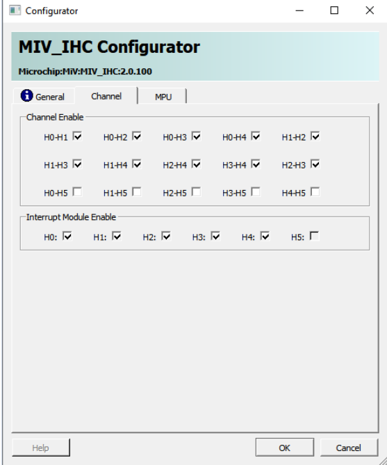
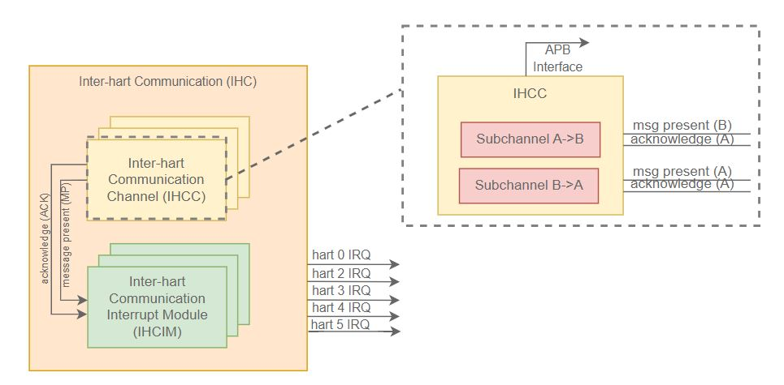
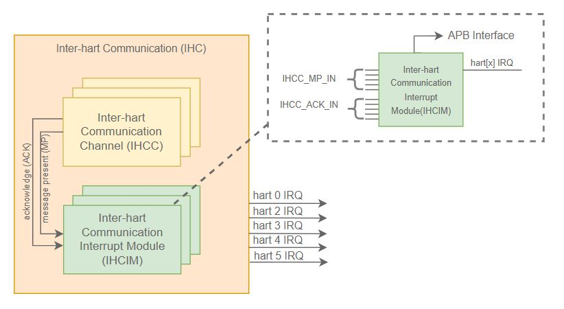
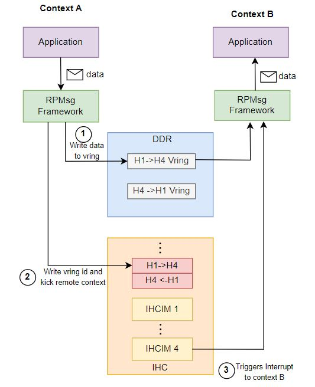
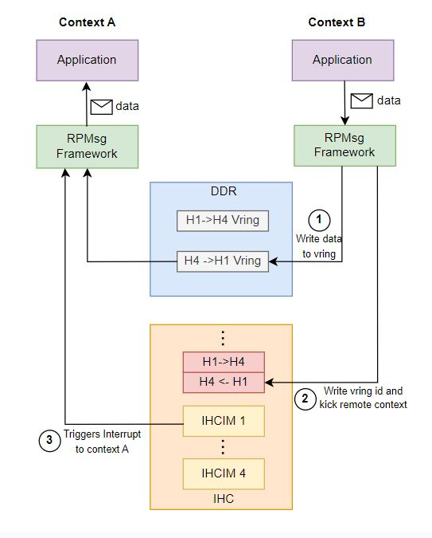

# Mi-V Inter-Hart Communication (IHC)

## Table of Contents

- [Introduction](#introduction)
  - [Inter-Hart Communication Channel (IHCC)](#inter-hart-communication-channel-ihcc)
  - [Inter-Hart Communication Interrupt Aggregator (IHCIA)](#inter-hart-communication-interrupt-aggregator-ihcia)
- [IHC Configuration](#ihc-configuration)
  - [Channel Assignment](#channel-assignment)
- [Associated Software](#associated-software)
  - [Operating Systems](#operating-systems)
    - [Context A to Context B Communication](#context-a-to-context-b-communication)
    - [Context B to Context A Communication](#context-b-to-context-a-communication)

## Introduction

The Inter-Hart Communication Soft-IP core (MiV-IHC) can be used to exchange data between harts in PolarFire SoC. It provides the ability to communicate and coordinate between harts through a non-blocking interrupt signaling mechanism.

Internally, the Mi-V IHC consists of multiple interconnected instances of the following components:

- **Inter-Hart Communication channels (IHCC)**
- **Inter-Hart Communication interrupt module (IHCIM)**

> [!IMPORTANT]
Starting from release v2025.07 and onwards, the Icicle Kit and Discovery Kit reference designs use
the Mi-V IHC IP v2 available in the Libero catalog.
The Mi-V IHC IP version 2 is not backwards compatible with the Mi-V IHC subsystem used in the
Icicle Kit reference design 2025.03 or earlier. For documentation on the Mi-V IHC subsystem available in v2025.03 release or earlier, please refer to
the [v2025.03 AMP documentation](https://github.com/polarfire-soc/polarfire-soc-documentation/tree/v2025.03/applications-and-demos)

The Mi-V IHC IP v2 documentation including the registery map can be found in the [Mi-V IHC User Guide](https://ww1.microchip.com/downloads/aemDocuments/documents/FPGA/ProductDocuments/UserGuides/ip_cores/directcores/MIV_IHC_User_Guide.pdf).

### Inter-Hart Communication Channel (IHCC)

A single IHCC facilitates communication between two Harts (assumed to be A and B). The Mi-V IHC contains a fixed number of IHCC's to facilitate communication between all Harts.

The Icicle Kit Reference Design includes an instance of Mi-V IHC
Soft-IP core configured as shown below:

- Four dedicated channels for communication between the monitor hart (E51) and applications harts (U54's) using the Hart Software Services (HSS)
- Six channels which can be used for communication between application harts (U54's)

The AMP demos provided as part of the PolarFire SoC Linux releases use the
H0+H4 communicationl channel to communicate between two AMP software contexts using the RPMsg protocol.

The remaining channels are not used by the software. These free channels could be used to extend the inter-hart communication if required.

Each IHCC is divided into two unidirectional subchannels that provide a signaling mechanism between a "sender" and a "receiver" hart.

Each subchannel consists of:

- Up to four 32-bit "message out" write-only registers that can be used to send data to the receiving hart.

- Up to four 32-bit "message in" read-only registers that can be used to read a message sent by the sender hart

> The "message in" and "message out" registers could be used to send/receive small amounts of data such as a message ID, a numerical index, a custom control data structure, or a pointer to another location in memory (DDR, LIM, etc.)

- Two associated interrupts:
  - message present interrupt: set when a message posted by the sending processor is available to be consumed on the receiving hart

  - message clear interrupt: set when a message posted by the sending processor has been retrieved by the receiving hart

> Note: The purpose of this IHC is to provide a signaling mechanism between harts. Therefore, the actual data to be shared between software contexts should be located in a shared memory area which is not part of the IHC. Some examples of shared memory areas include DDR or LIM.

### Inter-Hart Communication Interrupt Module (IHCIM)

The Inter-Hart Communication Interrupt Module (IHCIM) component has two main purposes:

- Manages interrupts from several channels in order to group them on a hart-level basis

- Provides a mechanism to quickly identify the source IHC channel that sent an interrupt to a particular hart

The IHC contains six Inter-Hart Communication Interrupt Modules (IHCIM's), one for each of the five harts available in PolarFire SoC and one
for communating with a Soft-IP core (MiV-RV32).

## IHC Configuration

This section provides an overview of the default IHC configuration provided in the [Icicle Kit reference design](https://mi-v-ecosystem.github.io/redirects/repo-icicle-kit-reference-design).

### Channel Assignment

The table below provides a list of all IHCC's available on PolarFire SoC, as well as the software associated with each of these channels:

| Channel Name     | Software Framework     |
|-------------     |------------------------|
| E51<->U54_1      | HSS                    |
| E51<->U54_2      | HSS                    |
| E51<->U54_3      | HSS                    |
| E51<->U54_4      | HSS                    |
| U54_1<->U54_4    | RPMsg (Context A <-> B)|
| U54_1<->U54_3    | Unused                 |
| U54_1<->U54_2    | Unused                 |
| U54_2<->U54_3    | Unused                 |
| U54_3<->U54_4    | Unused                 |
| U54_2<->U54_4    | Unused                 |

Channels E51<->U54_1, E51<->U54_2, E51<->U54_3 and E51<->U54_4 are used to communicate the monitor hart (E51) with the application harts using the Hart Software Services.

The U54_1 <-> U54_4 channel is assigned for context A to context B communication using the RPMsg protocol.

The above implies that the AMP configuration used should have at least U54_1 assigned to context A and U54_4 assigned to context B.

## Associated Software

### Operating Systems

The IHC is handled by Linux through the Linux mailbox framework and by RTOS/bare metal applications through the bare metal [Mi-V IHC driver]().

The IHC is used by the RPMsg framework to:

a) notify a 'remote' software context that a message has been posted in a ring buffer (vring) located in shared memory

b) send/receive the ring buffer (vring) ID where the sender context posted a message

For more information on the RPMsg framework, please refer to the [RPMsg](https://mi-v-ecosystem.github.io/redirects/asymmetric-multiprocessing_rpmsg) documentation page

#### Context A to Context B Communication

#### Context B to Context A Communication

