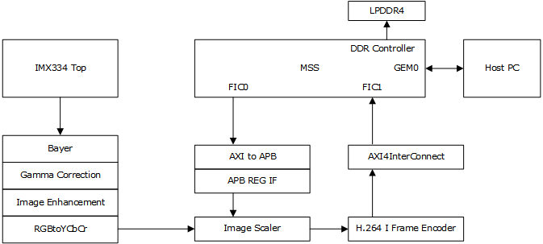
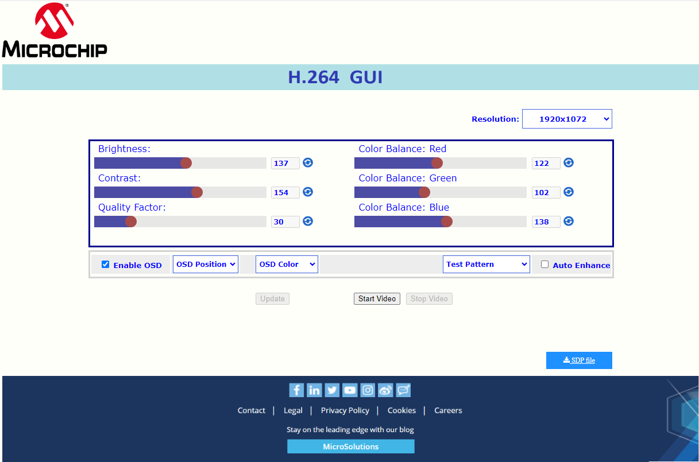
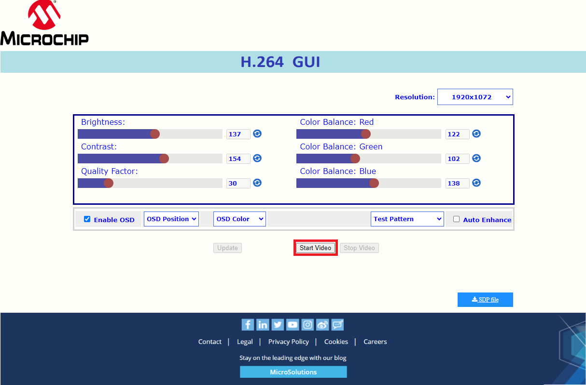
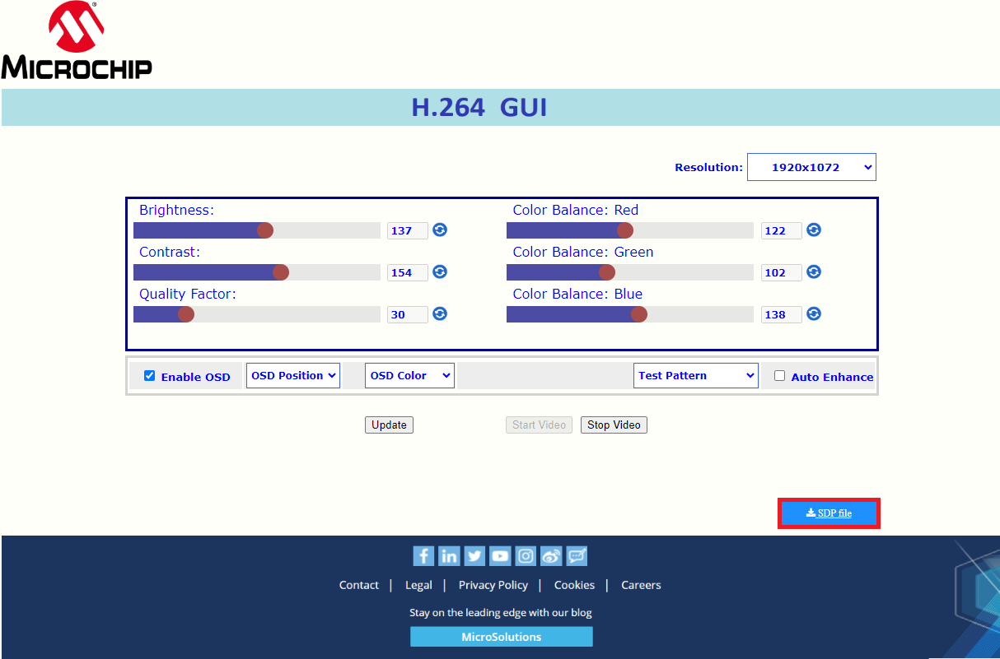
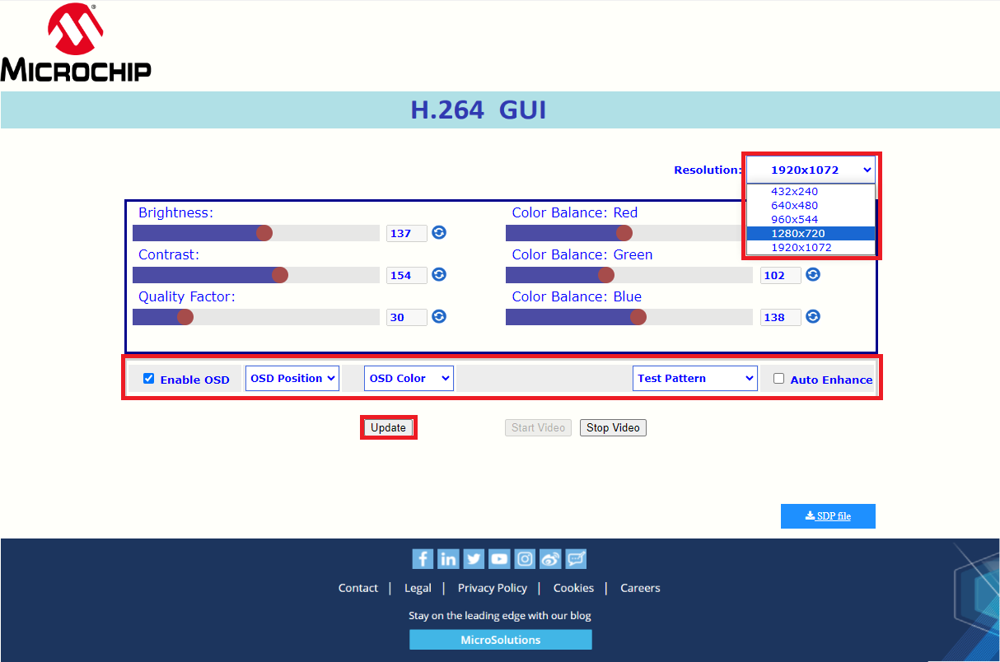
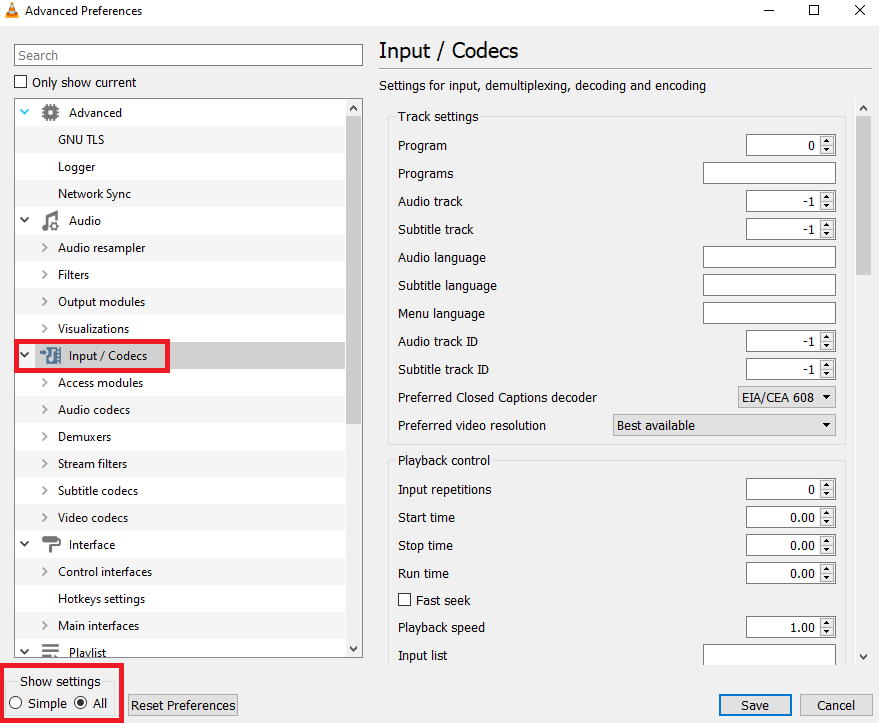
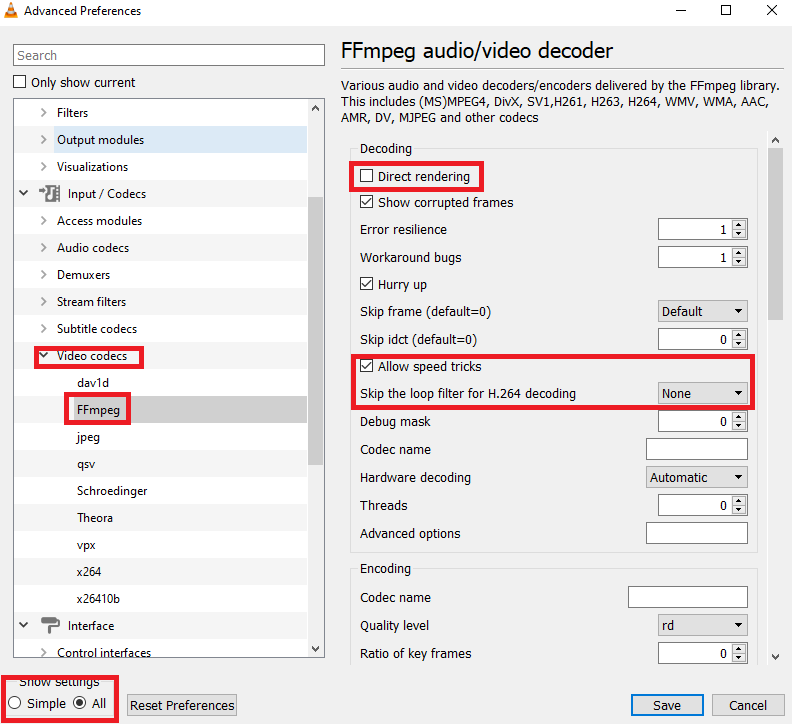

# MPFS Video Kit H.264 Demo

## Table of Contents

- [MPFS Video Kit H.264 Demo](#mpfs-video-kit-h.264-demo)
  - [Table of Contents](#table-of-contents)
  - [Description](#description)
  - [Requirements](#requirements)
  - [Pre-Requisite](#pre-requisite)
  - [Running the Demo](#runninng-the-demo)
    - [Running the demo using DHCP](#runninng-the-demo-using-dhcp)
    - [Steps to configure static IP addresses](#steps-to-configure-static-ip-address)
    - [Running the demo using static IP address](#runninng-the-demo-using-static-ip-address)
  - [VLC configurations](#vlc-configurations)
    - [Alter How Much VLC Caches the Video](#alter-how-much-vlc-caches-the-video)
    - [Configuration of FFMPEG video  decoder parameters](#configuration-of-ffmpeg-video-decoder-parameters)
    - [Configuration of Video output module to the Windows GDI output module](#configuration-of-video-output-module-to-the-windows-gdi-output-module)
  - [On Screen Display(Overlay) Controls](#on-screen-displayoverlay-controls)
    - [Horizontal Position](#horizontal-position)
    - [Vertical Position](#vertical-position)
    - [OSD disable](#osd-disable)
  - [Updating the Video kit with latest images](#updating-the-video-kit-with-latest-images)

<a name="description"></a>

## Description

This demo guide describes how to run H.264 video streaming over ethernet demo using Microchip’s PolarFire SoC Video Kit.
This kit features an MFS250T PolarFire SoC device. Microchip's PolarFire SoC devices combine RISC-V based 5x core Microprocessor Subsystem (MSS) capable of running Linux and the PolarFire FPGA Fabric in a single device.
This powerful combination enables the partitioning of user designs between the MSS (application code) and the fabric (HDL).
Microchip's Libero SoC enables the rapid development of RTL based designs for PolarFire SoC and many other device families.
Libero SoC provides a wide range of IP for a variety of applications such as video and imaging, signal processing, wired and wireless communications, and networking.
Microchip's SoftConsole enables the rapid development of C/C++ source code based applications targeted for all Microchip FPGA and SoC device families.

The demo captures live stream from a camera on a PolarFire SoC Video kit and performs H.264 compression using the FPGA fabric logic. A webserver application running on the MSS allows user to connect to the PolarFire SoC Video kit via ethernet.
Users can view the webserver by entering the IP address of the kit in a web browser. The webpage on the browser allows the user to control streaming of the live video from the Video kit to the connected system.
After the user initiates the stream on the webpage, the application running on the MSS reads a compressed stream of data from the fabric and sends encoded H.264 RTP ethernet packets to the IP address of the system which initiated the stream.
Users can play the video stream on a computer using applications such as VLC Media Player, Gstreamer or FFPlay. The webpage allows users to download an SDP file that can be passed on to the video player (VLC, Gstreamer, FFplay) after streaming is initiated.

Below block diagram explains the H.264 frame generation



<a name="requirements"></a>

## Requirements

- HostPC/Laptop – Windows 10 and above / Ubuntu 20.04
- VLC Media Player – 3.0.16 (Windows) and above / VLC Media Player – 3.0.9.2 (Ubuntu) and above.
- Web Browser – Chrome 96.0.4664.110 (Official Build) (64-bit) and above or Microsoft Edge Version 96.0.1054.53 (Official build) (64-bit) and above

<a name="pre-requisite"></a>

## Pre-Requisite

Before running the demo, make sure to complete the following steps:

- Setting up the jumpers on the Video Kit, refer to the [Video Kit user's guide](https://mi-v-ecosystem.github.io/redirects/boards-mpfs-sev-kit-sev-kit-user-guide).
- Setting up the two Serial Terminal programs "Interface 0 (UART0) and Interface 1 (UART1)" using extra-putty:
  - Select the COM ports which are connected to the following interfaces: Silicon Labs Quad CP2108 USB to UART BRIDGE: Interface 0 and Interface 1.
  - Set Baud rate to “115200”, Set Data to 8-bit, Set Flow control to None.

<a name="runninng-the-demo"></a>

## Running the Demo

The kit comes preprogrammed with a demonstrative design to run the PolarFire SoC H.264 demo. The preprogrammed design configures the ethernet ports on the Video kit with **static** IP addresses.
However, the Yocto images provided on the GitHub repository [Meta PolarFire SoC Yocto BSP](https://mi-v-ecosystem.github.io/redirects/releases-meta-polarfire-soc-yocto-bsp), configure the Video kit ethernet ports with **DHCP** IP addresses.

There are slight differences in the steps to run the demo depending on the static or DHCP IP addresses. To run the demo using static IP addresses, refer to the [Running the demo using static IP address](#runninng-the-demo-using-static-ip-address).

<a name="runninng-the-demo-using-dhcp"></a>

### Running the demo using DHCP

Follow the steps below to run the Demo using DHCP IP address:

1. Insert the dual camera sensor module into J10 on the PolarFire SoC Video kit. Ensure the lens caps are removed from the cameras.
2. Connect RJ45 ethernet cable between any one of the ethernet ports (connector J6 or J7) on the board and your network switch/router, Video kit will get a DHCP IP address once powered on.
3. From the Host PC open the browser (Chrome). Enter the IP address of the PolarFire SoC Video kit (assigned by DHCP) in the address bar.
4. The H.264 demo GUI will load automatically as shown in the image below:

    

5. Click the "Start Video" button as shown and follow the below steps:

    

6. Click on "SDP file" button to download SDP file.

    

7. Open SDP file:

- Windows: Open the SDP file with the VLC Media Player to play the video stream.
- Linux: Open the SDP file with the GUI of VLC Media Player, OR execute the "vlc" command in the terminal, passing the SDP file as an argument "e.g. vlc video.sdp"
- You should be able to observe a livestream video. This is a scaled & H.264 compressed video of the selected resolution. To change the resolution, select the resolution as shown below and click "update" button.



<a name="vlc-configuration"></a>

### VLC configuration

<a name="alter-how-much-vlc-caches-the-video"></a>

#### Alter How Much VLC Caches the Video

1. Open VLC’s preferences by going to Tools > Preferences.
2. Click “All” under the “Show Settings” option at the bottom of the window.
3. Click “Input / Codecs” in the left sidebar.

   

4. The standard delay in VLC for "Network Caching (ms)" is 1000 ms. This will cause noticeable lag, in order to avoid it reduce the caching value to 30 ms.

   

5. Select "Disable" for "Hardware-accelerated decoding" as it is not supported by the Video kit.

From the Preferences panel, click “Simple” in the lower left-hand corner, then, go to to Input/Codecs. Click the “Hardware-accelerated decoding” dropdown and choose "Disable".


<a name="configuration-of-ffmpeg-video-decoder-parameters"></a>

#### Configuration of FFMPEG video decoder parameters

1. Open the preferences panel by selecting "Tools" > "Preferences"
2. Select “All” under the “Show Settings” option at the bottom of the window.

   

3. Select “Input/Codecs" -> "Video codecs"-> "FFMPEG”
4. Uncheck "Direct rendering"
5. Allow the speed tricks to None
6. "Threads" should be 2
7. Click "Save"

<a name="configuration-of-video-output-module-to-the-windows-gdi-output-module"></a>

#### Configuration of Video output module to the Windows GDI output module

1. Open VLC’s preferences by going to Tools > Preferences.
2. Then, click “All” under the “Show Settings” option at the bottom of the window.
3. Click as video output modules as windows GDI video output in the left sidebar.
4. Click "Save".


<a name="steps-to-configure-static-ip-address"></a>

### Steps to configure static IP addresses

The released Yocto images on GitHub also provide an option to configure the ethernet ports to static IP address.
Follow the steps below to configure static IP addresses:

   Eth0 configuration: Open /etc/systemd/network/60-static-eth0.network.

   ```text
   root@mpfs-video-kit:~# vim /etc/systemd/network/60-static-eth0.network
   ```

   Comment out DHCP support, line 6, and uncomment the static IP configuration as shown below:

   ```text
   [Match]
   # You can also use wildcards. Maybe you want enable dhcp
   # an all eth* NICs
   Name=eth0
   [Network]
   #DHCP=v4
   # static IP
   192.168.100.2 netmask 255.255.255.0
   Address=192.168.2.1/24
   Gateway=192.168.2.254
   DNS=8.8.8.8
   ```

   Eth1 configuration: Open /etc/systemd/network/70-static-eth1.network.

   ```text
   root@mpfs-video-kit:~# vim /etc/systemd/network/70-static-eth1.network
   ```

   Comment out DHCP support, line 6, and uncomment the static IP configuration as shown below:

   ```text
   [Match]
   #You can also use wildcards. Maybe you want enable dhcp
   #an all eth* NICs
   Name=eth1
   [Network]
   #DHCP=v4
   #static IP
   192.168.100.2 netmask 255.255.255.0
   Address=192.168.2.2/24
   Gateway=192.168.2.254
   DNS=8.8.8.8
   ```

<a name="runninng-the-demo-using-static-ip-address"></a>

### Running the demo using static IP address

To run the H264 demo using the static IP address follow the steps provided in [Quick Start Guide](https://onlinedocs.microchip.com/v2/literature/DS50003455?version=latest&redirect=true).

<a name="on-screen-displayoverlay-controls"></a>

### On Screen Display(Overlay) Controls

The OSD (On Screen Display) feature overlays the amount of compression achieved in the encoding, in the form of: "COMPRESSION RATIO r" into the image frame, where r is the value of the ratio.
Each character in this text is 16x16 pixels, stored in the ROM. The text is displayed at the location specified by the input coordinates.
The encoding compression ratio is calculated by the driver dynamically and fed to the Fabric. The Fabric logic outputs RGB frame with the text added in the specified coordinates of the frame.
This feature is optional, and by default enabled.

<a name="horizontal-position"></a>

#### Horizontal Position

The user can change the OSD's horizontal position by changing the osdx-position using the following command:

   ```text
   v4l2-ctl -d /dev/video0 --set-ctrl=osdx_position=675
   ```

<a name="vertical-position"></a>

#### Vertical Position

The user can change the OSD's vertical position by changing the osdy-position using the following command:

   ```text
   v4l2-ctl -d /dev/video0 --set-ctrl=osdy_position=675
   ```

<a name="osd-disable"></a>

#### OSD disable

OSD feature is optional and can be disabled by the user. It is enabled by default.
To disable the OSD feature, set the osd_enable control to "0"

   ```text
   v4l2-ctl -d /dev/video0 --set-ctrl=osd_enable=0
   ```

To enable the OSD feature, set the osd_enable control to "1"

   ```text
   v4l2-ctl -d /dev/video0 --set-ctrl=osd_enable=1
   ```

<a name="updating-the-video-kit-with-latest-images"></a>

### Updating the Video kit with latest images

To update your Video kit to the latest releases of the reference Libero design and the software, refer to the [Updating MPFS Kit](https://mi-v-ecosystem.github.io/redirects/boards-mpfs-generic-updating-mpfs-kit).  
The latest reference Libero design for Video kit is available at [Video Kit Reference Design](https://mi-v-ecosystem.github.io/redirects/repo-sev-kit-reference-design).  
The latest Linux images for the Video Kit are available from the releases section of the [Meta PolarFire SoC Yocto BSP](https://mi-v-ecosystem.github.io/redirects/releases-meta-polarfire-soc-yocto-bsp) repository.  
For the jumper settings and other board details for the Video Kit, refer to the [Video Kit user's guide](https://mi-v-ecosystem.github.io/redirects/boards-mpfs-sev-kit-sev-kit-user-guide).
