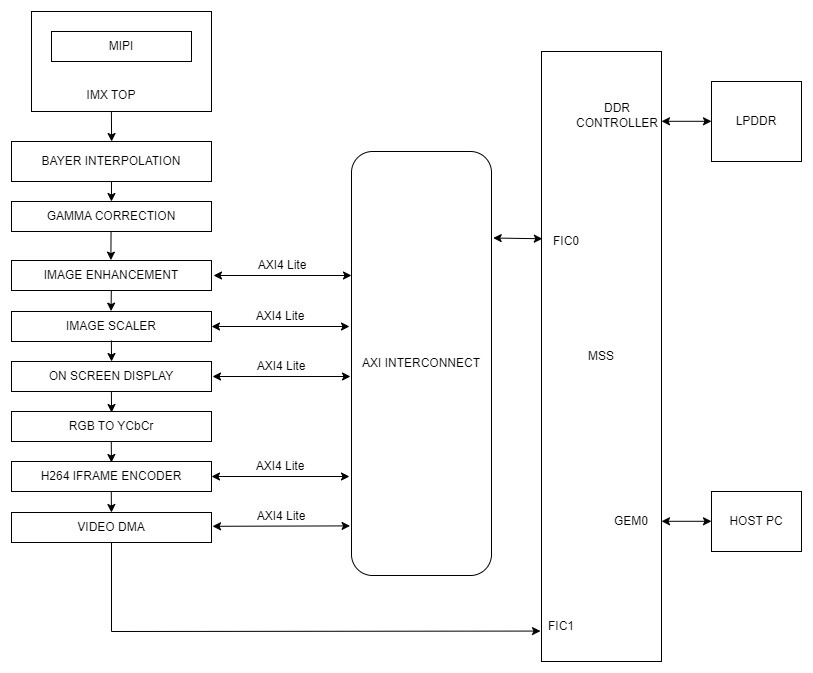
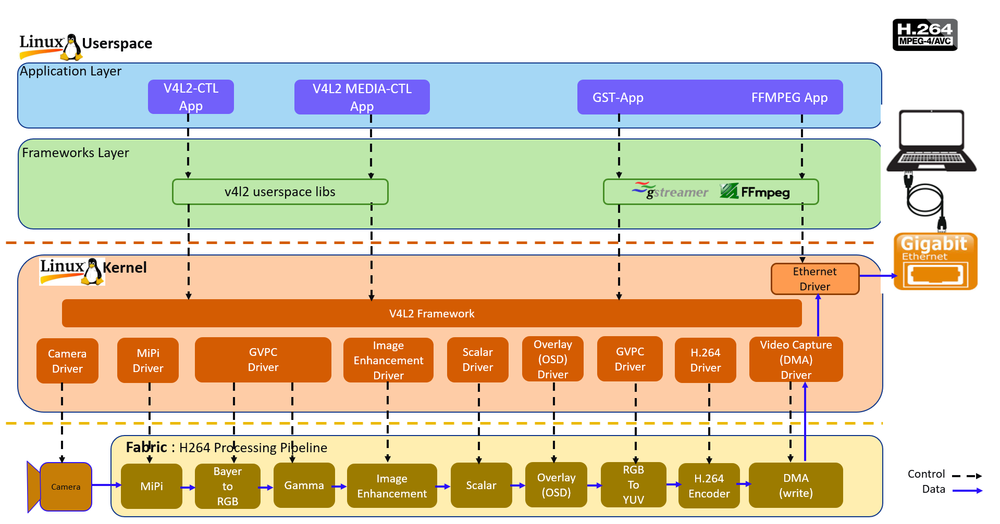

# PolarFire SoC Video Kit H.264 Modular Pipeline Demo

This document describes about H.264 modular pipeline.

## Table of Contents

- [Overview](#overview)
- [H.264 Modular Pipeline](#modular-pipeline)
- [Block Diagram](#block-diagram)
- [Software Stack](#software-stack)
- [Pre-Requisites](#pre-requisites)
- [Steps to Load H.264 Modular Pipeline](#load-modular-pipeline)
- [Running the Demo](#running-the-demo)

<a name="overview"></a>

## Overview

The H.264 modular pipeline has been developed using the Linux Kernel Media Framework, which complements the Video for Linux (V4L2) Framework.

The media framework requires the topology of the pipeline to be described using a topology graph.
A topology graph consists of entities and pads.
An entity can be any logical or physical functional block.
Pads enable connections between entities.
Pads can be source or sink pads, in which the source pad of an entity gets connected to the sink pad of the compatible entity.

An end-user application can access and configure the above graph using media device and sub-devices nodes, through the libmediactl and libv4l2subdev libraries respectively.

The Media Framework provides APIs to achieve the above functionality.
It includes:

- enumeration of entities and pads.
- setting format and resolution.

<a name="modular-pipeline"></a>

## H.264 Modular Pipeline

- The H.264 modular pipeline consists of the following IP's (each IP accessible through the corresponding drivers)

`Imx334 camera` --> `MIPI CSI2 IP` --> `GVPC (MONO to RGB)` --> `Image Enhancement` --> `Scaler` --> `OSD`  --> `GVPC (RGB to YUV)` --> `H264` -->`Video DMA IP (/dev/video0)`

- Each IP core driver registers itself as an entity with two pads (source/sink).
- Output of one IP core is fed to the input of next IP core. All parameter values are also passed on from the previous to the next IP core.
- Video DMA-write driver is responsible for creating v4l2 sub-devices and media devices.
- IP cores and corresponding drivers can be inserted or removed as required.

<a name="block-diagram"></a>

## Block Diagram

The following figure shows the Fabric (IP) -- MSS (Processor) Interface:
The control path is through AXI-Lite Interface.



<a name="software-stack"></a>

## Software Stack

Linux will load all v4l2 modular drivers based on the video pipeline specified in the device tree.

The following figure shows the software stack for H.264 video pipeline.



The framework exposes the following device node types to user space to control certain aspects of the pipeline:

- Media device node: `/dev/media*`
- Video device node: `/dev/video*`
- V4L subdevice node: `/dev/v4l-subdev*`

Where`/dev/video*` nodes are responsible for capturing the images, `/dev/v4l-subdev*` nodes are responsible for corresponding IP controls and `/dev/media*` nodes are for changing the resolution and format

In the above diagram, the Video device node is created by the Video Capture (DMA) Driver, while the subdevice nodes get created by the remaining drivers.

<a name="pre-requisites"></a>

## Pre-Requisites

- These pre-requisites are in addition to the ones mentioned in [h264 demo prerequisites](https://mi-v-ecosystem.github.io/redirects/demo-guides-mpfs-video-kit-h264-demo-pre-requisites)
- Make sure that the H264 modular pipeline design (MPFS_VIDEO_KIT_H264_MM_DESIGN_xxxx_xx.zip) is programmed to the PolarFire SoC Video Kit. A FlashPro Express programming job file can be found in the [Video Kit reference design](https://mi-v-ecosystem.github.io/redirects/releases-video-kit-reference-design).

<a name="load-modular-pipeline"></a>

## Steps To Load H.264 Modular Pipeline

- To load the H.264 modular pipeline, stop at U-Boot prompt (while booting on boot console press any key on key board to stop, U-Boot logs looks like below):

```sh
CPU:   rv64imafdc
Model: Microchip PolarFire-SoC Video Kit
DRAM:  1 GiB (effective 2.8 GiB)
Core:  49 devices, 11 uclasses, devicetree: separate
MMC:   mmc@20008000: 0
Loading Environment from FAT... OK
In:    serial@20100000
Out:   serial@20100000
Err:   serial@20100000
Net:   eth0: ethernet@20110000
Hit any key to stop autoboot:  0
RISC-V #
```

- Run the commands below:

```sh
RISC-V # load mmc 0:1 ${scriptaddr} fitImage;
RISC-V # bootm start ${scriptaddr}#conf-microchip_mpfs-video-kit.dtb#conf-mpfs_modular_h264_pipeline.dtbo;
RISC-V # bootm loados ${scriptaddr};
RISC-V # bootm ramdisk;
RISC-V # bootm prep;
RISC-V # fdt set /soc/ethernet@20112000 mac-address ${videokit_mac_addr0};
RISC-V # fdt set /soc/ethernet@20110000 mac-address ${videokit_mac_addr0};
RISC-V # bootm go;
```

<a name="running-the-demo"></a>

## Running the Demo

Please see the [Running the Demo](https://mi-v-ecosystem.github.io/redirects/demo-guides-mpfs-video-kit-h264-runninng-the-demo) guide for information on how to run the modular pipeline demo.

