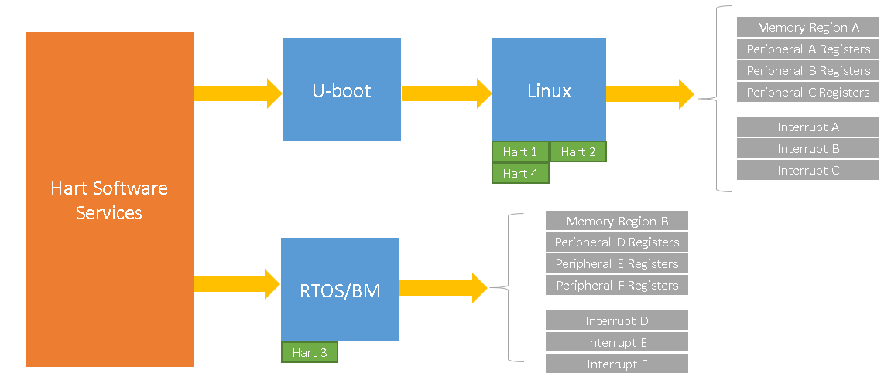
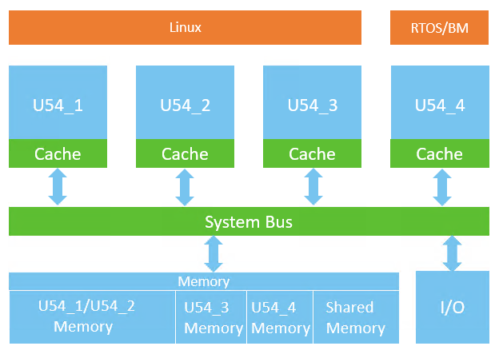

# Asymmetric Multiprocessing (AMP)

This page provides a brief introduction to Asymmetric Multiprocessing (AMP) concepts, including instructions on how to run multiple operating systems or bare metal applications simultaneously on PolarFire SoC.

- [Asymmetric Multiprocessing (AMP)](#asymmetric-multiprocessing-amp)
  - [Introduction](#introduction)
  - [AMP on PolarFire SoC](#amp-on-polarfire-soc)
    - [AMP Boot Flow](#amp-boot-flow)
    - [Inter-Hart Communication (IHC)](#inter-hart-communication-ihc)
  - [AMP Configurations](#amp-configurations)
    - [Linux + FreeRTOS/Bare Metal(BM) Configuration](#linux--freertos--baremetal-configuration)
    - [Building the Linux + FreeRTOS/BM Demo](#building-the-linux--freertos--bm-demo)
      - [Build Linux + FreeRTOS/BM AMP Demo using Yocto](#build-linux--freertos--bm-amp-demo-using-yocto)
      - [Build Linux + FreeRTOS/BM AMP Demo using Buildroot](#build-linux--freertos--bm-amp-demo-using-buildroot)
    - [Running the Linux + FreeRTOS/BM AMP Demo on the Icicle Kit](#running-the-linux--freertos--bm-amp-demo-on-the-icicle-kit)
    - [RTOS/BM + RTOS/BM AMP Configuration](#rtosbm--rtosbm-amp-configuration)

<a name="introduction"></a>

## Introduction

Asymmetric Multiprocessing (AMP) is a type of multi-core software architecture that allows multiple operating systems or software contexts to run simultaneously and independently of each other.

In an AMP system, it is possible to allocate hardware resources to a specific software context. These hardware resources include processor cores, peripherals and physical memory regions.

<a name="amp-on-polarfire-soc"></a>

## AMP on PolarFire SoC

PolarFire SoC contains a CPU Core Complex with a single E51 core and four U54 application cores, where each of the cores has one hardware thread or hart.

PolarFire SoC can be configured to run up to two independent software contexts. Each software context can have its own operating system, memory regions and hardware resources assigned.

The supported PolarFire SoC AMP software architecture is described below:

- 1x E51 monitor core which is dedicated to running the Hart Software Services (HSS)

- 4x U54 application cores which can be distributed between two independent software contexts

The [Hart Software Services](https://github.com/polarfire-soc/hart-software-services) (HSS) is a superloop monitor software running on the E51 processor. One of the many functions of the HSS is to act as a first-stage bootloader as part of the boot service. Please refer to the  [AMP boot flow](#amp-boot-flow) section for further information on the boot process.

<a name="amp-boot-flow"></a>

### AMP Boot Flow

The hart software services (HSS) makes use of a HSS payload as part of the boot service.

A HSS payload is an image containing a header and one or more binary files that have been merged together to form the payload.

In an AMP configuration, the HSS payload should contain two binary files, one for each of the supported software contexts. For example, one of these binary files could be an ELF file containing a bare metal application or RTOS, and the other one a U-boot binary to load Linux OS.

When loading a payload, the HSS will copy the payload from non-volatile storage to DDR and then copy the binaries to the memory location(s) that were specified when the payload was generated.

In addition to this, the HSS payload header describes which harts are associated with each payload as well as the address that each hart should start executing from once the payload has been loaded into memory by the HSS.



For further information on [HSS payloads](https://github.com/polarfire-soc/polarfire-soc-documentation/blob/master/software-development/hss-payloads.md), please refer to the HSS payload documentation page.

<a name="inter-hart-communication-ihc"></a>

### Inter-Hart Communication (IHC)

Some AMP applications may require software contexts to be able to communicate and send messages between them. For example, a RTOS or bare metal-based application communicating with a Linux context, or two RTOS or bare metal applications sending messages between them.

PolarFire SoC supports the Remote Processor Messaging (RPMsg) framework, which allows a 'master' software context to communicate with a 'remote' software context using a built-in API.

For more information on RPMsg protocol, please refer to the [PolarFire SoC RPMsg documentation](rpmsg.md) page.

<a name="amp-configurations"></a>

## AMP Configurations

PolarFire SoC supports several AMP configurations including Linux + RTOS, Linux + Bare Metal, RTOS + Bare Metal or Bare Metal + Bare Metal.

Each of the configurations described above have different use cases and should be chosen based on application requirements such as real-time response, security and safety requirements.

One of the most common approaches is to use a general purpose operating system such as Linux with a real-time operating system (RTOS) in order to have real-time constraints applications handled by the RTOS while having connectivity or UI applications running from the Linux context.

<a name="linux--freertos--baremetal-configuration"></a>

### Linux + FreeRTOS/Bare Metal Configuration

The Linux and FreeRTOS/Bare Metal AMP configuration consists of a Linux OS running in one context and a FreeRTOS application running on the second context, or running Linux in one context and a bare metal application on the second context.

The PolarFire SoC [Yocto](https://github.com/polarfire-soc/meta-polarfire-soc-yocto-bsp) and [Buildroot](https://github.com/polarfire-soc/polarfire-soc-buildroot-sdk) build environments provide an Icicle Kit AMP machine which can be used to build a Linux + FreeRTOS/BM AMP configuration demo.

The demo runs Linux on harts 1-2-3 and a FreeRTOS or Bare metal AMP application on hart 4. The demo contains several applications to send/receive messages between Linux and FreeRTOS using the RPMsg framework.

The image below shows a diagram of the Linux and FreeRTOS/BM AMP configuration demo:



The table below describes the hardware resources assignment used in this demo:

|          | Linux (Context A)   | FreeRTOS/BM (Context B) |
|----------|---------------------|----------------------|
| Harts    | U54_1, U54_2, U54_3 | U54_4                |
| PDMA     | ✓                   | -                    |
| RTC      | ✓                   | -                    |
| USB      | ✓                   | -                    |
| eMMC/SD  | ✓                   | -                    |
| Serial   | MMUART 1-2-4        | MMUART 3             |
| Ethernet | ✓                   | -                    |
| PCIE     | ✓                   | -                    |
| GPIO_2   | ✓                   |                      |
| I2C1     | ✓                   | -                    |
| LSRAM    | ✓                   | -                    |
| DMA(FIC) | ✓                   | -                    |
| CAN      | ✓                   | -                    |

The table below describes the DDR memory layout used in this demo:

|                             | Linux (Context A)                                            | FreeRTOS/BM (Context B)          |
| --------------------------- | ------------------------------------------------------------ | -------------------------------- |
| Main Memory                 | 1883.69 MB Total <br /><br /> Cached @ 0x10_0000_0000        | Cached @ 0x10_75BB_0000 (4 MB)   |
| User space mappable buffers | Cached @  0x80000000 (32 MB) <br /><br /> Non Cached @ 0xc0000000 (128MB) <br /><br /> WCB  @ 0xd0000000 (128MB) | -                                |
| RPMsg vrings                | Cached @ 0x10_75FB_0000 (64 KB)                              | Cached @ 0x10_75FB_0000 (64 KB)  |
| RPMsg buffers               | Cached @ 0x10_75FC_0000 (256 KB)                             | Cached @ 0x10_75FC_0000 (256 KB) |

<a name="building-the-linux--freertos--bm-demo"></a>

### Building the Linux + FreeRTOS/Bare Metal Demo

Pre-requisites: Before following the steps described in this section, make sure you have the latest [Yocto](https://github.com/polarfire-soc/meta-polarfire-soc-yocto-bsp) or [Buildroot](https://github.com/polarfire-soc/polarfire-soc-buildroot-sdk) build systems configured and setup in your system. Please refer to the README of each build system for further information.

<a name="build-linux--freertos--bm-amp-demo-using-yocto"></a>
#### Build Linux + FreeRTOS/Bare Metal AMP Demo using Yocto

1. Open the `icicle-kit-es-amp.conf` machine configuration file located in the `conf` directory. Make sure that the `AMP_DEMO` variable is set to `freertos` for a Linux+FreeRTOS demo or `bm` for a Linux+Bare Metal demo:

    ```bash
    ## Set this to "freertos" for a Linux + FreeRTOS demo or "bm" for a Linux + Bare Metal demo
    AMP_DEMO = "freertos"
    ##AMP_DEMO = "bm"
    ```

2. Use the Yocto bitbake command and set the icicle-kit-es-amp MACHINE and image required:

    ```bash
    MACHINE=icicle-kit-es-amp bitbake mpfs-dev-cli
    ```

3. Copy the created Disk Image to a flash device (USB mmc flash/SD/uSD)

> Be very careful while picking /dev/sdX device! Look at dmesg, lsblk, GNOME Disks, etc. before and after plugging in your usb flash device/uSD/SD to find a proper device. Double check it to avoid overwriting any system disks/partitions!

```bash
cd yocto-dev/build
zcat tmp-glibc/deploy/images/icicle-kit-es-amp/mpfs-dev-cli-icicle-kit-es-amp.wic.gz | sudo dd of=/dev/sdX bs=4096 iflag=fullblock oflag=direct conv=fsync status=progress
```

The disk image flashed to the device in the step above contains the following partitions:

- Boot partition containing a fitImage (Linux kernel + Device Tree Blob) used by context A
- HSS boot partition with a HSS payload containing the following binaries:
  - U-boot binary used by context A
  - FreeRTOS or Bare metal ELF file used by context B
- Linux Root Filesystem for context A

<a name="build-linux--freertos--bm-amp-demo-using-buildroot"></a>

#### Build Linux + FreeRTOS/Bare Metal AMP Demo using Buildroot

1. Build the image using the DEVKIT icicle-kit-es-amp and set the AMP_DEMO variable to `freertos` for a Linux+FreeRTOS demo or to `bm` for a Linux+ Bare Metal demo.

    Note: If no `AMP_DEMO` variable is set when building in AMP mode, the Linux+FreeRTOS will be set as default.

    For a Linux+FreeRTOS demo:

    ```bash
    make all DEVKIT=icicle-kit-es-amp AMP_DEMO=freertos
    ```

    For a Linux+Bare metal demo:

    ```bash
    make all DEVKIT=icicle-kit-es-amp AMP_DEMO=bm
    ```

2. Load the image onto the target as shown in the PolarFire SoC Buildroot SDK [README](https://github.com/polarfire-soc/polarfire-soc-buildroot-sdk).

The disk image generated by Buildroot contains the following partitions:

- Boot partition containing a fitImage (Linux kernel + Device Tree Blob + Initramfs) used by context A
- HSS boot partition with a HSS payload containing the following binaries:
  - U-boot binary used by context A
  - FreeRTOS or Bare Metal ELF file used by context B
- (optionally) A Linux Root Filesystem for context A

<a name="running-the-linux--freertos--bm-amp-demo-on-the-icicle-kit"></a>

### Running the Linux + FreeRTOS/BM AMP Demo on the Icicle Kit

On connecting Icicle kit J11 to the host PC, you should see 4 COM port interfaces. To use this project, configure the COM port interface 1 and 3 as below:

- 115200 baud
- 8 data bits
- 1 stop bit
- no parity

On startup, the Linux console will show messages on COM port interface 1 and the FreeRTOS or Bare Metal application will display a menu on COM port interface 3.

The menu displayed on the FreeRTOS/BM COM port allows the user to run several RPMsg applications included as part of the demo.

For more information on how to use the RPMsg applications, please refer to the [RPMsg documentation](rpmsg.md) page.

<a name="rtosbm--rtosbm-amp-configuration"></a>

### RTOS/BM + RTOS/BM AMP Configuration

The HSS payload generator can be used to create custom AMP configurations including RTOS + RTOS, RTOS + Bare metal or Bare metal + Bare metal.

The `mpfs-rpmsg-freertos` and `mpfs-rpmsg-bm` SoftConsole projects included within the [PolarFire SoC AMP examples](https://github.com/polarfire-soc/polarfire-soc-amp-examples) repository allow a FreeRTOS + BM, FreeRTOS + FreeRTOS or Bare Metal + Bare Metal AMP configuration demo to be built with RPMsg communication.

For more information on how to build these demos, please refer to the [RPMsg on FreeRTOS/Bare Metal](rpmsg.md#rpmsg-rtos-intro) section in the PolarFire SoC RPMsg documentation page.


