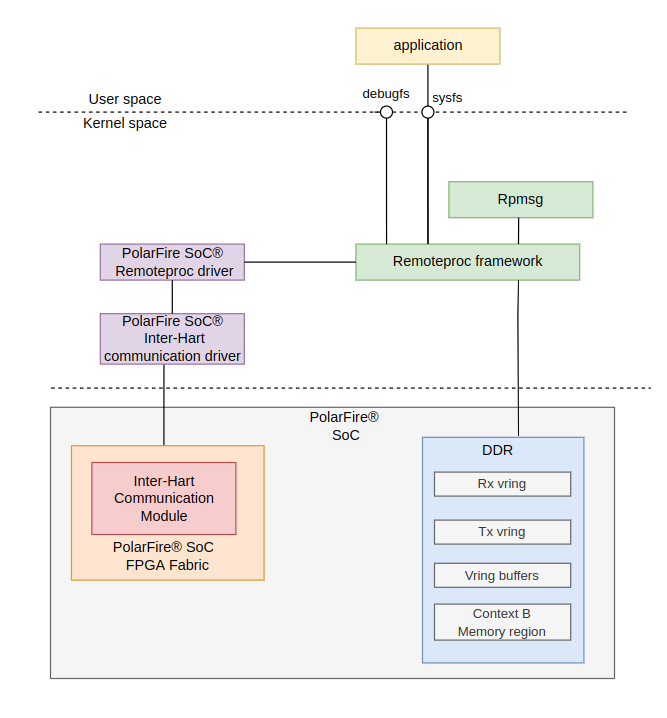

# Remote Processor Framework (Remoteproc)

- [Introduction to Remoteproc](#introduction-to-remoteproc)
- [The Remoteproc Resource Table](#the-remoteproc-resource-table)
  - [PolarFire SoC Default Resource Table](#polarfire-soc-default-resource-table)
  - [A resource table example without RPMsg Communication](#a-resource-table-example-without-rpmsg-communication)
- [Remoteproc Boot Modes](#remoteproc-boot-modes)
  - [Early Boot Mode](#early-boot-mode)
  - [Late Boot Mode](#late-boot-mode)
    - [Configure the HSS payload for Late Boot Mode](#configure-the-hss-payload-for-late-boot-mode)
    - [Booting the remote context using Remoteproc](#booting-the-remote-context-using-remoteproc)
      - [Booting the remote context using SysFs](#booting-the-remote-context-using-sysfs)
      - [Automatically Booting Firmware using RemoteProc (Advanced)](#automatically-booting-firmware-using-remoteproc-advanced)
- [RemoteProc Linux Overview](#remoteproc-linux-overview)
- [Remoteproc Linux Kernel Configuration](#remoteproc-linux-kernel-configuration)
- [Remoteproc Linux Device Tree Configuration](#remoteproc-linux-device-tree-configuration)

<a name="introduction-to-remoteproc"></a>

## Introduction to Remoteproc

This page provides a brief introduction to the Remote Processor Framework (Remoteproc) used to control the Life Cycle Management (LCM) of a remote AMP context (RTOS/BM) from Linux.

The remoteproc APIs provide life cycle management of remote processors by performing the following functions:

- Allow the master context to load code and data sections of the remote context firmware image (in ELF format) to appropiate locations in memory
- Start and stop exection of the remote context firmware
- Establish RPMsg communication channels to exchange messages with the remote context

<a name="the-remoteproc-resource-table"></a>

## The Remoteproc Resource Table

The remote context firmware should contain a statically linked resource table data structure that defines the system resources used by the remote firmware.

The role of the resource table is to:

- Describe contiguous memory carveouts required by the remote firmware's code and data sections
- Support additional resource entries to announce additional features supported by the remote processor, such as virtIO devices for RPMsg-based communication

The remoteproc framework on the master context parses the remote context resource table to allocate appropiate system resources, create virtIO devices for rpmsg communication, etc.

The resource table configuration and entries may mary depending on application requirements. [Section 2.1](#polarfire-soc-default-resource-table) describes the default resource table used in PolarFire SoC RPMsg application demos. Alternatively, [Section 2.2](a-resource-table-example-without-rpmsg-communication) describes a simple resource table that can be used on custom applications without RPmsg communication.

<a name="polarfire-soc-default-resource-table"></a>

### PolarFire SoC Default Resource Table

The PolarFire SoC AMP examples [repository](https://mi-v-ecosystem.github.io/redirects/repo-polarfire-soc-amp-examples) contains a resource table with the following configuration:

- One virtio device resource entry for RPmsg communication
- Two vrings entry descriptors (Tx/Rx pair)

The [resource table](https://mi-v-ecosystem.github.io/redirects/polarfire-soc-amp-examples-rpmsg-rsc-table) source code used in the PolarFire SoC AMP examples is shown below:

```c
# define NUM_VRINGS                  0x02
# define VRING_ALIGN                 0x1000
# define VDEV0_VRING_BASE            0x81400000
# define VRING_SIZE                  0x8000

const struct remote_resource_table __attribute__((section(".resource_table"))) resources
    .version = 1,
    .num = 1,
    .reserved = {0, 0},
    .offset = {
        offsetof(struct remote_resource_table, rpmsg_vdev),
    },
    /* Virtio device entry */
    .rpmsg_vdev= {
        RSC_VDEV, VIRTIO_ID_RPMSG, 0, RSC_VDEV_FEATURE_NS, 0, 0, 0,
        NUM_VRINGS, {0, 0},
    },

    /* Vring rsc entry - part of vdev rsc entry */
    .rpmsg_vring0 = {VDEV0_VRING_BASE, VRING_ALIGN, VRING_SIZE, 0, 0},
    .rpmsg_vring1 = {VDEV0_VRING_BASE + VRING_SIZE , VRING_ALIGN, VRING_SIZE, 1, 0},
};
```

<a name="a-resource-table-example-without-rpmsg-communication"></a>

### A resource table example without RPMsg Communication

For a simple resource table in a custom application without RPMsg communication, the following resource table can be used instead:

```c
const struct remote_resource_table __attribute__((section(".resource_table"))) resources
    .version = 1,
    .num = 1,
    .reserved = {0, 0},
    .offset = {0},
 };
```

<a name="remoteproc-boot-modes"></a>

## RemoteProc Boot Modes

There are two possible ways to load and start the remote context firmware; an Early Boot mode or a Late Boot mode. The following sections explain each modes in more detail.

<a name="early-boot-mode"></a>

### Early Boot Mode (Default)

This is the default mode configured the PolarFire SoC Yocto BSP when using the Icicle Kit AMP machine.

In the Early boot flow, the remote context firmware is booted by the HSS before Linux boots.

Once Linux boots, the remoteproc framework in Linux will automatically attach itself to the remote context. Once attached, it is possible for Linux to control the life cycle of the remote context.

For RPMsg communication to work in this mode, a `rsc-table` property pointing to the location in memory where the resource table was loaded by the remote processor should be provided in the Linux device Tree.

For more information on the device tree settings for remoteproc, please refer to the [Remoteproc Linux Device Tree Configuration](#remoteproc-linux-device-tree-configuration) section.

<a name="late-boot-mode"></a>

### Late Boot Mode

This mode can be used to load and start the remote context firmware from Linux using the Remoteproc framework.

<a name="configure-the-hss-payload-for-late-boot-mode"></a>

#### Configure the HSS payload for Late Boot Mode

To use the Remoteproc Late Boot mode, the HSS payload generator YAML configuration file needs to have the skip_autoboot flag set to true in the remote context payload entry. This will tell the HSS not to load or start the remote context firmware.

A sample HSS payload generator YAML file configured with late boot flow is provided below:

```yaml
#
# HSS Payload Generator YAML file
#

set-name: 'PolarFire-SoC-HSS::Linux + FreeRTOS AMP'

hart-entry-points: {u54_1: '0x1000200000', u54_2: '0x1000200000', u54_3: '0x1000200000', u54_4: '0x81000000'}

payloads:
  u-boot.bin: {exec-addr: '0x1000200000', owner-hart: u54_1, secondary-hart: u54_2, secondary-hart: u54_3, priv-mode: prv_s}
  amp-application.elf: {exec-addr: '0x81000000', owner-hart: u54_4, priv-mode: prv_m, skip-opensbi: true, skip-autoboot: true}
```

<a name="booting-the-remote-context-using-remoteproc"></a>

#### Booting the remote context using Remoteproc

When using the Late Boot mode, the Linux remoteproc framework will search and parse the resource table from the remote context firmware ELF file.
Therefore, there is no need to provide a rsc-table property in the device tree as done in the Early Boot mode.

There are two possibilities to load and start the remote processor from Linux when using the Late Boot mode:

- Start the firmware using the SysFS interface

- Auto boot: Automatically starts the firmware during the remoteproc driver probing

<a name="booting-the-remote-context-using-sysfs"></a>

#### Booting the remote context through SysFS

By default, when using the Late Boot mode, the remote context firmware must be manually started using SysFS.

The Linux Remoteproc framework will search for an ELF file with the name `rproc-miv-rproc-fw` in the /lib/firmware directory in the file system

- To start the firmware, the following command should be used:

```bash
# echo start >/sys/class/remoteproc/remoteproc0/state
```

Optionally, if the firmware elf file is different from the default one (rproc-miv-rproc-fw), the following command can be used to set the name of the firmware used by the remoteproc framework:

```bash
# echo -n <firmware_name.elf> > /sys/class/remoteproc/remoteproc0/firmware
```

Optionally, to stop the firmware running in the remote context, the following command can be used:

```bash
# echo stop >/sys/class/remoteproc/remoteproc0/state
```

<a name="automatically-booting-firmware-using-remoteproc-advanced"></a>

#### Automatically Booting Firmware using RemoteProc (Advanced)

Alternatively, there is an option that allows the firmware to boot automatically when the remoteproc driver is probed by Linux. This can be achieved by setting the `microchip,auto-boot` device tree property in the remoteproc stanza.

This requires additional configurations that are not enabled by default. Therefore, it is recommended for users who are familiar with Linux kernel and build systems.

It is worth mentioning that the firmware must be present in /lib/firmware before the remoteproc driver is probed. However, in normal conditions, the remoteproc driver is probed before the filesystem is mounted, and the firmware is consequently not available during the Linux driver probing phase. Possible solutions could be:

- To use an initramfs
- To compile remoteproc as a module and not as kernel built-in driver

To enable auto boot support, the `microchip,auto-boot` property can be enabled in the Linux Icicle Kit Device Tree as shown below

```dts
    rproc_contextb: remote-context {
        compatible = "microchip,miv-remoteproc";
        ...
        microchip,auto-boot;
        status = "okay";
    };
```

<a name="remoteproc-linux-overview"></a>

## RemoteProc Linux Overview



On the Linux side, the Remoteproc relies on the following components:

- **Linux Remoteproc framework**: Generic Linux remoteproc framework drivers, including the core remoteproc Linux driver, ELF loader and additional drivers to interact with SysFS, virtIO, debugFS, etc. For more information on the Linux remoteproc framework, please refer to the [Linux Remoteproc documentation](https://www.kernel.org/doc/Documentation/remoteproc.txt)

- **Mi-V Remoteproc driver**: This is the remoteproc platform specific Mi-V driver that interacts with the Linux Remoteproc framework.

The remoteproc components mentioned above interact with other subsystems including the Inter-hart communication driver (mailbox subsystem) and the rpmsg subsystem.

<a name="remoteproc-linux-kernel-configuration"></a>

## Remoteproc Linux Kernel Configuration

To enable the RPMsg communication on PolarFire SoC using Linux, remoteproc must be enabled in the Linux kernel by using the following kernel configurations:

```Kconfig
CONFIG_REMOTEPROC=y
CONFIG_MIV_REMOTEPROC=y
```

The Remoteproc Kconfig options shown above are already configured in the PolarFire SoC Yocto environment when using the AMP machine.

<a name="remoteproc-linux-kerdevice-tree-configuration"></a>

## Remoteproc Linux Device Tree Configuration

The default device tree configuration provided in the [Icicle Kit AMP device tree](https://mi-v-ecosystem.github.io/redirects/linux4microchip-icicle-kit-amp-dts) reserved all required memory regions to be able to:

- start, stop and load firmware to the remote AMP context
- vring and buffers required for RPMsg communication between Linux and the remote context (FreeRTOS/BM)

The [Mi-V Remoteproc bindings](https://mi-v-ecosystem.github.io/redirects/linux4microchip-bindings-microchip-miv-remoteproc) documentation deals with all required and optional device tree properties for remoteproc.


