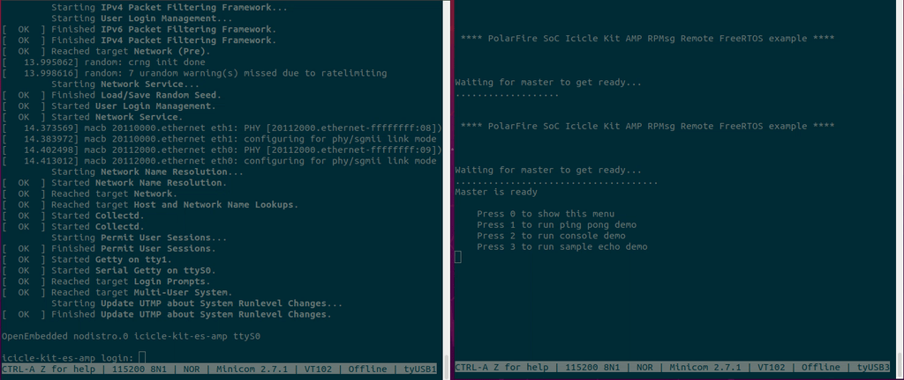

# Linux RPMsg Client Drivers

PolarFire SoC includes several client drivers which can be used to interact with a remote software context.

- [RPMsg client sample driver](#rpmsg-client-sample-driver)
- [RPMsg tty client driver](#rpmsg-tty-driver)
- [RPMsg char client driver](#rpmsg-char-driver)

## RPMsg client sample driver <a name="rpmsg-client-sample-driver"></a>

A sample driver included in the Linux kernel that demonstrates how to communicate with another software context over the RPMsg bus.

### Enabling the RPMsg client sample driver
This driver is automatically configured in Yocto and Buildroot AMP machines using the following kernel configuration:

```
CONFIG_SAMPLES=y
CONFIG_SAMPLE_RPMSG_CLIENT=m
```

### Using the RPMsg client sample driver

1. Build and run the Linux + FreeRTOS AMP configuration demo as explained [here](amp.md#amp-linux-freertos)
2. At start-up, FreeRTOS context will display a menu. Press 3 in the serial terminal to run the sample echo demo
3. The Linux context should start the demo automatically




## RPMsg TTY client driver <a name="rpmsg-tty-driver"></a>
Exposes a standard TTY interface (/dev/RPMSGX) on top of the RPMsg framework. Allows reading/writing to the TTY device to send/receive messages from a remote software context.

### Enabling the RPMsg TTY client driver
This driver is automatically configured in Yocto and Buildroot AMP machines using the following kernel configuration:

```
CONFIG_RPMSG_MIV_TTY=m
```

### Using the RPMsg TTY client driver

To test the RPMsg client driver using the Linux + FreeRTOS AMP configuration demo:

1. Build and run the Linux + FreeRTOS AMP configuration demo as explained [here](amp.md#amp-linux-freertos)
2. At start-up, FreeRTOS context will display a menu. Press 2 in the serial terminal to run the console demo
3. The Linux context should display the following message in the console:

```
virtio_rpmsg_bus virtio0: creating channel rpmsg-virtual-tty-channel
Installed rpmsg tty driver!
```

3. A new tty device should be registered in Linux. To verify this, run the command shown below:

```
root@icicle-kit-es-amp:~# ls /dev/ttyRPMSG*

/dev/ttyRPMSG4
```

4. Configure the RPMsg tty port using the stty command:

```
stty -echo -F /dev/ttyRPMSG4
```

5. Use the printf command to send a message to the FreeRTOS context:

```
printf "Hello from Linux context\r\r" > /dev/ttyRPMSG4
```

6. The message should be received and displayed on the FreeRTOS application.


## RPMsg Char client driver <a name="rpmsg-char-driver"></a>

Exposes RPMsg endpoints to user-space processes (/dev/rpmsgX). Supports the creation of multiple endpoints within a single RPMsg channel by using a control interface (/dev/rpmsg_ctrlX).

### Enabling the RPMsg char driver
This driver is automatically configured in Yocto and Buildroot AMP machines using the following kernel configuration:

```
CONFIG_RPMSG_CHAR=m
```

### Using the RPMsg char client driver

A RPMsg ping-pong linux user space application is provided as part of the [polarfire-soc-linux-examples](https://github.com/polarfire-soc/polarfire-soc-linux-examples) repository. These examples are also bundled in the PolarFire SoC Yocto and Buildroot images.

This rpmsg-pingpong application uses the RPMsg char driver to create an endpoint using an ioctl control interface (/dev/rpmsg_ctrlX) and exposes the endpoint to the user space by creating a /dev/rpmsgX device.

The application then uses this /dev/rpmsgX device to send chunks of data (payloads) of variable sizes to the remote software context. The remote side echoes the data back to the application which then validates the data returned.

1. Build and run the Linux + FreeRTOS AMP configuration demo as explained [here](amp.md#amp-linux-freertos)
2. At start-up, FreeRTOS context will display a menu. Press 1 in the serial terminal to run the ping pong demo
3. The Linux context should display the following message in the console:

```
virtio_rpmsg_bus virtio0: creating channel rpmsg-amp-demo-channel
```

4. Build and run the mpfs-pingpong application provided in the /opt/microchip/amp directory:

```
root@icicle-kit-es-amp:~# cd /opt/microchip/amp/rpmsg-pingpong/
root@icicle-kit-es-amp:~# make
root@icicle-kit-es-amp:~# ./rpmsg-pingpong
```
For more information on how to build/run the rpmsg-pingpong linux example, please refer to the [polarfire-soc-linux-examples repository](https://github.com/polarfire-soc/polarfire-soc-linux-examples).

5. The application should start sending/receiving messages. At the end, a test report should be displayed in the Linux console:

```
 **************************************

 Echo Test Round 0 Test Results: Error count = 0

 **************************************
```

