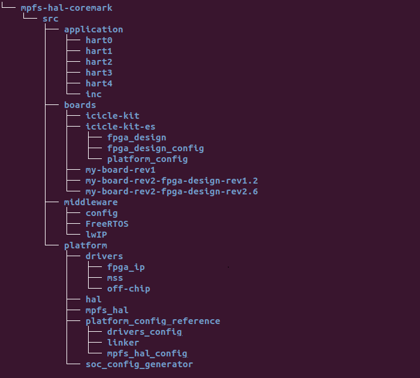
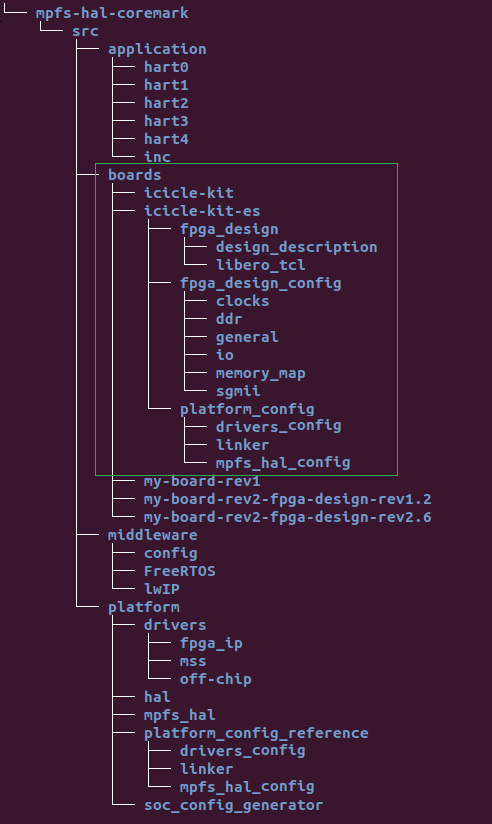
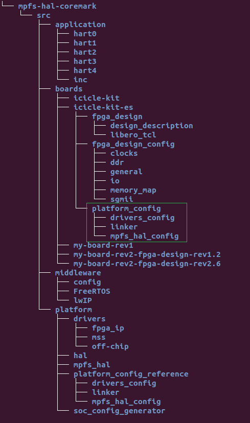
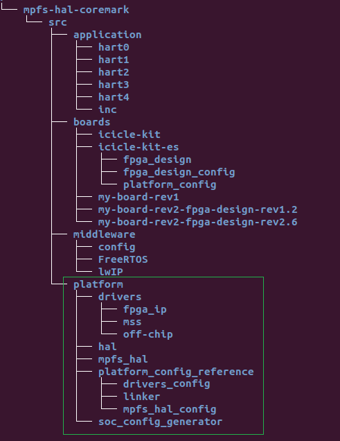
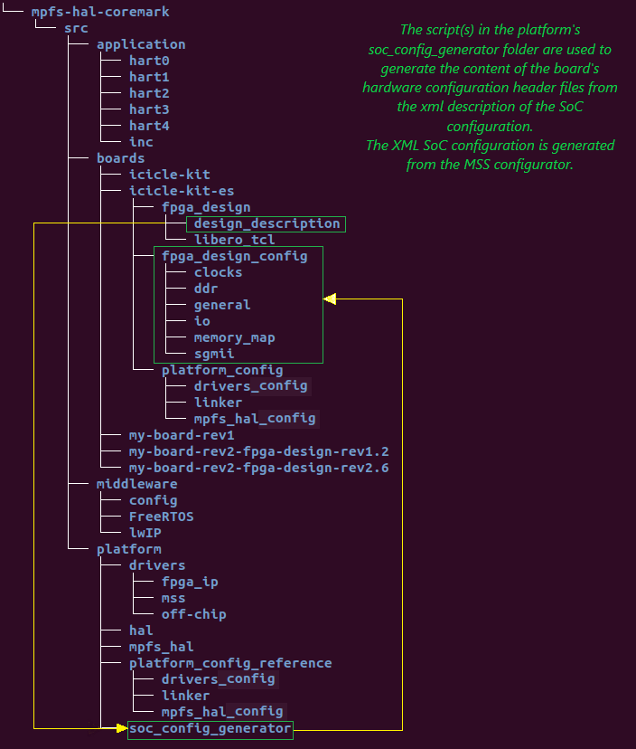
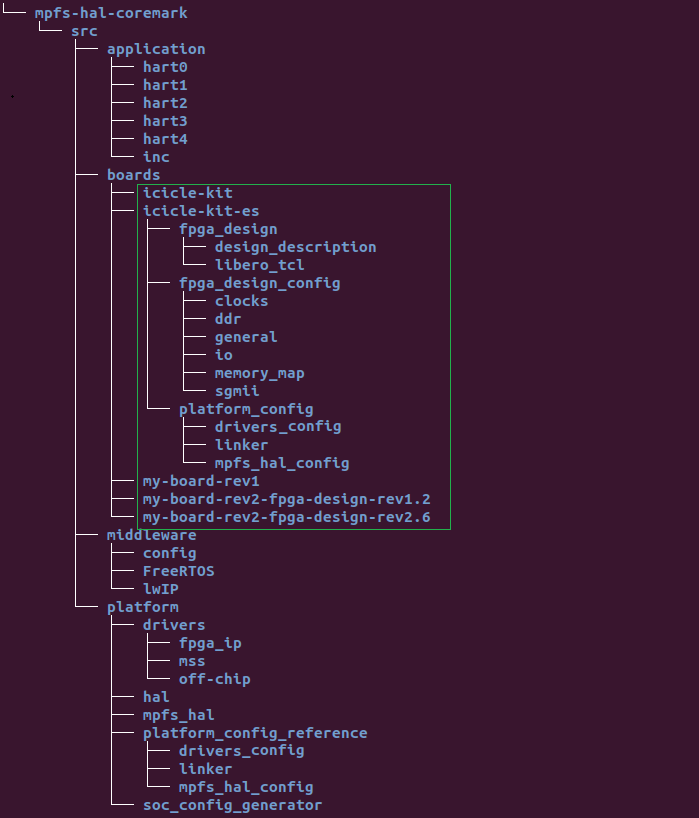
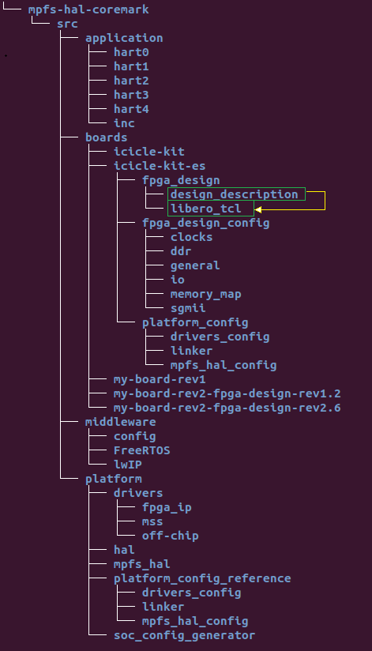

# Bare Metal Software Projects Structure

This document provides an overview of how PolarFire&reg; SoC example software projects are structured. It explains some of the rationales for using this structure and may be helpful in using and adapting this folder structure for your own use.

- [Folder Structure](#Folder-Structure)
    - [application](#Application-Folder)
    - [boards](#Boards-Folder)
        - [fpga_design_config](#fpga-design-config)
        - [soc_fpga_design](#soc-fpga-design)
            - [libero_tcl](#libero-tcl)
            - [design_description](#design-description)
    - [platform_config](#Platform-config-Folder)
        - [drivers_config](#drivers-config)
        - [linker](#Linker-Folder)
        - [mpfs_hal_config](#mpfs-hal-config)
    - [middleware](#Middleware-Folder)
    - [platform](#Platform-Library-Folder)
        - [drivers](#drivers-folder)
          - [fpga_ip](#fpga-ip-folder)
          - [mss](#mss-folder)
          - [off_chip](#off-chip-folder)
        - [hal](#hal-folder)
        - [soc_config_generator](#soc-config-generator)
        - [mpfs_hal](#mpfs-hal-folder)
        - [platform_config_reference](#reference-platform)
            - [drivers_config](#drivers-reference-config)
            - [linker](#linker-references)
            - [mpfs_hal_config](#mpfs-hal-config-reference)
- [Project Types](#Project-Types)
    - [Generic project](#Generic-project)
    - [Custom platform project](#Custom-platform-project)
    - [Multiple targets project](#Multiple-targets-project)
- [Platform configuration flow](#xml-flow)
- [MSS Configurator and Libero&reg; project](#MSS-Configurator-and-Libero-project)
- [Updating the platform](#Updating-the-platform)

## Concepts
The bare metal software projects structure is based around the concept of platform and boards. The platform is the combination of a hardware SoC device and some low level software. This low level software includes start-up code, hardware abstraction layer and peripheral drivers. This platform is configured through software to suit the target board.

In the case of PolarFire SoC, the SoC is a specific FPGA design. The platform configuration includes the Microprocessor Sub-System (MSS) configuration, which itself relies on SoC configuration metadata. Additional platform configuration settings are described by linker scripts and platform feature enable/disable selections.

## Folder Structure
All project source code is located under the *src* folder. Keeping the source code separate from project build artifacts allows easily searching the source code without getting matches from intermediate build objects or map files.

### application
The *application* folder is intended for the application source code. Typically, bare metal example projects have one file containing the code executed by each hart.

You can organize the content of this folder as best fits your preference or keep your application code in another location.

### boards
The *boards* folder contains one or more subfolders for each development board and SoC FPGA design combination supported by the software project. Each subfolder contains an *fpga_design* and a *fpga_design_config* folder under it.

#### fpga_design_config
The *fpga_design_config* folder contains header files specifying the configurations of the PolarFire SoC device. The content of this folder is auto-generated from configuration meta-data created using the MSS Configurator.

The content of this folder is used by the PolarFire SoC Hardware Abstraction Layer (MPFS HAL) to configure PolarFire SoC during system start-up. Among other things it configures:

- Clocks
- I/Os
- DDR memory controller
- SGMII interfaces
- L2 cache partitioning

#### fpga_design
The content of the *fpga_design* folder is not directly used as part of building the software but it is good practice to keep its content up to date and in synch with the SoC FPGA design.

##### libero_tcl
The *libero_tcl* sub-folder contains a copy of, or links to, the source controlled TCL script(s) used to re-generate the MSS configurator and Libero project from which the programming bitstream for the SoC FPGA is generated. Keeping track of these scripts allows you to generate the SoC FPGA programming bit-stream when unsure of which FPGA design your board is programmed with, or to look at the finer details of the SoC FPGA design to aid in system debug.

##### design_description
The *design_description* sub-folder contains the meta-data generated by the MSS Configurator. This meta-data is used to generate the C data structures containing the PolarFire SoC hardware configuration that are applied by the MPFS HAL at system start-up.

Depending on the your project's settings, the content of this folder can be used to generate the content of the board's *fpga_design_config* folder each time the project is built.

### platform_config
The *platform_config* folder contains sub-folders allowing fine tuning the configuration of the platform to best suit the project's application. This folder is only required if the default platform configuration is not suitable and needs to be customized for the application.
The typical reason for creating a *platform_config* is to customize reference linker scripts provided in the */src/platform/platform_config_reference* folder.
The *platform_config* folder is initially created from the *platform_config_reference* folder found under */src/platform*. It is the user's responsibility to manage the content of this folder. Tools will not change the content of this folder.

#### drivers_config
This *drivers_config* folder contains configuration for the drivers found in */src/platform/drivers*. This folder is rarely required. When required, its use will be explained in the driver's documentation.

#### linker
The *linker* folder contains linker script(s) specific to the project. It can be used where no linker script provided in the *platform/platform_config_refernce/linker* folder is suitable for the project or where one of these reference linker scripts needs to be modified to suit the project.

The use of this folder is only a suggestion. Nothing in the  bare metal software project structure forces you to use such a folder. However, it is recommended that you keep modified reference linker scripts in a location outside of the *platform* folder.

#### mpfs_hal_config
This *mpfs_hal_config* folder contains additional configuration of the MPFS HAL where the default MPFS HAL settings are not suitable for this specific project's application. For example, you might want to disable some hardware included in the base design and/or use only a subset of the available RISC-V harts for your application.

### middleware
The *middleware* folder is intended for RTOS, communication stacks and/or middleware. For example, RTOS source code or TCP/IP stacks.

The use of this folder is only a suggestion. Nothing in the bare metal software project structure forces you to use such a folder.

### platform
The *platform* folder contains source code for configuring and accessing the hardware platform.

The content of this folder is not expected to be modified. The content of this folder should be thought as silicon vendor specific software which is updated/released at regular intervals by Microchip. Avoiding modifications of this folder's content will allow you to easily update your project with updates and bug fixes from Microchip.

#### drivers
The *drivers* folder contains the device drivers supported by the platform and the board.

##### mss
The *mss* folder contains the source code for PolarFire SoC MSS peripherals.

##### fpga_ip
The *fpga_ip* folder contains the source code for FPGA fabric soft-IP peripherals.

##### off_chip
The *off_chip* folder contains the source code for peripherals that are external to the FPGA device, such as sensors or memory devices on the board, or peripherals connected to the board via expansion boards.

#### hal
The *hal* folder contains the Hardware Abstraction Layer(HAL) used by the FPGA fabric soft-IP peripheral drivers. This HAL is more generic than the MPFS HAL, allowing use of the same soft-IP peripherals and their drivers across different FPGA device families.

#### mpfs_hal
The *mpfs_hal* folder contains the PolarFire SoC Hardware Abstraction Layer (MPFS HAL). The MPFS HAL deals with configuring and starting up the system. It uses configuration files generated based on the system configuration captured in the MSS Configuration tool. These configuration files are found under the *platform_config* folder.

#### platform_config_reference
As indicated by the name, the *platform_config_reference* folder is provided as a reference implementation of the *platform_config*. The *platform_config_reference* configures the *platform* to the default settings. You are advised not to edit the contents of this folder. Instead, refer to the **platform_config** section above to understand the process of customizing the *platform* for your application.

##### drivers_config
This *drivers_config* folder contains the default configuration of the drivers found in     */src/platform/drivers*. The content of this folder is rarely required. If required, its use will be explained in the driver's documentation. However, it is not recommended to modify them in place to avoid difficulties in applying future platform updates.

##### linker
The *linker* folder contains example linker scripts providing the symbols required by the MPFS HAL to start-up the system and configure memory. These linker scripts can be copied to another location in the project outside of the *platform* folder and customized for your application. However, it is not recommended to modify them in place to avoid difficulties in applying future platform updates.

##### mpfs_hal_config
The *mpfs_hal_config* folder contains a set of header files containing the default configuration of the MPFS HAL. This default configuration includes the use of all processor cores and the configuration of all hardware blocks included in the microprocessor subsystem configuration selected in the MSS Configurator.

#### soc_config_generator
The *soc_config_generator* folder contains the script(s) used to generate the SoC FPGA hardware configuration files from the design description of the SoC FPGA design. Currently the design description is provided as a .xml file.

## Project Types

### Generic projects
Generic projects are the simplest form of software project. They have limited dependencies on board specific features. They usually only use MSS peripherals. They do not require special memory placement, allowing them to use the unmodified reference linker scripts provided in the *platform_config_reference*.

### Custom platform projects
Projects where code placement requires a modified linker script or where default MPFS HAL and/or driver configuration is not suitable.

Examples:
- Projects where DDR training is disabled or being debugged
- Projects where only a subset of harts are used

The *platform_config* folder is created by making a copy the *platform_config_reference* folder provided as part of the *platform* repository. Any linker script customization or configuration header changes take place outside of the *platform* folder which remains unchanged. This approach allows easy updating of the *platform* to take advantage of enhancements and bug fixes without overwriting any project specific customizations.

### Projects supporting multiple targets
The example software projects are structured to allow easily targeting multiple hardware platforms. Different hardware platforms can be completely different development boards or different FPGA design revisions for a same board.

One sub-folder for each board/FPGA design combination can be located under the *boards* folder. Targeting a specific board is done by setting the project's include paths for the compiler and assembler settings to point at the desired board's folder under the *boards* folder and only allowing the source code for that configuration to be included in the build.

For example, switching between the engineering sample and production silicon of the Icicle kit is done by:

- setting the compiler and assembler include path to point at *boards/icicle-kit* instead of *boards/icicle-kit-es*
- including in the build the source code contained in *boards/icicle-kit*
- excluding from the build the source code contained in *boards/icicle-kit-es*

The steps above can easily be done through SoftConsole build configurations or makefiles.

## Platform Configuration flow
Synchronization of the embedded software and FPGA digital design flows is presently done through a set of XML files generated by the MSS Configurator. It is good practice to keep a copy of both the generated XML file as well as the MSS Configurator project file within the
*board/\<board-design-name>/fpga_design* folder of the software project.
The XML design description file is used as input to a script located in *src/platform/soc_config_generator* to generate the content of the
*boards/\<board-design-name>/fpga_design_config* folder.

For more information on the Libero and MSS Configurator tools, pleaser refer to the [Tool Flow](https://github.com/polarfire-soc/polarfire-soc-documentation/blob/master/software-development/polarfire-soc-software-tool-flow.md#tool-flow)
## MSS Configurator and Libero project

### Updating the platform
The platform folder is intended to be updated from a git source code repository as a subtree or submodule. For the latest PolarFire SoC platform released, refer to the [platform release page](https://github.com/polarfire-soc/platform/releases).

#### Updating a custom project
Updating the *platform* of a project  using a custom platform configuration should include doing a diff of the *platform_config_reference* with its previous version to identify new or obsolete configuration defines that need to be merged into the custom *platform_config* folder. Likewise, the *platform_config_reference* linker scripts must be reviewed for changes that need to be merged into the custom linker scripts.
