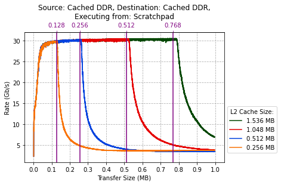

# PolarFire SoC DMA Benchmarking Overview

- [PolarFire SoC DMA Benchmarking Overview](#polarfire-soc-dma-benchmarking-overview)
  - [Introduction](#introduction)
    - [Background](#background)
  - [High Level Overview](#high-level-overview)
  - [Platform DMA (P-DMA) Controller](#platform-dma-p-dma-controller)
  - [P-DMA Performance Overview](#p-dma-performance-overview)
    - [P-DMA Force Ordering](#p-dma-force-ordering)
  - [CoreAXI4DMAController (F-DMA)](#coreaxi4dmacontroller-f-dma)
  - [F-DMA Performance Overview](#f-dma-performance-overview)
    - [Note on F-DMA FPGA Fabric Transfers](#note-on-f-dma-fpga-fabric-transfers)
  - [Concurrent DMA Benchmarking](#concurrent-dma-benchmarking)
  - [Note on Impact of L2 Cache configuration](#note-on-impact-of-l2-cache-configuration)

## Introduction

This document discusses benchmarking the performance of the Direct Memory Access (DMA) Controllers on
PolarFire SoC.

A high level overview of the benchmarking results is provided, in addition to a discussion of the main
factors impacting DMA performance.

Please refer to the following documents for a full set of results relating to each DMA controller:

- [P-DMA Benchmarking Results][P-DMA Benchmarking Results]: discusses the performance of the Platform
  DMA (P-DMA) Controller located in the MSS Core Complex.
- [CoreAXI4DMAController Benchmarking Results][CoreAXI4DMAController Benchmarking Results]: discusses
  the performance of the CoreAXI4DMAController (F-DMA) located in the FPGA fabric.
- [Concurrent Benchmarking Results][Concurrent Benchmarking Results]: discusses the performance results
  of using the P-DMA and the F-DMA to perform data transfers concurrently.

The results presented in these documents can be generated using the
[DMA benchmarking baremetal project][DMA benchmarking baremetal project].

[P-DMA Benchmarking Results]: https://mi-v-ecosystem.github.io/redirects/polarfire-soc/benchmarks/mss-pdma-benchmarking
[CoreAXI4DMAController Benchmarking Results]: https://mi-v-ecosystem.github.io/redirects/polarfire-soc/benchmarks/fabric-dma-benchmarking
[Concurrent Benchmarking Results]: https://mi-v-ecosystem.github.io/redirects/polarfire-soc/benchmarks/concurrent-dma-benchmarking
[DMA benchmarking baremetal project]: https://mi-v-ecosystem.github.io/redirects/polarfire-soc-bare-metal-examples-applications-benchmarks-dma_benchmarking-mpfs-dma-benchmarking

### Background

Direct Memory Access (DMA) Controllers provide high-bandwidth direct memory data transfers between memory
and hardware subsystems independent of the central processing unit (CPU). Minimal processor cycles are
required to program a DMA controller, and the CPU is free to execute other tasks while the DMA controller
transfers data.

There are two DMA Controllers available on PolarFire SoC:

- Platform DMA (P-DMA) Controller located inside the MSS Core Complex.
- CoreAXI4DMAController (F-DMA) which is a DMA Controller module in the FPGA fabric.

## High Level Overview

The following table provides a general summary of which DMA achieves the highest performance when transferring
data between each source and destination.

| **Source\Destination**     | **L2-LIM** | **Scratchpad** | **Cached DDR** | **Non-Cached DDR** | **FPGA Fabric Peripheral** |
| -------------------------- | ---------- | -------------- | -------------- | ------------------ | -------------------------- |
| **L2-LIM**                 | P-DMA      | P-DMA          | P-DMA          | P-DMA              | --                         |
| **Scratchpad**             | P-DMA      | P-DMA          | P-DMA          | P-DMA              | --                         |
| **Cached DDR**             | P-DMA      | P-DMA          | P-DMA          | P-DMA              | F-DMA                      |
| **Non-Cached DDR**         | P-DMA      | P-DMA          | P-DMA          | F-DMA              | F-DMA                      |
| **FPGA Fabric Peripheral** | --         | --             | F-DMA          | F-DMA              | F-DMA                      |

The table above uses the performance of the P-DMA and F-DMA in ideal circumstances.
Performance may vary based on a number of factors, such as: the type of memory that the program is
being executed from, transfer size, and whether both DMAs are running concurrently.

## Platform DMA (P-DMA) Controller

The P-DMA controller is located inside the CPU core complex. The P-DMA has memory-mapped control registers
accessed over a TileLink target interface to allow software to set up DMA transfers.

It also has a TileLink bus initiator port into the TileLink bus fabric for accessing external memory
locations.

The P-DMA is connected to the following;

- To the DRR Controller, via the TileLink bus and a 128-bit AXI initiator interface.
- To peripherals and to the FPGA fabric, via the TileLink bus, the AXI Switch and a 64-bit AXI initiator
  interface.

The P-DMA unit can support multiple independent simultaneous DMA transfers using different P-DMA channels
and can generate PLIC interrupts on various events during DMA transfer.

## P-DMA Performance Overview

The following table shows the peak transfer rate of the P-DMA transferring data between a selection of
the memory combinations when executing the program from each of the 3 possible memory locations.
A full set of results are available in the [P-DMA Benchmarking Results][P-DMA Benchmarking Results] document.

| **Memory Source:** | **Memory Destination:** | **Peak Rate, Executing from: Cached DDR** | **Peak Rate, Executing from: Scratchpad** | **Peak Rate, Executing from: L2-LIM** |
| ------------------ | ----------------------- | ----------------------------------------- | ----------------------------------------- | ------------------------------------- |
| **Cached DDR**     | Cached DDR              | 30288 Mb/s                                | 30320 Mb/s                                | 30248 Mb/s                            |
| **Non-Cached DDR** | Non-Cached DDR          | 3920 Mb/s                                 | 3624 Mb/s                                 | 3624 Mb/s                             |
| **L2-LIM**         | Cached DDR              | 19120 Mb/s                                | 19080 Mb/s                                | 17656 Mb/s                            |
| **L2-LIM**         | Non-Cached DDR          | 16992 Mb/s                                | 16928 Mb/s                                | 16984 Mb/s                            |
| **Scratchpad**     | Cached DDR              | 30464 Mb/s                                | 30472 Mb/s                                | 30504 Mb/s                            |

***The P-DMA achieves the highest transfer rate when transferring data between memories located within the
MSS corecomplex.
These memories are L2-LIM, Scratchpad and Cached DDR which are all part of the L2 Cache.***

### P-DMA Force Ordering

The P-DMA has an option to enforce ordering on DMA transfers.
If this setting is turned on the data transferred by the DMA from the source memory must be received
by the destination memory in the same order that is was transferred.

Turning on Force Ordering for the P-DMA reduces the peak transfer rate that it can achieve.
The table below shows the difference in P-DMA performance as a result of turning force ordering on,
when executing from each of the 3 possible memory locations.

***Force Ordering has the least impact on transfers between memories that use the L2 Cache, and the
greatest impact on transfers involving Non-Cached DDR.***

| **Memory Source:** | **Memory Destination:** | **Cached DDR - Peak Rate** | **Cached DDR - Force Order Performance Reduction** | **Scratchpad - Peak Rate** | **Scratchpad - Force Order Performance Reduction** | **L2-LIM - Peak Rate** | **L2-LIM - Force Order Performance Reduction** |
| ------------------ | ----------------------- | -------------------------- | -------------------------------------------------- | -------------------------- | -------------------------------------------------- | ---------------------- | ---------------------------------------------- |
| **Cached DDR**     | Cached DDR              | 13856 Mb/s                 | -53%                                               | 14232 Mb/s                 | -53%                                               | 14344 Mb/s             | -54%                                           |
| **Non-Cached DDR** | Non-Cached DDR          | 1960 Mb/s                  | -46%                                               | 1960 Mb/s                  | -46%                                               | 1960 Mb/s              | -47%                                           |
| **Non-Cached DDR** | L2-LIM                  | 2352 Mb/s                  | -81%                                               | 2344 Mb/s                  | -81%                                               | 2352 Mb/s              | -82%                                           |
| **L2-LIM**         | Cached DDR              | 12256 Mb/s                 | -29%                                               | 12264 Mb/s                 | -36%                                               | 10936 Mb/s             | -36%                                           |
| **L2-LIM**         | Non-Cached DDR          | 5688 Mb/s                  | -68%                                               | 5688 Mb/s                  | -68%                                               | 5472 Mb/s              | -68%                                           |
| **L2-LIM**         | L2-LIM                  | 7656 Mb/s                  | -17%                                               | 7656 Mb/s                  | -20%                                               | 7064 Mb/s              | -20%                                           |
| **L2-LIM**         | Scratchpad              | 12280 Mb/s                 | -38%                                               | 12256 Mb/s                 | -36%                                               | 10944 Mb/s             | -36%                                           |
| **Scratchpad**     | Cached DDR              | 14560 Mb/s                 | -51%                                               | 14800 Mb/s                 | -51%                                               | 14736 Mb/s             | -53%                                           |
| **Scratchpad**     | L2-LIM                  | 8064 Mb/s                  | -54%                                               | 8064 Mb/s                  | -58%                                               | 7824 Mb/s              | -58%                                           |

## CoreAXI4DMAController (F-DMA)

The F-DMA is a DMA controller module located in the FPGA fabric, and is connected to the PolarFire SoC
MSS via FIC 0.
It accesses the DDR Controller via FIC 0 and the AXI Switch over a 64-bit AXI4 bus.

The module supports memory to memory DMA transfers (block transfers) over an AXI4 master interface, and
transfers between the FPGA fabric and DDR memories using an AXI4-Stream slave interface and a AXI4 master
interface.

The F-DMA has memory mapped control and status registers accessible over AXI4-Lite interface.
It can support DMA operations up to 8MB, and has support for 32 internal descriptors, along with external
descriptor and stream descriptor support.

## F-DMA Performance Overview

The following table shows the peak performance of the F-DMA transferring data between every source-destination
combination when executing the program from each of the 3 possible memory locations.
Additional results data is available in the [F-DMA Benchmarking Results][F-DMA Benchmarking Results]
document.

| **Memory Source:** | **Memory Destination:** | **Peak Rate (Cached DDR)** | **Peak Rate (Scratchpad)** | **Peak Rate (L2-LIM)** |
| ------------------ | ----------------------- | -------------------------- | -------------------------- | ---------------------- |
| **Cached DDR**     | Cached DDR              | 6272 Mb/s                  | 7192 Mb/s                  | 7088 Mb/s              |
| **Cached DDR**     | Non-Cached DDR          | 7408 Mb/s                  | 7256 Mb/s                  | 7232 Mb/s              |
| **Non-Cached DDR** | Cached DDR              | 6968 Mb/s                  | 6944 Mb/s                  | 6944 Mb/s              |
| **Non-Cached DDR** | Non-Cached DDR          | 6968 Mb/s                  | 6968 Mb/s                  | 6968 Mb/s              |
| **FPGA Fabric**    | Cached DDR              | 7520 Mb/s                  | 7456 Mb/s                  | 7448 Mb/s              |
| **FPGA Fabric**    | Non-Cached DDR          | 7488 Mb/s                  | 7400 Mb/s                  | 7408 Mb/s              |
****
[F-DMA Benchmarking Results]: https://mi-v-ecosystem.github.io/redirects/polarfire-soc/benchmarks/fabric-dma-benchmarking

### Note on F-DMA FPGA Fabric Transfers

In the case of the benchmarking results table above, the F-DMA transfers from the FPGA fabric to either
the Cached/Non-Cached DDR were done using the AXI4-Stream functionality of the F-DMA.

Transfers from the FPGA fabric involve a data stream generated from a 'stream generator module' in the
fabric, connected to the AXI4-Stream slave interface on the F-DMA.
The F-DMA then transfers the streamed data to DDR memory over its AXI4 Master DMA interface.

## Concurrent DMA Benchmarking

The following table shows the peak transfer rate for a selection of the concurrent F-DMA & P-DMA transfers,
the full set of results are available in the
[Concurrent Benchmarking Results][Concurrent Benchmarking Results] document.

| **#** | **Executing From:** | **F-DMA: Source** | **F-DMA: Destination** | **P-DMA: Source** | **P-DMA: Destination** | **F-DMA: Individual Peak Transfer Rate (Mb/s)** | **F-DMA: Concurrent Peak Transfer Rate (Mb/s)** | **F-DMA: Concurrent Performance Difference** | **P-DMA: Individual Peak Transfer Rate (Mb/s)** | **P-DMA: Concurrent Peak Transfer Rate (Mb/s)** | **P-DMA: Concurrent Performance Difference** |
| ----- | ------------------- | ----------------- | ---------------------- | ----------------- | ---------------------- | ----------------------------------------------- | ----------------------------------------------- | -------------------------------------------- | ----------------------------------------------- | ----------------------------------------------- | -------------------------------------------- |
| **1** | **Cached DDR**      | Cached DDR        | Cached DDR             | Cached DDR        | Cached DDR             | 7088                                            | 4982                                            | -30%                                         | 30288                                           | 7127                                            | -76%                                         |
| **2** | **Cached DDR**      | Non-Cached DDR    | Non-Cached DDR         | Cached DDR        | Cached DDR             | 6968                                            | 6945                                            | -0%                                          | 30288                                           | 30903                                           | +2%                                          |
| **3** | **Cached DDR**      | Cached DDR        | Cached DDR             | Non-Cached DDR    | Non-Cached DDR         | 7088                                            | 4284                                            | -40%                                         | 3920                                            | 6561                                            | +67%                                         |
| **4** | **Cached DDR**      | FPGA Fabric       | Cached DDR             | Cached DDR        | Cached DDR             | 7520                                            | 7450                                            | -1%                                          | 30288                                           | 24220                                           | -20%                                         |
| **5** | **Scratchpad**      | Cached DDR        | Cached DDR             | Cached DDR        | Cached DDR             | 6272                                            | 6613                                            | +5%                                          | 30320                                           | 27424                                           | -10%                                         |
| **6** | **Scratchpad**      | FPGA Fabric       | Cached DDR             | Cached DDR        | Cached DDR             | 7456                                            | 7463                                            | 0%                                           | 30320                                           | 25244                                           | -17%                                         |
| **7** | **Scratchpad**      | Non-Cached DDR    | Cached DDR             | Cached DDR        | Non-Cached DDR         | 6968                                            | 6901                                            | -1%                                          | 17016                                           | 14268                                           | -16%                                         |

From the above table of results it can be seen that both the DMAs experience the greatest performance
reduction when they are both transferring data between the same source and destination pair,
such as row #1; F-DMA: Cached DDR to Cached DDR & P-DMA: Cached DDR to Cached DDR.

However, the performance impact to both DMA controllers can be mitigated by changing even one of the
source or destination memories used by either DMA controller.

Compare the case of row #1; F-DMA: FPGA Fabric to Cached DDR & P-DMA: Cached DDR to Cached DDR, and row
\#4; where both DMA controllers are transferring data between Cached DDR.
As a result of changing the F-DMA memory source (column 2) to be the FPGA Fabric; the F-DMA transfer
rate reduction is now 1\%, down from 30\%, and the reduction in P-DMA performance is down to 20\%, from
76\%.

Additionally, it is important to note that using both DMA controllers concurrently does not necessarily
result in a reduction in the performance of either DMA controller.

There is a minimal performance impact (< 2%) in the case of row #2, F-DMA: Non-Cached DDR to Non-Cached
DDR & P-DMA: Cached DDR to Cached DDR.
In some cases certain combinations of source and destination memories result in an improvement of transfer
rates, see row #3; F-DMA: Cached DDR to Cached DDR & P-DMA: Non-Cached DDR to Non-Cached DDR.

## Impact of L2 Cache configuration

The above figure graphs the performance of the P-DMA when transferring data to Cached
DDR for 4 different configurations of the L2 Cache.

For all of the above transfers, cached DDR is used as both the transfer source and
destination. Ass such the cache memory available for each is half the total size of
L2 Cache.

The drop off in performance of DMA transfers occurs when the available L2 Cache
memory fills up.
The same phenomenon occurs when transferring data to/from Cached DDR using the F-DMA
The cache becomes full because the DMAs can transfer data to the cache faster than
the data in the cache can be written to DDR memory.

The performance begins to degrade once the data being transferred is ~ 102%
the size of the available cache space. In the above figure, this is most apparent
with larger cache configurations of 1.536 MB and 1.024 MB.

The L2 memory can be configured to change how much space is allocated to each of
L2 LIM, Scratchpad Memory or L2 Cache, which is the cache used for the Cached DDR.
The default L2 Cache configuration for this project, has 4 cache ways of 0.128 MB
each, totalling 0.512 MB allocated for use as L2 Cache. The remainder is allocated
between Scratchpad and LIM memory.
In all the L2-Cache is made up of 16 cache ways, totalling 2.048MB of cached memory.

To modify the L2-Cache configuration, edit the MSS configuration file that is included
with the application, in the `src/boards/icicle-kit-es/mss_configuration` folder.
