# Concurrent DMA Transfer Benchmarks

- [Concurrent DMA Transfer Benchmarks](#concurrent-dma-transfer-benchmarks)
  - [Running from Cached DDR](#running-from-cached-ddr)
    - [Fabric-DMA: Cached DDR to Cached DDR, Running from Cached DDR](#fabric-dma-cached-ddr-to-cached-ddr-running-from-cached-ddr)
    - [Fabric-DMA: Cached DDR to Non-Cached DDR, Running from Cached DDR](#fabric-dma-cached-ddr-to-non-cached-ddr-running-from-cached-ddr)
    - [Fabric-DMA: Non-Cached DDR to Cached DDR, Running from Cached DDR](#fabric-dma-non-cached-ddr-to-cached-ddr-running-from-cached-ddr)
    - [Fabric-DMA: Non-Cached DDR to Non-Cached DDR, Running from Cached DDR](#fabric-dma-non-cached-ddr-to-non-cached-ddr-running-from-cached-ddr)
    - [Fabric-DMA: FPGA Fabric to Cached DDR, Running from Cached DDR](#fabric-dma-fpga-fabric-to-cached-ddr-running-from-cached-ddr)
    - [Fabric-DMA: FPGA Fabric to Non-Cached DDR, Running from Cached DDR](#fabric-dma-fpga-fabric-to-non-cached-ddr-running-from-cached-ddr)
  - [Running from Scratchpad Memory](#running-from-scratchpad-memory)
    - [Fabric-DMA: Cached DDR to Cached DDR, Running from Scratchpad Memory](#fabric-dma-cached-ddr-to-cached-ddr-running-from-scratchpad-memory)
    - [Fabric-DMA: Cached DDR to Non-Cached DDR, Running from Scratchpad Memory](#fabric-dma-cached-ddr-to-non-cached-ddr-running-from-scratchpad-memory)
    - [Fabric-DMA: Non-Cached DDR to Cached DDR, Running from Scratchpad Memory](#fabric-dma-non-cached-ddr-to-cached-ddr-running-from-scratchpad-memory)
    - [Fabric-DMA: Non-Cached DDR to Non-Cached DDR, Running from Scratchpad Memory](#fabric-dma-non-cached-ddr-to-non-cached-ddr-running-from-scratchpad-memory)
    - [Fabric-DMA: FPGA Fabric to Cached DDR, Running from Scratchpad Memory](#fabric-dma-fpga-fabric-to-cached-ddr-running-from-scratchpad-memory)
    - [Fabric-DMA: FPGA Fabric to Non-Cached DDR, Running from Scratchpad Memory](#fabric-dma-fpga-fabric-to-non-cached-ddr-running-from-scratchpad-memory)
  - [Running from L2-LIM](#running-from-l2-lim)
    - [Fabric-DMA: Cached DDR to Cached DDR, Running from L2-LIM](#fabric-dma-cached-ddr-to-cached-ddr-running-from-l2-lim)
    - [Fabric-DMA: Cached DDR to Non-Cached DDR, Running from L2-LIM](#fabric-dma-cached-ddr-to-non-cached-ddr-running-from-l2-lim)
    - [Fabric-DMA: Non-Cached DDR to Cached DDR, Running from L2-LIM](#fabric-dma-non-cached-ddr-to-cached-ddr-running-from-l2-lim)
    - [Fabric-DMA: Non-Cached DDR to Non-Cached DDR, Running from L2-LIM](#fabric-dma-non-cached-ddr-to-non-cached-ddr-running-from-l2-lim)
    - [Fabric-DMA: FPGA Fabric to Cached DDR, Running from L2-LIM](#fabric-dma-fpga-fabric-to-cached-ddr-running-from-l2-lim)
    - [Fabric-DMA: FPGA Fabric to Non-Cached DDR, Running from L2-LIM](#fabric-dma-fpga-fabric-to-non-cached-ddr-running-from-l2-lim)

## Running from Cached DDR

### Fabric-DMA: Cached DDR to Cached DDR, Running from Cached DDR

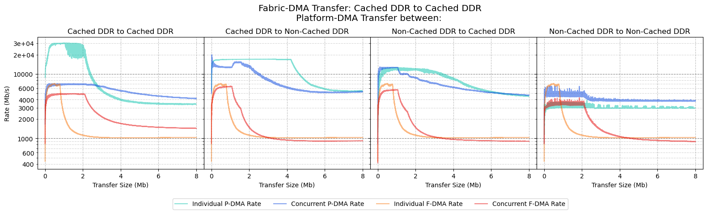

**F-DMA Results:**

| **F-DMA: Source** | **F-DMA: Destination** | **P-DMA: Source** | **P-DMA: Destination** | **F-DMA: Individual Peak Transfer Rate (Mb/s)** | **F-DMA: Size at Individual Peak Transfer Rate (Mb)** | **F-DMA: Concurrent Peak Transfer Rate (Mb/s)** | **F-DMA: Transfer Size at Concurrent Peak Transfer Rate (Mb)** | **F-DMA: Performance Difference** |
| ----------------- | ---------------------- | ----------------- | ---------------------- | ----------------------------------------------- | ----------------------------------------------------- | ----------------------------------------------- | -------------------------------------------------------------- | --------------------------------- |
| Cached DDR        | Cached DDR             | Cached DDR        | Cached DDR             | 7088                                            | 0.493                                                 | 4982                                            | 0.852                                                          | -30%                              |
| Cached DDR        | Cached DDR             | Cached DDR        | Non-Cached DDR         | 7088                                            | 0.493                                                 | 6447                                            | 1.025                                                          | -9%                               |
| Cached DDR        | Cached DDR             | Non-Cached DDR    | Cached DDR             | 7088                                            | 0.493                                                 | 5707                                            | 0.936                                                          | -19%                              |
| Cached DDR        | Cached DDR             | Non-Cached DDR    | Non-Cached DDR         | 7088                                            | 0.493                                                 | 4284                                            | 1.864                                                          | -40%                              |

**P-DMA Results:**

| **F-DMA: Source** | **F-DMA: Destination** | **P-DMA: Source** | **P-DMA: Destination** | **P-DMA: Individual Peak Transfer Rate (Mb/s)** | **P-DMA: Size at Individual Peak Transfer Rate (Mb)** | **P-DMA: Concurrent Peak Transfer Rate (Mb/s)** | **P-DMA: Transfer Size at Concurrent Peak Transfer Rate (Mb)** | **P-DMA: Performance Difference** |
| ----------------- | ---------------------- | ----------------- | ---------------------- | ----------------------------------------------- | ----------------------------------------------------- | ----------------------------------------------- | -------------------------------------------------------------- | --------------------------------- |
| Cached DDR        | Cached DDR             | Cached DDR        | Cached DDR             | 30288                                           | 1.272                                                 | 7127                                            | 0.642                                                          | -76%                              |
| Cached DDR        | Cached DDR             | Cached DDR        | Non-Cached DDR         | 17040                                           | 7.186                                                 | 15531                                           | 1.538                                                          | -9%                               |
| Cached DDR        | Cached DDR             | Non-Cached DDR    | Cached DDR             | 12624                                           | 0.642                                                 | 12767                                           | 0.741                                                          | +1%                               |
| Cached DDR        | Cached DDR             | Non-Cached DDR    | Non-Cached DDR         | 3920                                            | 2.263                                                 | 6561                                            | 0.689                                                          | +67%                              |

### Fabric-DMA: Cached DDR to Non-Cached DDR, Running from Cached DDR

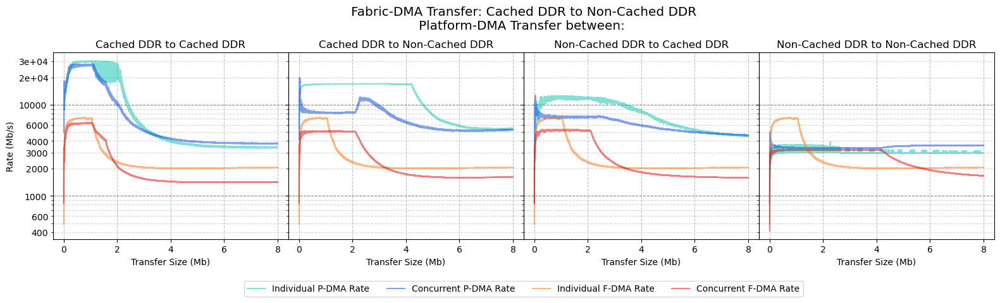

**F-DMA Results:**

| **F-DMA: Source** | **F-DMA: Destination** | **P-DMA: Source** | **P-DMA: Destination** | **F-DMA: Individual Peak Transfer Rate (Mb/s)** | **F-DMA: Size at Individual Peak Transfer Rate (Mb)** | **F-DMA: Concurrent Peak Transfer Rate (Mb/s)** | **F-DMA: Transfer Size at Concurrent Peak Transfer Rate (Mb)** | **F-DMA: Performance Difference** |
| ----------------- | ---------------------- | ----------------- | ---------------------- | ----------------------------------------------- | ----------------------------------------------------- | ----------------------------------------------- | -------------------------------------------------------------- | --------------------------------- |
| Cached DDR        | Non-Cached DDR         | Cached DDR        | Cached DDR             | 7232                                            | 0.745                                                 | 6361                                            | 1.005                                                          | -12%                              |
| Cached DDR        | Non-Cached DDR         | Cached DDR        | Non-Cached DDR         | 7232                                            | 0.745                                                 | 5195                                            | 0.213                                                          | -28%                              |
| Cached DDR        | Non-Cached DDR         | Non-Cached DDR    | Cached DDR             | 7232                                            | 0.745                                                 | 5372                                            | 0.752                                                          | -26%                              |
| Cached DDR        | Non-Cached DDR         | Non-Cached DDR    | Non-Cached DDR         | 7232                                            | 0.745                                                 | 3228                                            | 0.858                                                          | -55%                              |

**P-DMA Results:**

| **F-DMA: Source** | **F-DMA: Destination** | **P-DMA: Source** | **P-DMA: Destination** | **P-DMA: Individual Peak Transfer Rate (Mb/s)** | **P-DMA: Size at Individual Peak Transfer Rate (Mb)** | **P-DMA: Concurrent Peak Transfer Rate (Mb/s)** | **P-DMA: Transfer Size at Concurrent Peak Transfer Rate (Mb)** | **P-DMA: Performance Difference** |
| ----------------- | ---------------------- | ----------------- | ---------------------- | ----------------------------------------------- | ----------------------------------------------------- | ----------------------------------------------- | -------------------------------------------------------------- | --------------------------------- |
| Cached DDR        | Non-Cached DDR         | Cached DDR        | Cached DDR             | 30288                                           | 1.272                                                 | 28047                                           | 1.066                                                          | -7%                               |
| Cached DDR        | Non-Cached DDR         | Cached DDR        | Non-Cached DDR         | 17040                                           | 7.186                                                 | 12253                                           | 2.291                                                          | -28%                              |
| Cached DDR        | Non-Cached DDR         | Non-Cached DDR    | Cached DDR             | 12624                                           | 0.642                                                 | 8465                                            | 0.194                                                          | -33%                              |
| Cached DDR        | Non-Cached DDR         | Non-Cached DDR    | Non-Cached DDR         | 3920                                            | 2.263                                                 | 3611                                            | 7.709                                                          | -8%                               |

### Fabric-DMA: Non-Cached DDR to Cached DDR, Running from Cached DDR

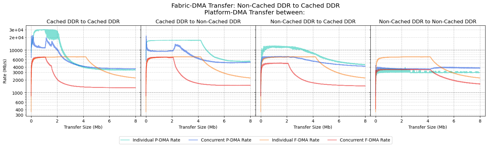

**F-DMA Results:**

| F-DMA: Source  | **F-DMA: Destination** | **P-DMA: Source** | **P-DMA: Destination** | **F-DMA: Individual Peak Transfer Rate (Mb/s)** | **F-DMA: Size at Individual Peak Transfer Rate (Mb)** | **F-DMA: Concurrent Peak Transfer Rate (Mb/s)** | **F-DMA: Transfer Size at Concurrent Peak Transfer Rate (Mb)** | **F-DMA: Performance Difference** |
| -------------- | ---------------------- | ----------------- | ---------------------- | ----------------------------------------------- | ----------------------------------------------------- | ----------------------------------------------- | -------------------------------------------------------------- | --------------------------------- |
| Non-Cached DDR | Cached DDR             | Cached DDR        | Cached DDR             | 6944                                            | 3.319                                                 | 6906                                            | 0.966                                                          | -1%                               |
| Non-Cached DDR | Cached DDR             | Cached DDR        | Non-Cached DDR         | 6944                                            | 3.319                                                 | 6895                                            | 1.441                                                          | -1%                               |
| Non-Cached DDR | Cached DDR             | Non-Cached DDR    | Cached DDR             | 6944                                            | 3.319                                                 | 4981                                            | 1.499                                                          | -28%                              |
| Non-Cached DDR | Cached DDR             | Non-Cached DDR    | Non-Cached DDR         | 6944                                            | 3.319                                                 | 3575                                            | 0.386                                                          | -49%                              |

**P-DMA Results:**

| F-DMA: Source  | **F-DMA: Destination** | **P-DMA: Source** | **P-DMA: Destination** | **P-DMA: Individual Peak Transfer Rate (Mb/s)** | **P-DMA: Size at Individual Peak Transfer Rate (Mb)** | **P-DMA: Concurrent Peak Transfer Rate (Mb/s)** | **P-DMA: Transfer Size at Concurrent Peak Transfer Rate (Mb)** | **P-DMA: Performance Difference** |
| -------------- | ---------------------- | ----------------- | ---------------------- | ----------------------------------------------- | ----------------------------------------------------- | ----------------------------------------------- | -------------------------------------------------------------- | --------------------------------- |
| Non-Cached DDR | Cached DDR             | Cached DDR        | Cached DDR             | 30288                                           | 1.272                                                 | 19968                                           | 0.180                                                          | -34%                              |
| Non-Cached DDR | Cached DDR             | Cached DDR        | Non-Cached DDR         | 17040                                           | 7.186                                                 | 13836                                           | 2.242                                                          | -19%                              |
| Non-Cached DDR | Cached DDR             | Non-Cached DDR    | Cached DDR             | 12624                                           | 0.642                                                 | 7137                                            | 1.506                                                          | -43%                              |
| Non-Cached DDR | Cached DDR             | Non-Cached DDR    | Non-Cached DDR         | 3920                                            | 2.263                                                 | 4016                                            | 5.289                                                          | +2%                               |

### Fabric-DMA: Non-Cached DDR to Non-Cached DDR, Running from Cached DDR

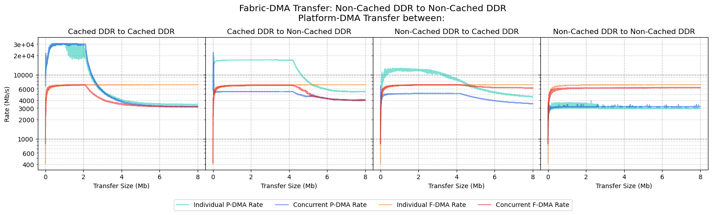

**F-DMA Results:**

| F-DMA: Source  | **F-DMA: Destination** | **P-DMA: Source** | **P-DMA: Destination** | **F-DMA: Individual Peak Transfer Rate (Mb/s)** | **F-DMA: Size at Individual Peak Transfer Rate (Mb)** | **F-DMA: Concurrent Peak Transfer Rate (Mb/s)** | **F-DMA: Transfer Size at Concurrent Peak Transfer Rate (Mb)** | **F-DMA: Performance Difference** |
| -------------- | ---------------------- | ----------------- | ---------------------- | ----------------------------------------------- | ----------------------------------------------------- | ----------------------------------------------- | -------------------------------------------------------------- | --------------------------------- |
| Non-Cached DDR | Non-Cached DDR         | Cached DDR        | Cached DDR             | 6968                                            | 6.669                                                 | 6945                                            | 1.917                                                          | -0%                               |
| Non-Cached DDR | Non-Cached DDR         | Cached DDR        | Non-Cached DDR         | 6968                                            | 6.669                                                 | 6848                                            | 3.568                                                          | -2%                               |
| Non-Cached DDR | Non-Cached DDR         | Non-Cached DDR    | Cached DDR             | 6968                                            | 6.669                                                 | 6961                                            | 3.647                                                          | -0%                               |
| Non-Cached DDR | Non-Cached DDR         | Non-Cached DDR    | Non-Cached DDR         | 6968                                            | 6.669                                                 | 6282                                            | 6.816                                                          | -10%                              |

**P-DMA Results:**

| F-DMA: Source  | **F-DMA: Destination** | **P-DMA: Source** | **P-DMA: Destination** | **P-DMA: Individual Peak Transfer Rate (Mb/s)** | **P-DMA: Size at Individual Peak Transfer Rate (Mb)** | **P-DMA: Concurrent Peak Transfer Rate (Mb/s)** | **P-DMA: Transfer Size at Concurrent Peak Transfer Rate (Mb)** | **P-DMA: Performance Difference** |
| -------------- | ---------------------- | ----------------- | ---------------------- | ----------------------------------------------- | ----------------------------------------------------- | ----------------------------------------------- | -------------------------------------------------------------- | --------------------------------- |
| Non-Cached DDR | Non-Cached DDR         | Cached DDR        | Cached DDR             | 30288                                           | 1.272                                                 | 30903                                           | 0.433                                                          | +2%                               |
| Non-Cached DDR | Non-Cached DDR         | Cached DDR        | Non-Cached DDR         | 17040                                           | 7.186                                                 | 5467                                            | 0.230                                                          | -68%                              |
| Non-Cached DDR | Non-Cached DDR         | Non-Cached DDR    | Cached DDR             | 12624                                           | 0.642                                                 | 5094                                            | 2.750                                                          | -60%                              |
| Non-Cached DDR | Non-Cached DDR         | Non-Cached DDR    | Non-Cached DDR         | 3920                                            | 2.263                                                 | 3438                                            | 5.208                                                          | -12%                              |

### Fabric-DMA: FPGA Fabric to Cached DDR, Running from Cached DDR

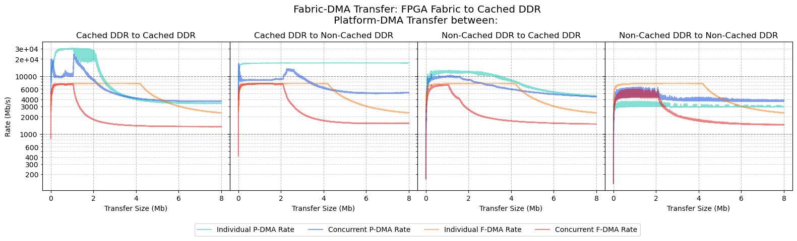

**F-DMA Results:**

| **F-DMA: Source** | **F-DMA: Destination** | **P-DMA: Source** | **P-DMA: Destination** | **F-DMA: Individual Peak Transfer Rate (Mb/s)** | **F-DMA: Size at Individual Peak Transfer Rate (Mb)** | **F-DMA: Concurrent Peak Transfer Rate (Mb/s)** | **F-DMA: Transfer Size at Concurrent Peak Transfer Rate (Mb)** | **F-DMA: Performance Difference** |
| ----------------- | ---------------------- | ----------------- | ---------------------- | ----------------------------------------------- | ----------------------------------------------------- | ----------------------------------------------- | -------------------------------------------------------------- | --------------------------------- |
| FPGA Fabric       | Cached DDR             | Cached DDR        | Cached DDR             | 7520                                            | 3.059                                                 | 7450                                            | 0.164                                                          | -1%                               |
| FPGA Fabric       | Cached DDR             | Cached DDR        | Non-Cached DDR         | 7520                                            | 3.059                                                 | 7473                                            | 0.426                                                          | -1%                               |
| FPGA Fabric       | Cached DDR             | Non-Cached DDR    | Cached DDR             | 7520                                            | 3.059                                                 | 7211                                            | 0.606                                                          | -4%                               |
| FPGA Fabric       | Cached DDR             | Non-Cached DDR    | Non-Cached DDR         | 7520                                            | 3.059                                                 | 6002                                            | 1.177                                                          | -20%                              |

**P-DMA Results:**

| **F-DMA: Source** | **F-DMA: Destination** | **P-DMA: Source** | **P-DMA: Destination** | **P-DMA: Individual Peak Transfer Rate (Mb/s)** | **P-DMA: Size at Individual Peak Transfer Rate (Mb)** | **P-DMA: Concurrent Peak Transfer Rate (Mb/s)** | **P-DMA: Transfer Size at Concurrent Peak Transfer Rate (Mb)** | **P-DMA: Performance Difference** |
| ----------------- | ---------------------- | ----------------- | ---------------------- | ----------------------------------------------- | ----------------------------------------------------- | ----------------------------------------------- | -------------------------------------------------------------- | --------------------------------- |
| FPGA Fabric       | Cached DDR             | Cached DDR        | Cached DDR             | 30288                                           | 1.272                                                 | 24220                                           | 1.090                                                          | -20%                              |
| FPGA Fabric       | Cached DDR             | Cached DDR        | Non-Cached DDR         | 17040                                           | 7.186                                                 | 13594                                           | 2.284                                                          | -20%                              |
| FPGA Fabric       | Cached DDR             | Non-Cached DDR    | Cached DDR             | 12624                                           | 0.642                                                 | 10851                                           | 0.261                                                          | -14%                              |
| FPGA Fabric       | Cached DDR             | Non-Cached DDR    | Non-Cached DDR         | 3920                                            | 2.263                                                 | 6507                                            | 1.275                                                          | +66%                              |

### Fabric-DMA: FPGA Fabric to Non-Cached DDR, Running from Cached DDR

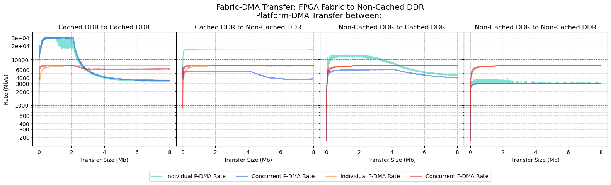

**F-DMA Results:**

| **F-DMA: Source** | **F-DMA: Destination** | **P-DMA: Source** | **P-DMA: Destination** | **F-DMA: Individual Peak Transfer Rate (Mb/s)** | **F-DMA: Size at Individual Peak Transfer Rate (Mb)** | **F-DMA: Concurrent Peak Transfer Rate (Mb/s)** | **F-DMA: Transfer Size at Concurrent Peak Transfer Rate (Mb)** | **F-DMA: Performance Difference** |
| ----------------- | ---------------------- | ----------------- | ---------------------- | ----------------------------------------------- | ----------------------------------------------------- | ----------------------------------------------- | -------------------------------------------------------------- | --------------------------------- |
| FPGA Fabric       | Non-Cached DDR         | Cached DDR        | Cached DDR             | 7488                                            | 7.770                                                 | 7448                                            | 1.229                                                          | -1%                               |
| FPGA Fabric       | Non-Cached DDR         | Cached DDR        | Non-Cached DDR         | 7488                                            | 7.770                                                 | 7447                                            | 3.195                                                          | -1%                               |
| FPGA Fabric       | Non-Cached DDR         | Non-Cached DDR    | Cached DDR             | 7488                                            | 7.770                                                 | 7442                                            | 3.245                                                          | -1%                               |
| FPGA Fabric       | Non-Cached DDR         | Non-Cached DDR    | Non-Cached DDR         | 7488                                            | 7.770                                                 | 7420                                            | 7.947                                                          | -1%                               |

**P-DMA Results:**

| **F-DMA: Source** | **F-DMA: Destination** | **P-DMA: Source** | **P-DMA: Destination** | **P-DMA: Individual Peak Transfer Rate (Mb/s)** | **P-DMA: Size at Individual Peak Transfer Rate (Mb)** | **P-DMA: Concurrent Peak Transfer Rate (Mb/s)** | **P-DMA: Transfer Size at Concurrent Peak Transfer Rate (Mb)** | **P-DMA: Performance Difference** |
| ----------------- | ---------------------- | ----------------- | ---------------------- | ----------------------------------------------- | ----------------------------------------------------- | ----------------------------------------------- | -------------------------------------------------------------- | --------------------------------- |
| FPGA Fabric       | Cached DDR             | Cached DDR        | Cached DDR             | 30288                                           | 1.272                                                 | 30784                                           | 0.370                                                          | +2%                               |
| FPGA Fabric       | Cached DDR             | Cached DDR        | Non-Cached DDR         | 17040                                           | 7.186                                                 | 5481                                            | 0.186                                                          | -68%                              |
| FPGA Fabric       | Cached DDR             | Non-Cached DDR    | Cached DDR             | 12624                                           | 0.642                                                 | 6055                                            | 3.288                                                          | -52%                              |
| FPGA Fabric       | Cached DDR             | Non-Cached DDR    | Non-Cached DDR         | 3920                                            | 2.263                                                 | 3206                                            | 3.924                                                          | -18%                              |

## Running from Scratchpad Memory

### Fabric-DMA: Cached DDR to Cached DDR, Running from Scratchpad Memory

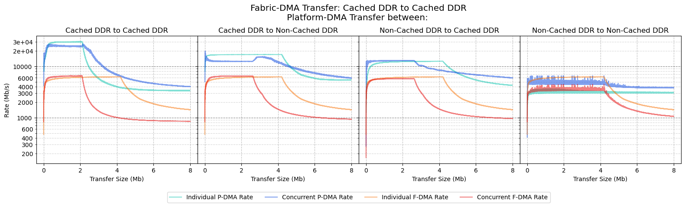

**F-DMA Results:**

| **F-DMA: Source** | **F-DMA: Destination** | **P-DMA: Source** | **P-DMA: Destination** | **F-DMA: Individual Peak Transfer Rate (Mb/s)** | **F-DMA: Size at Individual Peak Transfer Rate (Mb)** | **F-DMA: Concurrent Peak Transfer Rate (Mb/s)** | **F-DMA: Transfer Size at Concurrent Peak Transfer Rate (Mb)** | **F-DMA: Performance Difference** |
| ----------------- | ---------------------- | ----------------- | ---------------------- | ----------------------------------------------- | ----------------------------------------------------- | ----------------------------------------------- | -------------------------------------------------------------- | --------------------------------- |
| Cached DDR        | Cached DDR             | Cached DDR        | Cached DDR             | 6272                                            | 4.107                                                 | 6613                                            | 1.931                                                          | +5%                               |
| Cached DDR        | Cached DDR             | Cached DDR        | Non-Cached DDR         | 6272                                            | 4.107                                                 | 6524                                            | 2.473                                                          | +4%                               |
| Cached DDR        | Cached DDR             | Non-Cached DDR    | Cached DDR             | 6272                                            | 4.107                                                 | 5747                                            | 2.040                                                          | -8%                               |
| Cached DDR        | Cached DDR             | Non-Cached DDR    | Non-Cached DDR         | 6272                                            | 4.107                                                 | 4468                                            | 4.190                                                          | -29%                              |

**P-DMA Results:**

| **F-DMA: Source** | **F-DMA: Destination** | **P-DMA: Source** | **P-DMA: Destination** | **P-DMA: Individual Peak Transfer Rate (Mb/s)** | **P-DMA: Size at Individual Peak Transfer Rate (Mb)** | **P-DMA: Concurrent Peak Transfer Rate (Mb/s)** | **P-DMA: Transfer Size at Concurrent Peak Transfer Rate (Mb)** | **P-DMA: Performance Difference** |
| ----------------- | ---------------------- | ----------------- | ---------------------- | ----------------------------------------------- | ----------------------------------------------------- | ----------------------------------------------- | -------------------------------------------------------------- | --------------------------------- |
| Cached DDR        | Cached DDR             | Cached DDR        | Cached DDR             | 30320                                           | 1.993                                                 | 27424                                           | 2.139                                                          | -10%                              |
| Cached DDR        | Cached DDR             | Cached DDR        | Non-Cached DDR         | 17016                                           | 3.827                                                 | 15527                                           | 3.261                                                          | -9%                               |
| Cached DDR        | Cached DDR             | Non-Cached DDR    | Cached DDR             | 12632                                           | 4.186                                                 | 12974                                           | 0.895                                                          | +3%                               |
| Cached DDR        | Cached DDR             | Non-Cached DDR    | Non-Cached DDR         | 3624                                            | 1.620                                                 | 6552                                            | 1.992                                                          | +81%                              |

### Fabric-DMA: Cached DDR to Non-Cached DDR, Running from Scratchpad Memory

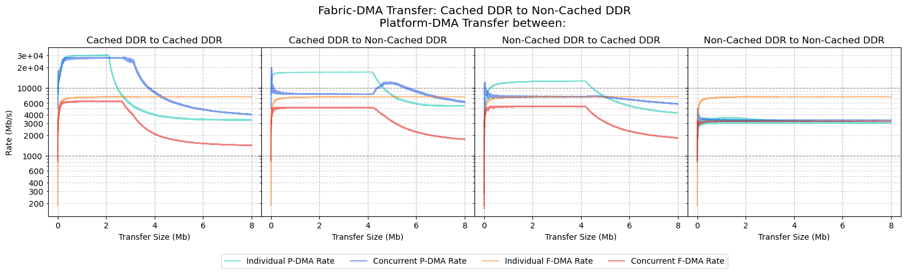

**F-DMA Results:**

| **F-DMA: Source** | **F-DMA: Destination** | **P-DMA: Source** | **P-DMA: Destination** | **F-DMA: Individual Peak Transfer Rate (Mb/s)** | **F-DMA: Size at Individual Peak Transfer Rate (Mb)** | **F-DMA: Concurrent Peak Transfer Rate (Mb/s)** | **F-DMA: Transfer Size at Concurrent Peak Transfer Rate (Mb)** | **F-DMA: Performance Difference** |
| ----------------- | ---------------------- | ----------------- | ---------------------- | ----------------------------------------------- | ----------------------------------------------------- | ----------------------------------------------- | -------------------------------------------------------------- | --------------------------------- |
| Cached DDR        | Non-Cached DDR         | Cached DDR        | Cached DDR             | 7408                                            | 6.496                                                 | 6389                                            | 2.070                                                          | -14%                              |
| Cached DDR        | Non-Cached DDR         | Cached DDR        | Non-Cached DDR         | 7408                                            | 6.496                                                 | 5195                                            | 0.213                                                          | -30%                              |
| Cached DDR        | Non-Cached DDR         | Non-Cached DDR    | Cached DDR             | 7408                                            | 6.496                                                 | 5390                                            | 0.496                                                          | -27%                              |
| Cached DDR        | Non-Cached DDR         | Non-Cached DDR    | Non-Cached DDR         | 7408                                            | 6.496                                                 | 3328                                            | 0.003                                                          | -55%                              |

**P-DMA Results:**

| **F-DMA: Source** | **F-DMA: Destination** | **P-DMA: Source** | **P-DMA: Destination** | **P-DMA: Individual Peak Transfer Rate (Mb/s)** | **P-DMA: Size at Individual Peak Transfer Rate (Mb)** | **P-DMA: Concurrent Peak Transfer Rate (Mb/s)** | **P-DMA: Transfer Size at Concurrent Peak Transfer Rate (Mb)** | **P-DMA: Performance Difference** |
| ----------------- | ---------------------- | ----------------- | ---------------------- | ----------------------------------------------- | ----------------------------------------------------- | ----------------------------------------------- | -------------------------------------------------------------- | --------------------------------- |
| Cached DDR        | Non-Cached DDR         | Cached DDR        | Cached DDR             | 30320                                           | 1.993                                                 | 28330                                           | 2.805                                                          | -7%                               |
| Cached DDR        | Non-Cached DDR         | Cached DDR        | Non-Cached DDR         | 17016                                           | 3.827                                                 | 12343                                           | 4.937                                                          | -27%                              |
| Cached DDR        | Non-Cached DDR         | Non-Cached DDR    | Cached DDR             | 12632                                           | 4.186                                                 | 8509                                            | 0.187                                                          | -33%                              |
| Cached DDR        | Non-Cached DDR         | Non-Cached DDR    | Non-Cached DDR         | 3624                                            | 1.620                                                 | 3611                                            | 0.170                                                          | -0%                               |

### Fabric-DMA: Non-Cached DDR to Cached DDR, Running from Scratchpad Memory

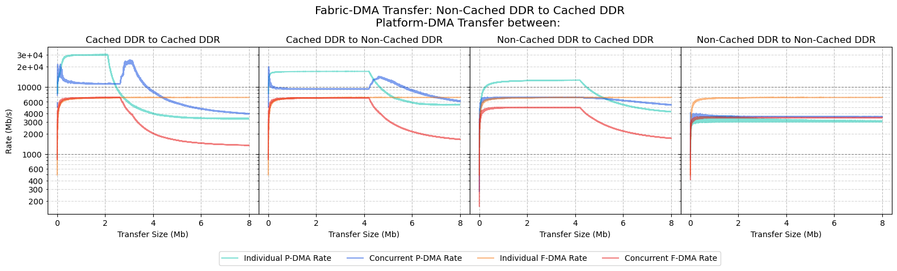

**F-DMA Results:**

| F-DMA: Source  | **F-DMA: Destination** | **P-DMA: Source** | **P-DMA: Destination** | **F-DMA: Individual Peak Transfer Rate (Mb/s)** | **F-DMA: Size at Individual Peak Transfer Rate (Mb)** | **F-DMA: Concurrent Peak Transfer Rate (Mb/s)** | **F-DMA: Transfer Size at Concurrent Peak Transfer Rate (Mb)** | **F-DMA: Performance Difference** |
| -------------- | ---------------------- | ----------------- | ---------------------- | ----------------------------------------------- | ----------------------------------------------------- | ----------------------------------------------- | -------------------------------------------------------------- | --------------------------------- |
| Non-Cached DDR | Cached DDR             | Cached DDR        | Cached DDR             | 6968                                            | 6.669                                                 | 6962                                            | 2.422                                                          | -0%                               |
| Non-Cached DDR | Cached DDR             | Cached DDR        | Non-Cached DDR         | 6968                                            | 6.669                                                 | 6901                                            | 3.471                                                          | -1%                               |
| Non-Cached DDR | Cached DDR             | Non-Cached DDR    | Cached DDR             | 6968                                            | 6.669                                                 | 4983                                            | 1.904                                                          | -28%                              |
| Non-Cached DDR | Cached DDR             | Non-Cached DDR    | Non-Cached DDR         | 6968                                            | 6.669                                                 | 3578                                            | 0.619                                                          | -49%                              |

**P-DMA Results:**

| F-DMA: Source  | **F-DMA: Destination** | **P-DMA: Source** | **P-DMA: Destination** | **P-DMA: Individual Peak Transfer Rate (Mb/s)** | **P-DMA: Size at Individual Peak Transfer Rate (Mb)** | **P-DMA: Concurrent Peak Transfer Rate (Mb/s)** | **P-DMA: Transfer Size at Concurrent Peak Transfer Rate (Mb)** | **P-DMA: Performance Difference** |
| -------------- | ---------------------- | ----------------- | ---------------------- | ----------------------------------------------- | ----------------------------------------------------- | ----------------------------------------------- | -------------------------------------------------------------- | --------------------------------- |
| Non-Cached DDR | Cached DDR             | Cached DDR        | Cached DDR             | 30320                                           | 1.993                                                 | 25189                                           | 3.022                                                          | -17%                              |
| Non-Cached DDR | Cached DDR             | Cached DDR        | Non-Cached DDR         | 17016                                           | 3.827                                                 | 14268                                           | 4.609                                                          | -16%                              |
| Non-Cached DDR | Cached DDR             | Non-Cached DDR    | Cached DDR             | 12632                                           | 4.186                                                 | 7066                                            | 1.993                                                          | -44%                              |
| Non-Cached DDR | Cached DDR             | Non-Cached DDR    | Non-Cached DDR         | 3624                                            | 1.620                                                 | 4049                                            | 0.243                                                          | +12%                              |

### Fabric-DMA: Non-Cached DDR to Non-Cached DDR, Running from Scratchpad Memory

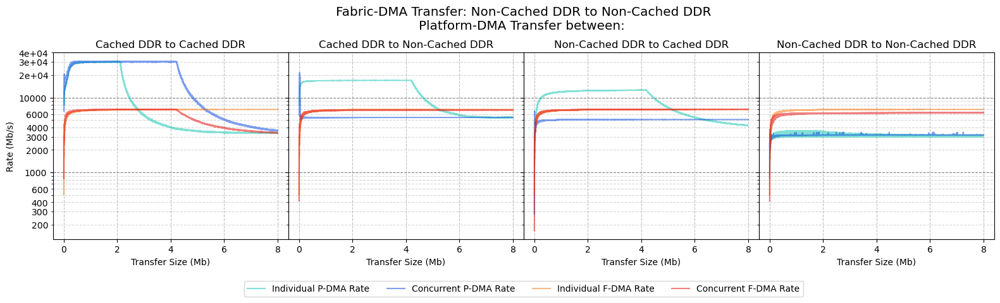

**F-DMA Results:**

| F-DMA: Source  | **F-DMA: Destination** | **P-DMA: Source** | **P-DMA: Destination** | **F-DMA: Individual Peak Transfer Rate (Mb/s)** | **F-DMA: Size at Individual Peak Transfer Rate (Mb)** | **F-DMA: Concurrent Peak Transfer Rate (Mb/s)** | **F-DMA: Transfer Size at Concurrent Peak Transfer Rate (Mb)** | **F-DMA: Performance Difference** |
| -------------- | ---------------------- | ----------------- | ---------------------- | ----------------------------------------------- | ----------------------------------------------------- | ----------------------------------------------- | -------------------------------------------------------------- | --------------------------------- |
| Non-Cached DDR | Non-Cached DDR         | Cached DDR        | Cached DDR             | 6968                                            | 6.283                                                 | 6972                                            | 3.821                                                          | 0%                                |
| Non-Cached DDR | Non-Cached DDR         | Cached DDR        | Non-Cached DDR         | 6968                                            | 6.283                                                 | 6866                                            | 5.767                                                          | -1%                               |
| Non-Cached DDR | Non-Cached DDR         | Non-Cached DDR    | Cached DDR             | 6968                                            | 6.283                                                 | 6979                                            | 7.907                                                          | 0%                                |
| Non-Cached DDR | Non-Cached DDR         | Non-Cached DDR    | Non-Cached DDR         | 6968                                            | 6.283                                                 | 6280                                            | 7.285                                                          | -10%                              |

**P-DMA Results:**

| F-DMA: Source  | **F-DMA: Destination** | **P-DMA: Source** | **P-DMA: Destination** | **P-DMA: Individual Peak Transfer Rate (Mb/s)** | **P-DMA: Size at Individual Peak Transfer Rate (Mb)** | **P-DMA: Concurrent Peak Transfer Rate (Mb/s)** | **P-DMA: Transfer Size at Concurrent Peak Transfer Rate (Mb)** | **P-DMA: Performance Difference** |
| -------------- | ---------------------- | ----------------- | ---------------------- | ----------------------------------------------- | ----------------------------------------------------- | ----------------------------------------------- | -------------------------------------------------------------- | --------------------------------- |
| Non-Cached DDR | Non-Cached DDR         | Cached DDR        | Cached DDR             | 30320                                           | 1.993                                                 | 30923                                           | 0.557                                                          | +2%                               |
| Non-Cached DDR | Non-Cached DDR         | Cached DDR        | Non-Cached DDR         | 17016                                           | 3.827                                                 | 5475                                            | 0.170                                                          | -68%                              |
| Non-Cached DDR | Non-Cached DDR         | Non-Cached DDR    | Cached DDR             | 12632                                           | 4.186                                                 | 5096                                            | 7.242                                                          | -60%                              |
| Non-Cached DDR | Non-Cached DDR         | Non-Cached DDR    | Non-Cached DDR         | 3624                                            | 1.620                                                 | 3442                                            | 7.235                                                          | -5%                               |

### Fabric-DMA: FPGA Fabric to Cached DDR, Running from Scratchpad Memory

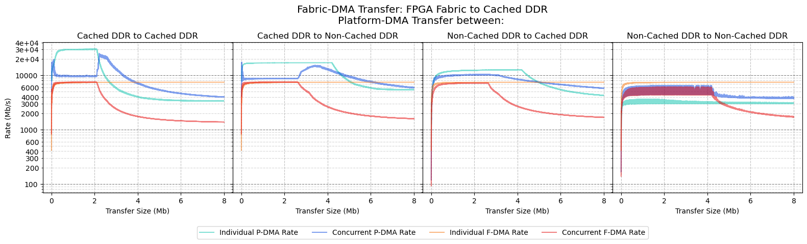

**F-DMA Results:**

| **F-DMA: Source** | **F-DMA: Destination** | **P-DMA: Source** | **P-DMA: Destination** | **F-DMA: Individual Peak Transfer Rate (Mb/s)** | **F-DMA: Size at Individual Peak Transfer Rate (Mb)** | **F-DMA: Concurrent Peak Transfer Rate (Mb/s)** | **F-DMA: Transfer Size at Concurrent Peak Transfer Rate (Mb)** | **F-DMA: Performance Difference** |
| ----------------- | ---------------------- | ----------------- | ---------------------- | ----------------------------------------------- | ----------------------------------------------------- | ----------------------------------------------- | -------------------------------------------------------------- | --------------------------------- |
| FPGA Fabric       | Cached DDR             | Cached DDR        | Cached DDR             | 7456                                            | 5.005                                                 | 7463                                            | 1.507                                                          | 0%                                |
| FPGA Fabric       | Cached DDR             | Non-Cached DDR    | Cached DDR             | 7456                                            | 5.005                                                 | 7267                                            | 2.573                                                          | -3%                               |
| FPGA Fabric       | Cached DDR             | Cached DDR        | Non-Cached DDR         | 7456                                            | 5.005                                                 | 7473                                            | 0.426                                                          | 0%                                |
| FPGA Fabric       | Cached DDR             | Non-Cached DDR    | Non-Cached DDR         | 7456                                            | 5.005                                                 | 6072                                            | 4.032                                                          | -19%                              |

**P-DMA Results:**

| **F-DMA: Source** | **F-DMA: Destination** | **P-DMA: Source** | **P-DMA: Destination** | **P-DMA: Individual Peak Transfer Rate (Mb/s)** | **P-DMA: Size at Individual Peak Transfer Rate (Mb)** | **P-DMA: Concurrent Peak Transfer Rate (Mb/s)** | **P-DMA: Transfer Size at Concurrent Peak Transfer Rate (Mb)** | **P-DMA: Performance Difference** |
| ----------------- | ---------------------- | ----------------- | ---------------------- | ----------------------------------------------- | ----------------------------------------------------- | ----------------------------------------------- | -------------------------------------------------------------- | --------------------------------- |
| FPGA Fabric       | Cached DDR             | Cached DDR        | Cached DDR             | 30320                                           | 1.993                                                 | 25244                                           | 2.222                                                          | -17%                              |
| FPGA Fabric       | Cached DDR             | Cached DDR        | Non-Cached DDR         | 12632                                           | 4.186                                                 | 10450                                           | 2.330                                                          | -17%                              |
| FPGA Fabric       | Cached DDR             | Non-Cached DDR    | Cached DDR             | 17016                                           | 3.827                                                 | 15312                                           | 3.414                                                          | -10%                              |
| FPGA Fabric       | Cached DDR             | Non-Cached DDR    | Non-Cached DDR         | 3624                                            | 1.620                                                 | 6503                                            | 4.032                                                          | +79%                              |

### Fabric-DMA: FPGA Fabric to Non-Cached DDR, Running from Scratchpad Memory

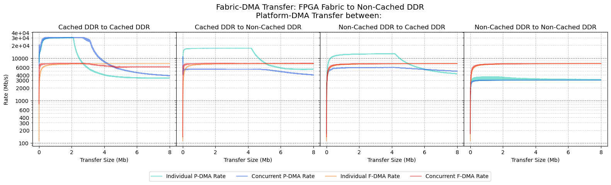

**F-DMA Results:**

| **F-DMA: Source** | **F-DMA: Destination** | **P-DMA: Source** | **P-DMA: Destination** | **F-DMA: Individual Peak Transfer Rate (Mb/s)** | **F-DMA: Size at Individual Peak Transfer Rate (Mb)** | **F-DMA: Concurrent Peak Transfer Rate (Mb/s)** | **F-DMA: Transfer Size at Concurrent Peak Transfer Rate (Mb)** | **F-DMA: Performance Difference** |
| ----------------- | ---------------------- | ----------------- | ---------------------- | ----------------------------------------------- | ----------------------------------------------------- | ----------------------------------------------- | -------------------------------------------------------------- | --------------------------------- |
| FPGA Fabric       | Non-Cached DDR         | Cached DDR        | Cached DDR             | 7400                                            | 7.439                                                 | 7452                                            | 2.556                                                          | +1%                               |
| FPGA Fabric       | Non-Cached DDR         | Cached DDR        | Non-Cached DDR         | 7400                                            | 7.439                                                 | 7450                                            | 7.242                                                          | +1%                               |
| FPGA Fabric       | Non-Cached DDR         | Non-Cached DDR    | Cached DDR             | 7400                                            | 7.439                                                 | 7416                                            | 7.505                                                          | 0%                                |
| FPGA Fabric       | Non-Cached DDR         | Non-Cached DDR    | Non-Cached DDR         | 7400                                            | 7.439                                                 | 7418                                            | 7.774                                                          | 0%                                |

**P-DMA Results:**

| **F-DMA: Source** | **F-DMA: Destination** | **P-DMA: Source** | **P-DMA: Destination** | **P-DMA: Individual Peak Transfer Rate (Mb/s)** | **P-DMA: Size at Individual Peak Transfer Rate (Mb)** | **P-DMA: Concurrent Peak Transfer Rate (Mb/s)** | **P-DMA: Transfer Size at Concurrent Peak Transfer Rate (Mb)** | **P-DMA: Performance Difference** |
| ----------------- | ---------------------- | ----------------- | ---------------------- | ----------------------------------------------- | ----------------------------------------------------- | ----------------------------------------------- | -------------------------------------------------------------- | --------------------------------- |
| FPGA Fabric       | Cached DDR             | Cached DDR        | Cached DDR             | 30320                                           | 1.993                                                 | 30903                                           | 0.433                                                          | +2%                               |
| FPGA Fabric       | Cached DDR             | Cached DDR        | Non-Cached DDR         | 17016                                           | 3.827                                                 | 5487                                            | 0.203                                                          | -68%                              |
| FPGA Fabric       | Cached DDR             | Non-Cached DDR    | Cached DDR             | 12632                                           | 4.186                                                 | 6031                                            | 3.878                                                          | -52%                              |
| FPGA Fabric       | Cached DDR             | Non-Cached DDR    | Non-Cached DDR         | 3624                                            | 1.620                                                 | 3022                                            | 7.438                                                          | -17%                              |

## Running from L2-LIM

### Fabric-DMA: Cached DDR to Cached DDR, Running from L2-LIM

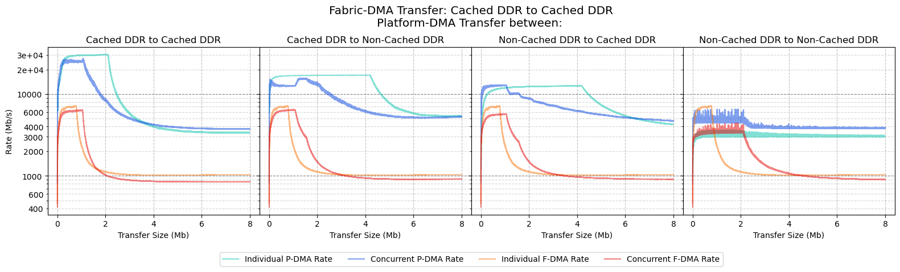

**F-DMA Results:**

| **F-DMA: Source** | **F-DMA: Destination** | **P-DMA: Source** | **P-DMA: Destination** | **F-DMA: Individual Peak Transfer Rate (Mb/s)** | **F-DMA: Size at Individual Peak Transfer Rate (Mb)** | **F-DMA: Concurrent Peak Transfer Rate (Mb/s)** | **F-DMA: Transfer Size at Concurrent Peak Transfer Rate (Mb)** | **F-DMA: Performance Difference** |
| ----------------- | ---------------------- | ----------------- | ---------------------- | ----------------------------------------------- | ----------------------------------------------------- | ----------------------------------------------- | -------------------------------------------------------------- | --------------------------------- |
| Cached DDR        | Cached DDR             | Cached DDR        | Cached DDR             | 7192                                            | 0.745                                                 | 6443                                            | 1.005                                                          | -10%                              |
| Cached DDR        | Cached DDR             | Cached DDR        | Non-Cached DDR         | 7192                                            | 0.745                                                 | 6451                                            | 1.045                                                          | -10%                              |
| Cached DDR        | Cached DDR             | Non-Cached DDR    | Cached DDR             | 7192                                            | 0.745                                                 | 5709                                            | 1.034                                                          | -21%                              |
| Cached DDR        | Cached DDR             | Non-Cached DDR    | Non-Cached DDR         | 7192                                            | 0.745                                                 | 4416                                            | 1.864                                                          | -39%                              |

**P-DMA Results:**

| **F-DMA: Source** | **F-DMA: Destination** | **P-DMA: Source** | **P-DMA: Destination** | **P-DMA: Individual Peak Transfer Rate (Mb/s)** | **P-DMA: Size at Individual Peak Transfer Rate (Mb)** | **P-DMA: Concurrent Peak Transfer Rate (Mb/s)** | **P-DMA: Transfer Size at Concurrent Peak Transfer Rate (Mb)** | **P-DMA: Performance Difference** |
| ----------------- | ---------------------- | ----------------- | ---------------------- | ----------------------------------------------- | ----------------------------------------------------- | ----------------------------------------------- | -------------------------------------------------------------- | --------------------------------- |
| Cached DDR        | Cached DDR             | Cached DDR        | Cached DDR             | 30248                                           | 2.010                                                 | 27264                                           | 1.063                                                          | -10%                              |
| Cached DDR        | Cached DDR             | Cached DDR        | Non-Cached DDR         | 17000                                           | 3.942                                                 | 15623                                           | 1.546                                                          | -8%                               |
| Cached DDR        | Cached DDR             | Non-Cached DDR    | Cached DDR             | 12600                                           | 4.068                                                 | 12930                                           | 0.478                                                          | +3%                               |
| Cached DDR        | Cached DDR             | Non-Cached DDR    | Non-Cached DDR         | 3624                                            | 1.646                                                 | 6540                                            | 1.635                                                          | +80%                              |

### Fabric-DMA: Cached DDR to Non-Cached DDR, Running from L2-LIM

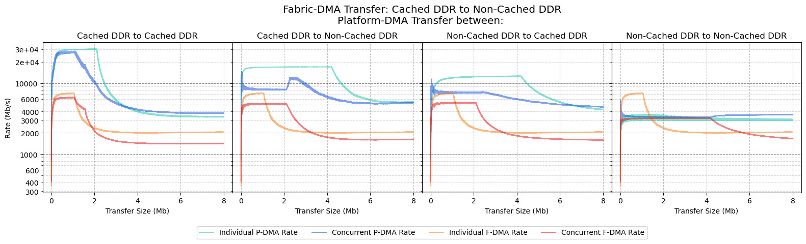

**F-DMA Results:**

| **F-DMA: Source** | **F-DMA: Destination** | **P-DMA: Source** | **P-DMA: Destination** | **F-DMA: Individual Peak Transfer Rate (Mb/s)** | **F-DMA: Size at Individual Peak Transfer Rate (Mb)** | **F-DMA: Concurrent Peak Transfer Rate (Mb/s)** | **F-DMA: Transfer Size at Concurrent Peak Transfer Rate (Mb)** | **F-DMA: Performance Difference** |
| ----------------- | ---------------------- | ----------------- | ---------------------- | ----------------------------------------------- | ----------------------------------------------------- | ----------------------------------------------- | -------------------------------------------------------------- | --------------------------------- |
| Cached DDR        | Non-Cached DDR         | Cached DDR        | Cached DDR             | 7256                                            | 0.992                                                 | 6347                                            | 0.958                                                          | -13%                              |
| Cached DDR        | Non-Cached DDR         | Cached DDR        | Non-Cached DDR         | 7256                                            | 0.992                                                 | 5156                                            | 1.361                                                          | -29%                              |
| Cached DDR        | Non-Cached DDR         | Non-Cached DDR    | Cached DDR             | 7256                                            | 0.992                                                 | 5368                                            | 0.499                                                          | -26%                              |
| Cached DDR        | Non-Cached DDR         | Non-Cached DDR    | Non-Cached DDR         | 7256                                            | 0.992                                                 | 3223                                            | 1.118                                                          | -56%                              |

**P-DMA Results:**

| **F-DMA: Source** | **F-DMA: Destination** | **P-DMA: Source** | **P-DMA: Destination** | **P-DMA: Individual Peak Transfer Rate (Mb/s)** | **P-DMA: Size at Individual Peak Transfer Rate (Mb)** | **P-DMA: Concurrent Peak Transfer Rate (Mb/s)** | **P-DMA: Transfer Size at Concurrent Peak Transfer Rate (Mb)** | **P-DMA: Performance Difference** |
| ----------------- | ---------------------- | ----------------- | ---------------------- | ----------------------------------------------- | ----------------------------------------------------- | ----------------------------------------------- | -------------------------------------------------------------- | --------------------------------- |
| Cached DDR        | Non-Cached DDR         | Cached DDR        | Cached DDR             | 30248                                           | 2.010                                                 | 28373                                           | 1.106                                                          | -6%                               |
| Cached DDR        | Non-Cached DDR         | Cached DDR        | Non-Cached DDR         | 17000                                           | 3.942                                                 | 12095                                           | 2.564                                                          | -29%                              |
| Cached DDR        | Non-Cached DDR         | Non-Cached DDR    | Cached DDR             | 12600                                           | 4.068                                                 | 8192                                            | 0.213                                                          | -35%                              |
| Cached DDR        | Non-Cached DDR         | Non-Cached DDR    | Non-Cached DDR         | 3624                                            | 1.646                                                 | 3616                                            | 7.803                                                          | -0%                               |

### Fabric-DMA: Non-Cached DDR to Cached DDR, Running from L2-LIM

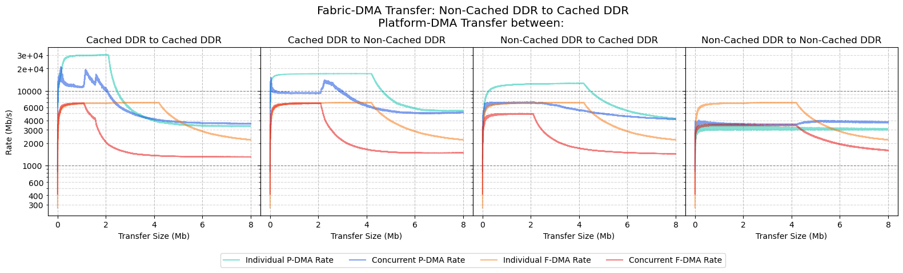

**F-DMA Results:**

| F-DMA: Source  | **F-DMA: Destination** | **P-DMA: Source** | **P-DMA: Destination** | **F-DMA: Individual Peak Transfer Rate (Mb/s)** | **F-DMA: Size at Individual Peak Transfer Rate (Mb)** | **F-DMA: Concurrent Peak Transfer Rate (Mb/s)** | **F-DMA: Transfer Size at Concurrent Peak Transfer Rate (Mb)** | **F-DMA: Performance Difference** |
| -------------- | ---------------------- | ----------------- | ---------------------- | ----------------------------------------------- | ----------------------------------------------------- | ----------------------------------------------- | -------------------------------------------------------------- | --------------------------------- |
| Non-Cached DDR | Cached DDR             | Cached DDR        | Cached DDR             | 6944                                            | 3.847                                                 | 6881                                            | 1.018                                                          | -1%                               |
| Non-Cached DDR | Cached DDR             | Cached DDR        | Non-Cached DDR         | 6944                                            | 3.847                                                 | 6885                                            | 1.604                                                          | -1%                               |
| Non-Cached DDR | Cached DDR             | Non-Cached DDR    | Cached DDR             | 6944                                            | 3.847                                                 | 4979                                            | 1.877                                                          | -28%                              |
| Non-Cached DDR | Cached DDR             | Non-Cached DDR    | Non-Cached DDR         | 6944                                            | 3.847                                                 | 3580                                            | 0.426                                                          | -48%                              |

**P-DMA Results:**

| F-DMA: Source  | **F-DMA: Destination** | **P-DMA: Source** | **P-DMA: Destination** | **P-DMA: Individual Peak Transfer Rate (Mb/s)** | **P-DMA: Size at Individual Peak Transfer Rate (Mb)** | **P-DMA: Concurrent Peak Transfer Rate (Mb/s)** | **P-DMA: Transfer Size at Concurrent Peak Transfer Rate (Mb)** | **P-DMA: Performance Difference** |
| -------------- | ---------------------- | ----------------- | ---------------------- | ----------------------------------------------- | ----------------------------------------------------- | ----------------------------------------------- | -------------------------------------------------------------- | --------------------------------- |
| Non-Cached DDR | Cached DDR             | Cached DDR        | Cached DDR             | 30248                                           | 2.010                                                 | 19275                                           | 1.157                                                          | -36%                              |
| Non-Cached DDR | Cached DDR             | Cached DDR        | Non-Cached DDR         | 17000                                           | 3.942                                                 | 13989                                           | 2.252                                                          | -18%                              |
| Non-Cached DDR | Cached DDR             | Non-Cached DDR    | Cached DDR             | 12600                                           | 4.068                                                 | 7110                                            | 0.391                                                          | -44%                              |
| Non-Cached DDR | Cached DDR             | Non-Cached DDR    | Non-Cached DDR         | 3624                                            | 1.646                                                 | 4027                                            | 5.384                                                          | +11%                              |

### Fabric-DMA: Non-Cached DDR to Non-Cached DDR, Running from L2-LIM

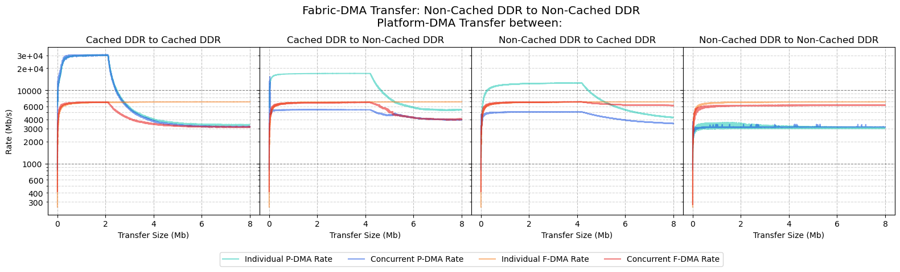

**F-DMA Results:**

| F-DMA: Source  | **F-DMA: Destination** | **P-DMA: Source** | **P-DMA: Destination** | **F-DMA: Individual Peak Transfer Rate (Mb/s)** | **F-DMA: Size at Individual Peak Transfer Rate (Mb)** | **F-DMA: Concurrent Peak Transfer Rate (Mb/s)** | **F-DMA: Transfer Size at Concurrent Peak Transfer Rate (Mb)** | **F-DMA: Performance Difference** |
| -------------- | ---------------------- | ----------------- | ---------------------- | ----------------------------------------------- | ----------------------------------------------------- | ----------------------------------------------- | -------------------------------------------------------------- | --------------------------------- |
| Non-Cached DDR | Non-Cached DDR         | Cached DDR        | Cached DDR             | 6968                                            | 7.308                                                 | 6940                                            | 2.054                                                          | -0%                               |
| Non-Cached DDR | Non-Cached DDR         | Cached DDR        | Non-Cached DDR         | 6968                                            | 7.308                                                 | 6853                                            | 4.091                                                          | -2%                               |
| Non-Cached DDR | Non-Cached DDR         | Non-Cached DDR    | Cached DDR             | 6968                                            | 7.308                                                 | 6967                                            | 4.180                                                          | -0%                               |
| Non-Cached DDR | Non-Cached DDR         | Non-Cached DDR    | Non-Cached DDR         | 6968                                            | 7.308                                                 | 6281                                            | 7.418                                                          | -10%                              |

**P-DMA Results:**

| **F-DMA: Source** | **F-DMA: Destination** | **P-DMA: Source** | **P-DMA: Destination** | **P-DMA: Individual Peak Transfer Rate (Mb/s)** | **P-DMA: Size at Individual Peak Transfer Rate (Mb)** | **P-DMA: Concurrent Peak Transfer Rate (Mb/s)** | **P-DMA: Transfer Size at Concurrent Peak Transfer Rate (Mb)** | **P-DMA: Performance Difference** |
| ----------------- | ---------------------- | ----------------- | ---------------------- | ----------------------------------------------- | ----------------------------------------------------- | ----------------------------------------------- | -------------------------------------------------------------- | --------------------------------- |
| FPGA Fabric       | Cached DDR             | Cached DDR        | Cached DDR             | 30248                                           | 2.010                                                 | 30566                                           | 1.987                                                          | +1%                               |
| FPGA Fabric       | Cached DDR             | Cached DDR        | Non-Cached DDR         | 17000                                           | 3.942                                                 | 5431                                            | 3.438                                                          | -68%                              |
| FPGA Fabric       | Cached DDR             | Non-Cached DDR    | Cached DDR             | 12600                                           | 4.068                                                 | 5089                                            | 3.618                                                          | -60%                              |
| FPGA Fabric       | Cached DDR             | Non-Cached DDR    | Non-Cached DDR         | 3624                                            | 1.646                                                 | 3441                                            | 5.291                                                          | -5%                               |

### Fabric-DMA: FPGA Fabric to Cached DDR, Running from L2-LIM

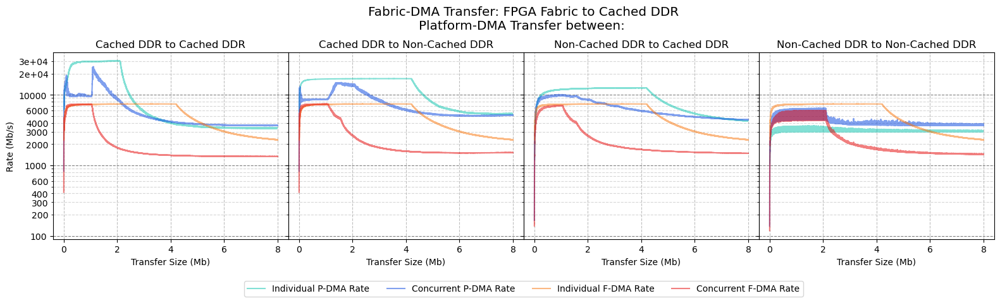

*F-DMA Results:*

| **F-DMA: Source** | **F-DMA: Destination** | **P-DMA: Source** | **P-DMA: Destination** | **F-DMA: Individual Peak Transfer Rate (Mb/s)** | **F-DMA: Size at Individual Peak Transfer Rate (Mb)** | **F-DMA: Concurrent Peak Transfer Rate (Mb/s)** | **F-DMA: Transfer Size at Concurrent Peak Transfer Rate (Mb)** | **F-DMA: Performance Difference** |
| ----------------- | ---------------------- | ----------------- | ---------------------- | ----------------------------------------------- | ----------------------------------------------------- | ----------------------------------------------- | -------------------------------------------------------------- | --------------------------------- |
| FPGA Fabric       | Cached DDR             | Cached DDR        | Cached DDR             | 7448                                            | 3.449                                                 | 7427                                            | 0.706                                                          | -0%                               |
| FPGA Fabric       | Cached DDR             | Cached DDR        | Non-Cached DDR         | 7448                                            | 3.449                                                 | 7439                                            | 0.886                                                          | -0%                               |
| FPGA Fabric       | Cached DDR             | Non-Cached DDR    | Cached DDR             | 7448                                            | 3.449                                                 | 7101                                            | 1.008                                                          | -5%                               |
| FPGA Fabric       | Cached DDR             | Non-Cached DDR    | Non-Cached DDR         | 7448                                            | 3.449                                                 | 6042                                            | 1.939                                                          | -19%                              |

**P-DMA Results:**

| **F-DMA: Source** | **F-DMA: Destination** | **P-DMA: Source** | **P-DMA: Destination** | **P-DMA: Individual Peak Transfer Rate (Mb/s)** | **P-DMA: Size at Individual Peak Transfer Rate (Mb)** | **P-DMA: Concurrent Peak Transfer Rate (Mb/s)** | **P-DMA: Transfer Size at Concurrent Peak Transfer Rate (Mb)** | **P-DMA: Performance Difference** |
| ----------------- | ---------------------- | ----------------- | ---------------------- | ----------------------------------------------- | ----------------------------------------------------- | ----------------------------------------------- | -------------------------------------------------------------- | --------------------------------- |
| FPGA Fabric       | Cached DDR             | Cached DDR        | Cached DDR             | 30248                                           | 2.010                                                 | 25130                                           | 1.106                                                          | -17%                              |
| FPGA Fabric       | Cached DDR             | Cached DDR        | Non-Cached DDR         | 17000                                           | 3.942                                                 | 15000                                           | 1.575                                                          | -12%                              |
| FPGA Fabric       | Cached DDR             | Non-Cached DDR    | Cached DDR             | 12600                                           | 4.068                                                 | 10169                                           | 0.915                                                          | -19%                              |
| FPGA Fabric       | Cached DDR             | Non-Cached DDR    | Non-Cached DDR         | 3624                                            | 1.646                                                 | 6460                                            | 2.080                                                          | +78%                              |

### Fabric-DMA: FPGA Fabric to Non-Cached DDR, Running from L2-LIM

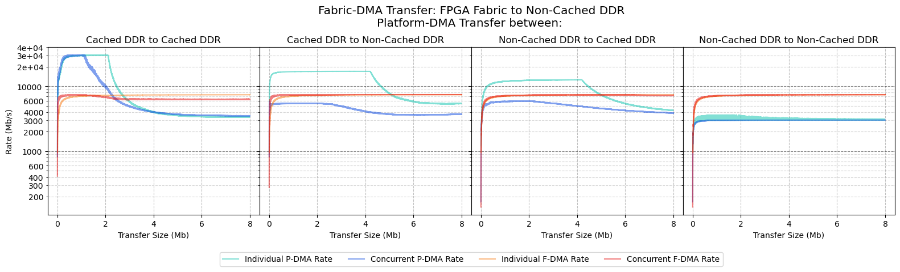

**F-DMA Results:**

| **F-DMA: Source** | **F-DMA: Destination** | **P-DMA: Source** | **P-DMA: Destination** | **F-DMA: Individual Peak Transfer Rate (Mb/s)** | **F-DMA: Size at Individual Peak Transfer Rate (Mb)** | **F-DMA: Concurrent Peak Transfer Rate (Mb/s)** | **F-DMA: Transfer Size at Concurrent Peak Transfer Rate (Mb)** | **F-DMA: Performance Difference** |
| ----------------- | ---------------------- | ----------------- | ---------------------- | ----------------------------------------------- | ----------------------------------------------------- | ----------------------------------------------- | -------------------------------------------------------------- | --------------------------------- |
| FPGA Fabric       | Non-Cached DDR         | Cached DDR        | Cached DDR             | 7408                                            | 7.987                                                 | 7430                                            | 0.958                                                          | 0%                                |
| FPGA Fabric       | Non-Cached DDR         | Cached DDR        | Non-Cached DDR         | 7408                                            | 7.987                                                 | 7448                                            | 7.135                                                          | +1%                               |
| FPGA Fabric       | Non-Cached DDR         | Non-Cached DDR    | Cached DDR             | 7408                                            | 7.987                                                 | 7388                                            | 4.197                                                          | -0%                               |
| FPGA Fabric       | Non-Cached DDR         | Non-Cached DDR    | Non-Cached DDR         | 7408                                            | 7.987                                                 | 7419                                            | 7.827                                                          | 0%                                |

**P-DMA Results:**

| **F-DMA: Source** | **F-DMA: Destination** | **P-DMA: Source** | **P-DMA: Destination** | **P-DMA: Individual Peak Transfer Rate (Mb/s)** | **P-DMA: Size at Individual Peak Transfer Rate (Mb)** | **P-DMA: Concurrent Peak Transfer Rate (Mb/s)** | **P-DMA: Transfer Size at Concurrent Peak Transfer Rate (Mb)** | **P-DMA: Performance Difference** |
| ----------------- | ---------------------- | ----------------- | ---------------------- | ----------------------------------------------- | ----------------------------------------------------- | ----------------------------------------------- | -------------------------------------------------------------- | --------------------------------- |
| FPGA Fabric       | Non-Cached DDR         | Cached DDR        | Cached DDR             | 30248                                           | 2.010                                                 | 30586                                           | 0.642                                                          | +1%                               |
| FPGA Fabric       | Non-Cached DDR         | Cached DDR        | Non-Cached DDR         | 17000                                           | 3.942                                                 | 5436                                            | 2.077                                                          | -68%                              |
| FPGA Fabric       | Non-Cached DDR         | Non-Cached DDR    | Cached DDR             | 12600                                           | 4.068                                                 | 5984                                            | 1.711                                                          | -53%                              |
| FPGA Fabric       | Non-Cached DDR         | Non-Cached DDR    | Non-Cached DDR         | 3624                                            | 1.646                                                 | 3022                                            | 7.438                                                          | -17%                              |
