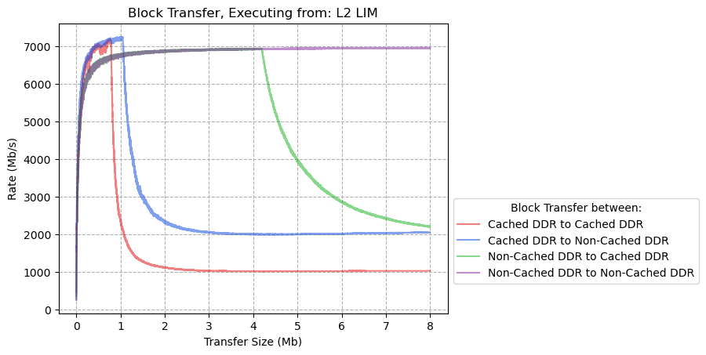
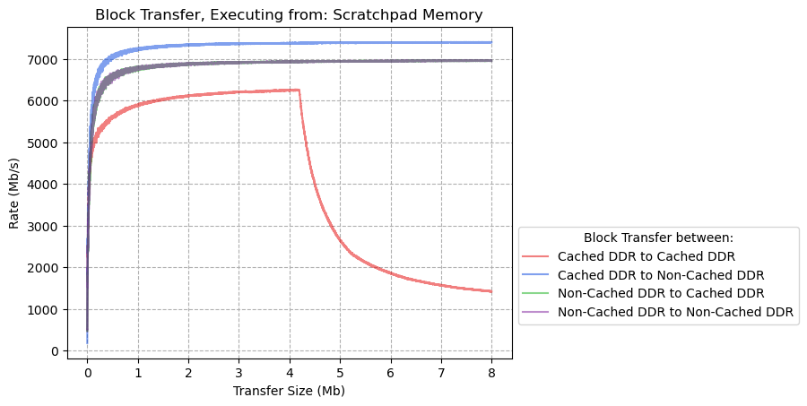
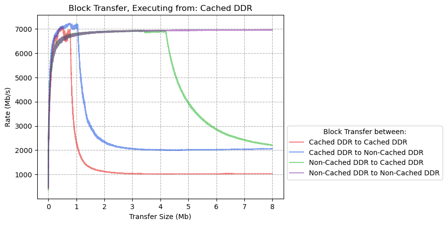
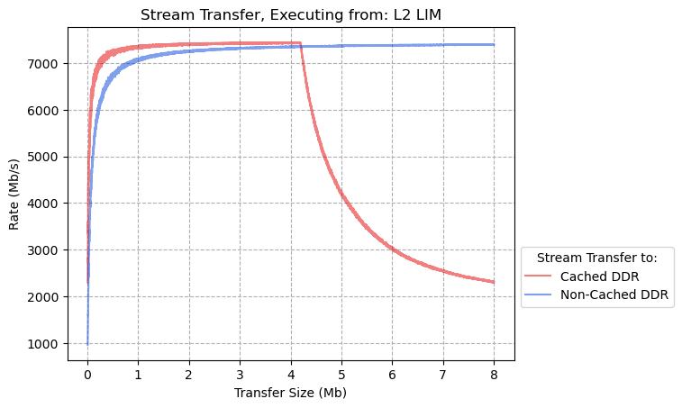
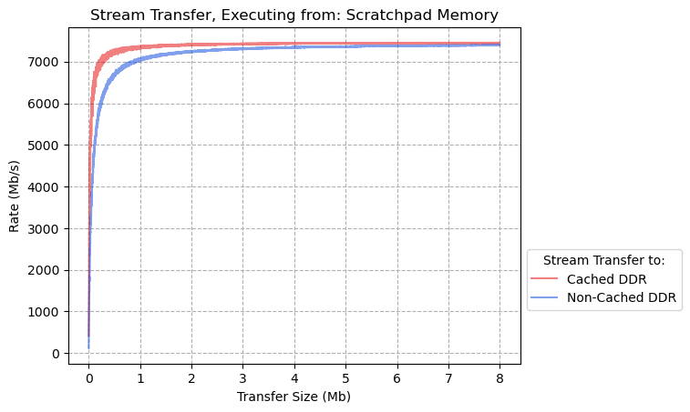
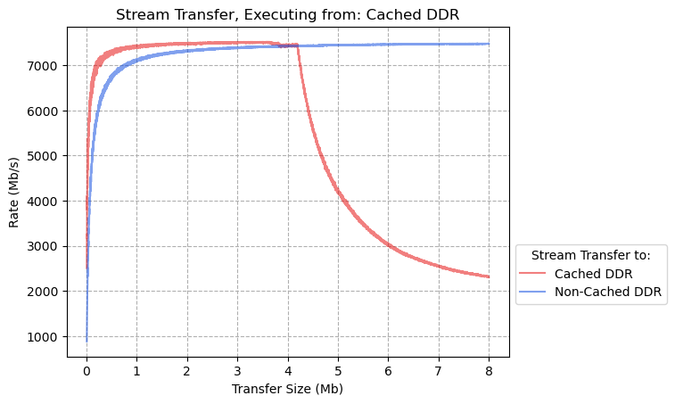

# CoreAXI4DMAController Performance Benchmarks

- [CoreAXI4DMAController Performance Benchmarks](#coreaxi4dmacontroller-performance-benchmarks)
  - [CoreAXI4DMAController Theoretical Performance](#coreaxi4dmacontroller-theoretical-performance)
  - [DDR Transfers](#ddr-transfers)
    - [Executing from L2-LIM](#executing-from-l2-lim)
    - [Executing from Scratchpad Memory](#executing-from-scratchpad-memory)
    - [Executing from DDR](#executing-from-ddr)
  - [FPGA Fabric Transfers](#fpga-fabric-transfers)
    - [Executing from: L2-LIM](#executing-from-l2-lim-1)
    - [Executing from: Scratchpad Memory](#executing-from-scratchpad-memory-1)
    - [Executing from: DDR](#executing-from-ddr-1)

## CoreAXI4DMAController Theoretical Performance

The theoretical maximum rate of a DMA transfer is determined by the width of the bus connecting a memory
source or destination to the CoreAXI4DMAController (Fabric-DMA/F-DMA), and by the clock rate.

The width of a given bus is an inherent property of the device and cannot be modified.
The clock rate is set as part of the hardware design programmed onto the board, and can be modified.

The theoretical maximum performance of the F-DMA when transferring data is 8000Mb/s.

The transfer rate is limited by the width of the bus in the Fabric Interface Controller (FIC), and by
the clock frequency of the FIC.
The FIC uses a 64-bit AIX4 bus and operates at a clock rate of 125MHz in the default PolarFire SoC Icicle
Kit Reference Design.

As such, the theoretical maximum performance of the F-DMA is: 64 bits * 125MHz = 8000Mb/s

## DDR Transfers

The following results show the performance of the F-DMA performing memory to memory transfers between
DDR memories.
These transfers use the AIX4 Master DMA interface on the F-DMA.

### Executing from L2-LIM

| **Source**     | **Destination** | **Transfer Size (Mb)** | **Peak Rate (Mb/s)** | **% of Theoretical Max Rate** |
| -------------- | --------------- | ---------------------- | -------------------- | ----------------------------- |
| Cached DDR     | Cached DDR      | 0.493                  | 7088                 | 89%                           |
| Cached DDR     | Non-Cached DDR  | 0.745                  | 7232                 | 90%                           |
| Non-Cached DDR | Cached DDR      | 3.319                  | 6944                 | 87%                           |
| Non-Cached DDR | Non-Cached DDR  | 6.669                  | 6968                 | 87%                           |

### Executing from Scratchpad Memory

| **Source**     | **Destination** | **Transfer Size (Mb)** | **Peak Rate (Mb/s)** | **% of Theoretical Max Rate** |
| -------------- | --------------- | ---------------------- | -------------------- | ----------------------------- |
| Cached DDR     | Cached DDR      | 0.745                  | 7192                 | 90%                           |
| Cached DDR     | Non-Cached DDR  | 0.992                  | 7256                 | 91%                           |
| Non-Cached DDR | Cached DDR      | 3.847                  | 6944                 | 87%                           |
| Non-Cached DDR | Non-Cached DDR  | 7.308                  | 6968                 | 87%                           |

### Executing from DDR

| **Source**     | **Destination** | **Transfer Size (Mb)** | **Peak Rate (Mb/s)** | **% of Theoretical Max Rate** |
| -------------- | --------------- | ---------------------- | -------------------- | ----------------------------- |
| Cached DDR     | Cached DDR      | 4.107                  | 6272                 | 78%                           |
| Cached DDR     | Non-Cached DDR  | 6.496                  | 7408                 | 93%                           |
| Non-Cached DDR | Cached DDR      | 6.669                  | 6968                 | 87%                           |
| Non-Cached DDR | Non-Cached DDR  | 6.283                  | 6968                 | 87%                           |

## FPGA Fabric Transfers

The following results show the performance of the F-DMA for transfers from the FPGA fabric to DDR memories.

These transfers use the AXI4-Stream Slave interface and the AXI4 Master DMA interface on the F-DMA.
The source of these transfers is a 'Stream Generator' module in the FPGA fabric, this module generates
data with an incrementing pattern that is streamed to the F-DMA using its AXI4-Stream Interface.
The F-DMA will then transfer the data it has received to DDR memory using its AXI4 Master interface.

### Executing from: L2-LIM

| **Source:** | **Destination** | **Transfer Size (Mb)** | **Peak Rate (Mb/s)** | **% of Theoretical Max Rate** |
| :---------- | :-------------- | ---------------------- | -------------------- | ----------------------------- |
| FPGA Fabric | Cached DDR      | 3.449                  | 7448                 | 93%                           |
| FPGA Fabric | Non-Cached DDR  | 7.987                  | 7408                 | 93%                           |

### Executing from: Scratchpad Memory

| **Source:** | **Destination** | **Transfer Size (Mb)** | **Peak Rate (Mb/s)** | **% of Theoretical Max Rate** |
| :---------- | :-------------- | ---------------------- | -------------------- | ----------------------------- |
| FPGA Fabric | Cached DDR      | 5.005                  | 7456                 | 93%                           |
| FPGA Fabric | Non-Cached DDR  | 7.439                  | 7400                 | 92%                           |

### Executing from: DDR

| **Source:** | **Destination** | **Transfer Size (Mb)** | **Peak Rate (Mb/s)** | **% of Theoretical Max Rate** |
| ----------- | --------------- | ---------------------- | -------------------- | ----------------------------- |
| FPGA Fabric | Cached DDR      | 3.059                  | 7520                 | 94%                           |
| FPGA Fabric | Non-Cached DDR  | 7.77                   | 7488                 | 94%                           |
