# DMA Performance Benchmark

## Table of contents

- [DMA Performance Benchmark](#dma-performance-benchmark)
  - [Table of contents](#table-of-contents)
  - [Introduction](#introduction)
  - [Benchmarking Overview](#benchmarking-overview)
  - [P-DMA Theoretical Performance](#p-dma-theoretical-performance)
  - [Results L2-LIM](#results-l2-lim)
    - [Source: L2-LIM, Destination: L2-LIM](#source-l2-lim-destination-l2-lim)
    - [Source: L2-LIM, Destination: Scratchpad](#source-l2-lim-destination-scratchpad)
    - [Source: L2-LIM, Destination: Cached DDR](#source-l2-lim-destination-cached-ddr)
    - [Source: L2-LIM, Destination: Non-Cached DDR](#source-l2-lim-destination-non-cached-ddr)
  - [Results Scratchpad Memory](#results-scratchpad-memory)
    - [Source: Scratchpad, Destination: L2-LIM](#source-scratchpad-destination-l2-lim)
    - [Source: Scratchpad, Destination: Scratchpad](#source-scratchpad-destination-scratchpad)
    - [Source: Scratchpad, Destination: Cached DDR](#source-scratchpad-destination-cached-ddr)
    - [Source: Scratchpad, Destination: Non-Cached DDR](#source-scratchpad-destination-non-cached-ddr)
  - [Results Cached DDR](#results-cached-ddr)
    - [Source: Cached DDR, Destination: L2-LIM](#source-cached-ddr-destination-l2-lim)
    - [Source: Cached DDR, Destination: Scratchpad](#source-cached-ddr-destination-scratchpad)
    - [Source: Cached DDR, Destination: Cached DDR](#source-cached-ddr-destination-cached-ddr)
    - [Source: Cached DDR, Destination: Non-Cached DDR](#source-cached-ddr-destination-non-cached-ddr)
  - [Results Non-Cached DDR](#results-non-cached-ddr)
    - [Source: Non-Cached DDR, Destination: L2-LIM](#source-non-cached-ddr-destination-l2-lim)
    - [Source: Non-Cached DDR, Destination: Scratchpad](#source-non-cached-ddr-destination-scratchpad)
    - [Source: Non-Cached DDR, Destination: Cached DDR](#source-non-cached-ddr-destination-cached-ddr)
    - [Source: Non-Cached DDR, Destination: Non-Cached DDR](#source-non-cached-ddr-destination-non-cached-ddr)

## Introduction

This document discusses benchmarking the performance of the Platform Direct Memory Access (P-DMA) Controller
on PolarFire SoC.
The document includes a complete set of benchmarking results, along with an accompanying synopsis.

## Benchmarking Overview

The benchmarking application tests the performance of the P-DMA transferring data between a given source
and destination. The possible source/destination combinations are any of the following memory locations:

- L2-LIM
- Scratchpad Memory
- Cached DDR
- Non-cached DDR

P-DMA performance is determined by several factors, principally: the source and destination of a transfer,
the memory location where the program is executed from, whether transfer ordering is enforced, and
the configuration of the L2 Cache when transferring to/from Cached DDR.

The program can be executed from any of the following memory locations:

- L2-LIM
- Scratchpad Memory
- Cached DDR

If transfer ordering is enforced data will be received at the destination in the same order that it
was transmitted otherwise, data can arrive out of order.

Every benchmark is run a total of 6 times, for the 3 memory locations the program can be executed from
with each of force ordering enabled and disabled.

All benchmarks are using a single P-DMA channel.

The P-DMA has 4 channels capable of transferring data independently of each other. As such the P-DMA
can transfer data from a single source to multiple destinations, or from multiple sources to a single
destination.

Increasing the number of P-DMA channels used in a transfer will increase P-DMA throughput, this improvement
is primarily due to each channel transferring data concurrently.

The throughput depends on: the number of channels used in a transfer, and the number of different memory
locations the channels are transferring to/from.

Throughput is highest using multiple channels to transfer data from a single source to a single destination,
as opposed to multiple channels transferring data from a single source to multiple destinations, or from
multiple destinations to a single source.

## P-DMA Theoretical Performance

PolarFire MSS Detailed Block Diagram. PolarFire SoC MSS Technical Reference Manual, page 11.

The theoretical maximum rate of a transfer is determined by the width of the bus connecting a memory
source and destination to the P-DMA, and by the processor clock rate.
The processor clock rate is set using the MSS Configurator.
The width of a given bus is an inherent property of the device (64b/128b in this case) and cannot be
modified.

The L2-LIM and L2-Scratchpad are both parts of the L2 Cache controller.
The cache controller along with the platform DMA controller is located within the CPU Core Complex, therefore
the P-DMA can access both LIM and Scratchpad via the 128-bit TileLink bus.

Cached DDR is also accessible over the 128-bit TileLink bus and a 128-bit AXI4 bus, via the DDR Controller.
Non-Cached DDR is accessible over the 128-bit TileLink bus and a 64-bit AXI4 bus.
The L2 Cache and AXI4 buses are clocked at a rate that is half the frequency of the CPU cores,
using the default setting of the MSS Configurator which is 300MHz.

Please refer to the [PolarFire SoC Technical Reference Manual][PolarFire SoC Technical Reference Manual]
for further information on the P-DMA.

Using the above figures, the theoretical performance of the P-DMA when transferring between each of the
4 memory locations can be calculated as follows:

- For transfers using the TileLink bus and 128-bit AXI4 bus: 128b * 300MHz = 38400 Mb/s
- For transfers using the TileLink bus and the 64-bit AXI4 bus: 64b * 300MHz = 19200 Mb/s

The below table summarises the theoretical maximum performance for every source and destination pair:

| **Source\Destination** | **L2-LIM** | **Scratchpad** | **Cached DDR** | **Non-Cached DDR** |
| :--------------------- | :--------- | :------------- | :------------- | :----------------- |
| **L2-LIM**             | 38400 Mb/s | 38400 Mb/s     | 38400 Mb/s     | 19200 Mb/s         |
| **Scratchpad**         | 38400 Mb/s | 38400 Mb/s     | 38400 Mb/s     | 19200 Mb/s         |
| **Cached DDR**         | 38400 Mb/s | 38400 Mb/s     | 38400 Mb/s     | 19200 Mb/s         |
| **Non-Cached DDR**     | 19200 Mb/s | 19200 Mb/s     | 19200 Mb/s     | 19200 Mb/s         |

[PolarFire SoC Technical Reference Manual]: https://onlinedocs.microchip.com/pr/GUID-0E320577-28E6-4365-9BB8-9E1416A0A6E4-en-US-4/index.html

## Results L2-LIM

### Source: L2-LIM, Destination: L2-LIM

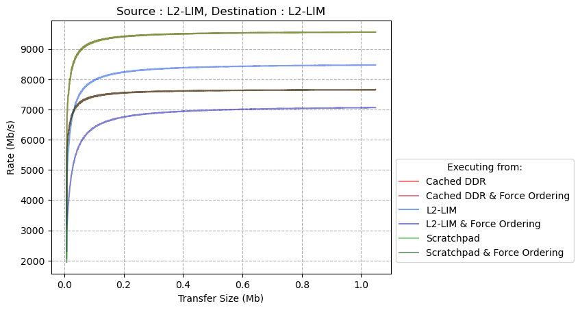

| **Executing From**              | **Transfer Size (Mb)** | **Peak Rate (Mb/s)** | **% of Theoretical Max Rate** |
| ------------------------------- | ---------------------- | -------------------- | ----------------------------- |
| **Cached DDR**                  | 0.87                   | 9560                 | 25%                           |
| **Cached DDR + Force Ordering** | 0.96                   | 7656                 | 20%                           |
| **L2-LIM**                      | 0.953                  | 8472                 | 22%                           |
| **L2-LIM + Force Ordering**     | 0.998                  | 7064                 | 18%                           |
| **Scratchpad**                  | 0.883                  | 9560                 | 25%                           |
| **Scratchpad + Force Ordering** | 0.986                  | 7656                 | 20%                           |

### Source: L2-LIM, Destination: Scratchpad

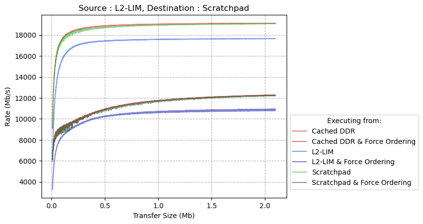

| **Executing From**              | **Transfer Size (Mb)** | **Peak Rate (Mb/s)** | **% of Theoretical Max Rate** |
| ------------------------------- | ---------------------- | -------------------- | ----------------------------- |
| **Cached DDR**                  | 1.997                  | 19120                | 50%                           |
| **Cached DDR + Force Ordering** | 2.093                  | 12280                | 32%                           |
| **L2-LIM**                      | 1.971                  | 17656                | 46%                           |
| **L2-LIM + Force Ordering**     | 2.089                  | 10944                | 28%                           |
| **Scratchpad**                  | 2.083                  | 19080                | 50%                           |
| **Scratchpad + Force Ordering** | 2.074                  | 12256                | 32%                           |

### Source: L2-LIM, Destination: Cached DDR

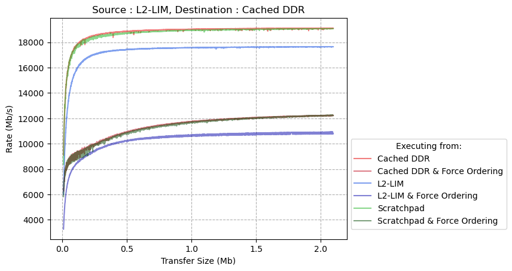

| **Executing From**              | **Transfer Size (Mb)** | **Peak Rate (Mb/s)** | **% of Theoretical Max Rate** |
| ------------------------------- | ---------------------- | -------------------- | ----------------------------- |
| **Cached DDR**                  | 1.93                   | 19120                | 50%                           |
| **Cached DDR + Force Ordering** | 2.059                  | 12256                | 32%                           |
| **L2-LIM**                      | 1.958                  | 17656                | 46%                           |
| **L2-LIM + Force Ordering**     | 2.07                   | 10936                | 28%                           |
| **Scratchpad**                  | 2.074                  | 19080                | 50%                           |
| **Scratchpad + Force Ordering** | 2.092                  | 12264                | 32%                           |

### Source: L2-LIM, Destination: Non-Cached DDR

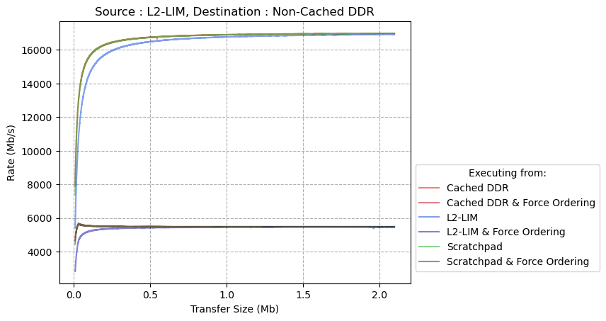

| **Executing From**              | **Transfer Size (Mb)** | **Peak Rate (Mb/s)** | **% of Theoretical Max Rate** |
| ------------------------------- | ---------------------- | -------------------- | ----------------------------- |
| **Cached DDR**                  | 2.054                  | 16992                | 88%                           |
| **Cached DDR + Force Ordering** | 0.031                  | 5688                 | 30%                           |
| **L2-LIM**                      | 2.085                  | 16928                | 88%                           |
| **L2-LIM + Force Ordering**     | 1.931                  | 5472                 | 28%                           |
| **Scratchpad**                  | 1.907                  | 16984                | 88%                           |
| **Scratchpad + Force Ordering** | 0.031                  | 5688                 | 30%                           |

## Results Scratchpad Memory

### Source: Scratchpad, Destination: L2-LIM

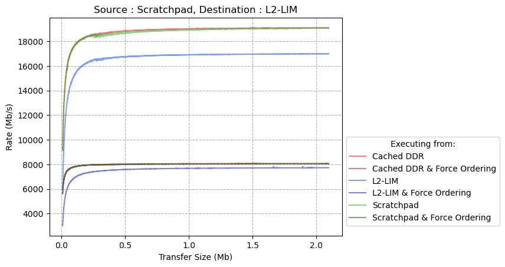

| **Executing From**              | **Transfer Size (Mb)** | **Peak Rate (Mb/s)** | **% of Theoretical Max Rate** |
| ------------------------------- | ---------------------- | -------------------- | ----------------------------- |
| **Cached DDR**                  | 1.997                  | 19112                | 50%                           |
| **Cached DDR + Force Ordering** | 1.216                  | 8064                 | 21%                           |
| **L2-LIM**                      | 1.833                  | 16992                | 44%                           |
| **L2-LIM + Force Ordering**     | 1.893                  | 7824                 | 20%                           |
| **Scratchpad**                  | 2.074                  | 19072                | 50%                           |
| **Scratchpad + Force Ordering** | 2.028                  | 8064                 | 21%                           |

### Source: Scratchpad, Destination: Scratchpad

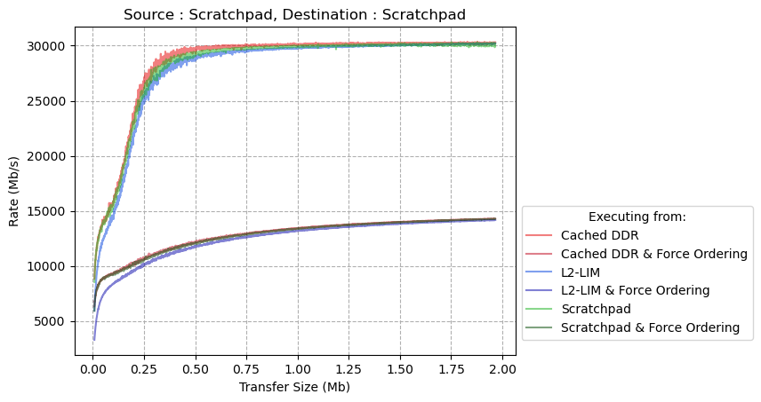

| **Executing From**              | **Transfer Size (Mb)** | **Peak Rate (Mb/s)** | **% of Theoretical Max Rate** |
| ------------------------------- | ---------------------- | -------------------- | ----------------------------- |
| **Cached DDR**                  | 1.878                  | 30368                | 79%                           |
| **Cached DDR + Force Ordering** | 1.955                  | 14296                | 37%                           |
| **L2-LIM**                      | 1.96                   | 30224                | 79%                           |
| **L2-LIM + Force Ordering**     | 1.966                  | 14168                | 37%                           |
| **Scratchpad**                  | 1.752                  | 30312                | 79%                           |
| **Scratchpad + Force Ordering** | 1.959                  | 14280                | 37%                           |

### Source: Scratchpad, Destination: Cached DDR

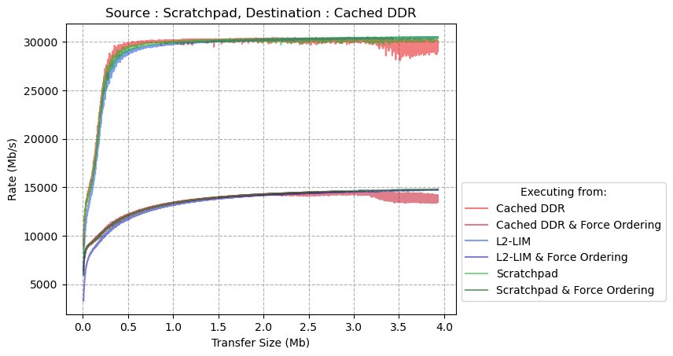

| **Executing From**              | **Transfer Size (Mb)** | **Peak Rate (Mb/s)** | **% of Theoretical Max Rate** |
| ------------------------------- | ---------------------- | -------------------- | ----------------------------- |
| **Cached DDR**                  | 3.152                  | 30464                | 79%                           |
| **Cached DDR + Force Ordering** | 2.862                  | 14560                | 38%                           |
| **L2-LIM**                      | 3.807                  | 30472                | 79%                           |
| **L2-LIM + Force Ordering**     | 3.914                  | 14736                | 38%                           |
| **Scratchpad**                  | 3.845                  | 30504                | 79%                           |
| **Scratchpad + Force Ordering** | 3.902                  | 14800                | 39%                           |

### Source: Scratchpad, Destination: Non-Cached DDR

| **Executing From**              | **Transfer Size (Mb)** | **Peak Rate (Mb/s)** | **% of Theoretical Max Rate** |
| ------------------------------- | ---------------------- | -------------------- | ----------------------------- |
| **Cached DDR**                  | 3.046                  | 17024                | 89%                           |
| **Cached DDR + Force Ordering** | 3.639                  | 6976                 | 36%                           |
| **L2-LIM**                      | 3.925                  | 17000                | 89%                           |
| **L2-LIM + Force Ordering**     | 3.456                  | 6960                 | 36%                           |
| **Scratchpad**                  | 3.833                  | 17016                | 89%                           |
| **Scratchpad + Force Ordering** | 2.176                  | 6968                 | 36%                           |

## Results Cached DDR

### Source: Cached DDR, Destination: L2-LIM

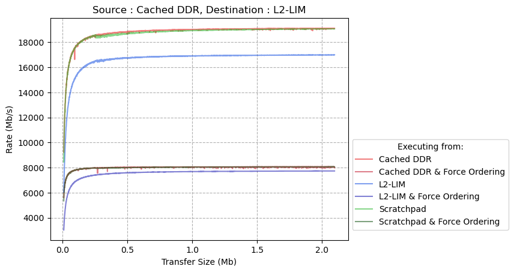

| **Executing From**              | **Transfer Size (Mb)** | **Peak Rate (Mb/s)** | **% of Theoretical Max Rate** |
| ------------------------------- | ---------------------- | -------------------- | ----------------------------- |
| **Cached DDR**                  | 2.069                  | 19120                | 50%                           |
| **Cached DDR + Force Ordering** | 1.33                   | 8064                 | 21%                           |
| **L2-LIM**                      | 1.928                  | 16992                | 44%                           |
| **L2-LIM + Force Ordering**     | 1.907                  | 7728                 | 20%                           |
| **Scratchpad**                  | 2.074                  | 19072                | 50%                           |
| **Scratchpad + Force Ordering** | 1.913                  | 8064                 | 21%                           |

### Source: Cached DDR, Destination: Scratchpad

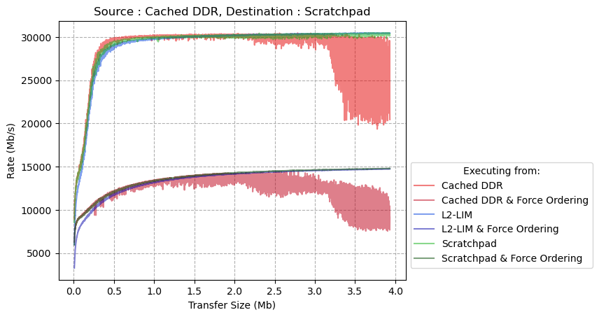

| **Executing From**              | **Transfer Size (Mb)** | **Peak Rate (Mb/s)** | **% of Theoretical Max Rate** |
| ------------------------------- | ---------------------- | -------------------- | ----------------------------- |
| **Cached DDR**                  | 2.786                  | 30464                | 79%                           |
| **Cached DDR + Force Ordering** | 2.426                  | 14416                | 38%                           |
| **L2-LIM**                      | 3.865                  | 30464                | 79%                           |
| **L2-LIM + Force Ordering**     | 3.909                  | 14736                | 38%                           |
| **Scratchpad**                  | 3.672                  | 30488                | 79%                           |
| **Scratchpad + Force Ordering** | 3.89                   | 14800                | 39%                           |

### Source: Cached DDR, Destination: Cached DDR

The drop off in performance that occurs in the above graph at ~; 0.256MB is due to the L2 cache
becoming full.
This is because the P-DMA can transfer data to the cache faster than the cache is able to write data
to DDR memory.

The L2 Cache configuration used in this application has 0.512MB of space available to be used by Cached
DDR.
In the case of this benchmark cached DDR is being used as both the source and destination, therefore
twice the space is required for each transfer, causing the cache to become full at ~; 0.256MB.
Whereas in the [Cached DDR to Non-Cached DDR](#source-cached-ddr-destination-non-cached-ddr),
and [Non-Cached DDR to Cached DDR](#source-non-cached-ddr-destination-cached-ddr) benchmarks the entire
cache is used only as either the source or the destination,
as such the performance begins to degrade at ~; 0.512MB.

A full discussion of the impact of the L2 Cache configuration on the performance of transfers to Cached
DDR is provided in the [DMA benchmarking overview readme document][DMA benchmarking overview readme document].

| **Executing From**              | **Transfer Size (Mb)** | **Peak Rate (Mb/s)** | **% of Theoretical Max Rate** |
| ------------------------------- | ---------------------- | -------------------- | ----------------------------- |
| **Cached DDR**                  | 1.272                  | 30288                | 79%                           |
| **Cached DDR + Force Ordering** | 1.742                  | 13856                | 36%                           |
| **L2-LIM**                      | 2.01                   | 30248                | 79%                           |
| **L2-LIM + Force Ordering**     | 2.084                  | 14232                | 37%                           |
| **Scratchpad**                  | 1.993                  | 30320                | 79%                           |
| **Scratchpad + Force Ordering** | 2.091                  | 14344                | 37%                           |

[DMA benchmarking overview readme document]: https://mi-v-ecosystem.github.io/redirects/polarfire-soc/benchmarks/Readme

### Source: Cached DDR, Destination: Non-Cached DDR

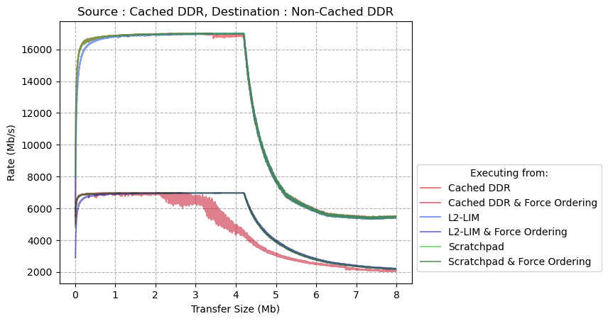

The drop off in performance at ~; 0.512MB is due to the cache becoming full,
as the P-DMA can transfer data faster than the cache can clear data from DDR memory.
More cache space can be allocated to the L2 Cache using the MSS Configurator.

A full discussion of the impact of the L2 Cache configuration on the performance of transfers to Cached
DDR is provided in the [DMA benchmarking overview readme document][DMA benchmarking overview readme document].

| **Executing From**              | **Transfer Size (Mb)** | **Peak Rate (Mb/s)** | **% of Theoretical Max Rate** |
| ------------------------------- | ---------------------- | -------------------- | ----------------------------- |
| **Cached DDR**                  | 1.638                  | 16984                | 88%                           |
| **Cached DDR + Force Ordering** | 1.465                  | 6968                 | 36%                           |
| **L2-LIM**                      | 3.942                  | 17000                | 89%                           |
| **L2-LIM + Force Ordering**     | 3.449                  | 6960                 | 36%                           |
| **Scratchpad**                  | 3.827                  | 17016                | 89%                           |
| **Scratchpad + Force Ordering** | 2.194                  | 6968                 | 36%                           |

## Results Non-Cached DDR

### Source: Non-Cached DDR, Destination: L2-LIM

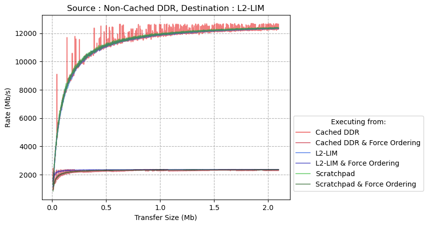

| **Executing From**              | **Transfer Size (Mb)** | **Peak Rate (Mb/s)** | **% of Theoretical Max Rate** |
| ------------------------------- | ---------------------- | -------------------- | ----------------------------- |
| **Cached DDR**                  | 1.527                  | 12696                | 66%                           |
| **Cached DDR + Force Ordering** | 0.118                  | 2352                 | 12%                           |
| **L2-LIM**                      | 2.075                  | 12392                | 65%                           |
| **L2-LIM + Force Ordering**     | 0.909                  | 2352                 | 12%                           |
| **Scratchpad**                  | 2.062                  | 12424                | 65%                           |
| **Scratchpad + Force Ordering** | 1.756                  | 2344                 | 12%                           |

### Source: Non-Cached DDR, Destination: Scratchpad

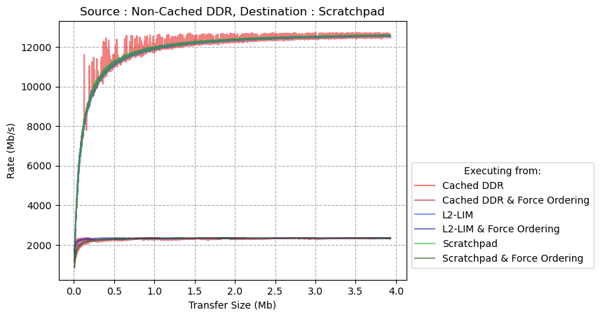

| **Executing From**              | **Transfer Size (Mb)** | **Peak Rate (Mb/s)** | **% of Theoretical Max Rate** |
| ------------------------------- | ---------------------- | -------------------- | ----------------------------- |
| **Cached DDR**                  | 2.469                  | 12704                | 66%                           |
| **Cached DDR + Force Ordering** | 0.108                  | 2352                 | 12%                           |
| **L2-LIM**                      | 3.83                   | 12592                | 66%                           |
| **L2-LIM + Force Ordering**     | 0.874                  | 2352                 | 12%                           |
| **Scratchpad**                  | 3.878                  | 12608                | 66%                           |
| **Scratchpad + Force Ordering** | 3.534                  | 2352                 | 12%                           |

### Source: Non-Cached DDR, Destination: Cached DDR

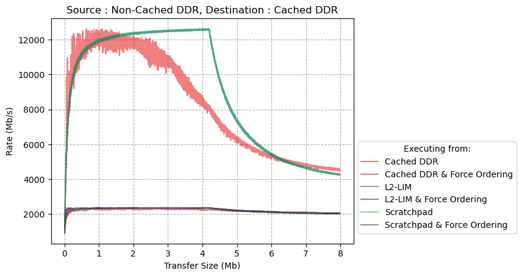

The drop off in performance at ~; 0.512MB is due to the cache becoming full,
as the P-DMA can transfer data to the cache faster than the cache can write data to DDR memory.
More cache space can be allocated to the L2 Cache using the MSS Configurator.
A full discussion of the impact of the L2 Cache configuration on the performance of transfers to Cached
DDR is provided in the [DMA benchmarking overview readme document][DMA benchmarking overview readme document].

| **Executing From**              | **Transfer Size (Mb)** | **Peak Rate (Mb/s)** | **% of Theoretical Max Rate** |
| ------------------------------- | ---------------------- | -------------------- | ----------------------------- |
| **Cached DDR**                  | 0.642                  | 12624                | 66%                           |
| **Cached DDR + Force Ordering** | 0.082                  | 2360                 | 12%                           |
| **L2-LIM**                      | 4.068                  | 12600                | 66%                           |
| **L2-LIM + Force Ordering**     | 0.902                  | 2352                 | 12%                           |
| **Scratchpad**                  | 4.186                  | 12632                | 66%                           |
| **Scratchpad + Force Ordering** | 3.578                  | 2352                 | 12%                           |

### Source: Non-Cached DDR, Destination: Non-Cached DDR

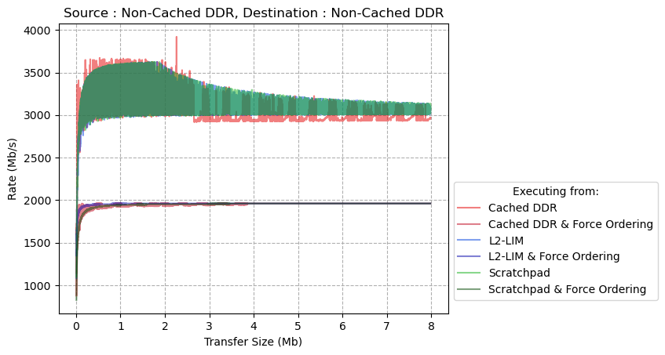

| **Executing From**              | **Transfer Size (Mb)** | **Peak Rate (Mb/s)** | **% of Theoretical Max Rate** |
| ------------------------------- | ---------------------- | -------------------- | ----------------------------- |
| **Cached DDR**                  | 2.263                  | 3920                 | 20%                           |
| **Cached DDR + Force Ordering** | 0.134                  | 1960                 | 10%                           |
| **L2-LIM**                      | 1.646                  | 3624                 | 19%                           |
| **L2-LIM + Force Ordering**     | 0.798                  | 1960                 | 10%                           |
| **Scratchpad**                  | 1.62                   | 3624                 | 19%                           |
| **Scratchpad + Force Ordering** | 2.966                  | 1960                 | 10%                           |
