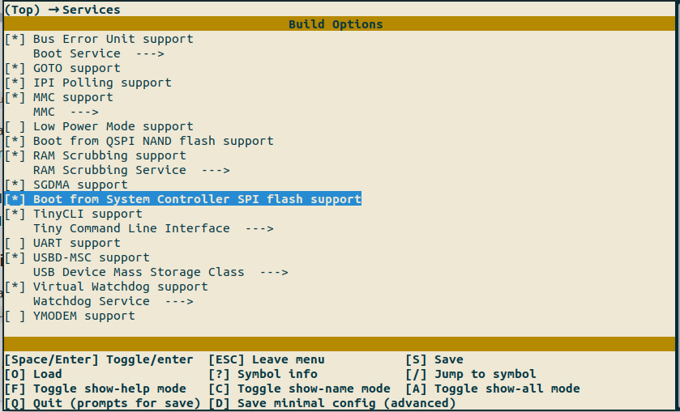

# PolarFire SoC: Programming the SPI Flash on the Icicle Kit and Booting via HSS

- [Build the HSS](#build-the-hss)
- [Use Libero to program the SPI flash](#use-libero-to-program-the-spi-flash)

This document provides a brief overview of programming the SPI flash part on the Icicle kit with a HSS-compatible payload, and booting it via the HSS.

Please refer to the [PolarFire SoC Microprocessor Subsystem (MSS) User Guide](https://www.microsemi.com/document-portal/doc_download/1244570-ug0880-polarfire-soc-fpga-microprocessor-subsystem-mss-user-guide)
for a detailed description of PolarFire SoC.

<a name="build-the-hss"></a>

## Build the HSS

Clone the Hart Software Services repository

```shell
$ git clone https://github.com/polarfire-soc/hart-software-services.git
```

Copy the default configuration for your board. For example:

```shell
$ cd hart-software-services
$ cp boards/mpfs-icicle-kit-es/def_config .config
```

Edit the default HSS configuration using menuconfig command as shown below:

```shell
$ make menuconfig
```

After running the command shown above, a configuration menu should pop-up.

Navigate to the "Services" category


Select the "Boot from System Controller SPI flash support" option by pressing the space/enter button



Exit menuconfig by pressing the "Q" in the keyboard and save the configuration when prompted

Build the HSS using the `make` command as shown below. Alternatively, build the HSS using Softconsole as shown in the "Building the HSS using SoftConsole" section of this [document](https://mi-v-ecosystem.github.io/redirects/software-development_polarfire-soc-software-tool-flow).

```shell
$ make
```

Flash the HSS to your board from the command line using the command shown below. Alternatively, use the SoftConsole GUI as shown in the "Programming the eNVM" section of this [document](https://mi-v-ecosystem.github.io/redirects/software-development_polarfire-soc-software-tool-flow).

```shell
$ make program
```

From either Buildroot or Yocto, you should have a payload.bin file which
contains U-Boot. Convert this to HEX using

```shell
$ bincopy convert -i binary -o ihex payload.bin payload.hex
```

If you don't have bincopy installed, install it with pip (or pip3,
whichever you have):

```shell
$ sudo pip install bincopy
```

<a name="use-libero-to-program-the-spi-flash"></a>

## Use Libero to program the SPI flash

Clone the Icicle Kit reference design (`git clone
 https://github.com/polarfire-soc/icicle-kit-reference-design.git`) and
Open Libero. Either click `Project→Execute Script` (or press CTRL-u)
to get the `Execute Script` dialog, and click "..." to select the
Icicle Kit reference design Tcl script:


Click Run to generate the project.

Select the "`Design Flow`" tab, and then run the "`Generate FPGA Array
Data`" tool to synthesize the design.

This will take some time, but the next tool in the flow depends on the
output of "`Generate FPGA Array Data`" and it won't run it automatically.


Open the "`Configure Design Initialization Data and Memories`" tool.


Select the "`SPI Flash`" tab, and change the SPI Flash memory size to
1,048,576 KiB.


Click "`Add`, and add a "`Data Storage Client`". Give your payload a
meaningful and representative name (call it "payload" if you're stuck),
select "`Memory file`" and click "`...`" to select your payload.hex image
from earlier.


The Start address offset of 0x400 is important -- do not change that.

Next, start the "`Run PROGRAM_SPI_IMAGE Action`" tool.


Click "`Yes`" to both the Warning dialog and the Information dialog


This will take a minute or two.

Power-cycle the board, and watch the boot messages.
