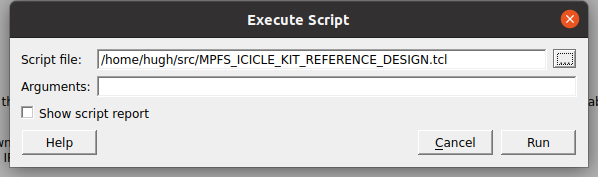
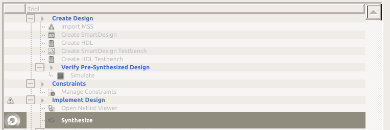
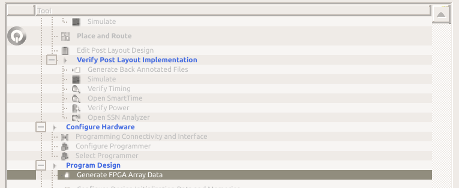
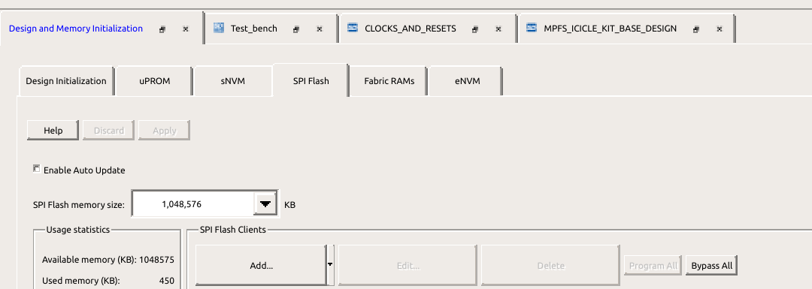
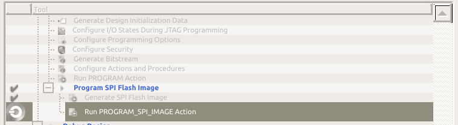
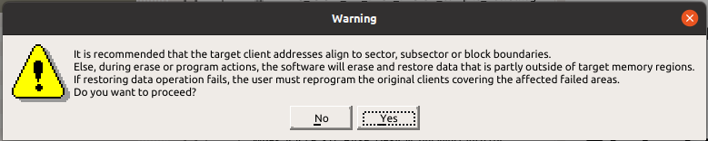

# PolarFire SoC: Programming the SPI Flash on the Icicle Kit and Booting via HSS

- [Build the HSS](#build-the-hss)
- [Use Libero to program the SPI flash](#use-libero-to-program-the-spi-flash)

This document provides a brief overview of programming the SPI flash part on the Icicle kit with a HSS-compatible payload, and booting it via the HSS.

Please refer to the [PolarFire SoC Microprocessor Subsystem (MSS) User Guide](https://www.microsemi.com/document-portal/doc_download/1244570-ug0880-polarfire-soc-fpga-microprocessor-subsystem-mss-user-guide)
for a detailed description of PolarFire SoC.


# <a name="build-the-hss">Build the HSS</a>

```
$ git clone ssh://git@bitbucket.microchip.com/fpga_pfsoc_es/hart-software-services.git
$ cd hart-software-services
$ cp boards/mpfs-icicle-kit-es/def_config .config
```

Edit .config and ensure that *CONFIG_SERVICE_SPI* is enabled in the .config file.

Ensure that jumpers 34/43 on the Icicle kit are correctly set for 1v8 operation.

```
$ make
```

From either Buildroot or Yocto, you should have a payload.bin file which
contains U-Boot. Convert this to HEX using

```
$ bincopy convert -i binary -o ihex payload.bin payload.hex
```

If you don't have bincopy installed, install it with pip (or pip3,
whichever you have):

```
$ sudo pip install bincopy
```

# <a name="use-libero-to-program-the-spi-flash">Use Libero to program the SPI flash</a>

Clone the Icicle Kit reference design (`git clone
 https://github.com/polarfire-soc/icicle-kit-reference-design.git`) and
Open Libero. Either click `Project→Execute Script` (or press CTRL-u)
to get the `Execute Script` dialog, and click "..." to select either
eMMC or SD Tcl script:



Click Run to generate the project.

Select the "`Design Flow`" tab, and then run the "`Generate FPGA Array
Data`" tool to synthesize the design.

This will take some time, but the next tool in the flow depends on the
output of "`Generate FPGA Array Data`" and it won't run it automatically.





Open the "`Configure Design Initialization Data and Memories`" tool.


Select the "`SPI Flash`" tab, and change the SPI Flash memory size to
1,048,576 KiB.



Click "`Add`, and add a "`Data Storage Client`". Give your payload a
meaningful and representative name (call it "payload" if you're stuck),
select "`Memory file`" and click "`...`" to select your payload.hex image
from earlier.


The Start address offset of 0x400 is important -- do not change that.

Next, start the "`Run PROGRAM_SPI_IMAGE Action`" tool.




Click "`Yes`" to both the Warning dialog and the Information dialog




This will take a minute or two.

Power-cycle the board, and watch the boot messages.
