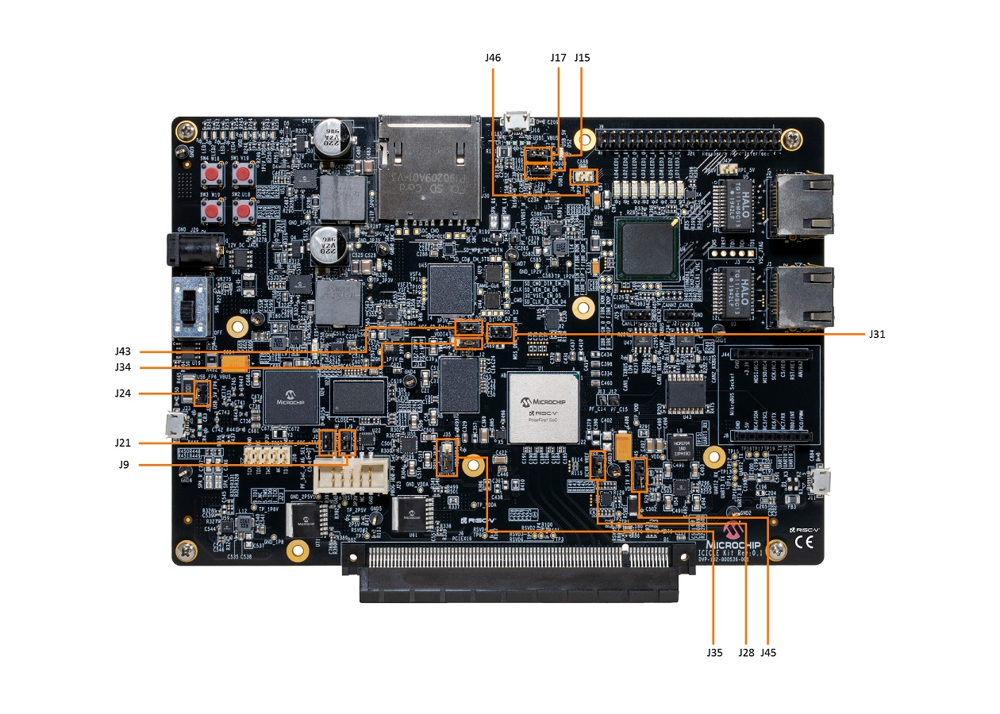
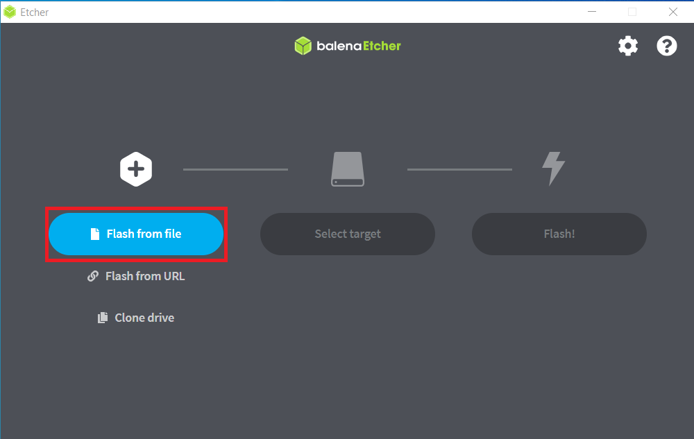
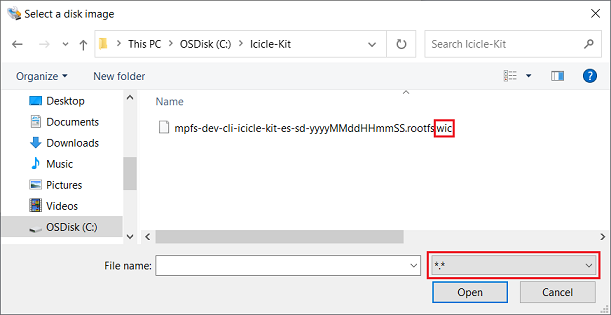
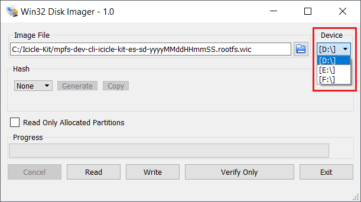
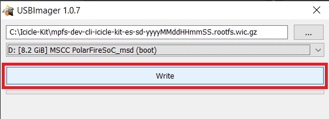
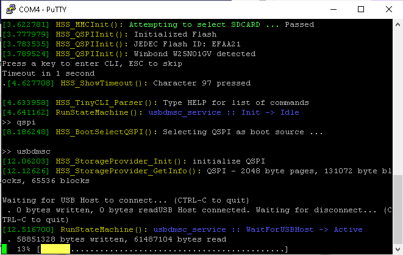

# Updating PolarFire SoC Icicle-Kit FPGA Design and Linux Image

- [Updating PolarFire SoC Icicle-Kit FPGA Design and Linux Image](#updating-polarfire-soc-icicle-kit-fpga-design-and-linux-image)
  - [Programming Files](#programming-files)
    - [FPGA fabric and eNVM](#fpga-fabric-and-envm)
    - [Linux image](#linux-image)
  - [Serial Ports](#serial-ports)
  - [Linux Credentials](#linux-credentials)
  - [Programming The PolarFire SoC Design](#programming-the-polarfire-soc-design)
  - [Programming the Linux Image](#programming-the-linux-image)
    - [eMMC](#emmc)
    - [SD Card](#sd-card)
    - [External QSPI Flash Memory](#external-qspi-flash-memory)
  - [Tools and References](#tools-and-references)

This document provides links to files and instructions to provision an Icicle Kit to boot Linux. To achieve this:

- The PolarFire SoC Icicle Kit reference design, including the HSS boot loader must be programmed to the kit
- The on board eMMC or an SD card need to be programmed with a Linux image

## Programming Files

The sections below link to programming files for the FPGA and eNVM along with images for Linux.

### FPGA fabric and eNVM

A FlashPro Express programming job file is provided as an asset with the Icicle Kit Reference Design [releases](https://github.com/polarfire-soc/icicle-kit-reference-design/releases). This programming job file will program the FPGA fabric with the latest reference configuration and also program the eNVM with the latest HSS payload. The .zip file in the release assets should be downloaded and extracted to access the programming job file.

### Linux image

A minimal Linux image is provided as an asset with the Meta PolarFire SoC Yocto BSP [releases](https://github.com/polarfire-soc/meta-polarfire-soc-yocto-bsp/releases).

Linux images with a 'wic' file extension use a GUID partition table (GPT) and are suitable for programming to the eMMC or an SD card.

The .wic.gz file in the release assets should be downloaded to program into storage using the steps outlined in the [eMMC](#emmc) or [SD](#sd-card) sections.

Linux images with a 'mtdimg' extension are suitable for programming to an external QSPI flash memory device using the steps outlined in the [External QSPI Flash Memory](#external-qspi-flash-memory) section.

When updating the Icicle Kit as shown in this section, make sure to keep both the Icicle Kit Reference Design and Linux image versions in sync by using the latest release assets.

## Jumper Settings

The Icicle Kit jumper settings required to boot Linux are as follows:

| Jumper | Setting | Description                                                               |
|:-------|:--------|:--------------------------------------------------------------------------|
| J15    | Open    | USB device mode selection. Open: USB client. Closed: USB host             |
| J17    | Open    | USB device mode selection. Open: USB client. Closed: USB host             |
| J24    | Closed  | Required for Embedded FlashPro6 (eFP6)                                    |
| J28    | Closed  | Transceiver external reference clock. Closed: ground (no clock provided). |
| J31    | Open    | DDR controller reference voltage.                                         |
|        |         | Open: no external reference.                                              |
|        |         | Closed: External reference provided.                                      |
| J34    | 2 & 3   | Bank 4 reference voltage                                                  |
|        |         | 1&2 = 3v3                                                                 |
|        |         | 2&3 = 1v8                                                                 |
| J35    | 2 & 3   | Bank 4 I/O auxiliary supply voltage.                                      |
|        |         | 1&2 = 3v3                                                                 |
|        |         | 2&3 = 2v5                                                                 |
| J43    | 2 & 3   | U44 reference voltage                                                     |
|        |         | 1&2 = 3v3                                                                 |
|        |         | 2&3 = bank 4 reference voltage                                            |
| J45    | 2 & 3   | Core voltage (VDD) set to 1.05v                                           |
| J46    | Closed  | RPi 3v3 enable                                                            |

### FlashPro Jumpers

| Jumper | Description                                                             |
|:-------|:------------------------------------------------------------------------|
| J9     | Used to select between Embedded FlashPro6 and external FlashPro header. |
|        | Closed: eFP6 connected to J33 micro-USB port.                           |
|        | Open: External FlashPro connected to J23 header.                        |
| J21    | JTAG nTRST interface pull down enable. Leave open.                      |
| J24    | VBUS source. Leave closed.                                              |

## Serial Ports

The Icicle Kit gives access to 4 serial ports via the J11 micro-USB port. These are connected to MMUART0:3 respectively. A terminal emulator (e.g putty or teraterm) can be used to connect to the serial ports.

The first two serial ports are used when booting Linux. MMUART0 displays the zero stage bootloader and U-Boot messages, MMUART1 displays Linux messages and a console. If you're unsure about which COM port relates to which MMUART, all ports should be connected and checked for startup messages. MMUART0 will always display HSS messages and MMUART 1 will always display the Linux console in the standard configuration.

The serial port settings are as follows: 115200 baud, 8-bit, no flow control.

## Linux Credentials

You can login to the board using 'root' as user name, there is no password by default. If one is requested 'microchip' is used by default.

## Programming The PolarFire SoC Design

Please use FlashPro Express to program the PolarFire SoC design to the Icicle Kit.

Instructions for programming a target using FlashPro Express can be found [here](https://onlinedocs.microchip.com/pr/GUID-BB497156-B848-40FC-B995-DF115EF2C226-en-US-1/index.html?GUID-9DDB79B6-A78C-46CE-A288-92C87FDB7063). There is also a video available which outlines the required steps [here](https://youtu.be/Foil5pIRBlM?list=PLtQdQmNK_0DTpi5IB0WcN84fDr_Crn47m&t=141).

## Programming the Linux Image

### eMMC

The Icicle Kit's eMMC content is written by the Hart Software Services (HSS) using the `usbdmsc` command. The HSS `usbdmsc` command exposes the eMMC as a USB mass storage device through the Icicle Kit's USB-OTG J16 connector located beside the SD card slot.

If both QSPI and an MMC services are enabled in the HSS, you must specify the default device to be programmed before running the `usbdmsc` command. For example, to program the eMMC using USBDMSC service, you must use the `mmc` command before running `usbdmsc` command.

#### eMMC content update procedure

1. Connect the J11 USB-UART connector to your host PC. This is the micro-USB connector on the same side as the Ethernet connectors. This connection will give you access to 4 of the PolarFire SoC UARTs
2. Open a terminal application to interact with the HSS through MMUART0. Settings are 115200 baud, 8 data bits, 1 stop bit, no parity, and no flow control.
3. Power on the board and the Microchip logo will be displayed on MMUART0 as the HSS boots.
4. Type a key in the terminal application to stop the HSS from booting. This will give you access to the HSS command line interface and a ">>" for input will be displayed in the terminal.
5. Type `mmc` to select mmc as a boot source and then `usbdmsc` in the HSS command line interface. If successful, a message saying "Waiting for USB Host to connect" will be displayed.
6. Connect the J16 USB-OTG connector to your host PC. The eMMC content will be transferred to the Icicle Kit through this connection.
7. The Icicle Kit should now appear as mass storage device/drive on your host PC.
8. Download the asset for the Linux image that you want to program to the Icicle Kit from the [Linux image](#Linux-asset) section of this document.
9. Download and install [USBImager](https://bztsrc.gitlab.io/usbimager/).
10. Start USBImager

    

11. Select the *Image file* that was downloaded in step 8. Note: Linux images are generated with a time stamp; assets from different releases will have different names.

    

12. Select the target *Device* to program the image to.

    

13. Click *Write*.

    

14. Once writing has completed, unmount/eject the drive from the host PC and press `CTRL+C` in the HSS command line interface. Disconnect the micro-USB cable from J16 of the Icicle Kit.
15. Type `boot` to boot the newly copied Linux image.
16. HSS boot messages will appear on MMUART0 and the Linux boot will appear on MMUART1.

### SD Card

1. Put an SD card into the SD card reader of your host PC and use the instructions below.

2. Download the asset for the Linux image that you want to program to the Icicle Kit from the [Linux image](#Linux-asset) section of this document.

3. Download and install [USBImager](https://bztsrc.gitlab.io/usbimager/).

4. Start USBImager

    

5. Select *Image file* that was downloaded in step 2. Note: Linux images are generated with a time stamp, assets from different releases will have different names.

    

6. Select the *Device*.

    

7. Click *Write*.

    

8. Once writing has completed, eject the SD card from the host PC.
9. Insert it in the Icicle Kit's SD card slot and power on the board.
10. HSS boot messages will appear on MMUART0 and the Linux boot will appear on MMUART1. The expected HSS output for a successful boot from eMMC is shown below:

    

11. To verify the Linux image that has been programmed the bundled webserver demo can be run. Instructions for running this demo can be found in the Icicle Kit Quick Start Guide [here](https://www.microsemi.com/products/fpga-soc/polarfire-soc-icicle-quick-start-guide#getting-started).

### External QSPI Flash Memory

The Icicle Kit supports booting Linux from QSPI by connecting an external Winbond W25N01GVZEIG QSPI NAND flash memory  to the Raspberry Pi 4 Interface (J26).

For more information on the QSPI flash memory devices supported, please refer to the [booting from QSPI](https://mi-v-ecosystem.github.io/redirects/booting-from-qspi_booting-from-qspi) documentation.

The external QSPI flash memory can be programmed using the Hart Software Services (HSS) using the `usbdmsc` command. The HSS `usbdmsc` command exposes the QSPI flash memory as a USB mass storage device through the Icicle Kit's USB-OTG J16 connector located beside the SD card slot.

If both QSPI and an MMC services are enabled in the HSS, you must specify the default device to be programmed before running the `usbdmsc` command. For example, to program the external QSPI flash memory using USBDMSC service, you must use the `qspi` command before running `usbdmsc` command.

1. Connect the J11 USB-UART connector to your host PC. This is the micro-USB connector on the same side as the Ethernet connectors. This connection will give you access to 4 of the PolarFire SoC UARTs
2. Open a terminal application to interact with the HSS through MMUART0. Settings are 115200 baud, 8 data bits, 1 stop bit, no parity, and no flow control.
3. Power on the board and the Microchip logo will be displayed on MMUART0 as the HSS boots.
4. Type a key in the terminal application to stop the HSS from booting. This will give you access to the HSS command line interface and a ">>" for input will be displayed in the terminal.
5. Type `qspi` to select QSPI as the boot source  and then type `usbdmsc` in the HSS command line interface. If successful, a message saying "Waiting for USB Host to connect" will be displayed.
6. Connect the J16 USB-OTG connector to your host PC. The content will be transferred to the external QSPI flash memory through this connection.
7. The Icicle Kit should now appear as mass storage device/drive on your host PC.
8. Download the asset for the Linux image that you want to program to the Icicle Kit from the [Linux image](#Linux-asset) section of this document. The asset should have a `.mtdimg` file extension.
9. Download and install [USBImager](https://bztsrc.gitlab.io/usbimager/).
10. Start USBImager

    

11. Select the *Image file* that was downloaded in step 8. Note: Linux images are generated with a time stamp; assets from different releases will have different names.

    

12. Select the target *Device* to program the image to.

    

13. Click *Write*.

    

14. Once writing has completed, unmount/eject the drive from the host PC and press `CTRL+C` in the HSS command line interface. Disconnect the micro-USB cable from J16 of the Icicle Kit.
15. A progress bar will show up, indicating that the image is being transfered to the flash memory connected to the Icicle Kit.

    

16. Once the transfer has completed, the HSS console shoud look as shown in the image below

    

17. Type `boot` to boot the newly copied Linux image.
18. HSS boot messages will appear on MMUART0 and the Linux boot will appear on MMUART1.

## Tools and References

[FlashPro Express Installer and Release Notes Download](https://www.microsemi.com/product-directory/programming/4977-flashpro#software)

**Note:** FlashPro Express is installed with Libero and does not need to be installed separately. If Libero is not installed FlashPro Express is bundled with the Programming and Debug Tools. FlashPro and FlashPro Express are different tools.

[USBImager](https://bztsrc.gitlab.io/usbimager/)

[USBImager Manual](https://gitlab.com/bztsrc/usbimager/-/blob/master/usbimager-manual.pdf)

[FlashPro Express User Guides](https://www.microsemi.com/product-directory/programming/4977-flashpro#documents)
