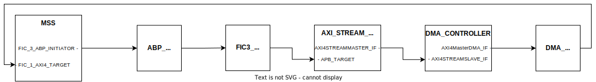

# AXI4-Stream Demonstration

## Objective

This document describes a demonstration of an FPGA fabric DMA Controller (`COREAXIDMACONTROLLER`) transferring 32 bit data over an AXI4-Stream interface.
The demonstration has been implemented as a addition to the PolarFire SoC Icicle Kit Reference Design.

## Description

The project has two configurations:

- A hardware configuration; which can be programmed onto the Icicle Kit using Libero SoC
- A simulation configuration; which is run by a Bus Functional Model (BFM) script using the ModelSim simulator.

Both configurations can be generated using the Icicle Kit Reference Design Tcl script by passing arguments in the "Execute Script" dialogue in Libero Soc.
The `AXI4_STREAM_DEMO`, or `AXI4_STREAM_DEMO` and `BFM_SIMULATION` arguments must be passed to the script dialogue to generate the hardware or simulation configurations respectively.

Further information on the Icicle Kit Reference Design Generation Tcl Scripts is available on the following [GitHub repository](https://github.com/polarfire-soc/icicle-kit-reference-design).

The project consists of a data source, the `AXI4_STREAM_DATA_GENERATOR` module, which is connected to a fabric DMA Controller using an AXI4-Stream interface.
The DMA Controller directs data it receives to memory, based on a stream descriptor stored in shared memory.
Either non-cached DDR or fabric SRAM is used depending on whether the hardware or simulation configuration has been generated.

The `AXI4_STREAM_DATA_GENERATOR` produces incrementing data which is output over an AXI4-Stream interface.
The size of the AXI4 transfers can be configured by writing to the modules' Transfer Size register.
An AXI4-Stream transfer can be initiated by writing to the modules' Start register.
Both registers are accessible over the APB interface.

The stream generator module is intended to emulate the functionality of a camera or sensor module which can use a DMA Controller to stream data to memory.

## Requirements

- Libero Soc v2021.3 or later

To run the hardware configuration on the Icicle Kit the following are additionally required:

- PolarFire SoC Icicle Kit (MPFS250T_ES-FCVG484E)
- Serial Terminal program e.g. PuTTY
- SoftConsole v2021.1 or later

## Pre-Requisites

Before running the hardware configuration be sure to complete the following steps:

- Power on and connect the Icicle Kit via jumpers J33 and J11.
- Open up a serial connection to the board:
  - Choose the COM port corresponding to UART interface 1.
  - Set the baud rate to “115200”, set data bits to 8, set flow control to none

## Running the Demonstration

### Hardware Configuration

The hardware configuration can be generated by passing the `AXI4_STREAM_DEMO` argument in the execute script dialog when generating the reference design in Libero.
The generated reference design must then be programmed onto the Icicle Kit by following the design flow in Libero.
Refer to the [Libero SoC Design Flow User Guide](https://github.com/polarfire-soc/polarfire-soc-documentation/blob/master/software-development/polarfire-soc-software-tool-flow.md#using-libero-soc) for further information on programming the Libero design flow.

There is a companion bare-metal project available with the demonstration that initiates the data stream and verifies the data.
The bare metal project can be found in the following GitHub repository: [CoreAXI4DMAController](https://github.com/polarfire-soc/polarfire-soc-bare-metal-examples/tree/main/driver-examples/fpga-ip/CoreAXI4DMAController).

The bare metal project initiates a dummy AXI4-Stream transfer and reads back all of the streamed values from memory.
Messages are printed to UART1, in the event of a data mismatch the incorrect values are flagged.

### Simulation Configuration

The simulation configuration can be automatically generated by passing the `AXI4_STREAM_DEMO` and `BFM_SIMULATION` arguments when generating the reference design in Libero.
To run the demonstration, in the "Stimulus Hierarchy", 'right-click' on the Test_Bench SmartDesign and selecting "Simulate Pre-Synth Design" and then "Open Interactively".
ModelSim will launch and run the testbench script which will call two BFM scripts, corresponding to FIC0 and FIC3.

The BFM scripts will set up and initiate a data stream transfer.
The streamed data can be verified with the 'Wave view' and the 'Memory List view' in ModelSim.

In the wave view the data being written to SRAM can be seen by observing the 'WDATA' signal in the 'SRAM' group.

The data can also be seen in the Memory List View, by selecting one of the `PF_SRAM_AHBL_AXI_CO_PF_TPSRAM_AHB_AXI_0_PF_TPSRAM_RXXCXX` memory instances, with `RXXCXX` changing depending on the specific memory instance selected.
The data should appear similar to that shown in the following figure.

## AXI4-Stream Data Generator: Ports

### AMBA AXI4-Stream interface signals

The following table describes the ports that are used in the AXI4-Stream interface:

| Signal | Width | Direction | Description                                                                                                                   |
|:------ |:----- |:----------|:------------------------------------------------------------------------------------------------------------------------------|
| TVALID |   1   |   Output  |   TVALID indicates that the initiator is driving a valid transfer.                                                            |
| TREADY |   1   |   Input   |   TREADY indicates that the target can accept a transfer in the current cycle.                                                |
| TDATA  |   32  |   Output  |   TDATA is the channel used to provide data passing across the interface.                                                     |
| TSTRB  |   32  |   Output  |   Each bit of TSTRB mirrors TKEEP.                                                                                            |
| TKEEP  |   4   |   Output  |   Asserting TKEEP is used to indicate a transaction of data bytes, de asserting TKEEP indicates a transaction of null bytes.  |
| TLAST  |   1   |   Output  |   Indicates the boundary of a packet.                                                                                         |
| TID    |   8   |   Output  |   The identifier that indicates different streams of data.                                                                    |
| TDEST  |   2   |   Output  |   Provides routing information for the data stream.                                                                           |

### APB target interface

The following table describes the ports that are used in the APB interface:

| Signal  | Width | Direction | Description                                                   |
|:------- |:----- |:--------- |:--------------------------------------------------------------|
| PENABLE | 1     | Input     | Indicates a transaction has begun.                            |
| PSEL    | 1     | Input     | Indicates this target has been selected.                      |
| PADDR   | 32    | Input     | Address selected.                                             |
| PWRITE  | 1     | Input     | If high indicates the transaction is a write, otherwise read. |
| PRDATA  | 32    | Output    | Data read from the peripheral.                                |
| PREADY  | 1     | Output    | Indicates a successful transaction.                           |
| PWDATA  | 32    | Input     | Input used to set the transfer size.                          |
| PSLVERR | 1     | Output    | Always 0, if high, indicates an error has occurred.           |

### Misc

The following table describes the remaining ports:

| Signal  | Width | Direction | Description                                                 |
|:------- |:----- |:--------- |:------------------------------------------------------------|
| ACLK    |   1   |   Input   | AXI clock signal, all signal are sampled on a rising edge.  |
| RSTN    |   1   |   Input   | AXI reset signal, active low.                               |
| PCLK    |   1   |   Input   | APB clock                                                   |
| PRESETN |   1   |   Input   | Active high reset signal for APB interface exclusively.     |

## Register Description

| Register                | Offset  | Width | R/W | Reset Value | Description                                                 |
|------------------------ | ------- | ----- | --- | ----------- | ----------------------------------------------------------- |
| Transfer Size register  | 0x0     | 32    | R/W | 0x0         | Sets the number of transactions in an AXI4-Stream transfer. |
| Start register          | 0x4     | 1     | R/W | 0x0         | Used to start the AXI4-Stream.                              |

## Design

The stream transaction generation module is comprised of 4 sub-modules `AXI4_STREAM_DATA_GENERATOR_gen.v`, `AXI4_STREAM_DATA_GENERATOR_FSM.v`, `AXI4_STREAM_DATA_GENERATOR_ABP_Reg.v` and `AXI4_STREAM_DATA_GENERATOR_DFF.v`.
`AXI4_STREAM_DATA_GENERATOR_gen.v` generates a stream of incrementing sequential numbers.
`AXI4_STREAM_DATA_GENERATOR_FSM.v` is a Finite State Machine sub-module, it is used to determine when `AXI4_STREAM_DATA_GENERATOR_gen.v` should start or stop producing data.
A state transition diagram for the sub-module can be seen below.

 `AXI4_STREAM_DATA_GENERATOR_ABP_Reg.v` is a register used to store the variable controlling the transfer size.
 `AXI4_STREAM_DATA_GENERATOR_DFF.v` is a flip-flop used to store the start input to the module.

  A block diagram of the top-level module can be seen below.

## System integration

This core is usually converted to be an HDL+ core when imported into Libero SoC, this allows BIFs (Bus Interfaces) to be added which collect all AMBA signals for a particular interface into one port for easier interaction and connection using SmartDesigns.
The module is intended to be connected via an AXI4-Stream interface to a CoreAXI4DMAController.
The module's output will generate incrementing data to benchmark the performance of the system.

### Hardware Configuration

The hardware configuration for the demonstration is shown in the following diagram, displaying the connections that are made using only the 'AXI4_STREAM_DEMO' flag.
In this configuration, the DMA Controller directs data to memory based on the address specified in the stream descriptor created by the bare metal application.
Non-cached DDR is the default memory destination.

### Simulation Configuration

Generating the demonstration with the additional 'BFM_SIMULATION' flag will connect the 'AXI4_STREAM_DATA_GENERATOR' and the 'DMA_CONTROLLER' as shown in the following diagram.
In this configuration, the DMA Controller directs data to fabric SRAM (`PF_SRAM_AHBL_AXI`).
The data written to SRAM can be read back by the MSS using a BFM script.

