# DMA Performance Benchmark

## Table of contents

- [DMA Performance Benchmark](#dma-performance-benchmark)
  - [Table of contents](#table-of-contents)
  - [Introduction](#introduction)
  - [Background](#background)
    - [The Platform Direct Memory Access Controller](#the-platform-direct-memory-access-controller)
  - [Benchmarking Overview](#benchmarking-overview)
  - [PDMA Theoretical Performance](#pdma-theoretical-performance)
  - [Results L2-LIM](#results-l2-lim)
    - [Source: L2-LIM, Destination: L2-LIM](#source-l2-lim-destination-l2-lim)
    - [Source: L2-LIM, Destination: Scratchpad](#source-l2-lim-destination-scratchpad)
    - [Source: L2-LIM, Destination: Cached DDR](#source-l2-lim-destination-cached-ddr)
    - [Source: L2-LIM, Destination: Non-Cached DDR](#source-l2-lim-destination-non-cached-ddr)
  - [Results Scratchpad Memory](#results-scratchpad-memory)
    - [Source: Scratchpad, Destination: L2-LIM](#source-scratchpad-destination-l2-lim)
    - [Source: Scratchpad, Destination: Scratchpad](#source-scratchpad-destination-scratchpad)
    - [Source: Scratchpad, Destination: Cached DDR](#source-scratchpad-destination-cached-ddr)
    - [Source: Scratchpad, Destination: Non-Cached DDR](#source-scratchpad-destination-non-cached-ddr)
  - [Results Cached DDR](#results-cached-ddr)
    - [Source: Cached DDR, Destination: L2-LIM](#source-cached-ddr-destination-l2-lim)
    - [Source: Cached DDR, Destination: Scratchpad](#source-cached-ddr-destination-scratchpad)
    - [Source: Cached DDR, Destination: Cached DDR](#source-cached-ddr-destination-cached-ddr)
    - [Source: Cached DDR, Destination: Non-Cached DDR](#source-cached-ddr-destination-non-cached-ddr)
  - [Results Non-Cached DDR](#results-non-cached-ddr)
    - [Source: Non-Cached DDR, Destination: L2-LIM](#source-non-cached-ddr-destination-l2-lim)
    - [Source: Non-Cached DDR, Destination: Scratchpad](#source-non-cached-ddr-destination-scratchpad)
    - [Source: Non-Cached DDR, Destination: Cached DDR](#source-non-cached-ddr-destination-cached-ddr)
    - [Source: Non-Cached DDR, Destination: Non-Cached DDR](#source-non-cached-ddr-destination-non-cached-ddr)
  - [Appendix 1: Impact on L2 Cache configuration](#appendix-1-impact-on-l2-cache-configuration)

## Introduction

This document discusses benchmarking the performance of the Platform Direct
Memory Access (PDMA) Controller on PolarFire SoC.
The document includes a complete set of benchmarking results, along with an accompanying
synopsis.
These results have been generated using the [mpfs-dma-benchmarking](https://mi-v-ecosystem.github.io/redirects/demo-mpfs-dma-benchmarking)
project.

## Background

Direct Memory Access (DMA) Controllers provide high-bandwidth direct memory
data transfers between memory and hardware subsystems independent of the central
processing unit (CPU). Minimal processor cycles are required to program a DMA
controller, and the CPU is free to execute other tasks while the DMA controller
transfers data.

### The Platform Direct Memory Access Controller

The PDMA controller is provided alongside the CPU core complex. The PDMA unit
has memory-mapped control registers accessed over a TileLink target interface to
allow software to set up DMA transfers.

It also has a TileLink bus initiator port into the TileLink bus fabric for
accessing external memory locations.

The PDMA is connected to the following;

- To the DRR Controller, via the TileLink bus and a 128-bit AXI initiator
  interface.
- To peripherals and to the FPGA fabric, via the TileLink bus, the AXI Switch
  and a 64-bit AXI initiator interface.

The PDMA unit can support multiple independent simultaneous DMA transfers using
different PDMA channels and can generate PLIC interrupts on various events during
DMA transfer.

## Benchmarking Overview

The benchmarking application tests the performance of the PDMA transferring
data between a given source and destination. The possible source/destination
combinations are any of the following memory locations:

- L2-LIM
- Scratchpad Memory
- Cached DDR
- Non-cached DDR

PDMA performance is determined by several factors, principally: the source
and destination of a transfer, the memory location where the program is executed
from, whether transfer ordering is enforced, and the configuration of the L2
Cache when transferring to/from Cached DDR.

The program can be executed from any of the following memory locations:

- L2-LIM
- Scratchpad Memory
- Cached DDR

If transfer ordering is enforced data will be received at the destination in the
same order that it was transmitted otherwise, data can arrive out of order.

Every benchmark is run a total of 6 times, for the 3 memory locations the program
can be executed from with each of force ordering enabled and disabled.

All benchmarks are using a single PDMA channel.

The PDMA has 4 channels capable of transferring data independently of each other.
As such the PDMA can transfer data from a single source to multiple destinations,
or from multiple sources to a single destination.

Increasing the number of PDMA channels used in a transfer will increase PDMA throughput,
this improvement is primarily due to each channel transferring data concurrently.

The throughput depends on: the number of channels used in a transfer,
and the number of different memory locations the channels are transferring to/from.

Throughput is highest using multiple channels to transfer data from a single
source to a single destination, as opposed to multiple channels transferring data
from a single source to multiple destinations, or from multiple destinations to a
single source.

## PDMA Theoretical Performance

PolarFire MSS Detailed Block Diagram. PolarFire SoC MSS Technical Reference
Manual, page 11.

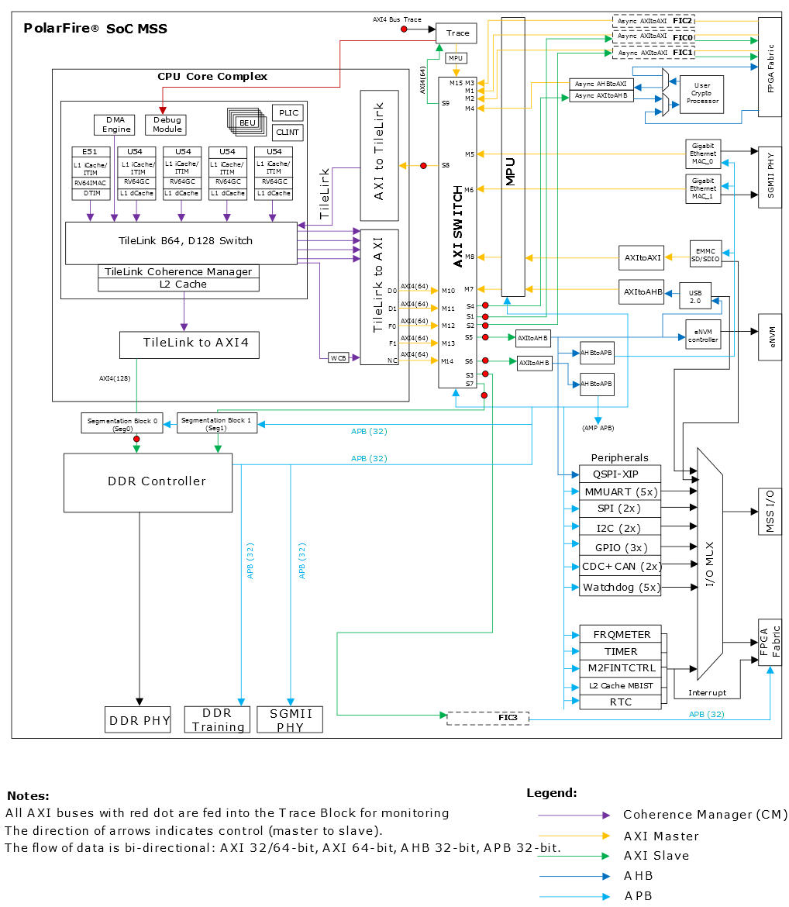

The theoretical maximum rate of a transfer is determined by the width of the bus
connecting a memory source and destination to the PDMA, and by the processor
clock rate.
The processor clock rate is set using the MSS Configurator.
The width of a given bus is an inherent property of the device (64b/128b in this
case) and cannot be modified.

The L2-LIM and L2-Scratchpad are both parts of the L2 Cache controller.
The Cache controller along with the platform DMA controller is located within
the CPU Core Complex, therefore the PDMA can access both LIM and Scratchpad via
the 128-bit TileLink bus.

Cached DDR is also accessible over the 128-bit TileLink bus
and a 128-bit AXI4 bus, via the DDR Controller.
Non-Cached DDR is accessible over the 128-bit TileLink bus and a 64-bit AXI4 bus.
The L2 Cache and AXI4 buses are clocked at a rate that is half the frequency of
the CPU cores,
using the default setting of the MSS Configurator which is 300MHz.

Please refer to the [PolarFire SoC Technical Reference Manual](https://onlinedocs.microchip.com/pr/GUID-0E320577-28E6-4365-9BB8-9E1416A0A6E4-en-US-4/index.html)
for further information on the PDMA.

Using the above figures, the theoretical performance of the PDMA when transferring
between each of the 4 memory locations can be calculated as follows:

- For transfers using the TileLink bus and 128-bit AXI4 bus: 128b/8 * 300MHz = 4800MB/s

- For transfers using the TileLink bus and the 64-bit AXI4 bus: 64b/8 * 300MHz =
  2400MB/s

The below table summarises the theoretical maximum performance for every
source and destination pair:

| Source\Destination | L2-LIM   | Scratchpad | Cached DDR | Non-Cached DDR |
| :----------------- | :------- | :--------- | :--------- | :------------- |
| L2-LIM             | 4800MB/s | 4800MB/s   | 4800MB/s   | 2400MB/s       |
| Scratchpad         | 4800MB/s | 4800MB/s   | 4800MB/s   | 2400MB/s       |
| Cached DDR         | 4800MB/s | 4800MB/s   | 4800MB/s   | 2400MB/s       |
| Non-Cached DDR     | 2400MB/s | 2400MB/s   | 2400MB/s   | 2400MB/s       |

## Results L2-LIM

### Source: L2-LIM, Destination: L2-LIM

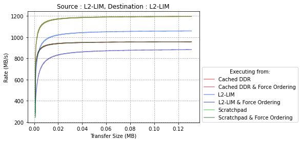

| Executing From:      | L2-LIM | Scratchpad | Cached DDR | L2-LIM + Force Order | Scratchpad + Force Order | Cached DDR + Force Order |
| :------------------- | :----- | :--------- | :--------- | :------------------- | :----------------------- | :----------------------- |
| Size (MB)            | 0.13   | 0.13       | 0.13       | 0.13                 | 0.13                     | 0.13                     |
| Rate (MB/s)          | 1059   | 1195       | 1195       | 883                  | 957                      | 957                      |
| % of Theoretical Max | 22%    | 25%        | 25%        | 18%                  | 20%                      | 20%                      |

### Source: L2-LIM, Destination: Scratchpad

| Executing From:      | L2-LIM | Scratchpad | Cached DDR | L2-LIM + Force Order | Scratchpad + Force Order | Cached DDR + Force Order |
| :------------------- | :----- | :--------- | :--------- | :------------------- | :----------------------- | :----------------------- |
| Size (MB)            | 0.26   | 0.26       | 0.26       | 0.26                 | 0.26                     | 0.26                     |
| Rate (MB/s)          | 2206   | 2384       | 2389       | 1366                 | 1524                     | 1530                     |
| % of Theoretical Max | 46%    | 50%        | 50%        | 28%                  | 32%                      | 32%                      |

### Source: L2-LIM, Destination: Cached DDR

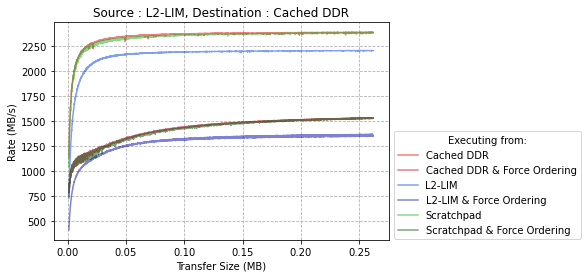

| Executing From:      | L2-LIM | Scratchpad | Cached DDR | L2-LIM + Force Order | Scratchpad + Force Order | Cached DDR + Force Order |
| :------------------- | :----- | :--------- | :--------- | :------------------- | :----------------------- | :----------------------- |
| Size (MB)            | 0.26   | 0.26       | 0.26       | 0.26                 | 0.26                     | 0.26                     |
| Rate (MB/s)          | 1921   | 2384       | 2389       | 1370                 | 1525                     | 1529                     |
| % of Theoretical Max | 46%    | 50%        | 50%        | 29%                  | 32%                      | 32%                      |

### Source: L2-LIM, Destination: Non-Cached DDR

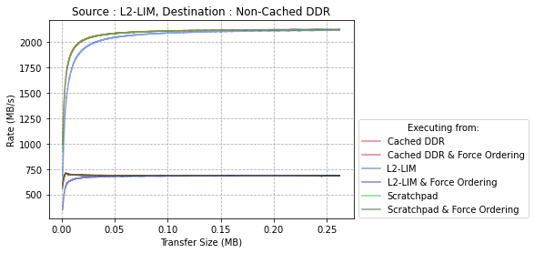

| Executing From:      | L2-LIM | Scratchpad | Cached DDR | L2-LIM + Force Order | Scratchpad + Force Order | Cached DDR + Force Order |
| :------------------- | :----- | :--------- | :--------- | :------------------- | :----------------------- | :----------------------- |
| Size (MB)            | 0.26   | 0.26       | 0.26       | 0.26                 | 0.26                     | 0.26                     |
| Rate (MB/s)          | 2115   | 2123       | 2123       | 684                  | 685                      | 686                      |
| % of Theoretical Max | 88%    | 88%        | 88%        | 29%                  | 29%                      | 29%                      |

## Results Scratchpad Memory

### Source: Scratchpad, Destination: L2-LIM

| Executing From:      | L2-LIM | Scratchpad | Cached DDR | L2-LIM + Force Order | Scratchpad + Force Order | Cached DDR + Force Order |
| :------------------- | :----- | :--------- | :--------- | :------------------- | :----------------------- | :----------------------- |
| Size (MB)            | 0.26   | 0.26       | 0.26       | 0.26                 | 0.26                     | 0.26                     |
| Rate (MB/s)          | 2124   | 2382       | 2382       | 970                  | 1008                     | 1009                     |
| % of Theoretical Max | 44%    | 50%        | 50%        | 20%                  | 21%                      | 21%                      |

### Source: Scratchpad, Destination: Scratchpad

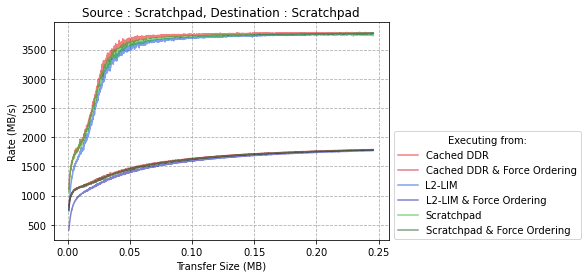

| Executing From:      | L2-LIM | Scratchpad | Cached DDR | L2-LIM + Force Order | Scratchpad + Force Order | Cached DDR + Force Order |
| :------------------- | :----- | :--------- | :--------- | :------------------- | :----------------------- | :----------------------- |
| Size (MB)            | 0.26   | 0.26       | 0.26       | 0.26                 | 0.26                     | 0.26                     |
| Rate (MB/s)          | 3777   | 3753       | 3761       | 1771                 | 1784                     | 1786                     |
| % of Theoretical Max | 79%    | 78%        | 78%        | 36%                  | 37%                      | 37%                      |

### Source: Scratchpad, Destination: Cached DDR

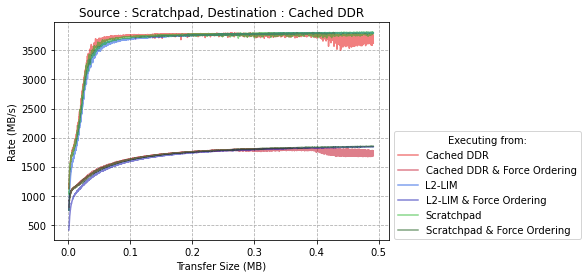

| Executing From:      | L2-LIM | Scratchpad | Cached DDR | L2-LIM + Force Order | Scratchpad + Force Order | Cached DDR + Force Order |
| :------------------- | :----- | :--------- | :--------- | :------------------- | :----------------------- | :----------------------- |
| Size (MB)            | 0.5    | 0.5        | 0.5        | 0.5                  | 0.5                      | 0.5                      |
| Rate (MB/s)          | 3744   | 3785       | 3799       | 1841                 | 1850                     | 1786                     |
| % of Theoretical Max | 78%    | 79%        | 79%        | 38%                  | 39%                      | 37%                      |

### Source: Scratchpad, Destination: Non-Cached DDR

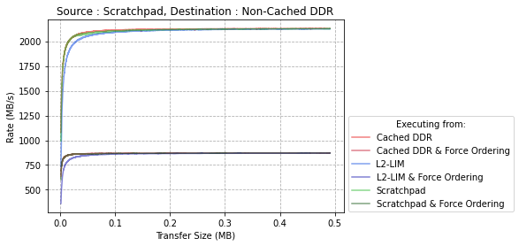

| Executing From:      | L2-LIM | Scratchpad | Cached DDR | L2-LIM + Force Order | Scratchpad + Force Order | Cached DDR + Force Order |
| :------------------- | :----- | :--------- | :--------- | :------------------- | :----------------------- | :----------------------- |
| Size (MB)            | 0.5    | 0.5        | 0.5        | 0.5                  | 0.5                      | 0.5                      |
| Rate (MB/s)          | 2103   | 2120       | 2120       | 868                  | 870                      | 872                      |
| % of Theoretical Max | 88%    | 88%        | 88%        | 36%                  | 36%                      | 36%                      |

## Results Cached DDR

### Source: Cached DDR, Destination: L2-LIM

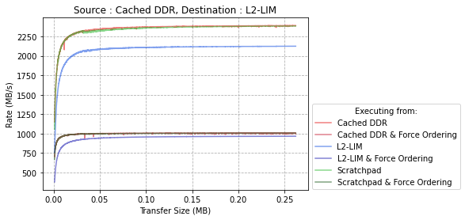

| Executing From:      | L2-LIM | Scratchpad | Cached DDR | L2-LIM + Force Order | Scratchpad + Force Order | Cached DDR + Force Order |
| :------------------- | :----- | :--------- | :--------- | :------------------- | :----------------------- | :----------------------- |
| Size (MB)            | 0.26   | 0.26       | 0.26       | 0.26                 | 0.26                     | 0.26                     |
| Rate (MB/s)          | 2124   | 2383       | 2389       | 966                  | 1008                     | 1008                     |
| % of Theoretical Max | 44%    | 50%        | 50%        | 20%                  | 21%                      | 21%                      |

### Source: Cached DDR, Destination: Scratchpad

| Executing From:      | L2-LIM | Scratchpad | Cached DDR | L2-LIM + Force Order | Scratchpad + Force Order | Cached DDR + Force Order |
| :------------------- | :----- | :--------- | :--------- | :------------------- | :----------------------- | :----------------------- |
| Size (MB)            | 0.5    | 0.5        | 0.5        | 0.5                  | 0.5                      | 0.5                      |
| Rate (MB/s)          | 3805   | 3805       | 3808       | 1842                 | 1850                     | 1802                     |
| % of Theoretical Max | 79%    | 79%        | 79%        | 39%                  | 38%                      | 37%                      |

### Source: Cached DDR, Destination: Cached DDR

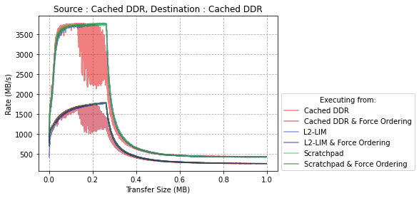

The drop off in performance that occurs in the above graph at &#8776; 0.256MB is
due to the L2 cache becoming full.
This is because the PDMA can transfer data to the cache faster than the cache is
able to write data to DDR memory.

The L2 Cache configuration used in this application has 0.512MB of space available
to be used by Cached DDR.
In the case of this benchmark Cached DDR is being used as both the source and destination,
therefore twice the space is required for each transfer, causing the cache to become
full at &#8776; 0.256MB.
Whereas in the [Cached DDR to Non-Cached DDR](#source-cached-ddr-destination-non-cached-ddr),
and [Non-Cached DDR to Cached DDR](#source-non-cached-ddr-destination-cached-ddr)
benchmarks the entire cache is used only as either the source or the destination,
as such the performance begins to degrade at &#8776; 0.512MB.

For a full discussion of the impact of the L2-Cache configuration on the performance
of Cached DDR see the following section, [Appendix 1: Impact on L2 Cache configuration](#appendix-1-impact-on-l2-cache-configuration).

| Executing From:      | L2-LIM | Scratchpad | Cached DDR | L2-LIM + Force Order | Scratchpad + Force Order | Cached DDR + Force Order |
| :------------------- | ------ | :--------- | :--------- | -------------------- | :----------------------- | :----------------------- |
| Size (MB)            | 1      | 1          | 1          | 1                    | 1                        | 1                        |
| Rate (MB/s)          | 3780   | 3790       | 3786       | 1779                 | 1793                     | 1732                     |
| % of Theoretical Max | 79%    | 79%        | 79%        | 37%                  | 37%                      | 36%                      |

### Source: Cached DDR, Destination: Non-Cached DDR

The drop off in performance at &#8776; 0.512MB is due to the cache becoming full,
as the PDMA can transfer data faster than the cache can clear data from DDR memory.
More cache space can be allocated to the L2-Cache using the MSS Configurator.

For a full discussion of the impact of the L2-Cache configuration on the performance
of Cached DDR see the following section, [Appendix 1: Impact on L2 Cache configuration](#appendix-1-impact-on-l2-cache-configuration).

| Executing From:      | L2-LIM | Scratchpad | Cached DDR | L2-LIM  Force Order | Scratchpad + Force Order | Cached DDR + Force Order |
| :------------------- | :----- | :--------- | :--------- | :------------------ | :----------------------- | :----------------------- |
| Size (MB)            | 1      | 1          | 1          | 1                   | 1                        | 1                        |
| Rate (MB/s)          | 2125   | 2127       | 2123       | 870                 | 871                      | 871                      |
| % of Theoretical Max | 89%    | 89%        | 88%        | 36%                 | 36%                      | 36%                      |

## Results Non-Cached DDR

### Source: Non-Cached DDR, Destination: L2-LIM

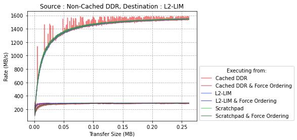

| Executing From:      | L2-LIM | Scratchpad | Cached DDR | L2-LIM + Force Order | Scratchpad + Force Order | Cached DDR + Force Order |
| :------------------- | :----- | :--------- | :--------- | :------------------- | :----------------------- | :----------------------- |
| Size (MB)            | 0.26   | 0.26       | 0.26       | 0.26                 | 0.26                     | 0.26                     |
| Rate (MB/s)          | 1565   | 1576       | 1587       | 294                  | 293                      | 293                      |
| % of Theoretical Max | 65%    | 65%        | 65%        | 12%                  | 12%                      | 12%                      |

### Source: Non-Cached DDR, Destination: Scratchpad

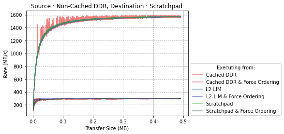

| Executing From:      | L2-LIM | Scratchpad | Cached DDR | L2-LIM + Force Order | Scratchpad + Force Order | Cached DDR + Force Order |
| :------------------- | :----- | :--------- | :--------- | :------------------- | :----------------------- | :----------------------- |
| Size (MB)            | 0.5    | 0.5        | 0.5        | 0.5                  | 0.5                      | 0.5                      |
| Rate (MB/s)          | 1586   | 1594       | 1584       | 294                  | 293                      | 293                      |
| % of Theoretical Max | 66%    | 66%        | 66%        | 12%                  | 12%                      | 12%                      |

### Source: Non-Cached DDR, Destination: Cached DDR

The drop off in performance at &#8776; 0.512MB is due to the cache becoming full,
as the PDMA can transfer data to the cache faster than the cache can write data to
DDR memory. More cache space can be allocated to the L2-Cache using the MSS Configurator.
For a full discussion of the impact of the L2-Cache configuration on the performance
of Cached DDR see the following section, [Appendix 1: Impact on L2 Cache configuration](#appendix-1-impact-on-l2-cache-configuration).

| Executing From:      | L2-LIM | Scratchpad | Cached DDR | L2-LIM + Force Order | Scratchpad + Force Order | Cached DDR + Force Order |
| :------------------- | :----- | :--------- | :--------- | :------------------- | :----------------------- | :----------------------- |
| Size (MB)            | 1      | 1          | 1          | 1                    | 1                        | 1                        |
| Rate (MB/s)          | 1585   | 1580       | 1587       | 295                  | 294                      | 281                      |
| % of Theoretical Max | 66%    | 66%        | 66%        | 12%                  | 12%                      | 12%                      |

### Source: Non-Cached DDR, Destination: Non-Cached DDR

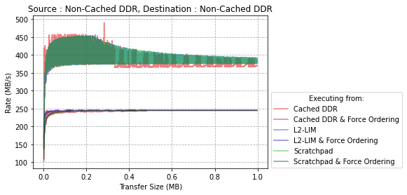

| Executing From:      | L2-LIM | Scratchpad | Cached DDR | L2-LIM + Force Order | Scratchpad + Force Order | Cached DDR + Force Order |
| :------------------- | :----- | :--------- | :--------- | :------------------- | :----------------------- | :----------------------- |
| Size (MB)            | 1      | 1          | 1          | 1                    | 1                        | 1                        |
| Rate (MB/s)          | 453    | 453        | 459        | 245                  | 246                      | 246                      |
| % of Theoretical Max | 19%    | 19%        | 19%        | 10%                  | 10%                      | 10%                      |

## Appendix 1: Impact on L2 Cache configuration

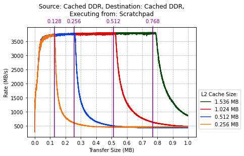

The above figure graphs the performance of the PDMA when transferring data to Cached
DDR for 4 different configurations of the L2 Cache.

For all of the above transfers Cached DDR is used as both the transfer source and
destination, as such the cache memory available for each is half the total size of
L2 Cache.

The drop off in performance of PDMA transfers occur when the available L2 Cache
memory fills up.
The cache becomes full because the PDMA can transfer data to the cache  faster than
the data in the cache can be written to DDR memory.

The performance begins to degrade once the data being transferred is &#8776; 102%
the size of the available cache space. In the above figure, this is most apparent
with larger cache configurations of 1.536 MB and 1.024 MB.

The L2 Cache can be configured to change how much space is allocated to each of
L2 LIM, Scratchpad Memory or L2 Cache, which is the cache used for the Cached DDR.
The default L2 Cache configuration for this project, has 4 cache ways of 0.128 MB
each, totalling 0.512 MB allocated for use as L2 Cache. The remainder is allocated
between Scratchpad and LIM memory.
In all the L2-Cache is made up of 16 cache ways, totalling 2.048MB of cached memory.

To modify the L2-Cache configuration edit the MSS configuration file that is included
with the application, in the `src/boards/icicle-kit-es/mss_configuration` folder.
