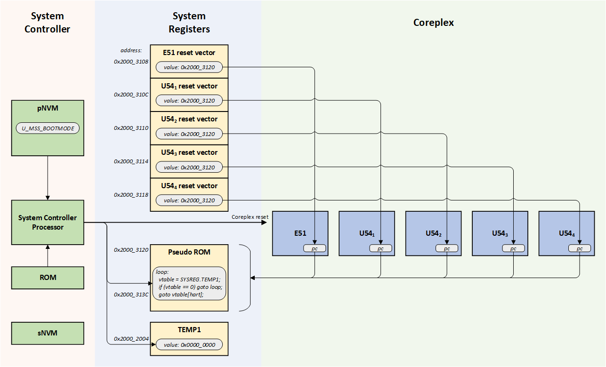

# PolarFire SoC Boot Mode 0 Fundamentals

## Overview
PolarFire SoC boot mode 0 is used by blank devices or when debugging embedded software where code should not be executed on power up. Boot mode 0 puts the MSS in a mode where all harts execute a loop waiting for the debugger to connect through JTAG or for the device to be  programmed.

Blank devices use boot mode 0. Boot mode 0 can also be useful when debugging low level software through JTAG in order to prevent the system state from being modified between the system being powered up and the debug session starting.

## Boot Mode 0 Sequence
On power up, the PolarFire SoC System Controller starts up and holds the MSS in reset until it has completed configuring the device. It executes ROM code which configures the Core Complex based on configuration data structures stored in its private Non-Volatile Memory (pNVM).

In boot mode 0, the System Controller only uses the U_MSS_BOOTMODE configuration item stored in pNVM to control the Core Complex boot process: The U_MSS_BOOTMODE configuration item determines whether boot mode 0, 1, 2 or 3 is used.

The boot mode 0 sequence is as follows:

1.  Registers have the following reset values:
    - Pseudo BOOTROM system registers is a code loop.
    - System registers' reset vectors point to the base address of the pseudo BOOTROM
    - TEMP1 system register is zero.
 2. The System Controller releases the Core Complex reset causing all harts to execute the code found in the pseudo BOOTROM system registers.
     - The loop will keep executing until the content of the TEMP1 system register remains set to zero.

 

The Core Complex harts will remain executing the pseudo BOOTROM loop until the debugger sets the hart's program counters to new values.

Notes:

- The System Controller's pNVM content can only be modified through a programming bitstream. Neither pNVM nor sNVM content are directly accessible from the Core Complex.
- The MSS/Core Complex default clock configuration is 80MHz using the SCB clock source.
