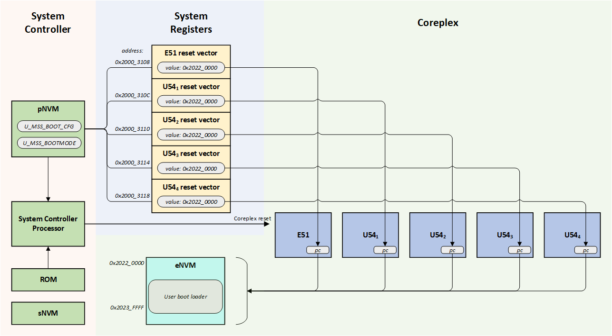

# PolarFire SoC Boot Mode 1

## Overview
PolarFire SoC boot mode 1 is used where the Microprocessor Subsystem (MSS) harts start executing code from eNVM.

## Boot Mode 1 Sequence
The PolarFire SoC System Controller executes first before the Coreplex harts when the device comes out of power-on reset. 

The System Controller configures the PolarFire SoC device before releasing the Coreplex out of reset. It executes ROM code which configures the CoreComplex based on configuration data structures stored in its Private Non-Volatile Memory (pNVM).

In boot mode 1, the System Controller uses:

- U_MSS_BOOT_MODE: determines whether boot mode 0, 1, 2 or 3 is used.
- U_MSS_BOOT_CFG: contains boot configuration specific to the requested boot mode. In the case of boot mode 1, it contains the reset vectors for all 5 harts.

For boot mode 1, the System Controller:

- Sets the content of the System Registers' reset vector register from the values found in U_MSS_BOOT_CFG configuration data structure held in pNVM.
- Releases the Coreplex reset causing all harts to execute the code found in eNVM. 

 

Please note that the System Controller's pNVM and sNVM content can only be modified through a programming bitstream. Neither pNVM nor sNVM content is directly accessible from the Coreplex.
