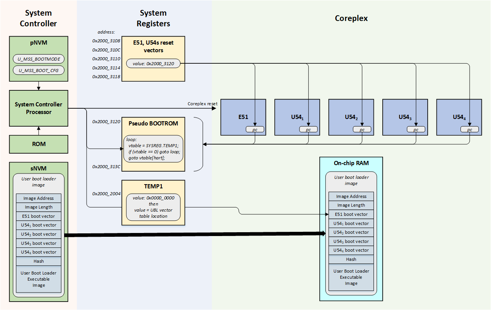

# PolarFire SoC Boot Mode 2 Fundamentals

## Overview
PolarFire SoC boot mode 2 is intended for implementing user-defined secure boot authentication.

## Boot Mode 2 Sequence
The PolarFire SoC System Controller executes first before the Coreplex harts when the device comes out of power-on reset. 

The System Controller configures the PolarFire SoC device before releasing the Coreplex out of reset. It executes ROM code which configures the CoreComplex based on configuration data structures stored in its private Non-Volatile Memory (pNVM).

In boot mode 2, the System Controller uses:

- U_MSS_BOOT_MODE: determines whether boot mode 0, 1, 2 or 3 is used.
- U_MSS_BOOT_CFG: contains boot configuration specific to the requested boot mode. In the case of boot mode 2, it contains the page offset at which the user boot loader image is secure non volatile memory.

The mode 2 boot sequence is as follows:

- The reset value of the pseudo BOOTROM system registers is a code loop.
- The reset value of the system registers' reset vectors point to the base address of the pseudo BOOTROM
- The reset value of the TEMP1 system register is zero.
- The System Controller releases the Coreplex reset causing all harts to execute the code found in the pseudo BOOTROM system registers. The loop will keep executing until the content of the TEMP1 system register remains set to zero.
- The System Controller copies the User Boot Loader (UBL) image from sNVM to on-chip RAM:
	- The location of the UBL image in sNVM is specified in the U_MSS_BOOT_CFG
	- The target address where the UBL is to be copied within on-chip RAM is found at the top of the UBL image. The length to copy is also found at the top of the UBL image
- The System Controller sets the value of the TEMP1 System Register to the address of the UBL vector table within on-chip RAM. This results in the Coreplex harts executing the user boot loader.

The user boot loader typically authenticates the content of the eNVM before executing it.

 

Notes:

- The sNVM used to store the user boot loader must be marked as ROM in order to avoid it being modified by anything other than a suitable programming bitstream.
- The device will boot in mode 0 and set the boot_fail tamper flag if the boot configuration data is invalid . Validity of the boot configuration data is checked through a digest check performed by the System Controller. Likewise, the device will remain in boot mode 0 if the recomputed hash of the user bootloader executable does not match the hash valid found before the UBL executable image.
