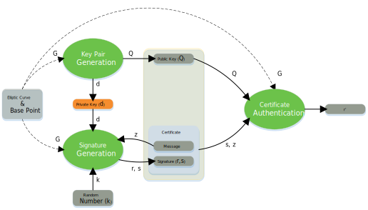
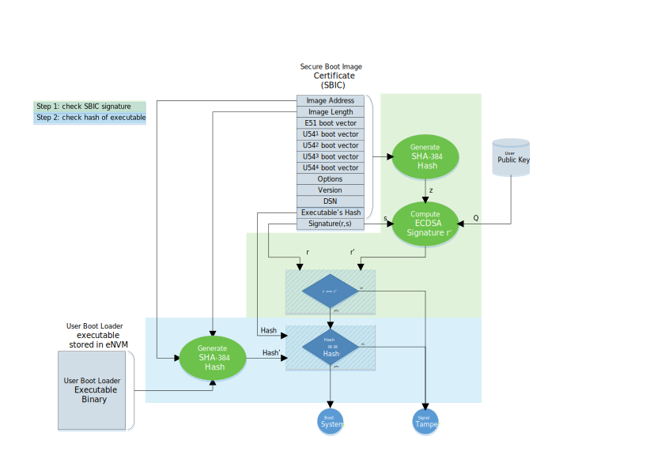
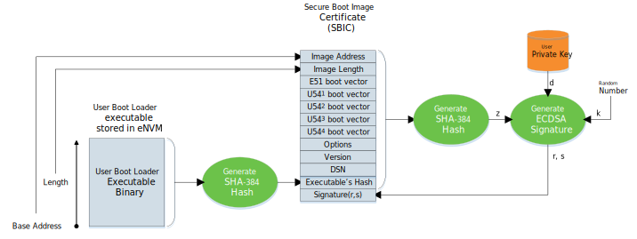

#PolarFire SoC Boot Mode 3 Fundamentals

##Overview
Secure boot mode 3 uses the Elliptic Curve Digital Signature Algorithm (ECDSA) to authenticate the signature of a Secure Boot Image Certificate (SBIC) as part of booting the system. The PolarFire SoC RISC-V monitor and application processors will not be started and a tamper signaled to the FPGA fabric if authentication fails.

Secure boot mode 3 only supports authentication of the eNVM content. No encryption/decryption of the eNVM content is used.

## Elliptic Curve Digital Signature Algorithm (ECDSA) Refresher
>Warning: This is intended to be a very high level algorithm overview of ECDSA. It glosses over some of the finer details and conveniently ignores some of the mathematical properties required of the various actors in this play.

The Elliptic Curve Digital Signature Algorithm (ECDSA) is used to sign and authenticate certificates. It uses elliptic curve point multiplication by a scalar number as a one-way function, which is in practice impossible to reverse, to generate asymmetric key pairs and authenticate messages.
The diagram below illustrates how difficult it would be to retrieve the scalar value used in the point multiplication to generate points P and Q from base point G. Such a scalar value is used, among other things, as a private key in the ECDSA.

 

ECDSA is used to generate a certificate containing a signature for a message using a private key. The associated public key is then used to authenticate the content of the certificate to check that the message has not been tampered with.

All ECDSA steps are performed using a publicly agreed elliptic curve and base point (G) on that curve suitable for this purpose. The base point (G) is used to generate other points on the curve through point multiplication to generate keys and check signatures.

 

| Parameter | Description |
| --- | --- |
| curve | Agreed elliptic curve used for signing and authenticating messages. |
| G| Base point on the curve. Used to generate other points on the curve though point multiplication. The value of the base point is known to both the signing and authenticating sides. |
| d | Private key. This is a large integer used in elliptic curve scalar point multiplications. The private key is only known by the signing side. |
| Q | Public key. This is a point on the elliptic curve. It is known to both signing and authenticating sides. |
| k | Secret random number used to generate the certificate's signature. The value of this random number is only known by the the signing side.|
| z | Hash of the message being signed. |
| r | Part of the signature included in the certificate. |
| s | Part of the signature included in the certificate used to reconstruct r'. |
| r' | Value computed from the message's hash during authentication. Should match the signature's r value for authentication to be successful. |

###Key Pair Generation
>Note about mathematical notation: This document uses "." for scalar multiplication and "*" for elliptic curve point multiplication.
	
The signing side generates a private/public key pair by randomly selecting a number (d) within the order of the agreed upon elliptic curve. The private key (d) is then used in an elliptic curve point multiplication with the base point (G) to produce the public key (Q): Q = d * G.
The private key is a scalar number. The public key is a point on the curve.

###Signature Generation
The ECDSA signature is generated using a secret random number (k). This random number is only known by the signing side. It must be changed every time a new signature is generated to prevent an attacker from retrieving sufficient data to reconstruct the signing private key.

The ECDSA signature is made up of two scalar values (integers): (r) and (s). The value of (r) is the x-axis of the point on the curve computed by point multiplication of the base point (G) by the secret random number (k):

*(x,y) = k * G*
*r = x*

The (s) part fo the signature is computed using the hash (z) of the message to sign, the private key (d) and the secret random number (k):

*z = hash of message*
*s = (z + r.d)k ^-1^*

The (s) part of the signature is designed such that it can be used to reconstruct the value of (r) using the public key (Q) and the hash of the message (z).

###Certificate Authentication
The certificate authentication is performed using the agreed curve and base point (G) by computing the signature check value (r') from the hash of the message (z), the (s) part of the signature and the public key (Q) using the following equations:

*u~1~ = z.s^-1^*
*u~2 ~= r.s^-1^*
*(x, y) = (u~1~ * G) + (u~2~ * Q)*
*r' = x*

The authentication is successful if the computed value (r') matches the (r) value of the certificate's signature.

The magic of ECDSA is the ability of the authenticating side to recompute the same point (P) on the curve using the hash of the message (z), the signature (s) and the public key as the signing side using the random number (k) and the curve's base point (G).

*(x,y) = (u~1~ * G) + (u~2~ * Q) = k * G*

Please refer to the [ECDSA Wikipedia page](https://en.wikipedia.org/wiki/Elliptic_Curve_Digital_Signature_Algorithm) for a more detailed explanation of the correctness of the algorithm.

## Checking The Secure Boot Image Certificate
Secure boot mode 3 uses the Elliptic Curve Digital Signature Algorithm (ECDSA) to sign a Secure Boot Image Certificate (SBIC). The SBIC is stored in eNVM alongside the executable being booted. The SBIC is authenticated at system boot time. The boot process is stopped and a tamper signal is asserted to the FPGA fabric if the SBIC authentication fails.

Two optional checks can be done by the system controller before authenticating the SBIC:

- An optional check of the Device Serial Number (DSN) is done if the SBIC's DSN field is non-zero. This option can be used to bind the SBIC to a specific individual PolarFire SoC device.
- An optional certificate revocation check is done if the SBIC's Version field is non-zero. The value of the SBIC's Version field is compared against a revocation threshold value. The system will only boot if the SBIC's Version is greater or equal to the revocation threshold. The revocation threshold is programmed as part of a bitstream. This option can prevent old valid certificates from being used.

The actual ECDSA signature authentication is orchestrated by the system controller if the above optional checks were successful. The authenticxation is done in two steps:

- The System Controller verifies the SBIC signature using the ECDSA algorithm. It uses the (s) part of the signature, the user private key and the hash of the SBIC content to compute (r'). The SBIC is authenticated if the computed (r') value is equal to thge (r) part of the SBIC's signature.
- If the SBIC signature authentication is successful, the hash of the User Boot Loader is computed and compared against the hash contained in the SBIC. The computed hash matching the SBIC's hash field indicates that the USer Boot Loader has not been tampered with and can be executed.

 

The System Controller causes the RISC-V harts to jump the addresses defined in the SBIC's boot vector fields when authentication is successful. The System Controller signals a tamper to the FPGA fabric and the User Boot Loader is not executed if any authentication step fails

##Generating The Secure Boot Image Certificate
The Secure Boot Image Certificate (SBIC) is constructed to contain information allowing to authenticate a User Boot Loader (UBL) located in eNVM. The SBIC contains the address in eNVM and length in bytes of the of the User Boot Loader alongside the hash value of the UBL's binary.

The SBIC also contains the boot vector addresses from which each PolarFire SoC RISC-V hart will execute from upon successful authentication of the certificate. It also contains options to bind itself to an individual PolarFire SoC device using the device's Device Serial Number (DSN), and the option to revoke the SBIC based on the SBIC's Version field.

 

Two distinct SHA-384 hash values are used to authenticate the User Boot Loader:

- The SBIC includes a SHA-384 hash of the User Boot Loader executable binary contained in eNVM.
- A SHA-384 hash (z)  of the SBIC content, except the signature, is used to sign the certificate.

The signature is generated from the SBIC's hash (z), the user private key and a random number using the ECDSA algorithm. The generated signature is made up of two parts (r) and (s). Signature part (s) is used during the signature check to recompute the (r) part of the signature using the hash (z) of the SBIC content and the public key (Q). Authentication succeeds if the recomputed (r') matches the (r) part of the SBIC's signature.

>Note: Private key management is not covered by this document. A solution for private key management will be provided at a later date.

