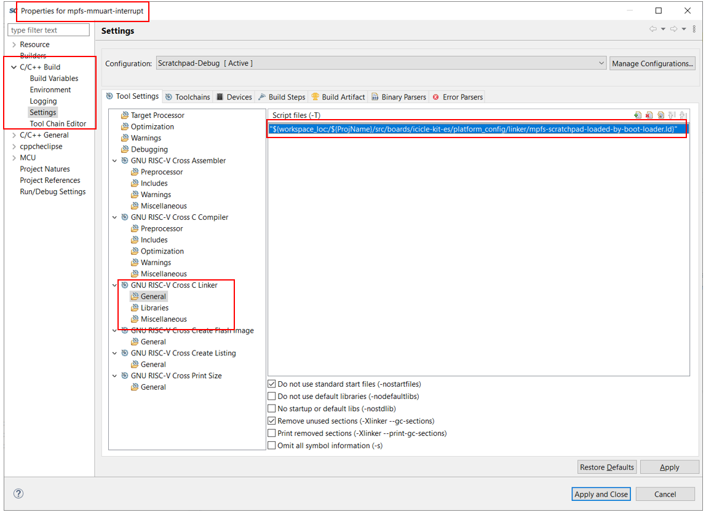
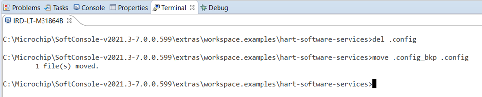
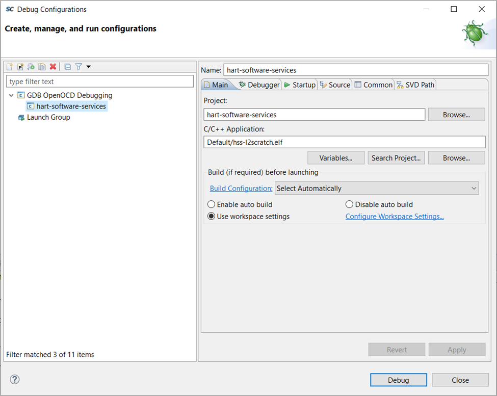

# Debugging Bare Metal Applications From L2 scratchpad

## Table of Contents

- [Debugging Bare Metal Applications From L2 scratchpad](#debugging-bare-metal-applications-from-l2-scratchpad)
  - [Table of Contents](#table-of-contents)
  - [Introduction](#introduction)
    - [Methodology](#methodology)
    - [The HSS](#the-hss)
      - [HSS startup](#hss-startup)
  - [Configuring a reduced HSS to set up the L2 scratchpad](#configuring-a-reduced-hss-to-set-up-the-l2-scratchpad)
    - [Using SoftConsole to configure a reduced HSS](#using-softconsole-to-configure-a-reduced-hss)
    - [Using the command line to configure a reduced HSS](#using-the-command-line-to-configure-a-reduced-hss)
  - [Configuring a bare metal application to execute from L2 scratchpad](#configuring-a-bare-metal-application-to-execute-from-l2-scratchpad)
    - [Creating a custom linker script for L2 scratchpad applications](#creating-a-custom-linker-script-for-l2-scratchpad-applications)
  - [Debugging bare metal applications executing from L2 scratchpad](#debugging-bare-metal-applications-executing-from-l2-scratchpad)
    - [Debugging a bare metal application executing from L2 scratchpad](#debugging-a-bare-metal-application-executing-from-l2-scratchpad)
      - [Creating an L2 scratchpad debug configuration](#creating-an-l2-scratchpad-debug-configuration)
      - [Starting the debug session](#starting-the-debug-session)
    - [Debugging the hss-l2scratch.elf using SoftConsole](#debugging-the-hss-l2scratchelf-using-softconsole)
    - [Debugging the hss-l2scratch.elf using the command line](#debugging-the-hss-l2scratchelf-using-the-command-line)

<a name="Introduction"></a>
## Introduction

Debugging of bare metal applications that target the L2 scratchpad on
PolarFire&reg; SoC is possible, although, the scratchpad does need to be
configured before starting a debug session. This guide will outline the
recommended method of configuring the scratchpad before starting a debug session
and outline the steps to debug the HSS and any bare metal application designed
to target the scratchpad.

The easiest way to initialize the scratchpad is using a reduced HSS stored in
eNVM which configures the scratchpad on boot and then goes into a while loop.

Once the reduced HSS has entered its while loop a debug session can be started and the
bare metal binary to be debugged can be loaded into the configured
scratchpad. If the application being debugged will train the DDR during its
start up then DDR training is not required in the reduced HSS. It is
possible to modify the HSS to not train DDR, and not progress to booting, using
the HSS Kconfig options `CONFIG_SKIP_DDR` and `CONFIG_SERVICE_BOOT`. If DDR is
required by the bare metal software and it expects DDR to be confgured for it
when it starts running then DDR training is required in the reduced HSS.

<a name="Methodology"></a>
### Methodology

The following methodology is used to debug an application from the L2 scratchpad
memory:

1. Build a version of the Hart Software Services to configure the L2
  scratchpad but not boot

2. Program the modified HSS to eNVM and start up

3. Build the bare metal application under test in a "Loaded by bootloader
  configuration" so it performs no system configuration on startup

4. Download the application to be debugged to the L2 scratchpad using the
  debugger without resetting the target

5. Debug as normal

<a name="The-HSS"></a>
### The HSS

The HSS is built in two parts:

- `hss-l2scratch.elf`, which contains the run-time HSS code itself
- `hss-envm-wrapper.hex`, which includes a small decompressor, and the
   `hss-l2scratch.elf` converted to a binary and compressed using DEFLATE.

It is possible to debug and step through the `hss-l2scratch.elf` using the
methodology in this document.

<a name="HSS-startup"></a>
#### HSS startup

The HSS code resides in eNVM, but its code size is too large so it needs to be
compressed to do so. The HSS is built with the MSS configurator XML to divide
the L2 area up as appropriate into L2 scratchpad, LIM, and L2-cache.

A small decompressor at the front of eNVM sets up L2 scratchpad as required,
copies across the HSS image, and executes this decompressed image. This is all
orchestrated from `envm-wrapper/envm-wrapper_crt.S`.

There are two main reasons that we run from L2 scratchpad and not LIM:

- Scratchpad supports Atomic instructions, which OpenSBI uses to sequence
  booting

- Scratchpad is slightly faster than LIM

<a name="Configuring-a-reduced-HSS-to-set-up-the-L2-scratchpad"></a>
## Configuring a reduced HSS to set up the L2 scratchpad

<a name="Using-SoftConsole-to-configure-a-reduced-HSS"></a>
### Using SoftConsole to configure a reduced HSS

Make sure to clean, build and program the modified HSS to the eNVM

1. Rename an existing `.config` file from the top level HSS project directory
    (if present) so there is a backup of the existing configuration (if the
    standard HSS configuration is being built this step can be skipped). This
    can be done using the terminal view in SoftConsole using the `move`
    command on Windows or `mv` on Linux:

    

2. Copy the `def_config` from the boards/*target* directory to the top level
    HSS project directory (note *target* should be replaced with the actual target,
    e.g *mpfs-icicle-kit-es*). Modify the following:

    Ensure that `CONFIG_SKIP_DDR=y` is present. Also ensure that
    `CONFIG_BOOT_SERVICE=y` is not present, and instead there is a line that
    explicitly mentions `# CONFIG_SERVICE_BOOT` is not set, for example:

    ```ruby
    # CONFIG_SKIP_DDR is not set
    CONFIG_SERVICE_BOOT=y
    ```

    There should be no other mentions of either `CONFIG_SKIP_DDR` or
    `CONFIG_SERVICE_BOOT` in the `.config file` at this point.
     The modifications are shown below:

    

3. If the GUI configuration was not used rename `def_config` to `.config` by
  right clicking on `def_config` and selecting rename

4. If an application is being debugged from the L2 scratchpad that is not the
  HSS, for example a payload intended to be booted by the HSS, updated XML will
  need to be generated using the MSS configurator to allocate more than the
  default 512k of the L2 to the scratchpad.

5. Import the updated XML to the boards/*target*/soc_fpga_design/xml
  directory. Ensure the updated XML name matches the XML used in the `.config`
  file.

6. Right click on the hart-software-services project folder and select
  `Clean Project`

7. Build the HSS using the `Default` build configuration

    

8. Program the HSS to the eNVM using the SoftConsole `PolarFire SoC program
  non-secure boot mode 1` external tool configuration

    

    When configured like this, the HSS will start running from eNVM on a power-cycle
    or reset, setup L2 Scratch, jump to its runtime code but then idle.

    

    At this point, as long as the SoC isn’t reset or power-cycled, it is possible
    to attach a debugger and download an ELF that targets L2 scratchpad, and to
    natively debug from it (set/remove breakpoints, step, run, etc.).

<a name="Using-the-command-line-to-configure-a-reduced-HSS"></a>
### Using the command line to configure a reduced HSS

In the `.config file`, ensure that `CONFIG_SKIP_DDR=y` is present. Also ensure
that `CONFIG_BOOT_SERVICE=y` is not present, and instead there is a line that
explicitly mentions `# CONFIG_SERVICE_BOOT is not set`, for example:

```ruby
CONFIG_SKIP_DDR=y
# CONFIG_SERVICE_BOOT is not set
```

There should be no other mentions of either `CONFIG_SKIP_DDR` or
`CONFIG_SERVICE_BOOT` in the `.config` file at this point.

If an application is being debugged from the L2 scratchpad that is not the
HSS, for example a payload intended to be booted by the HSS, updated XML will
need to be generated using the MSS configurator to allocate more than the
default 512k of the L2 to the scratchpad. Import the updated XML to the
boards/*target*/soc_fpga_design/xml directory. Ensure the updated XML name
matches the XML used in the `.config` file.

Make sure to clean, build and program the modified HSS to the eNVM:

```ruby
$ make clean
$ make
$ make program
```

When configured like this, the HSS will start running from eNVM on a power-cycle
 or reset, setup L2 Scratch, jump to its runtime code but then idle.


At this point, as long as the SoC isn’t reset or power-cycled, it is possible
to attach a debugger and download an ELF that targets L2 scratchpad, and to
natively debug from it (set/remove breakpoints, step, run, etc.)

<a name="Configuring-a-bare-metal-application-to-execute-from-L2-scratchpad"></a>
## Configuring a bare metal application to execute from L2 scratchpad

If the HSS is being debugged from L2 scratchpad these steps do not need to be
followed. Please skip to the
[Debugging a bare metal application executing from L2 scratchpad](#Debugging-a-bare-metal-application-executing-from-L2-scratchpad) section if debugging the HSS. These
steps only need to be followed if a bare metal application is being reconfigured
to run from the L2 scratchpad.

No default linker script is supplied to debug or run from the L2 scratchpad. To
debug or run code from this location:

1. It is assumed that the reduced HSS will be used to pre-configure the system

2. A custom linker script will be created to ensure that the bare metal
    application does not conflict with the memory used by the HSS. I.e the HSS
    occupies the first 512K of L2 scratchpad, targeting a bare metal application
    will overwrite the HSS memory and would fail to boot if used as a payload.

<a name="Creating-a-custom-linker-script-for-L2-scratchpad-applications"></a>
### Creating a custom linker script for L2 scratchpad applications

It is recommended that the linker script to target L2 scratchpad is based off
the `mpfs-ddr-loaded-by-boot-loader.ld` linker script provided with the MPFS
HAL. To modify this linker script to target the L2 scratchpad:

1. Create a copy of the `mpfs-ddr-loaded-by-boot-loader.ld` linker script
  named `mpfs-scratchpad-loaded-by-boot-loader.ld`

2. Update the `scratchpad(rwx)    : ORIGIN = 0x0A000000, LENGTH = 256k` field.

    a. Ensure the `ORIGIN` value is set to an appropriate start address that it0
      doesn't conflict with the HSS. By default the HSS reserves 512K of L2 scratchpad
      so `ORIGIN = 0x0A040000` would be acceptable.

    b. The `LENGTH` field should also be updated to reflect the amount of L2
      scratchpad memory available to the application. For example if a total L2
      scratchpad size of 640K was configured, 128K would be available to the
      application so `LENGTH = 128K` would be acceptable.

3. In this linker script replace any entries locating code in
  `ddr_cached_32bit` with `scratchpad`

    I.e all:

    ```ruby
    } > ddr_cached_32bit
    ```

    entries should become:

    ```ruby
    } > scratchpad
    ```

4. In the:

    `Project properties -> C/C++ Build -> Settings`

    view select `Manage Configurations` and then `New...` to create a new build
    configuration.

    

5. Name the build configuration `Scratchpad-Debug` (or an appropriate name) and
   provide a description. Copy the build settings from the existing
   `DDR-Release` build configuration.

    

6. In the:

    `Project properties -> C/C++ Build -> Settings` -> `Tool Settings -> GNU RISC-V
    Cross C Linker -> General`

    view, ensure the `Scratchpad-Debug` build configuration is chosen and update
    the chosen linker script to point to the
    `mpfs-scratchpad-loaded-by-boot-loader.ld` linker script created in step 1.

    

<a name="Debugging-bare-metal-applications-executing-from-L2-scratchpad"></a>
## Debugging bare metal applications executing from L2 scratchpad

This section is broken up into 3 sections:

1. [Debugging a bare metal application executing from L2 scratchpad](#Debugging-a-bare-metal-application-executing-from-L2-scratchpad) (for example from the PolarFire
  SoC Bare Metal Examples repository)

2. [Debugging the hss-l2scratch.elf using SoftConsole](#Debgging-the-hss-l2scratch.elf-using-SoftConsole)

3. [Debugging the hss-l2scratch.elf using the command line](#Debgging-the-hss-l2scratch.elf-the-using-command-line)

<a name="Debugging-a-bare-metal-application-executing-from-L2-scratchpad"></a>
### Debugging a bare metal application executing from L2 scratchpad

All bare metal applications from the PolarFire SoC Bare Metal Examples
repository include 3 debug configurations:

1. `[project name] hw all-harts debug`

2. `[project name] hw all-harts attach`

3. `[project name] renode all-harts debug`

A new debug configuration will need to be created for L2 scratchpad debug.

<a name="Creating-an-L2-scratchpad-debug-configuration"></a>
#### Creating an L2 scratchpad debug configuration

In the "Debug Configurations" view:

1. Duplicate the `[project name] hw all-harts debug` configuration and name the
  new configuration `[project name] hw all-harts debug-from-scratchpad`

    

2. In the `Startup` tab disable the `Initial Reset.` option (this will prevent
  the configured L2 scratchpad being reset)

    

3. Apply the changes

<a name="Starting-the-debug-session"></a>
#### Starting the debug session

Before starting a debug session ensure the reduced HSS has been programmed into
eNVM and has started running. It should have reached the Tiny CLI prompt and not
booted a payload. Once this has completed start the debug session by selecting
the `[project name] hw all-harts debug-from-scratchpad` debug configuration and
clicking `Debug`. The application can now be debugged as normal.

<a name="Debgging-the-hss-l2scratch.elf-using-SoftConsole"></a>
### Debugging the hss-l2scratch.elf using SoftConsole

1. Restore the original HSS build configuration which was backed up in [Using
  SoftConsole to configure a reduced HSS](#Using-SoftConsole-to-configure-a-reduced-HSS)
  step 1 above by deleting the modified `.config` file and restoring from the
  original file

    

2. Clean the HSS and rebuild

3. Launch the included hart-software-services debug configuration from the
  SoftConsole Debug Configurations (note this debug configuration is set up to
  not perform an initial reset on connection and simply download the application
   binary and start the debug session, this preserves the scratchpad
   configuration from the reduced HSS)

    

<a name="Debgging-the-hss-l2scratch.elf-the-using-command-line"></a>
### Debugging the hss-l2scratch.elf using the command line

Important: at this point, revert your configuration changes from [Using the
command line to configure a reduced HSS](#Using-the-command-line-to-configure-a-reduced-HSS)
and rebuild the HSS to ensure that the version you’ll be debugging will boot and
will train DDR. Ensure that `CONFIG_SERVICE_BOOT=y` and `# CONFIG_SKIP_DDR` is
not set are in the .config file:

```ruby
# CONFIG_SKIP_DDR is not set
CONFIG_SERVICE_BOOT=y
```

There should be no other mentions of either `CONFIG_SKIP_DDR` or
`CONFIG_SERVICE_BOOT` in the `.config` file at this point.

Make sure to clean and build the modified HSS:

```ruby
$ make clean
$ make
```

In a terminal window, start OpenOCD manually:

```ruby
${SC_INSTALL_DIR}/openocd/bin/openocd  -c "set DEVICE MPFS" -f board/microsemi-riscv.cfg -c init
```

Next, in a separate terminal, run gdb and load an image as follows:

```ruby
${SC_INSTALL_DIR}/riscv-unknown-elf-gcc/bin/riscv64-unknown-elf-gdb
```

Finally, at the (gdb) prompt, load the hss-l2scratch.elf image:

```ruby
target remote localhost:3333
file Default/hss-l2scratch.elf
load Default/hss-l2scratch.elf
layout split
thread apply all set $pc=_start
```

At this point you can set any breakpoints etc. and start it running.
For example:

```ruby
break hss_main
continue
```
