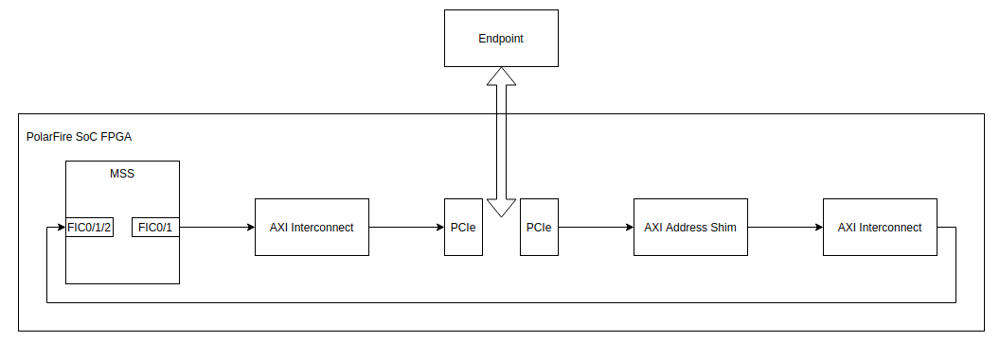
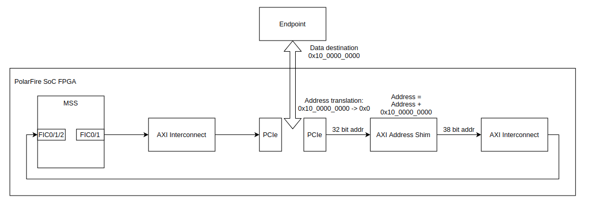
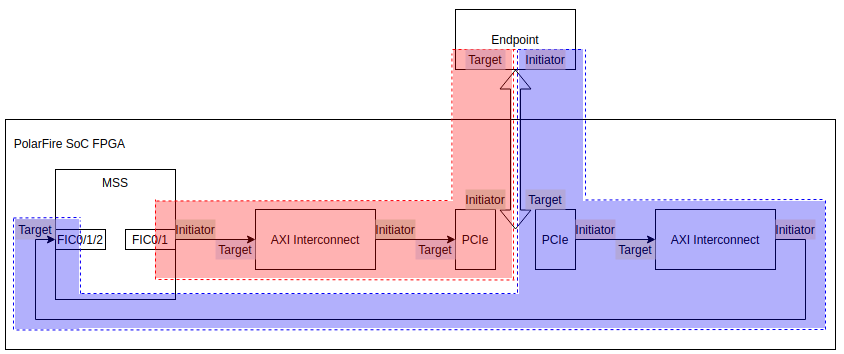
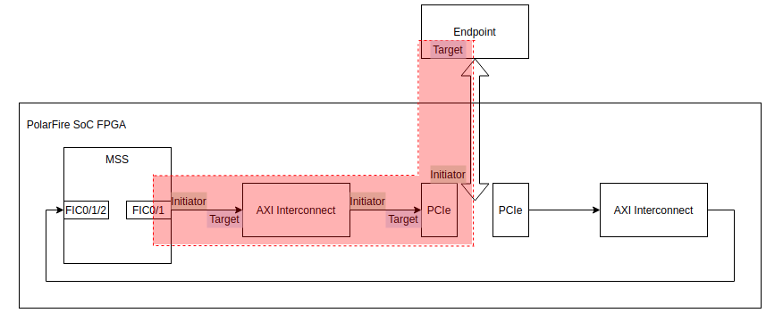
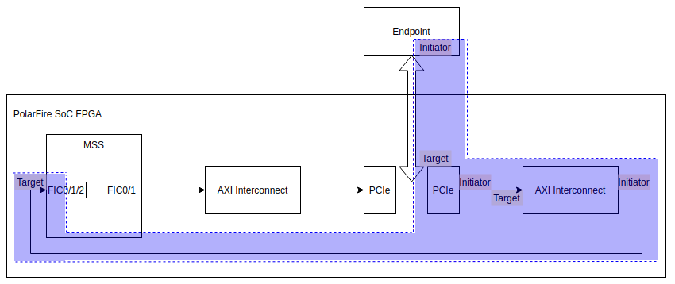
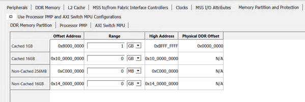
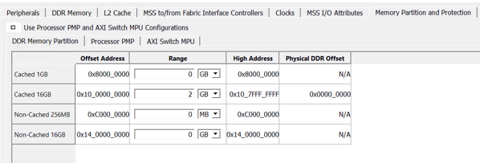

# PolarFire SoC PCIe Memory Configuration

- [Introduction](#introduction)
- [PCIe Design Implementation on PolarFire SoC](#pcie-design-implementation-on-polarfire-soc)
  - [PCIe Implementation on PolarFire SoC](#pcie-implementation-on-polarfire-soc)
  - [Known limitations](#known-limitations)
  - [Theory of operation for PCIe data transfers](#theory-of-operation-for-pcie-transfers)
  - [MSS FICs](#mss-fics)
  - [PCIe Addressing Configurations](#pcie-addressing-configurations)
    - [32-bit addressing only configuration](#32-bit-addressing-only-configuration)
    - [38-bit addressing only configuration](#38-bit-addressing-only-configuration)
  - [AXI address map](#axi-address-map)
  - [Interrupt Configuration](#interrupt-configuration)
- [Software Considerations](#software-considerations)
  - [MSS Configurator](#mss-configurator)
  - [Hart Software Services (HSS)](#hart-software-services-hss)
  - [U-boot](#u-boot)
  - [Linux Device Tree](#linux-device-tree)
  - [PolarFire SoC Build Systems](#polarfire-soc-build-systems)
    - [Yocto BSP](#yocto-bsp)
    - [Buildroot SDK](#buildroot-sdk)

<a name="introduction"></a>

## Introduction

This document will guide users through the different hardware and software configuration requirements to use PCIe on MPFS.

The first section of the document describes the PCIe design implementation on PolarFire SoC.

The second section will show users how to set up the standard 64-bit configuration and a 32-bit addressing only configuration.

The 32-bit addressing configuration has limited DDR address space but supports a wider range of PCIe NICs.

<a name="pcie-design-implementation-on-polarfire-soc"></a>

## PCIe Design Implementation on PolarFire SoC

<a name="pcie-implementation-on-polarfire-soc"></a>

### PCIe Implementation on PolarFire SoC

The PCIe block on PolarFire SoC (which is the same block on PolarFire) can be used as an endpoint or a root port.

For Linux running on PolarFire SoC, the PCIe block is configured as a root port. This means that any endpoint devices connected can be detected and configured on start up.

The PCIe block has multiple interfaces to the FPGA fabric:

- A DRI (Dynamic Reconfiguration Interface) to allow access to individual lane registers

- An APB target interface for full register access

- An AXI4 target interface

- An AXI4 initiator interface

- Clock inputs for clocks from PLLs routed through the fabric

- Interrupt and reset inputs / outputs

The standard configuration of PCIe interfacing to the PolarFire SoC MSS is using a 64-bit AXI4 interface.

The AXI interfaces on the MSS have 38 address bits and can be used with two address ranges, known as the 1 GiB range (which has 1 GiB of address space into the FPGA fabric) and the 64 GiB range which can address up to 64 GiB of address space.

The PCIe block present on PolarFire SoC has 32 address bits present on its AXI interface which limits the amount of DDR it can address. The PCIe to DDR interface is via the MSS using a target interface on a FIC.

The DDR controller of the MSS has the capability to split DDR into multiple address spaces and partition DDR into cached and non-cached address space. This means any initiator accessing the DDR will have 4 potential ranges where it can be accessed:

- Cached 32-bit space

- Non-cached 32-bit space

- Cached 38-bit space

- Non-cached 38-bit space

<a name="known-limitations"></a>

### Known Limitations

Initially, PolarFire SoC was configured with Linux executing from the cached 32-bit DDR address space with DDR available in the cached 38-bit address space too.

It was seen that Linux was configuring PCIe DMA jobs to transfer data into the 32 bit non cached address space and then using memcpy to move data to the 38-bit address space from the 32-bit address space. This causes a significant CPU overhead and impacts performance significantly.

The route to the PCIe block is via an MSS FIC, the 32-bit address space on a FIC is limited to 1 GiB and the PCIe block only supports 32 address bits. This means that using the 32-bit address space on a FIC only 1 GiB of address space can be made available for PCIe.

The 38-bit address space supports up to 64 GiB of memory accesses, but address translation and an address shim are required to access the PCIe using this space.

<a name="theory-of-operation-for-pcie-transfers"></a>

### Theory of operation for PCIe data transfers

There are several ways PCIe can be used, for example in a bare metal configuration users have access to configure transfers in any way they like. However, using Linux there is less flexibility in how the PCIe is used as the Linux PCIe subsystem expects the part to behave in a certain way and configures the system dynamically.

The understood method of operation for the PCIe root port (PolarFire SoC) to transfer data to and from an endpoint is as follows:

1. Linux, via the root port will configure the endpoint’s DMA engine with the addresses for the source and destination of the data to be transferred.

    This configuration uses the root port data path

2. Linux, via the root port will then start the DMA operations from the endpoint

3. The end point DMA will act as the initiator of the transactions sending data to / from DDR via the root port

4. The end point DMA will send an interrupt to the root port PCIe to indicate that the DMA transfer operation is complete


<a name="mss-fics"></a>

### MSS FICs

3 MSS FICs are needed to fully interact with the PCIe block in the fabric:

- 1x AXI4 initiator (either FIC0 or FIC1)
- 1x APB3 initiator (FIC3)
- 1x AXI4 target (either FIC0 or FIC1 or FIC2)

Each initiator FIC has its own address space, as FIC0 or FIC1 can be used as an AXI initiator, depending on which one is chosen, the PCIe base address in the device tree will need to be updated.

For register access the PCIe will need the APB3 connection - this is recommended as FIC3 here but bus conversion from AXI4 -> APB3 could be used to access PCIe registers from one of the AXI FICs.

The PCIe block’s AXI initiator interface is used to communicate with the MSS DDR from endpoints. This interface should be connected to an MSS FIC target interface. This can be any one of FIC0, FIC1 or FIC2.

FIC1 is recommended due to its placement relative to the PCIe block on the fabric to allow timing closure at higher frequencies.

The standard operating frequency of the AXI domain (MSS FICs and PCIe AXI interfaces) in the Icicle Kit Reference design is 125MHz – as these interfaces are 64 bit this theoretically allows 8Gb/s of transfers. The maximum operating frequency of the FICs is 250 MHz.

<a name="pcie-addressing-configurations"></a>

### PCIe Addressing Configurations

<a name="32-bit-addressing-only-configuration"></a>

#### 32-bit addressing only configuration

The standard PCIe configuration only uses 32-bit addressing by connecting an MSS AXI FIC initiator to the PCIe AXI target interface via the FPGA fabric.

The PCIe block can be accessed using the 32-bit memory mapped ranges of the MSS FIC.

The PCIe block can access the MSS DDR using a connection from the PCIe block’s AXI initiator interface to an MSS AXI FIC.

The diagram below shows this configuration:


<a name="38-bit-addressing-only-configuration"></a>

#### 38-bit addressing only configuration

The PCIe can be configured to use 38-bit addressing by adding an additional block to the FPGA fabric.

There are several factors that must be considered to achieve this configuration – the aim is to produce a 38-bit address on the MSS FIC for DDR access in the PCIe -> MSS data path.

Because only 32 address bits are available on the PCIe AXI interfaces they cannot directly address DDR using 38 address bits.

To access the DDR direct addressing from the AXI initiator interface of the PCIe controller must be bypassed. This is achieved using address translation and an address shim in the fabric.

The AXI shim is added between the PCIe block and the FIC, in the image below it can be seen connecting the PCIe to an AXI interconnect:



Address translation is used to remove the start address from PCIe transactions which reduce the addresses generated by the PCIe AXI interface to just be offsets from a base.

For example, DDR is accessible at 0x10_0000_0000, if data is directed to 0x10_0001_0000 the address produced by the PCIe block after address translation is 0x1_0000 which is an offset from the start address of DDR. This allows a valid address to be generated by the PCIe AXI interface.

Once this address has been generated it is passed through a shim block. This block adds the DDR start address back on to the offset address to produce a valid address for the MSS FIC to allow DDR access. I.e., an offset address of 0x1_0000 is generated by the PCIe block, the shim then adds 0x10_0000_0000 to this address to produce an address of 0x10_0001_0000.



The block used as an address shim has very basic functionality; its main purpose is to set a bit (or bits) corresponding to the address that needs to be generated.

It was seen during testing that the MSS FIC / PCIe AXI interface would lock up if the address bits are simply tied off.

To avoid locking the interface up the address bits that need to be set are connected to the output of an AND gate. This ANDs the resetn and read/write valid signals depending on the transaction to allow for address generation only when the FPGA fabric is out of reset and a valid transaction is present.

The design of the address shim is shown below:


<a name="axi-address-map"></a>

### AXI Address Map

There are several memory mapped domains in the PCIe configuration:



The first domain highlighted in red below is the MSS -> PCIe -> Endpoint domain.

In this domain the MSS is the initiator of transactions and reads/writes to/from the endpoint.

In this domain the MSS could stream data to the endpoint if desired. It is believed that this is the least used path in a Linux configuration. The reason being that using this data path the MSS PDMA or a fabric DMA would need to send transactions to a single end point at a time, or the MSS could send single chunks of data at a time.

Multiple endpoints could be connected and used, and this data path would limit efficiency. Therefore, this data path is primarily used to configure an endpoint to use its own DMA; once configured the endpoint will initiate transactions.



This means when multiple endpoints are connected, they can all individually initiate their own transfers when instructed to do so by Linux. This will use the blue highlighted path shown below. Using this path, the endpoints’ DMAC can read/write from areas of the MSS DDR and then send an interrupt to Linux to let it know that the DMA job has been completed.



If multiple end points are connected, they can all initiate their own transactions on the same data path independently of each other as shown below:


This means there are two AXI address maps for the configuration, the address map for MSS -> PCIe and the address map from PCIe –> MSS (DDR).

The MSS -> PCIe address space does not have to be significantly large, it mainly depends on the config space (aka eCAM region) required for the endpoints. This address can be anything as it will simply be reduced to an offset from the start address of the PCIe block.

The PCIe -> MSS address space needs to be capable of addressing all of the DDR to avoid the use of Linux bounce buffers.

The MSS FIC targets have access to all the DDR address space (if allowed by the MPU and interconnect configurations). This means that the MSS MPU and/or AXI interconnect used in the fabric will need to allow the PCIe block to address all the DDR and the PCIe block must be capable of generating addresses to target all of DDR.

If the PCIe block is not capable of addressing all of the DDR, address translation and address shims will be needed as described previously in this document.

<a name="interrupt-configuration"></a>

### Interrupt Configuration

The PCIe block supports multiple interrupt configurations for the interrupts sent from PCIe to the MSS. They are INTx, MSI1, MSI2. MSI4, MSI8, MSI16 and MSI32. MSI-X is not currently supported.

An interrupt is sent to the MSS using a dedicated interrupt output from the PCIe block to signal that an interrupt event has occurred. When this interrupt asserts Linux can determine the source by reading registers in the PCIe block.

By default, the PCIe interrupt is connected to MSS_INT_F2M[1] of the MSS, this is not a requirement and any F2M interrupt can be used once the device tree reflects this.

## Software Considerations

<a name="software-considerations"></a>

### MSS Configurator

<a name="mss-configurator"></a>

#### 32-bit addressing only

When using 32 bit addressing only all Linux DDR must be in the 1GB DDR range (it is recommended to use the cached route).

This means the amount of DDR available to Linux in the 32 bit configuration is limited to 1GB.

This is configured using the MSS configurator, the XML output of the configurator should be imported into the HSS so DDR segmentation register changes are applied at start up.

A sample configuration is shown below:



#### 38-bit addressing only

When 38 bit addressing is used all DDR available to Linux should be in the 16GB range (it is recommended to use the cached route). This means the amount of DDR available to Linux is limited to 16GB.

This is configured using the MSS configurator, the XML output of the configurator should be imported into the HSS so DDR segmentation register changes are applied at start up.

A sample configuration is shown below:



<a name="hart-software-services-hss"></a>

### Hart Software Services (HSS)

#### HSS Linker Addresses

The HSS linker script boards/mpfs-icicle-kit-es/hss-l2scratch.lds specifies ddr (32-bit cached) and ddrhi (38-bit cached) DDR address space regions, along with their sizes. These need to be kept in sync with the configuration of the MSS. Currently, these are set as follows:

```ld
{
    ddr (rwx)          : ORIGIN = 0x80000000, LENGTH = 32m
    ddrhi (rwx)        : ORIGIN = 0x1000000000, LENGTH = 1888m

}
```

#### HSS Boot DDR Target Address

The HSS copies its boot image from the storage medium to an initial address in DDR.This address is controlled via the `CONFIG_SERVICE_BOOT_DDR_TARGET_ADDR` Kconfig located in the top-level .config file:

Setting this to an appropriate address for your DDR address space – for example, 0xA000_0000.

#### Payload YAML file

The HSS payload generator tool uses a YAML configuration file to create a formatted payload image for the HSS.

The configuration file is used to map the ELF binaries or binary blobs to the individual application harts (U54s). See the HSS payload generator [documentation](https://mi-v-ecosystem.github.io/redirects/tool-hss-payload-generator) for more details on the configuration file format and the HSS payload generator tool.

When using the cached 32-bit DDR address space, this configuration file should set appropriate hart-entry-points and exec-addr values in this YAML file. This should be an address starting at 0x8000_0000.

The hart-entry-points and exec-addr values may be the same, but they do not need to be – however, they must confirm to whatever is specified in the application linker script. For example, for U-Boot, use hart-entry-points of 0x8020_0000 and exec-addr of 0x8020_0000.

When using the cached 38-bit DDR address, space, the address must start with 0x10_0000_0000. As an example, for U-Boot,  use hart-entry-points of 0x10_0020_0000 and exec-addr of 0x10_0020_0000.

The Yocto or Buildroot build system can be configured to select between the two address regions.
For more information refer to the [PolarFire SoC Build Systems section](#polarfire-soc-build-systems).

#### Linker Scripts for Bare Metal payloads / U-Boot Payloads

In addition to execution placement and entry point specification via the YAML file, it is important that binaries that are not position independent are linked correctly for the target address.

I.e., if the YAML file specifies an exec-addr of 0x8000_0000 and a hart-entry-point of 0x8020_0000, then the linker script for the payload must agree with this.

#### HSS PCIe Init Function

The HSS clears various PCIe related interrupt status registers at start-up. If PCIe is removed from the fabric design, it is important that the HSS Kconfig option `CONFIG_USE_PCIE` is **disabled**.

<a name="u-boot"></a>

### U-boot

U-Boot allows to load the kernel and device tree into memory as well as booting the Linux kernel.

There are some configurations and environment variables used by U-boot to identify where to load the kernel in memory.

These configurations can be found in the following locations:

- MPFS Icicle Kit header file (include/configs/microchip_mpfs_icicle.h)

- MPFS Icicle Kit defconfig (configs/microchip_mpfs_icicle_defconfig)

- MPFS Icicle Kit Kconfig (board/microchip/mpfs_icicle/Kconfig)

The configurations shown below can be modified based on the memory configuration required (32-bit or 38-bit addressing):

`SYS_TEXT_BASE` specifies the u-boot base address. This is the address where u-boot is loaded by the zero-stage bootloader (HSS).

When using 38-bit DDR map use 0x10_0020_0000, for 32-bit addressing use 0x8020_0000 instead.

`CONFIG_SYS_LOAD_ADDR` is the default address used to load an image at a specified address when using tftpboot or dhcp commands from the U-boot

`CONFIG_SYS_SDRAM_BASE` describes the base memory address. This is use internally to calculate address offsets required by U-boot such as stack pointer addresses.

When using 38-bit DDR map use 0x10_0000_0000, for 32-bit DDR map use 0x8000_0000 instead

`CONFIG_STANDALONE_LOAD_ADDR` is an optional macro which is used as the linker address for standalone applications.

Additionally, default U-boot environment variable are provided in the `CONFIG_EXTRA_ENV_SETTINGS`. Some of the addresses set by this macro are used by Yocto to build a U-boot script executed at boot to load the device tree and kernel into memory.

```c
#define CONFIG_EXTRA_ENV_SETTINGS \
"kernel_addr_r=0x1004000000\0" \
"fdt_addr_r=0x1008000000\0" \
"scriptaddr=0x1008100000\0" \
"pxefile_addr_r=0x1008200000\0" \
"ramdisk_addr_r=0x1008300000\0" \
```

Finally, the MPFS Icicle Kit device tree `microchip-mpfs-icicle-kit.dts` file located in the arch/riscv/dts/ specifies the DDR memory layout for the system.

Default configuration (38-bit addressing) specifies a 1888MB general purpose memory region starting at 0x10_0000_0000. If 32-bit addressing, change as required.

It is important to point out that U-boot and Linux device trees should match. Therefore, any change done in U-boot device tree should be applied to the Linux device tree. For further information on Linux device tree refer to [Linux Device Tree section](#linux-device-tree)

<a name="linux-device-tree"></a>

### Linux Device Tree

#### Specifying the DDR memory map in Linux

The default device tree (dts) file for PolarFire SoC on Icicle-Kit uses the mapping shown below; it associates 1888 MB of DDR memory, cached, and with 38-bit addressing:

```dts
ddrc_cache: memory@1000000000 {
  device_type = "memory";
  reg = <0x10 0x0 0x0 0x76000000>;
  clocks = <&clkcfg CLK_DDRC>;
  status = "okay";
};
```

The 160 MB of remaining memory is used to create buffers in the low memory region, that is the 32-bit addressable memory space:

- 32 MB buffer, cache-coherent

- 128 MB buffer, non-cache-coherent

- 128 MB buffer, non-cache-coherent, write combine buffered

For more information on the default DDR memory layout on the Icicle Kit, please refer to the “DDR on Icicle Kit” section in the following [README](https://github.com/polarfire-soc/polarfire-soc-linux-examples/tree/master/pdma).

If required, the memory map layout described above should be modified based on the memory map as described in the [MSS Configuration section](#mss-configurator).

#### Telling Linux where PCIe should work

##### Linux: 38-bit addressing only configuration

In 38-bit addressing only configuration, the PCIe root port on Microchip PolarFire SoC needs to be configured in the Linux device-tree to shift addresses on transactions initiated by the Endpoint from 10’0000’0000h to 0h.

```dts
pcie: pcie@2000000000 {
    ...
    microchip,axi-m-atr0 = <0x10 0x0>;
    ...
};
```

This shift is used, in conjunction with the PCIE address adaption logic to pass those addresses through the PCIe root port before shifting them back to 0x10_0000_0000 outside the root port before presenting them to the AXI4 subsystem.

Note, in this mode, any transaction to an address in MSS subsystem, originated from the endpoint, where that address does not have bit 37 set will not pass through the root port. Any such transaction will be terminated on the PCIe side of the root port, and an error reported by the PCIe root port. This implies endpoints that cannot use 38-bit addressing cannot use this configuration.

The most common situation is where an endpoint can address a maximum of 32 bits. For this case, the 32-bit addressing only configuration is provided.

##### Linux: 32-bit addressing only configuration

In 32-bit addressing only configuration, the PCIe root port needs to be configured in the Linux device-tree to map addresses, for transactions initiated by the endpoint, from 0x00_0000_0000 to 0x00_0000_0000.

```dts
pcie: pcie@2000000000 {
  ...
  microchip,axi-m-atr0 = <0x0 0x0>;
  ...
};

```

In 32-bit addressing only configuration, the PCIe root port is limited to 32-bit addresses.

Any endpoint-initiated transaction targeting an address in DDR above 0xffff_ffff will result in the PCIe root port rejecting the transaction from the endpoint and reporting an error.

Therefore, for this configuration to work effectively, Microchip PolarFire SoC should be configured such that its DDR is either:

- 32-bit only which uses DDR at addresses in the range from 0x8000_0000 to 0xbfff_ffff

Or, if using a DDR at addresses where some addresses are in the range from 0x8000_0000 to 0xbfff_ffff (the LOMEM window) and some addresses are in the range from 0x10_0000_0000 to 0x1f_ffff_ffff (the HIMEM window), then:

- the device tree should be configured so that the PCIe root port is configured as 32-bit only using a dma-ranges property like the following:

```dts
dma-ranges = <0x02000000 0x0 0x00000000 0x0 0x00000000 0x1 0x00000000>;
```

- And the Linux kernel configured to use bounce buffers using such as:

```kconfig
CONFIG_HAS_DMA=y
CONFIG_ZONE_DMA=y
CONFIG_ZONE_DMA32=y
```

The maximum addressable memory using 32-bit only (LOMEM window only) on Microchip PolarFire SoC is 0x4000_0000 (1 GiB).  

The maximum addressable memory using 38-bit only (HIMEM window only) is 64 GiB. There are interoperability considerations here as some endpoints can address a maximum of 32-bits only.

The maximum addressable memory using both LOMEM and HIMEM windows is 65 GiB.  There are performance considerations for transfer speeds with endpoints that need memory in this configuration, as data transfers, involving these devices, where buffers originate in the high memory area will have to be routed by Linux through intermediate bounce buffers in the 32-bit memory window.

<a name="polarfire-soc-build-systems"></a>

### PolarFire SoC Build Systems

<a name="yocto-bsp"></a>

#### Yocto BSP

Within the Machine configuration the u-boot entry point and DT load address are specified. When using 38-bit DDR map use 0x10_0020_0000, for 32-bit addressing use 0x8020_0000 instead. The following is the 38-bit addresses specified.

```bitbake
UBOOT_ENTRYPOINT = "0x10 0x00200000"
UBOOT_DTB_LOADADDRESS = "0x10 0x02200000"
```

Ensure the payload generator is configured as described in the HSS section. Modify the yaml file in the following directory as required:

`meta-polarfire-soc-yocto-bsp/recipes-bsp/hss/files/<MACHINE>/uboot.yaml`

<a name="buildroot-sdk"></a>

#### Buildroot SDK

Buildroot defines the Linux, device tree and initramfs load addresses in the fitImage source file osbi-fit-image.its located in the polarfire-soc-buildroot-sdk/conf/<DEVKIT> directory.

When using 32-bit DDR map adjust the `#address-cells` property from load `#address-cells = <2>` to `#address-cells = <1>` and then adjust the entry point addresses below as required.

For 38-bit addressing the following entries are used by default:

```its
      / {
     description = "U-Boot fitImage for the MPFS";
     #address-cells = <2>;
      images {
                vmlinux.bin {
                       …
                        description = "Linux kernel";
                        load = <0x10 0x0200000>;
                        entry = <0x10 0x0200000>;
                       …
                };
                initramfs.cpio.gz {
                        description = "buildroot initramfs";
                        …
                        load = <0x10 0x40000000>;
                        …
                };
                riscvpc.dtb {
                        description = "Flattened Device Tree blob";
                       …
                        load = <0x10 0x2200000>;
                };
  };
```

In addition to this, the U-boot source file uEnv_s-mode.txt located in the `polarfire-soc-buildroot-sdk/conf/<DEVKIT>` directory defines the address in memory where the fitImage gets loaded. When 38-bit addressing 0x1030000000 is used. If using 32-bit DDR map adjust the address as required.

Finally, ensure the payload generator is configured as described in the HSS section. Modify the yaml file in the following directory as required:

`polarfire-soc-buildroot-sdk/conf/<DEVKIT>/config.yaml`
