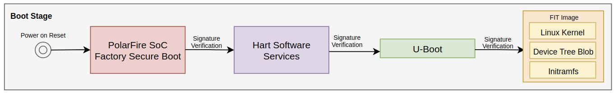
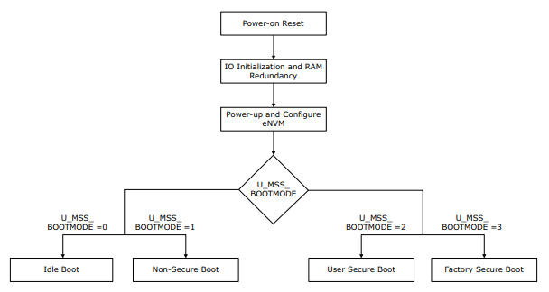
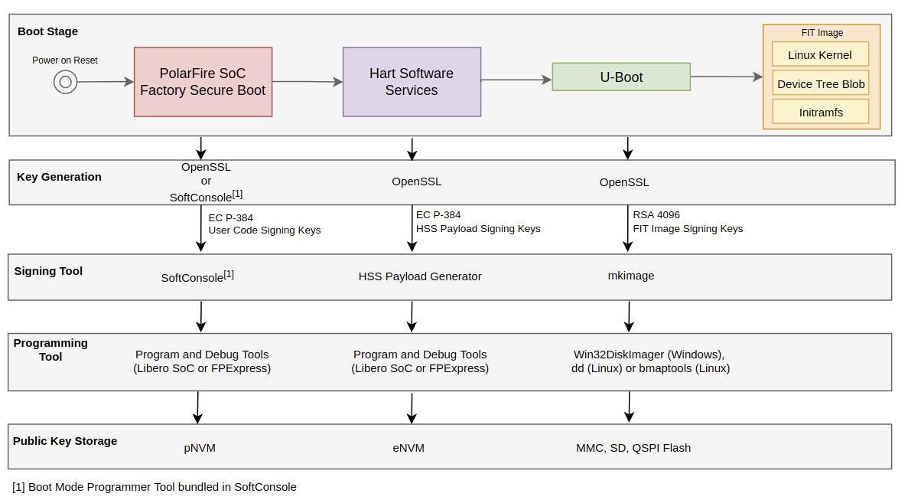
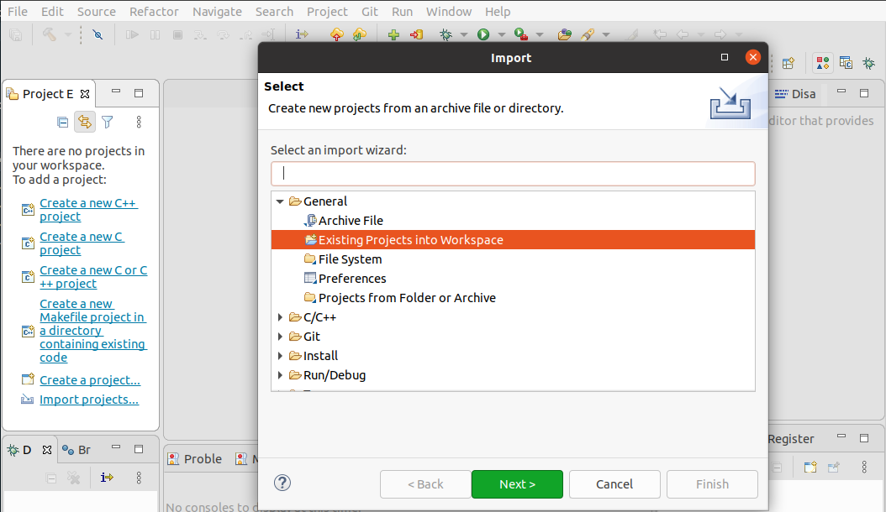
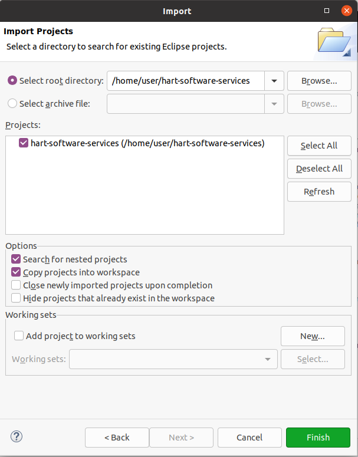
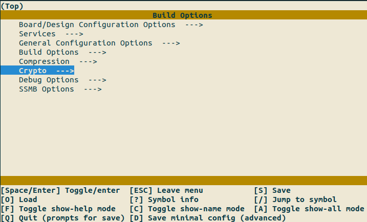
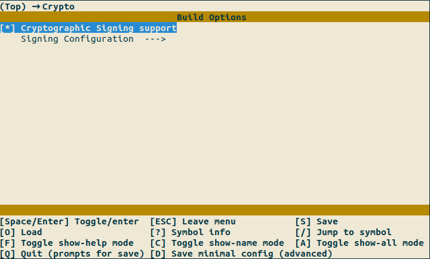
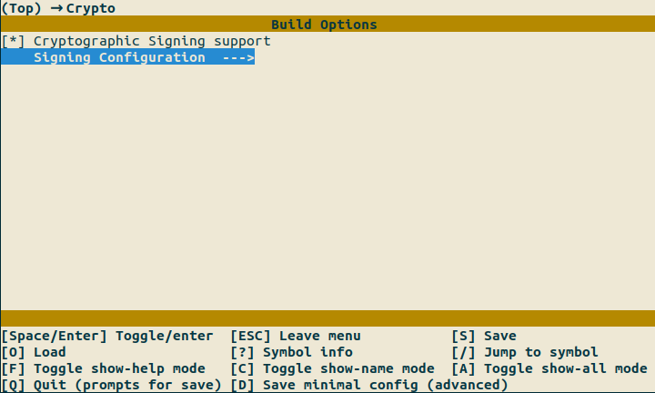
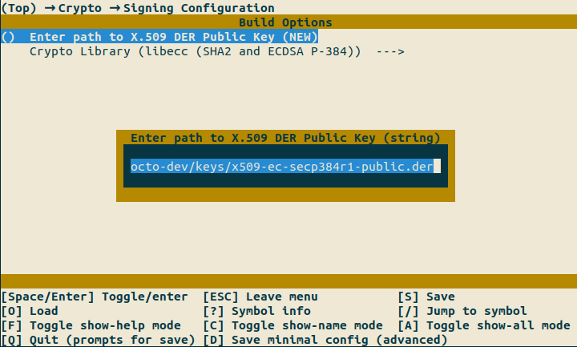

# PolarFire SoC Linux Authenticated Boot

This document describes a simple approach for booting an authenticated Linux kernel on PolarFire SoC.

## Table of Contents

- [Requirements](#requirements)
- [Introduction](#introduction)
  - [Chain of Trust](#chain-of-trust)
  - [PolarFire SoC Boot Modes](#polarfire-soc-boot-modes)
    - [Introduction to PolarFire SoC Factory Secure Boot](#introduction-to-polarfire-soc-factory-secure-boot)
- [Key Creation and Management](#key-creation-and-management)
- [Authenticated Boot Tasks](#authenticated-boot-tasks)
- [Development Flow](#development-flow)
  - [U-Boot Verified Boot](#u-boot-verified-boot)
  - [U-Boot FIT Images](#u-boot-fit-images)
  - [Configuring U-Boot](#configuring-u-boot)
  - [Creating the Keys](#creating-the-keys)
  - [Signing the FIT Image](#signing-the-fit-image)
  - [Building the Image](#building-the-image)
  - [Running the Image](#running-the-image)
  - [HSS](#hss)
    - [Enabling Signing Support on the HSS](#enabling-signing-support-on-the-hss)
    - [Deploying the HSS to the eNVM](#deploying-the-hss-to-the-envm)

<a name="requirements"></a>

## Requirements

- PolarFire SoC Icicle Kit
- SoftConsole v2022.2 or later
- Serial Terminal Program
- Ubuntu Host PC configured as shown in the "Build Instructions" of the PolarFire SoC Yocto BSP [README](https://mi-v-ecosystem.github.io/redirects/repo-meta-polarfire-soc-yocto-bsp)

<a name="introduction"></a>

## Introduction

Authenticated boot is a mechanism by which software is checked for integrity and source
authentication before execution. Verification of integrity ensures that data has not been
modified. Modification includes the insertion, deletion, and substitution
of data/information. Authentication verifies the identity of the entity that created the
data/information.

<a name="chain-of-trust"></a>

### Chain of Trust

Most modern embedded systems have a sequence of software components executed as part of the boot
process. For example a Linux system may have a bootloader, kernel, device tree, initial RAM
filesystem (initramfs), root file system, etc.

Having a verification scheme, from power up to userspace, involves establishing a chain of trust.

The fundamental concept of the chain of trust, is that each stage in the process verifies that the
subsequent stage is valid and unmodified, before initiating that stage. If the verification of any
stage fails, the device will not continue to boot.

The chain of trust that will be demonstrated in this application note is shown in the image below:



<a name="polarfire-soc-boot-modes"></a>

### PolarFire SoC Boot Modes

The boot-up sequence starts when the PolarFire SoC FPGA is powered-up or reset. It ends when the
processor is ready to execute a user application. This boot sequence runs through several
stages before it begins the execution of user programs.

The MSS Core Complex can be booted in one of four modes. There are two boot modes relevant for
authenticated boot; User Secure Boot and Factory Secure Boot.



The [User Secure Boot][User Secure Boot] methodology is intended for implementing user-defined secure boot authentication.

The [Factory Secure Boot][Factory Secure Boot] mode implements Microchip supplied factory secure boot authentication of the eNVM content.

This document describes how to configure a secure boot system using Factory Secure Boot.

[User Secure Boot]: https://mi-v-ecosystem.github.io/redirects/boot-mode-2_boot-mode-2-fundamentals
[Factory Secure Boot]: https://mi-v-ecosystem.github.io/redirects/boot-mode-3_boot-mode-3-fundamentals

<a name="introduction-to-polarfire-soc-factory-secure-boot"></a>

#### Introduction to PolarFire SoC Factory Secure Boot

Secure boot mode 3 implements Microchip supplied factory secure boot authentication of the eNVM
content. It uses the Elliptic Curve Digital Signature Algorithm (ECDSA) to authenticate the
signature of a Secure Boot Image Certificate (SBIC) as part of booting the system. The PolarFire SoC
RISC-V monitor and application processors will not be started if authentication fails.

Secure boot mode 3 only supports authentication of the eNVM content. No encryption/decryption of the
eNVM content is used.

For detailed information on Factory Secure Boot please refer to the [Boot Mode 3
Fundamentals][Boot Mode 3 Fundamentals] documentation.

[Boot Mode 3 Fundamentals]: https://mi-v-ecosystem.github.io/redirects/boot-mode-3_boot-mode-3-fundamentals

<a name="key-creation-and-management"></a>

## Key Creation and Management

Key management is often the critical link in building a secure system. Key management includes
generating, distributing, and storing keys.

In this document we will generate three key pairs

- User Code Signing Keys (UCSK and UCSQ): The User Code Signing Key (UCSK) is the private key used to
  sign the SBIC. The User Code Signing Public Key (UCSQ) is a public key stored in the private
  Non-volatile Memory (pNVM) and is used to verify the SBIC during the boot process.

- HSS Payload Signing Keys (HPSK and HPSQ): THe HSS Payload Signing Key (HPSK) is the private key
  used to sign the HSS Payload, e.g, U-Boot. The HSS Payload Signing Public Key (HPSQ) is a public
  key used to verify the HSS payload and is embedded into the HSS binary and stored in eNVM.

- FIT Image Signing Keys: used to sign and verify the Linux FIT image containing all the boot
  artifacts, i.e., kernel, initramfs, device tree blob and FIT image configuration. The public key
  is stored as part of the U-Boot binary and stored in persistant storage e.g., mmc/SD or QSPI
  flash device.

> Note: A private key is a confidential key used during the signing process only. It is never stored
> in the embedded device.

The image below shows the key generation process, as well as the signing and programming tools
that will be used for each of the boot stages, that conforms to this chain of trust example.



<a name="authenticated-boot-tasks"></a>

## Authenticated Boot Tasks

The activities necessary to enable an authenticated boot flow include:

1. Prepare the PolarFire SoC Linux build system. This includes:
  * Configuring U-Boot with FIT signature verification
  * Creating the FIT Image Signing Keys to sign and verify the FIT image
  * Creating a signed FIT image containing a Linux kernel, device tree and initramfs

2. Generate the cryptographic material to sign and verify the HSS payload

3. Sign the HSS payload containing the U-boot binary using the HSS Payload Generator tool

4. Deploy the Yocto Linux image to a storage device (eMMC, SD or QSPI flash)

5. Configure the Hart Software Services (HSS) with crypto signing support

6. Deploy the HSS binary to the eNVM using Factory Secure Boot mode in SoftConsole

<a name="development-flow"></a>

## Development Flow

The flow of this document will be presented in a somewhat reversed order – starting from a
completely open, unsigned platform, then securing pieces from the running operating system back to
the root of trust (the System Controller). This allows the addition of security features, one layer
at a time, and prevents having to get everything working together at the beginning.

This document relies on the Yocto build system to manage the process of building a working Linux
image that can be run from eMMC/SD on the Icicle Kit.

Before continuing with this document, please make sure you have set up Yocto in a host PC as shown
in the "Build Instructions" section of the [PolarFire SoC Yocto BSP README][PolarFire SoC Yocto BSP README].

[PolarFire SoC Yocto BSP README]: https://mi-v-ecosystem.github.io/redirects/repo-meta-polarfire-soc-yocto-bsp

<a name="u-boot-verified-boot"></a>

### U-Boot Verified Boot

[Verified Boot][Verified Boot] is the process that U-Boot uses to verify that an
image is correct and is allowed to run on the platform. Using Verified Boot requires:

1. Special U-Boot configuration
2. Creating the FIT Image Signing keys
3. Storing the FIT Image Signing Public Key in the U-Boot control DTB
4. Creating a FIT image
5. Signing a FIT image using mkimage tool

The FIT image that will be configured in this document contains a configuration that is hashed using SHA256 and encrypted using RSA encryption.

[Verified Boot]:https://lwn.net/Articles/571031/

<a name="u-boot-fit-images"></a>

### U-Boot FIT Images

Flattened Image Tree (FIT) files are special instances of Flattened Device Tree (FDT) files.
Instead of describing hardware, U-Boot FIT files contain files and metadata in the form of nodes and
properties that are used to boot applications such as Linux. The FIT files for Verified Boot contain
a Linux kernel, Linux device tree, configuration data, and hashes that U-Boot uses to authenticate
the data contained within the FIT file. U-Boot uses the “bootm” command to verify and boot an image
in the FIT format.

<a name="configuring-u-boot"></a>

### Configuring U-Boot

Since U-Boot is extremely flexible, there are many features that should be carefully evaluated to
help ensure security. One configuration setting, `CONFIG_FIT_SIGNATURE`, allows image signature
checking and is the heart of U-Boot’s Verified Boot methodology. Without the `CONFIG_FIT_SIGNATURE`
setting, it is not possible to check, or even generate, a properly signed FIT file.

The `CONFIG_FIT_SIGNATURE` option is configured in the `icicle-kit-es-auth` machine
included in our [Yocto BSP][Yocto BSP].

Although this document focuses on the boot authentication process, there are many other
configurations that need to be considered for enforcing U-Boot security. For example, we do not want
someone to be able to tamper with the U-Boot environment script or arbitrarily execute whatever
U-Boot commands they would like. For this reason, it is recommended to lock-down U-Boot by disabling
some configurations, such as autoboot, command line and the use of U-Boot boot scripts, since they
could be used by an attacker to alter the boot sequence. For additional details on securing U-Boot
see the document by [F-Secure][F-Secure].

[PolarFire SoC Yocto BSP]: https://mi-v-ecosystem.github.io/redirects/repo-meta-polarfire-soc-yocto-bsp
[F-Secure]: https://www.f-secure.com/content/dam/labs/docs/2020-05-u-booting-securely-wp-final.pdf

<a name="creating-the-keys"></a>

### Creating the Keys

This application note will not go into the details of Public Key Infrastructure (PKI), but will
introduce and describe the components necessary to perform an authenticated boot. When performing
PKI operations, there are several important components that must be obtained or constructed ahead of
time.

The easiest way to generate a public/private key pairs is to use the OpenSSL library, available
for Windows and Linux from [openssl.org][openssl.org]. OpenSSL is a robust,
commercial-grade, fully-featured toolkit for general-purpose cryptography and secure communication.

OpenSSL can be compiled from source, installed via third-party community contributed binaries
for Windows etc. (available from [openssl's website][openssl's website]
or installed via a Linux distribution package manager (e..g., for Ubuntu, apt install openssl).

This section will describe how to generate the HSS Payload Signing Keys (HPSK and HPSQ) and FIT Image Signing Keys.

Before continuing with this document, please make sure you have set up Yocto in a host PC as shown
in the "Build Instructions" section of the [PolarFire SoC Yocto BSP README][PolarFire SoC Yocto BSP README].

[openssl.org]:https://www.openssl.org/
[openssl's website]:https://www.openssl.org/community/binaries.html
[PolarFire SoC Yocto BSP README]:https://mi-v-ecosystem.github.io/redirects/repo-meta-polarfire-soc-yocto-bsp

1. First, setup the Bitbake environment if you haven't already

    ```shell
    $ . ./meta-polarfire-soc-yocto-bsp/polarfire-soc_yocto_setup.sh
    ```

2. Run the PolarFire SoC Authenticated Boot setup script

    ```shell
    $ . ../meta-polarfire-soc-yocto-bsp/meta-polarfire-soc-extras/scripts/polarfire-soc_auth_setup.sh
    ```

By default, the script will generate the HSS Payload Signing Keys (HPSK and HPSQ) and FIT Image Signging Keys in the repo workspace directory. For example:

```text
├── conf
├── keys
│   ├── mpfs_fitimage_key.crt
│   ├── mpfs_fitimage_key.key
│   ├── x509-ec-secp384r1-private.pem
│   └── x509-ec-secp384r1-public.der
├── meta-openembedded
├── meta-polarfire-soc-yocto-bsp
├── openembedded-core
```

Additionally, the script will export the key names and paths to Bitbake
using environment variables. For this reason, it is important that this script gets sourced each time a new terminal session is initiated.

  > Note: U-Boot requires the names of the key and certificate to be identical, except the filename
  > extension of the key must be .key, and the certificate .crt.

<a name="signing-the-fit-image"></a>

### Signing the FIT Image

The PolarFire SoC Yocto BSP layer uses the `kernel-fitimage` class to automatically pack a kernel
image, device tree(s), and initramfs into a single FIT image. This FIT image can be signed when the
variables `UBOOT_SIGN_ENABLE`, `UBOOT_MKIMAGE_DTCOPTS`, `UBOOT_SIGN_KEYDIR` and `UBOOT_SIGN_KEYNAME`
are set appropriately.

The `UBOOT_SIGN_KEYNAME` variable should contain the name of the key used for signing the FIT
Image, this should be located in the directory specified in the `UBOOT_SIGN_KEYDIR` variable.

For signature validation to be of any use, the public key has to be available before loading the FIT
image. This is why U-Boot must include the public key in the U-Boot's device tree (often called
flattened device tree or FDT). The `UBOOT_MKIMAGE_DTCOPTS` variable can be used to tell the Device
Tree Compiler (DTC) that we need space for the public keys. As recommended by the `uboot-sign`
bitbake class, we use 2kBytes of padding for the public key and certificate.

It is worth mentioning that the default hash algorithm and signing algorithm for the FIT Image are
SHA256 and RSA 4086, respectively. If needed, the `FIT_SIGN_ALG` and `FIT_SIGN_NUMBITS` variables
can be use to adjust this configuration. In this document, we will use RSA encryption with 4096 bits.
For more information please refer to the [Yocto Project Reference Manual][Yocto Project Reference Manual].

The `HSS_PAYLOAD_GEN_KEYNAME` variable should contain the name of the private key to sign the HSS
payload, this should be located in the directory specified in the `HSS_PAYLOAD_GEN_KEYDIR` variable.

Our [Yocto BSP][Yocto BSP] provides an `icicle-kit-es-auth` machine that has all the options above configured by default.

[Yocto Project Reference Manual]: https://docs.yoctoproject.org/ref-manual/variables.html#term-FIT_SIGN_ALG
[Yocto BSP]: https://mi-v-ecosystem.github.io/redirects/repo-meta-polarfire-soc-yocto-bsp

<a name="building-the-image"></a>

### Building the Image

To build an image with authenticated boot:

1. Build the `mpfs-initramfs-image` for the Icicle  using the `icicle-kit-es-auth` machine:

```bash
$ MACHINE=icicle-kit-es-auth bitbake -R conf/initramfs.conf mpfs-initramfs-image
```

Note: The chain of trust demonstrated in this document uses an initramfs, this ensures that only an
authenticated initramfs that is part of the FIT image can be used. However, when using a root
filesystem, it is recommended to authenticate the rootfs using other tools such as [dm-verity][dm-verity].

[dm-verity]: https://docs.kernel.org/admin-guide/device-mapper/verity.html

<a name="running-the-image"></a>

### Running the Image

1. Copy the image to the eMMC/SD card

    ```bash
    bmaptool copy tmp-glibc/deploy/images/icicle-kit-es-auth/mpfs-initramfs-image-icicle-kit-es-auth.wic /dev/sdX
    ```

    > Be very careful while picking /dev/sdX device! Look at dmesg, lsblk, GNOME Disks, etc. before and after plugging in your usb flash device/uSD/SD to find a proper device. Double check it to avoid overwriting any of system disks/partitions!

2. Power-cycle the Icicle Kit and observe U-Boot's boot log. Notice that the “Verifying Hash Integrity”
   message shows “rsa4096:mpfs_fitimage_key+”. This indicates that the FIT signature was indeed
   checked, and found to be valid.

    ```bash
    ## Loading kernel from FIT Image at 1008300000 ...
      Using 'conf-microchip_mpfs-icicle-kit.dtb' configuration
      Verifying Hash Integrity ... sha256,rsa4096:mpfs_fitimage_key+ OK
      Trying 'kernel-1' kernel subimage
        Description:  Linux kernel
        Type:         Kernel Image
        Compression:  gzip compressed
        Data Start:   0x10083000fc
        Data Size:    4816479 Bytes = 4.6 MiB
        Architecture: RISC-V
        OS:           Linux
        Load Address: 0x1000200000
        Entry Point:  0x1000200000
        Hash algo:    sha256
        Hash value:   8da0226da5c62c57acbbeaf86e3ea807e5ff8c2dac0c5ad21bea41bfee564ebb
      Verifying Hash Integrity ... sha256+ OK
    ## Loading ramdisk from FIT Image at 1008300000 ...
      Using 'conf-microchip_mpfs-icicle-kit.dtb' configuration
      Verifying Hash Integrity ... sha256,rsa4096:mpfs_fitimage_key+ OK
      Trying 'ramdisk-1' ramdisk subimage
        Description:  mpfs-core-image-base
        Type:         RAMDisk Image
        Compression:  uncompressed
        Data Start:   0x100879ceb4
        Data Size:    43696904 Bytes = 41.7 MiB
        Architecture: RISC-V
        OS:           Linux
        Load Address: unavailable
        Entry Point:  unavailable
        Hash algo:    sha256
        Hash value:   7fbcc959d1470846a285776862e4d2985ad5cccb19916aac8ec3cad5bf2f708a
      Verifying Hash Integrity ... sha256+ OK
    ## Loading fdt from FIT Image at 1008300000 ...
      Using 'conf-microchip_mpfs-icicle-kit.dtb' configuration
      Verifying Hash Integrity ... sha256,rsa4096:mpfs_fitimage_key+ OK
      Trying 'fdt-microchip_mpfs-icicle-kit.dtb' fdt subimage
        Description:  Flattened Device Tree blob
        Type:         Flat Device Tree
        Compression:  uncompressed
        Data Start:   0x1008798084
        Data Size:    16823 Bytes = 16.4 KiB
        Architecture: RISC-V
        Load Address: 0x1002200000
        Hash algo:    sha256
        Hash value:   00ecbea21657a5593b1ab78065e86d95b6378ef4a2749e40f30764fcae9e2710
      Verifying Hash Integrity ... sha256+ OK
      Loading fdt from 0x1008798084 to 0x1002200000
      Booting using the fdt blob at 0x1002200000
      Uncompressing Kernel Image
      Loading Ramdisk to 100d653000, end 100ffff308 ... OK
      Loading Device Tree to 000000100d64b000, end 000000100d6521b6 ... OK
    ```

<a name="hss"></a>

### HSS

This section describes how to:

- Build the HSS with crypto signing support
- Deploy the HSS along with the HSS Payload Signing Public Key (HSPQ) to PolarFire SoC

For more information on how the HSS crypto signing and validation works, please refer to
the [HSS secure boot documentation][HSS secure boot documentation].

[HSS secure boot documentation]: https://mi-v-ecosystem.github.io/redirects/secure-boot_secure-boot

<a name="enabling-signing-support-on-the-hss"></a>

#### Enabling Signing Support on the HSS

Firstly, the HSS needs to be compiled with support for code signing enabled and with the public-key embedded in it.

1. Clone or download the hart-software-services project from GitHub

    ```bash
    $ git clone https://github.com/polarfire-soc/hart-software-services.git
    ```

2. Launch SoftConsole IDE and open either a new or an existing workspace

3. In the Project Explorer window, click `Import projects...` as shown in the following figure. Expand the `General` drop-down list and select `Existing Projects into Workspace`, then click Next.

    

4. Click `Browse...`, navigate to the location where the hart-software-services project folder is located, select the folder and then, click `Finish`.

    

5. Launch a terminal emulator and navigate to the hart-software-services repository

    ```bash
    $ cd hart-software-services
    ```

6. Copy the default config of your board. For example:

    ```bash
    $ cp boards/mpfs-icicle-kit-es/def_config .config
    ```

7. Edit the default HSS configuration using menuconfig

    ```bash
    $ make menuconfig
    ```

    After running the command shown above, a configuration menu should pop-up.

    Navigate to the Crypto category

    

    Enable Cryptographic Signing support

    

    Navigate to the Signing Configuration category

    

    Enter the path to the HSS Payload Signing Public Key (HPSQ). For example `/home/user/yocto-dev/conf/keys/x509-ec-secp384r1-public.der"`:

    

    Exit menuconfig by pressing the "Q" in the keyboard and save the configuration when prompted.

8. Build the HSS by pressing the Build button in SoftConsole or by using the command line

    ```
    $ make
    ```

For more information on how to build the HSS using the command line, please refer to the [Hart Software Services README][Hart Software Services README].

[Hart Software Services README]: https://mi-v-ecosystem.github.io/redirects/repo-hart-software-services

<a name="deploying-the-hss-to-the-envm"></a>

#### Deploying the HSS to the eNVM

The Boot Mode Programmer Tool, which is built into SoftConsole, provides the ability to deploy an application and configure the boot mode on PolarFire SoC.

When setting Boot Mode 3 (Factory Secure Boot), the Boot Mode Programmer Tool embedded in SoftConsole will perform the following actions:

- Read ECDSA NIST P-384 keys (UCSK and UCSQ) from a given directory
- Generate and sign the SBIC (Secure Boot Image Certificate)
- Generate a HEX file containing the application binary and SBIC data
- Generate the bitstream and program it to the target device

To generate the User Signing Keys (UCSK and UCSQ) which are used to sign and verify the SBIC:

```shell
$ openssl ecparam -name secp384r1 -genkey -noout -out combined.ec.key
$ openssl pkcs8 -topk8 -nocrypt -in combined.ec.key -out ucsk-private.pem
$ openssl ec -in ucsk-private.pem -pubout -out ucsq-public.pem
```

Flash the HSS to your board using factory secure boot mode 3:

```shell
make program BOOTMODE=3 BOOTMODE_ARGS="--keys SEPARATED ucsk-private.pem ucsq-public.pem"
```

If the application was successfully programmed to the device, the Boot Mode Programmer Tool should output the following:

```text
15:09:51 INFO  - Generating BIN file...
15:09:51 INFO  - Generating SBIC (Secure Boot Image Certificate)...
15:09:51 INFO  - Reading ECDSA NIST P-384 keys from files...
15:09:51 INFO  - Generating HEX file...
15:09:51 INFO  - Preparing for bitstream generation...
15:09:51 INFO  - Generating bitstream...
15:09:58 INFO  - Programming the target...
15:10:09 INFO  - Verifying the target...
15:10:16 INFO  - mpfsBootmodeProgrammer completed successfully.
```

Once programmed, the HSS console now shows a “ECDSA verification passed” message. This indicates that the HSS payload signature was verified and found to be valid.

```bash
[6.264467] PolarFire(R) SoC Hart Software Services (HSS) - version 0.99.33-dev-build
MPFS HAL version 2.0.101 / DDR Driver version 0.4.018 / Mi-V IHC version 0.1.1 / BOARD=mpfs-icicle-s
(c) Copyright 2017-2022 Microchip FPGA Embedded Systems Solutions

...

Press a key to enter CLI, ESC to skip
Timeout in 1 second
..
[7.589296] CLI boot interrupt timeout
[7.594261] Initializing Mi-V IHC
[7.598748] Initializing IPI Queues (6056 bytes @ 0xa037ce0)...
[7.606100] Initializing PMPs
[7.610206] Initializing Boot Image ...
[7.615266] Trying to boot via MMC ...
[7.620231] Preparing to copy from MMC to DDR ...
[7.629007] Validated GPT Header ...
[7.663805] Validated GPT Partition Entries ...
[7.669967] Boot Partition found at index 1
[7.675514] Attempting to read image header (1632 bytes) ...
[7.685626] Copying 705024 bytes to 0xa0000000
[7.720598] MMC: Boot Image registered ...
[9.220997] ECDSA verification passed
...
```

In this example, the generated bistream is encrypted and authenticated using the default factory key, known as Key Loading Key (KLK).

The KLK is common to a relatively large number of devices of the same type and version, and resides
within the programming tool software. This makes it the easiest key to use but is not as secure as
the other options. Although this document focuses on the authentication process, there are many
other configurations such as user keys and passcodes that should be considered to
enforce security. For more information please refer to the
[PolarFire SoC FPGA Security User Guide][PolarFire SoC FPGA Security User Guide].

[PolarFire SoC FPGA Security User Guide]: https://ww1.microchip.com/downloads/aemDocuments/documents/FPGA/ProductDocuments/UserGuides/Microchip_PolarFire_FPGA_and_PolarFire_SoC_FPGA_Security_User_Guide_VA+%282%29.pdf
