# Re-programming the FPGA from Linux

- [Introduction](#introduction)
  - [Requirements](#requirements)
    - [Board Requirements for IAP and Auto Update](#board-requirements-for-iap-and-auto-update)
    - [Hart Software Services Support for Auto Update](#hart-software-services-support-for-auto-update)
    - [Bitstream Requirements for Auto Update](#bitstream-requirements-for-auto-update)
      - [Enabling Auto Update in Libero](#enabling-auto-update-in-libero)
      - [Adding an eNVM client to the bitstream](#adding-an-envm-client-to-the-bitstream)
      - [Configuring the Design and Back Level Version](#configuring-the-design-and-back-level-version)
      - [Generating a Golden/Recovery Image](#generating-a-golden-recovery-image)
      - [Exporting the FPGA and SPI Programming Job Files](#exporting-the-fpga-and-spi-programming-job-files)
      - [Programming the FPGA and SPI Programming Job Files using FPExpress](#programming-the-fpga-and-spi-programming-job-files-using-fpexpress)
    - [DeviceTree Requirements for IAP and Auto Update](#devicetree-requirements-for-iap-and-auto-update)
      - [Linux Requirements for Auto Update](#linux-requirements-for-auto-update)
  - [Performing an Auto Update](#performing-an-auto-update)
    - [Auto Update Failures](#auto-update-failures)
  - [SPI Flash Layout](#spi-flash-layout)
    - [SPI Directory Layout](#spi-directory-layout)

<a name="introduction"></a>

## Introduction

On PolarFire SoC, auto update and In-Application Programming (IAP) are the
mechanisms through which the FPGA can reprogram itself.
In auto update, the device reprograms itself on power-up, and in IAP, the device
is programmed when an application executing on the device requests it.
In both cases, the system controller fetches a bitstream from external SPI flash
& uses that to program the device.

Unlike other SoC FPGAs that support reprogramming from Linux, PolarFire SoC is
a flash-based FPGA, and does not support partial reconfiguration.
As a result, reprogramming the FPGA requires disabling both the FPGA fabric &
the Microprocessor Subsystem (MSS).
If reprogramming is initiated, the device is halted and a device reset occurs,
whether the re-programming has been successful or not.

Since Linux runs on the MSS, initiating IAP would immediately take the system
down, without going through the proper Linux shutdown procedure.
If other operations were in progress, they would be immediately killed,
which may be problematic.
Auto Update only runs on power-up, avoiding issues shutting Linux down
gracefully.
For this reason, the officially supported option for reprogramming
from Linux is auto update.

The auto update feature is not enabled by default and needs to be enabled using
Libero SoC. The [Bitstream Requirements for Auto Update][Bitstream Requirements for Auto Update] section describes the
steps required to enable and configure auto update using Libero.
Alternatively, from v2023.06 release, reference design assets with auto update support
are provided as part of the [PolarFire SoC Video Kit Reference Design Releases][PolarFire SoC Video Kit Reference Design Releases].

[Bitstream Requirements for Auto Update]: #bitstream-requirements-for-auto-update
[PolarFire SoC Video Kit Reference Design Releases]: https://mi-v-ecosystem.github.io/redirects/redirects/releases-video-kit-reference-design

<a name="requirements"></a>

## Requirements

<a name="board-requirements-for-iap-and-auto-update"></a>

### Board Requirements for IAP and Auto Update

Before attempting to run auto update, make sure you have a board with a
PolarFire SoC device with production silicon, such as the PolarFire SoC
Video Kit (MPFS250-VIDEO-KIT).

Icicle Kits with Engineering Sample silicon (denoted as -es) are not able
to write to the flash from the MSS.
As such, IAP and auto update are not supported.

In order to use auto update, or IAP for that matter, some consideration
must be made when designing a board, as an external flash is used to store FPGA
bitstreams, connected to the system controller.
Please see the [PolarFire SoC FPGA Programming User Guide][PolarFire SoC FPGA Programming User Guide]
for more information on this requirement.

[PolarFire SoC FPGA Programming User Guide]: https://www.microsemi.com/document-portal/doc_download/1245813-polarfire-fpga-and-polarfire-soc-fpga-programming-user-guide

<a name="hart-software-services-support-for-auto-update"></a>

### Hart Software Services Support for Auto Update

The Hart Software Services (HSS) Kconfig option `COLDREBOOT_TRY_AUTO_UPDATE`
is required to support triggering auto update when a "reboot" command is issued in Linux.
Linux takes care of writing the FPGA bitstream to the SPI flash, so that on the
next power-up, an automatic update will take place.

<a name="bitstream-requirements-for-auto-update"></a>

### Bitstream Requirements for Auto Update

In order to perform an auto update, some constraints apply for both the
existing and the to-be-programmed bitstreams.

<a name="enabling-auto-update-in-libero"></a>

#### Enabling Auto Update in Libero

Firstly, the existing bitstream must enable auto update.

1. Clone or download the latest [PolarFire SoC Video Kit Reference Design](https://mi-v-ecosystem.github.io/redirects/repo-sev-kit-reference-design)
2. Open the latest Libero
3. Open the execute script dialog (CTRL + U)
4. Execute the "MPFS_VIDEO_KIT_REFERENCE_DESIGN.tcl" script

    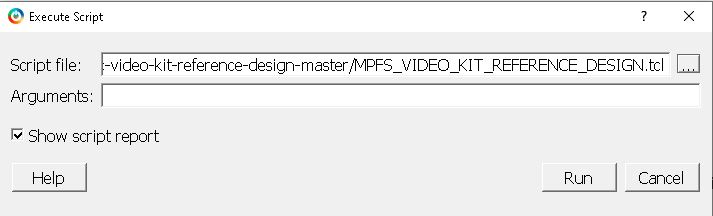

5. From the Design Flow window, double-click the "Generate FPGA Array Data"
   option and wait for the full process to finish

    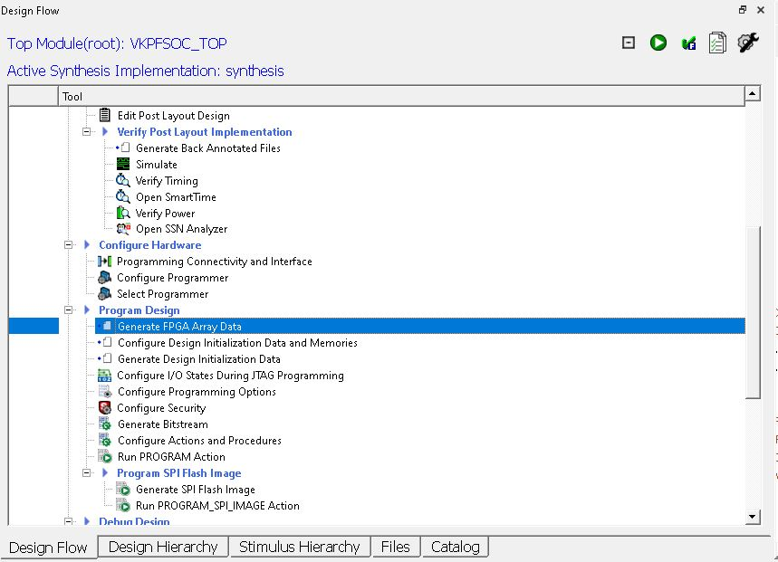

6. From the Design Flow window, double-click the Configure Design Initialization
   Data and Memories option. Select the SPI Flash tab and set the "Enable Auto
   Update" checkbox and then click the "Apply" button

    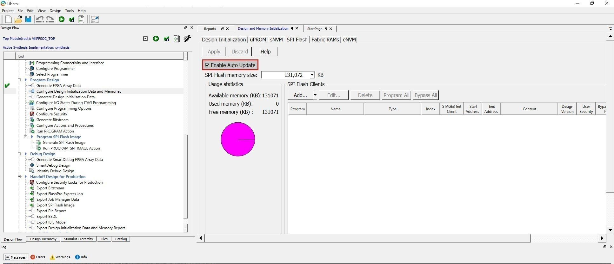

<a name="adding-an-envm-client-to-the-bitstream"></a>

#### Adding an eNVM client to the bitstream

It is possible to program an eNVM client which may be useful for upgrading the HSS.
To add an eNVM client:

1. From the Design Flow window, double-click the Configure Design Initialization
   Data and Memories option. Select the "eNVM" tab

    

2. Click the "Add" button and then select "Add Boot Mode 1 Client" from the dropdown menu

3. Select the binary that should be programmed to the eNVM. In this case, we
   will select the Hart Software Services compiled using the PolarFire SoC Video
   Kit as the target board. The binary should be in Intel Hex format.
   Click the OK button

    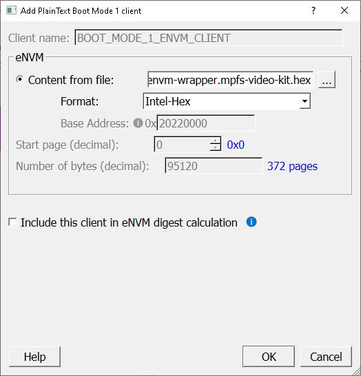

    Note: The [Hart Software Services release page](https://mi-v-ecosystem.github.io/redirects/redirects/redirects/releases-hart-software-services)
    on GitHub contains assets in Intel hex format that can be to program to the eNVM.

4. The eNVM tab should now show the eNVM client we just added in the step above.
   Click Apply to save the changes

    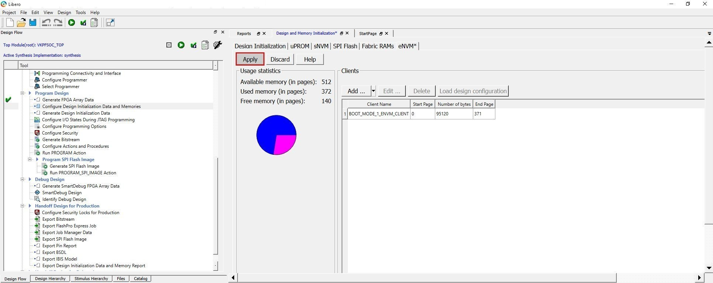

<a name="configuring-the-design-and-back-level-version"></a>

#### Configuring the Design and Back Level Version

1. From the Design Flow Window, double-click "Configure Programming Options"

    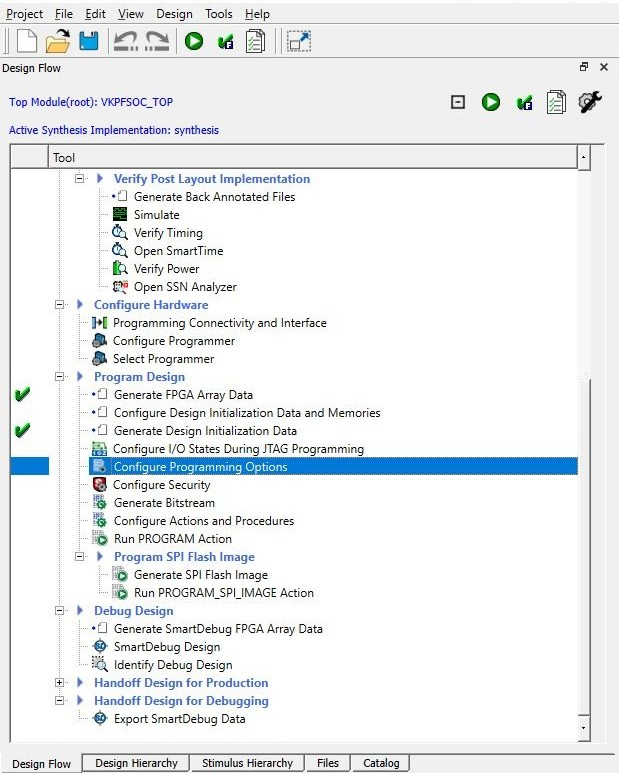

2. The following dialog box should appear:

    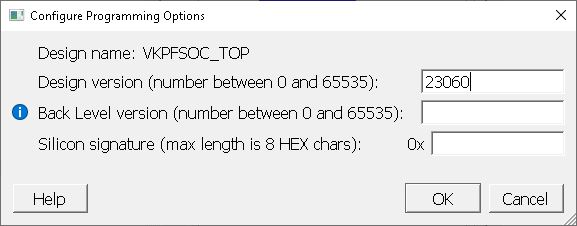

    The **Design version** is a number between 0 and 65535.
    It specifies the Design version of the generated bitstream.

    Back level protection blocks re-programming the FPGA with a bitstream
    older than that currently programmed.
    This is a security feature, disabled by default, that might be useful
    in a production environment. For more information please refer to the
    [PolarFire SoC Programming User Guide](https://www.microsemi.com/document-portal/doc_download/1245813-polarfire-fpga-and-polarfire-soc-fpga-programming-user-guide).

3. In this case we will set the Design version to 23060 to indicate
    that the bitstream contains the 2023.06 PolarFire SoC Video Kit Reference
    Design release.
    Click OK to apply the changes

4. From the Design Flow Window, double-click the Generate Bistream option

    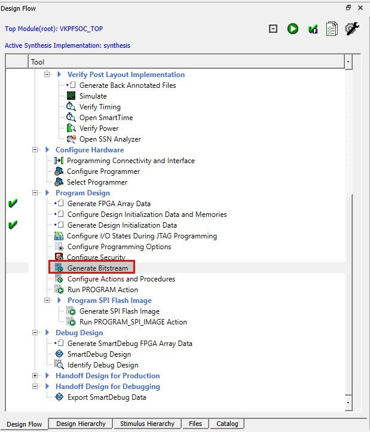

<a name="generating-a-golden-recovery-image"></a>

#### Generating a Golden/Recovery Image

A `golden image` needs to be present in the SPI flash in image index 0, address
0x100400, which will be used as a back-up if updating to the runtime supplied
image fails. The [SPI Flash Layout](#spi-flash-layout) section provides
additional information on the SPI descriptors and offsets required for
using auto update.

This section explains how to generate and configure a golden image
using Libero:

1. From the Design Flow window, double-click the Export Bistream option. Select
   the SPI checkbox to generate a bitstream with a `spi` extension. Click OK

    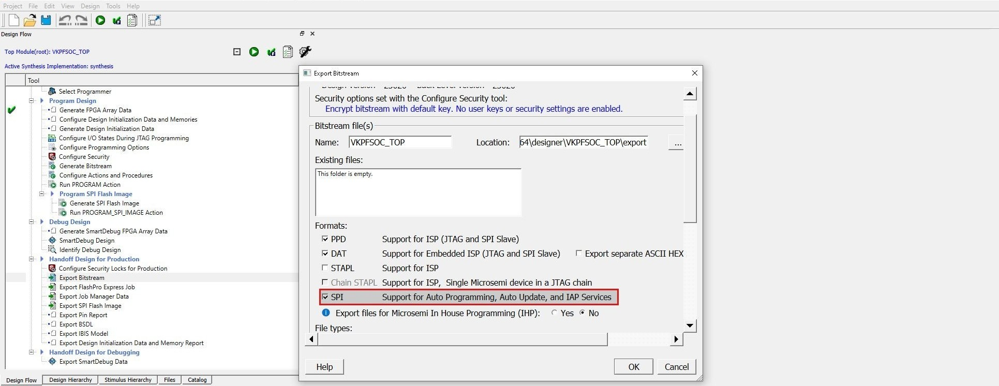

    Optionally, you can change the name and location of the output file.
    For demonstration purposes, we are going to leave the default values.
    The default output directory is `polarfire-soc-video-kit-reference-design/VKPFSOC_H264/designer/VKPSOC_TOP/export`.

2. Add the VKPFSOC_TOP.spi bitstream generated above as a Golden/Recovery image.
   From the Design Flow window, double-click the Configure Design Initialization
   Data and Memories

    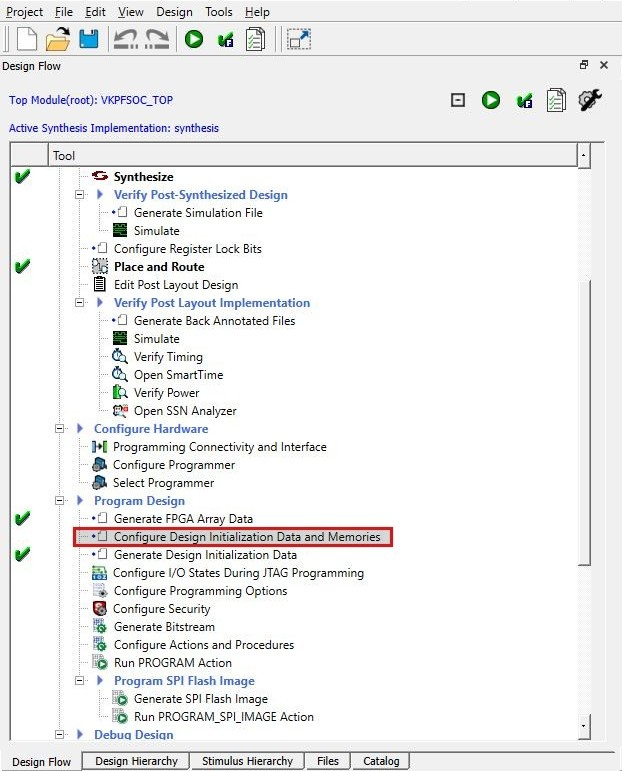

3. Select the SPI Flash tab. Select Add -> Add a SPI bitstream Client

    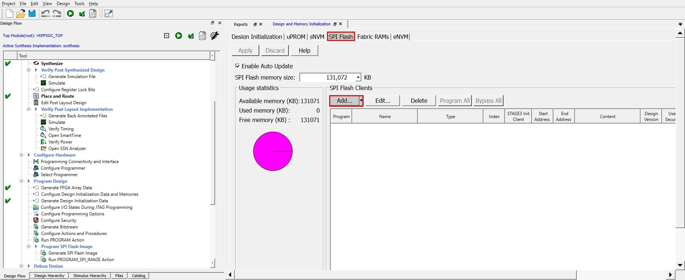

4. From the Add SPI Bistream client window, configure the following fields:

    Name: For demonstration purposes, we are going to set the name to
    `mpfs_golden_image`

    Type: SPI Bistream file for Recovery/Golden

    Start Address (HEX): 0x100400

    The space before 0x100400 is ordinarily reserved for non-bitstream objects,
    such as dt-overlays.
    From 0x100400 to 0x3D00400 is reserved for FPGA images.

    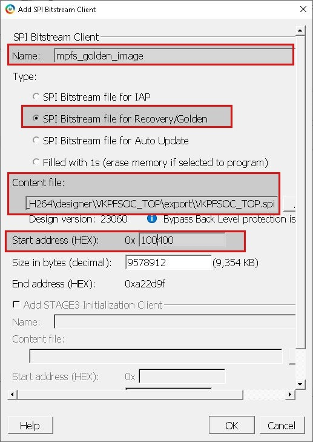

5. Click Ok and then select the Apply button to save the changes

6. From the Design Flow Window, double-click the Generate Bistream option

    

7. From the Design Flow Window, double-click the Generate SPI Flash Image

    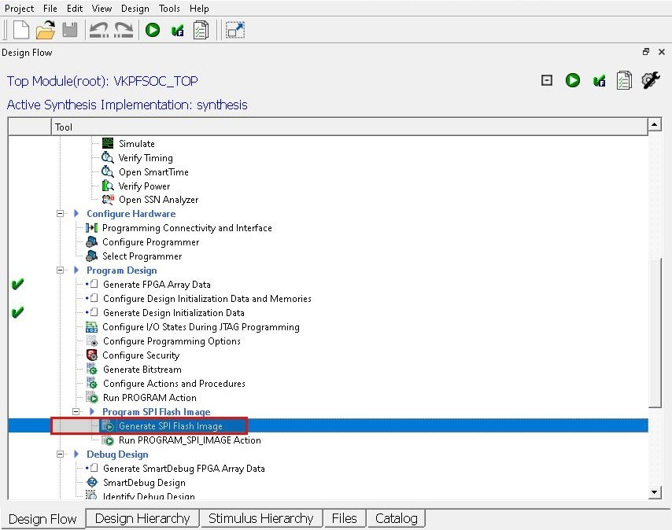

<a name="exporting-the-fpga-and-spi-programming-job-files"></a>

#### Exporting the FPGA and SPI Programming Job Files

1. Export the design into a Job File. From the Design Flow Window, select
   "Export Flash Pro Express Job"

    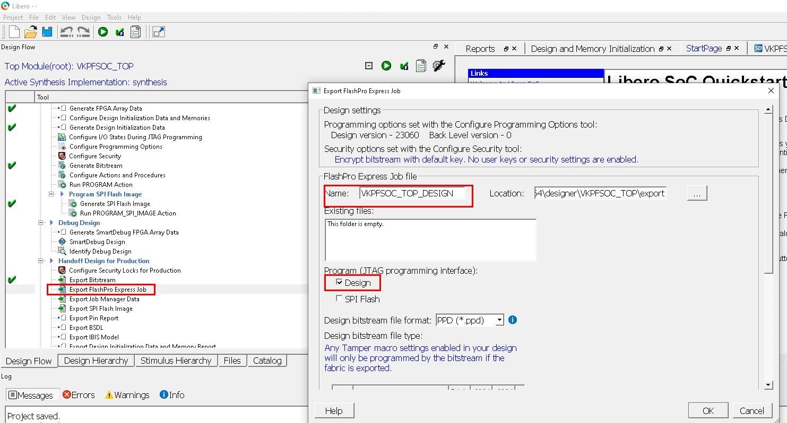

    Make sure you have selected the "Design" checkbox as shown in the image above.

    Optionally, you can change the name and location of the output file.
    For demonstration purposes, we are going to name it `VKPFSOC_TOP_DESIGN` and
    leave the default output directory.
    The default output directory is `polarfire-soc-video-kit-reference-design/VKPFSOC_H264/designer/VKPSOC_TOP/export`.

2. Export the SPI Flash golden image to a Job File. From the Design Flow Window, select "Export Flash Pro Express Job"

    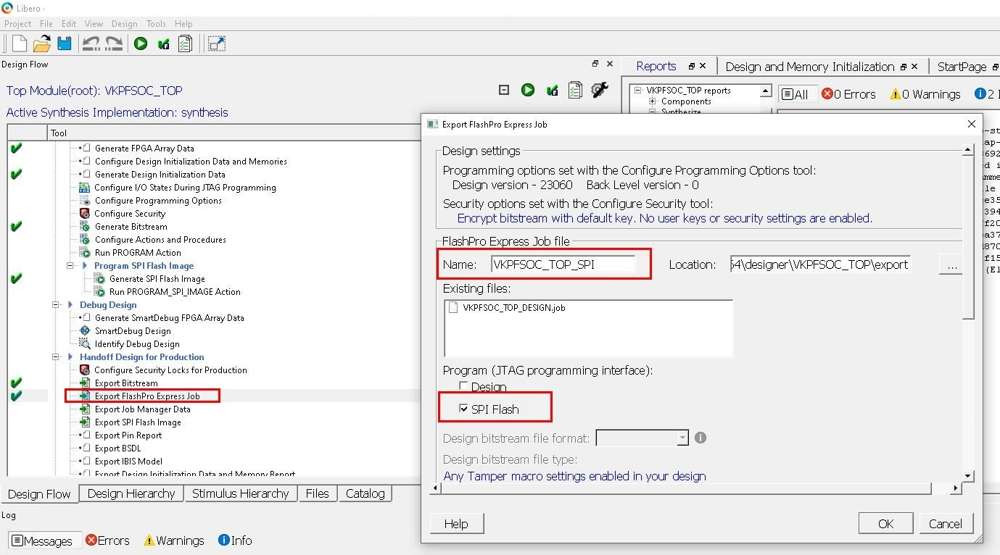

    Make sure you uncheck the "Design" checbox and select the "SPI Flash"
    checkbox as shown in the image above.

    Optionally, you can change the name and location of the output file.
    For demonstration purposes, we are going to name it `VKPFSOC_TOP_SPI` and
    leave the default output directory.
    The default output directory is `polarfire-soc-video-kit-reference-design/VKPFSOC_H264/designer/VKPSOC_TOP/export`.

<a name="programming-the-fpga-and-spi-programming-job-files-using-fpexpress"></a>

#### Programming the FPGA and SPI Programming Job Files Using FPExpress

In the previous section two FlashPro Express job files were generated,
one containing the design and another one containing the SPI Flash golden image.

In this section, we will use FlashPro Express tool to program both Job Files to
the Video Kit.

Before running the steps above make sure you connect the PC and the board using
a standard micro-USB cable into the USB-JTAG J5 connector.
For more information on FlashPro jumper settings please refer to the
[PolarFire SoC Video Kit User Guide][PolarFire SoC Video Kit User Guide].

1. Power on the Video Kit
2. Open FlashPro Express.
3. From the title bar select Project -> New Job Project
4. Import the FlashPro Express design job file `VKPFSOC_TOP_DESIGN.job`.

    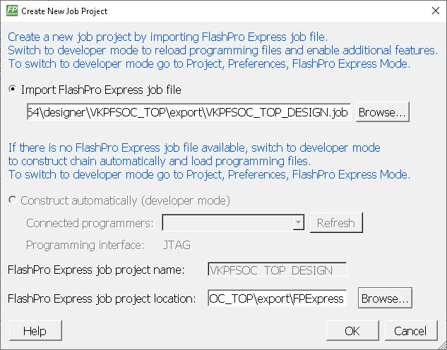

5. Press the RUN button to program the design to the Video Kit. Wait for the process to finish

    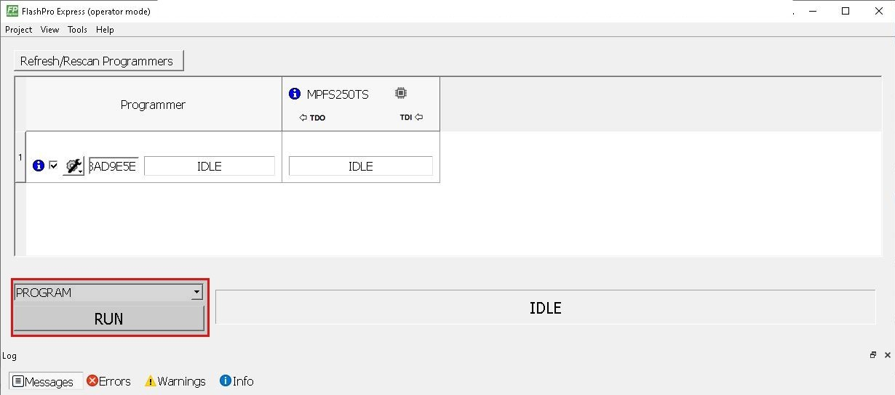

6. From the title bar select Project -> New Job Project to create a new project

7. Import the FlashPro Express SPI job file `VKPFSOC_TOP_SPI.job`

    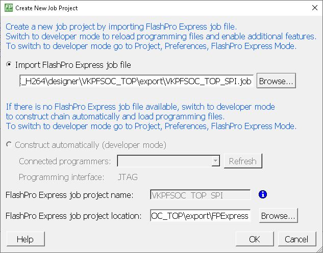

8. Press the RUN button to program the golden image to the System Controller SPI Flash. Wait for the process to finish

    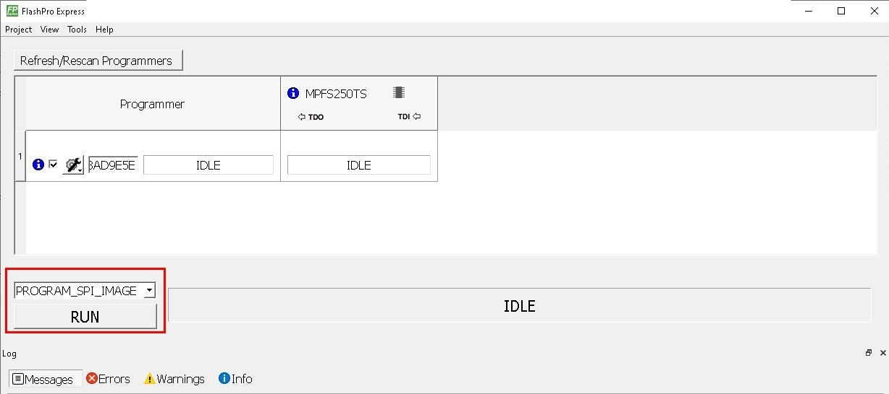

Once both FlashPro Express Job files have been programmed, the Video Kit will
be capable of supporting auto update.

[PolarFire SoC Video Kit User Guide]: https://mi-v-ecosystem.github.io/redirects/boards-mpfs-sev-kit-sev-kit-user-guide

<a name="devicetree-requirements-for-iap-and-auto-update"></a>

### DeviceTree Requirements for IAP and Auto Update

The system controller's QSPI & the attached flash must be present in the DeviceTree.
An example DeviceTree configuration would look like:

```dts
soc {
    #address-cells = <2>;
    #size-cells = <2>;
    compatible = "simple-bus";
    ranges;

    mbox: mailbox@37020000 {
        compatible = "microchip,mpfs-mailbox";
        reg = <0x0 0x37020000 0x0 0x58>, <0x0 0x2000318C 0x0 0x40>,
            <0x0 0x37020800 0x0 0x100>;
        interrupt-parent = <&plic>;
        interrupts = <96>;
        #mbox-cells = <1>;
        status = "okay";
    };

    syscontroller_qspi: spi@37020100 {
        compatible = "microchip,mpfs-qspi", "microchip,coreqspi-rtl-v2";
        #address-cells = <1>;
        #size-cells = <0>;
        reg = <0x0 0x37020100 0x0 0x100>;
        interrupt-parent = <&plic>;
        interrupts = <110>;
        clocks = <&scbclk>;
        status = "okay";

        sys_ctrl_flash: flash@0 { // MT25QL01GBBB8ESF-0SIT
                compatible = "jedec,spi-nor";
                #address-cells = <1>;
                #size-cells = <1>;
                spi-max-frequency = <20000000>;
                spi-rx-bus-width = <1>;
                reg = <0>;
        };
    };
};

syscontroller: syscontroller {
    compatible = "microchip,mpfs-sys-controller";
    mboxes = <&mbox 0>;
    microchip,bitstream-flash = <&sys_ctrl_flash>;
    status = "okay";
};
```

All required options are configured in the PolarFire SoC Video Kit device tree,
used as the basis of PolarFire SoC's support in
our [Yocto BSP][Yocto BSP] & [Buildroot][Buildroot].

[Yocto BSP]: https://github.com/polarfire-soc/meta-polarfire-soc-yocto-bsp
[Buildroot]: https://github.com/linux4microchip/buildroot-external-microchip

<a name="linux-requirements-for-auto-update"></a>

### Linux Requirements for Auto Update

The auto update driver and FPGA manager subsystem must be enabled:

```kconfig
CONFIG_FPGA=y
CONFIG_FPGA_BRIDGE=y
CONFIG_FPGA_REGION=y
CONFIG_FPGA_MGR_MICROCHIP_AUTO_UPDATE=y
CONFIG_FPGA_MGR_MICROCHIP_SPI=y
CONFIG_DEBUG_FS=y
```

All required options are set in mpfs_defconfig, used as the basis of PolarFire SoC's support in
our [Yocto BSP][Yocto BSP] & [Buildroot][Buildroot].

[Yocto BSP]: https://github.com/polarfire-soc/meta-polarfire-soc-yocto-bsp
[Buildroot]: https://github.com/linux4microchip/buildroot-external-microchip

<a name="performing-an-auto-update"></a>

## Performing an Auto Update

Before performing an auto update in Linux, you'll need:

1. A bitstream that supports auto update programmed to the device. This can be
   achieved by following the `Bitstream Requirements for Auto Update` section in
   this document. Alternatively, if using the PolarFire SoC Video Kit, reference
   design release assets can be used instead (v2023.06 reference design or higher)

2. A bitstream with a `.spi` file extension which contains a design version
   higher than the design version programmed in the device

The bitstream to be programmed must be placed in `/lib/firmware`, named `mpfs_bitstream.spi`.

```sh
root@mpfs-video-kit:~# mkdir -p /lib/firmware
root@mpfs-video-kit:~# cp foo.spi /lib/firmware/mpfs_bitstream.spi
```

Write a `1` to `/sys/kernel/debug/fpga/microchip_exec_update`, for example:

```sh
echo 1 > /sys/kernel/debug/fpga/microchip_exec_update
```

If successful, the console should display some messages indicating that the
bistream image has been transferred to the SPI flash and the bitstream
address has been copied to the spi flash directory. For more information
on the SPI flash memory layout please refer to the [SPI Directory Layout][SPI Directory Layout]
section.
Finally, the system controller reads the bitstream from the SPI flash to verify its content.

```text
root@mpfs-video-kit:~# echo 1 > /sys/kernel/debug/fpga/microchip_exec_update
[  109.173410] fpga_manager fpga0: writing mpfs_bitstream.spi to Microchip MPFS Auto Update FPGA Manager
[  109.293877] mpfs-auto-update mpfs-auto-update: Writing the image address (1500400) to the flash directory (4)
[  109.314809] mpfs-auto-update mpfs-auto-update: Erasing the flash at address (1500400)
[  147.676660] mpfs-auto-update mpfs-auto-update: Writing the image to the flash at address (1500400)
[  172.018172] mpfs-auto-update mpfs-auto-update: Running verification of Update Image
[  176.746100] mpfs-auto-update mpfs-auto-update: Verification of Update Image passed!
```

If verification passes, type `reboot` to initiate the re-programming:

```text
root@mpfs-video-kit:~# reboot
```

Once the reboot command gets issued, the system controller reads the
bitstream image from the SPI flash and programs the design into the device.
The following message should be displayed in the terminal to indicate
that the auto update is in progress.

```text
...
[  214.968630] reboot: Restarting system
[232.748680] reboot: Auto Update in progress

```

After a short delay, the HSS will start up and the new design should have been programmed to the device.

[SPI Directory Layout]: #spi-directory-layout

<a name="auto-update-failures"></a>

### Auto Update Failures

There are cases were writing the image to the flash or doing the auto update may fail.

#### No bitstream found in /lib/firmware directory

The following error is likely to occur if there is no bitstream named
`mpfs_bistream.spi` in the /lib/firmware directory:

```shell
root@mpfs-video-kit:~# echo 1 > /sys/kernel/debug/fpga/microchip_exec_update
[   56.441509] fpga_manager fpga0: writing mpfs_bitstream.spi to Microchip MPFS Auto Update FPGA Manager
[   56.450992] fpga_manager fpga0: Direct firmware load for mpfs_bitstream.spi failed with error -2
[   56.459881] fpga_manager fpga0: Error requesting firmware mpfs_bitstream.spi
[   56.467018] mpfs-auto-update mpfs-auto-update: Failed to write the bitstream
[   56.474149] mpfs-auto-update mpfs-auto-update: error -ENOENT: Auto Update failed
```

#### SPI Flash has insufficient capacity to store a bitstream

The following error is likely to occur if the image exceeds the space available on the flash:

```shell
root@mpfs-video-kit:~# echo 1 > /sys/kernel/debug/fpga/microchip_exec_update
[73801.553485] fpga_manager fpga0: writing mpfs_bitstream.spi to Microchip MPFS Auto Update FPGA Manager
[73806.743402] mpfs-auto-update mpfs-auto-update: flash device has insufficient capacity to store this bitstream
[73806.753474] fpga_manager fpga0: Error while writing image data to FPGA
[73806.959995] mpfs-auto-update mpfs-auto-update: Failed to write the bitstream
[73806.967184] mpfs-auto-update mpfs-auto-update: error -EINVAL: Auto Update failed
```

#### Failed to Verify the image (invalid bistream)

In this other example, the driver failed to verify the image that was intended to be programmed.
In this case, it is likely that the bitstream is invalid, ensure you have followed the steps in
this document for the creation of a correctly formatted bitstream.

```text
root@mpfs-video-kit:~# echo 1 > /sys/kernel/debug/fpga/microchip_exec_update
[73944.021438] fpga_manager fpga0: writing mpfs_bitstream.spi to Microchip MPFS Auto Update FPGA Manager
[73944.061811] mpfs-auto-update mpfs-auto-update: Writing the image address (1500400) to the flash directory (4)
[73944.082790] mpfs-auto-update mpfs-auto-update: Erasing the flash at address (1500400)
[73947.850574] mpfs-auto-update mpfs-auto-update: Writing the image to the flash at address (1500400)
[73950.270617] mpfs-auto-update mpfs-auto-update: Running verification of Update Image
[73950.298524] mpfs-auto-update mpfs-auto-update: Verification of Update Image failed!
[73950.314199] fpga_manager fpga0: Error after writing image data to FPGA
[73950.321164] mpfs-auto-update mpfs-auto-update: Failed to write the bitstream
[73950.328294] mpfs-auto-update mpfs-auto-update: error -EBADMSG: Auto Update failed
```

#### Auto Update Image is not an update

The following message may be seen if the version of the bitstream being programmed is the same as that
which is already programmed:

```text
root@mpfs-video-kit:~# echo 1 > /sys/kernel/debug/fpga/microchip_exec_update
[6100.853425] fpga_manager fpga0: writing mpfs_bitstream.spi to Microchip MPFS Auto Update FPGA Manager
[76100.975527] mpfs-auto-update mpfs-auto-update: Writing the image address (1500400) to the flash directory (4)
[76100.996143] mpfs-auto-update mpfs-auto-update: Erasing the flash at address (1500400)
[76139.708658] mpfs-auto-update mpfs-auto-update: Writing the image to the flash at address (1500400)
[76164.008867] mpfs-auto-update mpfs-auto-update: Running verification of Update Image
[76168.736811] mpfs-auto-update mpfs-auto-update: Verification of Update Image passed!
root@mpfs-video-kit:~# reboot
...
[76214.185933] reboot: Restarting system
[76232.88482] reboot: Auto Update image is not an update: 24
[76232.94498] reboot: Using fallback reboot provider
```

<a name="spi-flash-layout"></a>

## SPI Flash Layout

The first 1 MiB after the SPI directory is reserved for carrying information about the bitstream,
dt-overlays etc. It has no corresponding SPI directory.

```text
 |------------------------------| 0x0000000
 | 1 KiB                        |
 | SPI directory                |
 |------------------------------| 0x0000400
 | 1 MiB                        |
 | Reserved area                |
 | Used for bitstream info      |
 |------------------------------| 0x0100400
 | 20 MiB                       |
 | Golden Image                 |
 |------------------------------| 0x1500400
 | 20 MiB                       |
 | Auto Update Image           |
 |------------------------------| 0x2900400
 | 20 MiB                       |
 | Reserved for multi-image IAP |
 | Unused for Auto Update      |
 |------------------------------| 0x3D00400
 | ? B                          |
 | Unused                       |
 |------------------------------| 0x?
```

<a name="spi-directory-layout"></a>

### SPI Directory Layout

The SPI directory is a collection of image descriptor pointers that
point to the beginning of the programming image. For more information,
please refer to section 10.2 of the [PolarFire SoC FPGA Programming User Guide][PolarFire SoC FPGA Programming User Guide].

The SPI directory is laid out like so:

```text
 |------------------------------| 0x000
 | Golden Image Address:        |
 | 0x0100400                    |
 |------------------------------| 0x004
 | Update Image Address        |
 | 0x1500400                    |
 |------------------------------| 0x008
 | Empty                        |
 | 0x000000                     |
 |------------------------------| 0x00C
 | Unused for re-programming    |
 |                              |
 |------------------------------| 0x400
```

[PolarFire SoC FPGA Programming User Guide]: https://www.microsemi.com/document-portal/doc_download/1245813-polarfire-fpga-and-polarfire-soc-fpga-programming-user-guide
