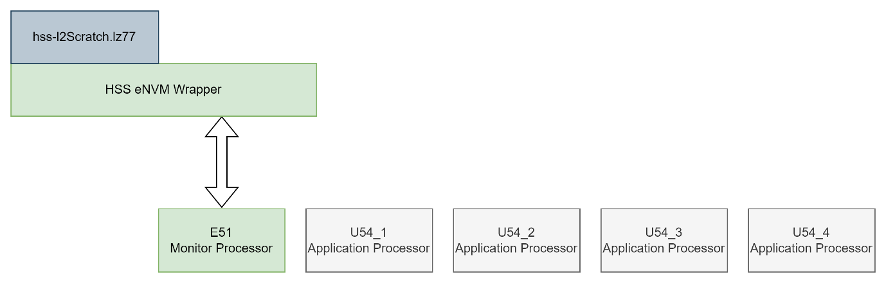
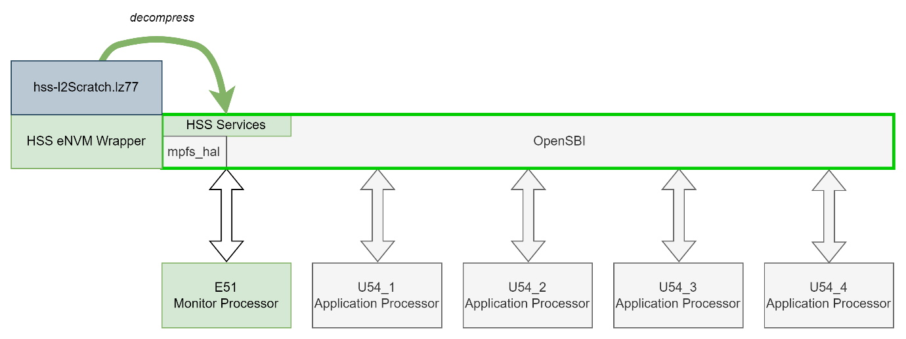
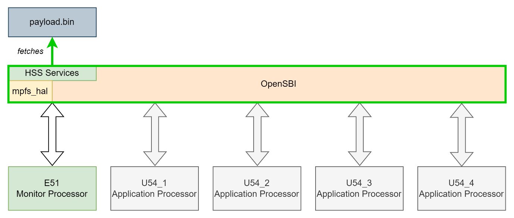
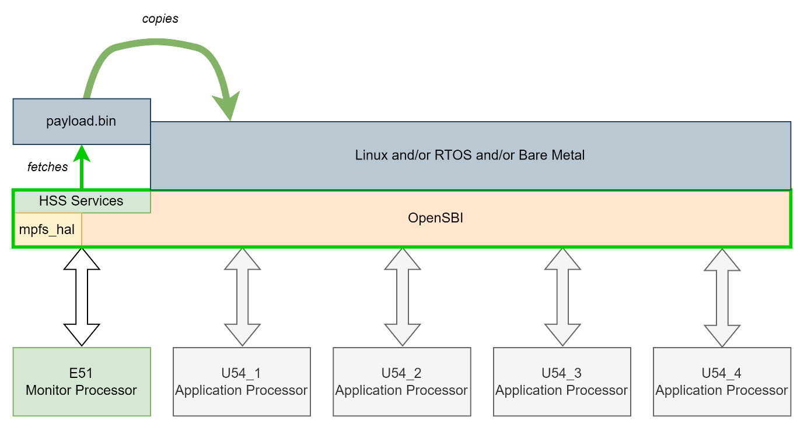
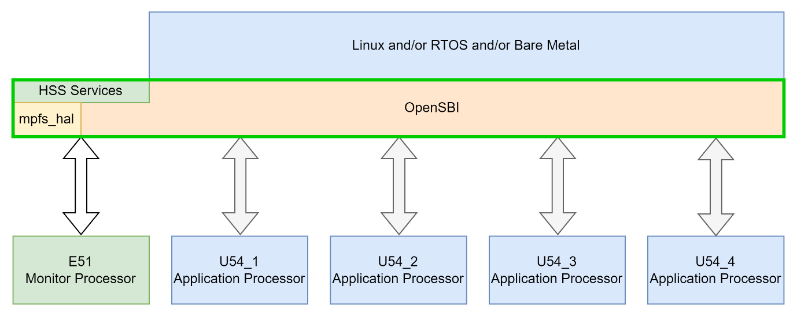
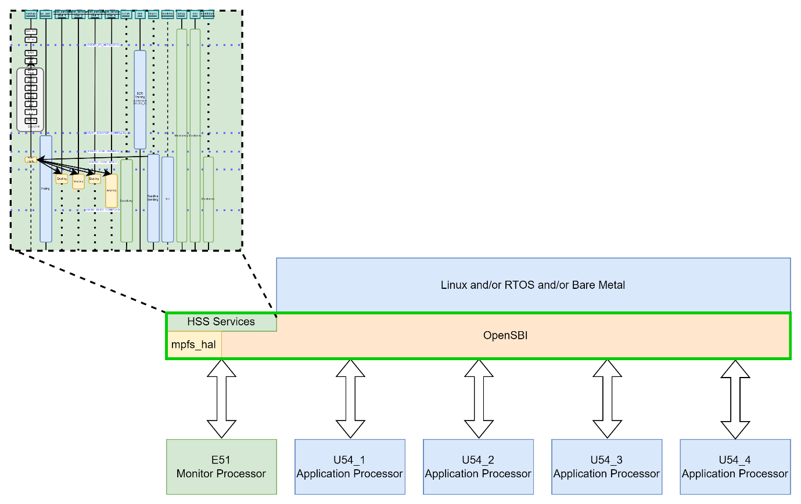
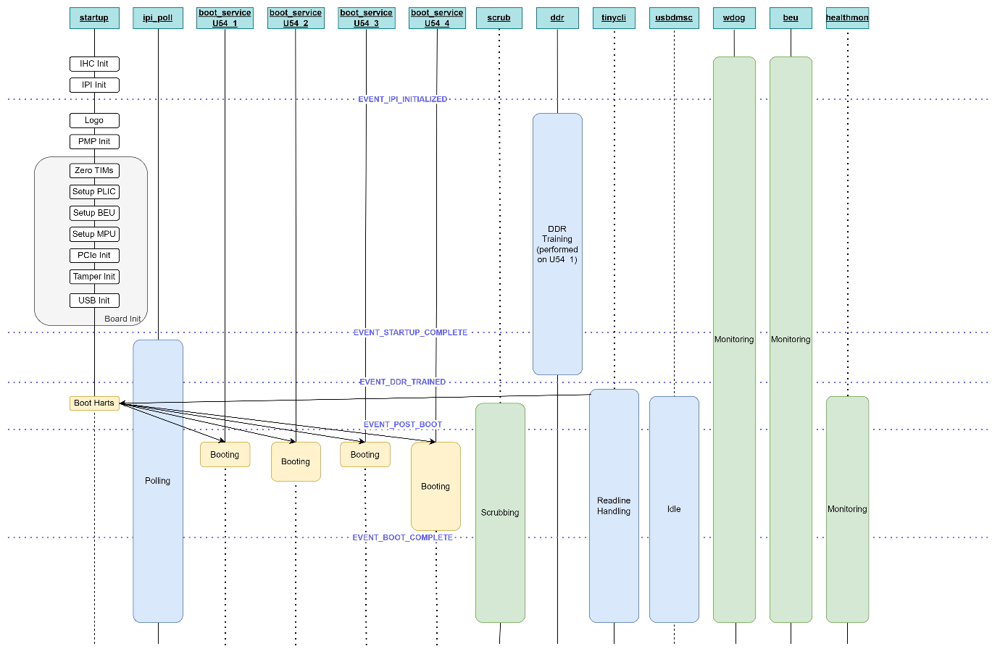
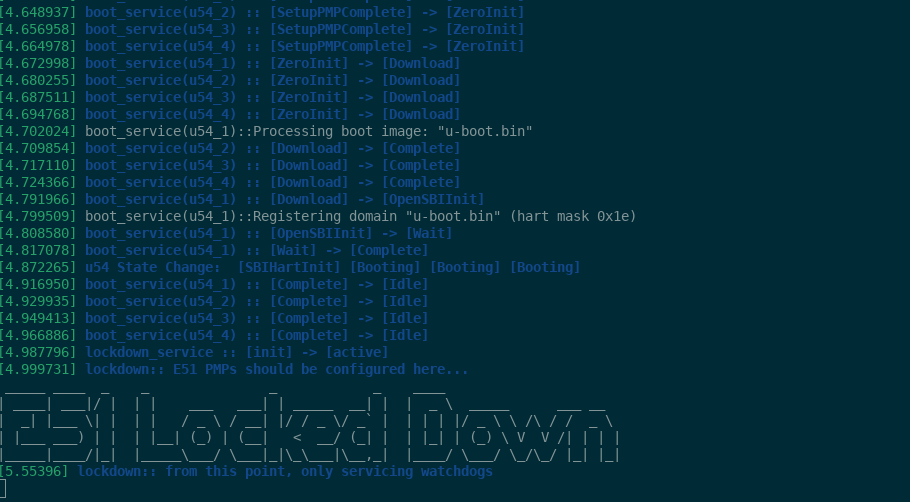
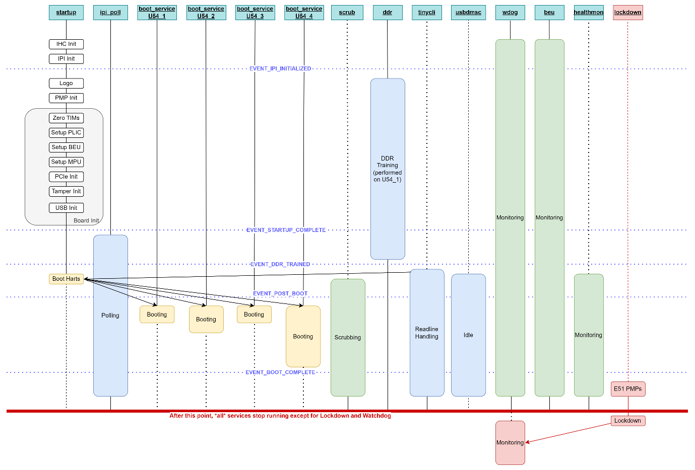
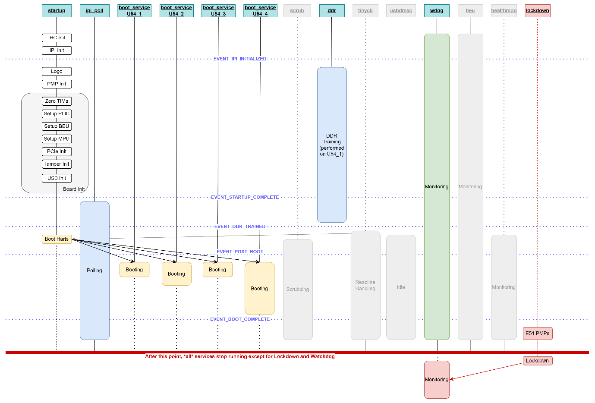

# PolarFire SoC: Hart Software Services E51 Lockdown Service

* [Overview](#overview)
* [What is the HSS exactly?](#what-is-the-HSS-exactly)
* [System Startup](#system-startup)
  * [Focusing on the HSS portion of System Startup](#focusing-on-the-HSS-portion-of-system-startup)
* [E51 Lockdown](#e51-lockdown)
  * [Reducing Footprint](#reducing-footprint)
* [Conclusions](#conclusions)

## Overview

This document introduced the HSS E51 Lockdown Service, which is intended
to provide a convenient mechanism for customers to limit and restrict
what code runs on the E51 once the system has successfully booted.

We'll describe what the HSS is, and how it is responsible for system
startup. We'll look in more detail at the way the services provided by
the HSS are structured. Finally, we'll look at how the E51 Lockdown
Service interacts with these services and provides hooks for the
developer to take control of what the E51 is going to do after a
successful system boot-up.

## What is the HSS exactly?

The Hart Software Services (HSS) is a zero-stage boot loader, system
monitor and Runtime Services Provider for Applications:

* The HSS supports early system setup, and DDR training.

* The HSS supports secure boot and hardware partitioning/separation

* The HSS supports booting from eMMC/SDCard and QSPI.

Normally (especially with AMP applications), it is expected that the HSS
will stay resident to allow per-context reboot (i.e reboot one context
only, without full-chip reboot), and to allow the HSS to monitor health
(ECCs, Lock Status Bits, Bus Errors, SBI errors, PMP violations, etc).

However, it is possible to put the HSS into lockdown mode once the U54
Application Harts have booted.

## System Startup

In order to understand exactly what the E51 Lockdown Service does, let's
start with some background on the way the HSS starts the system and gets
it up and running.

The HSS starts running from eNVM, where it decompressed itself from eNVM
to L2-Scratch memory.

Once decompression has completed, it jumps from eNVM to L2Scratch into
an executable consisting of three components:

* mpfs-hal and bare metal drivers

* OpenSBI (modified slightly for AMP purposes)

* HSS services (state machines run in a superloop)

The HSS service "Startup" initializes the hardware (mpfs-hal, trains DDR, etc.)
and OpenSBI.

The HSS then fetches the application workload (payload.bin) file from
external storage -- eMMC/SD/QSPI.

The HSS parses the data chunks from the payload.bin file, copying them
as required to their final runtime destinations. Once this is complete,
it runs the applications encapsulated in the payload.bin by starting
their respective AMP context(s).

Finally, the HSS instructs the U54 Application harts to start running
the application payload code, and any second stage boot loaders run on
them (e.g. U-Boot to bring-up Linux)...

### Focusing on the HSS portion of System Startup

At this point, let's focus specifically on the HSS aspects of system
start-up and look in more detail on the various services it runs.

The HSS implements its services as state machines that are run by a
superloop. Each time around the loop, every service is given an
opportunity to run and to progress state.

State machines synchronize with each other using notifications of
events, which trigger state machines of interest to progress.

For example, once inter-hart comms (IHC + IPI) is brought up, the DDR
state machine starts and farms DDR training work off to U54\_1. Once DDR
training is complete, any boot service depending on it can start, etc.

## E51 Lockdown

The v2024.06 release of the HSS introduced the Lockdown Service.

It can be enabled using the Kconfig option CONFIG\_SERVICE\_LOCKDOWN.

The lockdown service is intended to allow restriction of the activities
of the HSS after it boots the U54 application Harts.

The Lockdown Service is triggered by EVENT\_BOOT\_COMPLETE.

Once it starts, it blocks all other state machines from running.

It calls two weakly bound functions:

* e51\_pmp\_lockdown() and

* e51\_lockdown()

These functions are intended to be overridden by board-specific code.
The default implementation will just service the watchdog at this point
in the E51. See services/lockdown/lockdown\_service.c for details.

### Reducing Footprint

In addition to using the Lockdown Service, depending on what choices are
made as regards PMP-restricting the E51 (and thus HSS), it may make
sense to disable services not of interest to reduce the footprint of the
HSS.

These include the scrub, tinycli, usbdmsc, beu and healthmon services.

* These services will \*not\* be run once lockdown is active, but they
  also won't be automatically removed from the build.

* They can be individually disabled using Kconfig.

## Conclusions

This document introduced the HSS E51 Lockdown Service, which is intended
to provide a convenient mechanism for customers to limit and restrict
what code runs on the E51 once the system has successfully booted.

At the most extreme level (with no watchdog support), it is possible to
have the E51 remain in the equivalent of a `while (1) { ; }` loop. With
watchdog support enabled, the E51 will need to service the watchdogs but
nothing else.

E51 Lockdown can help a designer concerned with system integrity and
security to ensure that the HSS is locked down and locked out from
accessing any sensitive application data.
