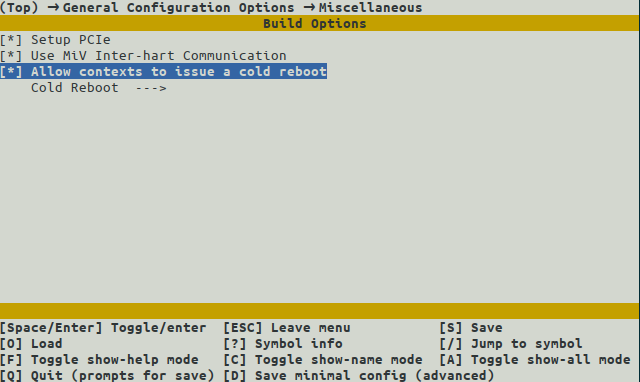
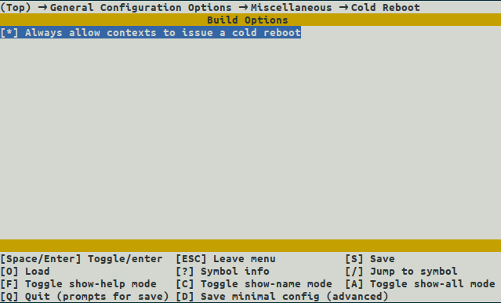
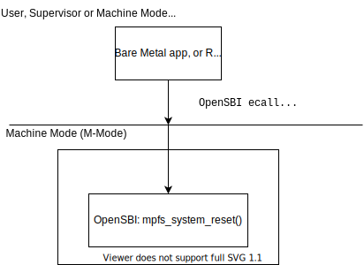

# PolarFire SoC: Hart Software Services Reboot

* [Overview](#overview)
* [Relevant KConfig Options](#relevant-hss-kconfig-options)
* [Reboot Operation](#reboot-operation)
  * [OpenSBI Reboot ecall](#opensbi-reboot-ecall)
  * [Bare Metal Reboot](#bare-metal-reboot)
  * [Linux Reboot](#linux-reboot)

This document provides a brief overview of the PolarFire SoC features related to system and context reboot.

Please refer to the [PolarFire SoC Microprocessor Subsystem (MSS) User Guide](https://www.microsemi.com/document-portal/doc_download/1244570-ug0880-polarfire-soc-fpga-microprocessor-subsystem-mss-user-guide) for the detailed description of PolarFire SoC.

<a name="overview"></a>

## Overview

In the context of PolarFire SoC workloads, system rebooting needs to consider both symmetric multiprocessing (SMP) and asymmetric multiprocessing (AMP) scenarios. In the case of an SMP system, a reboot can safety cold reboot the entire system as there are no additional workloads on another context to consider.

In the case on an AMP system, a workload might only be allowed to reboot itself (and not interfere with any other context), or it might be privileged to be able to perform a full system reboot.  For example, consider the following representative scenarios:

* **Scenario 1**: A single SMP context, which is allow request full system reboot


* **Scenario 2**: AMP, where context A is allow request full system reboot (affecting all contexts), and Context B is allowed reboot itself only


* **Scenario 3**: AMP, where context A and B are only allowed reboot themselves (and not affect the other context)


* **Scenario 4**: AMP, where context A and B are both allow request full system reboots


<a name="relevant-hss-kconfig-options"></a>

## Relevant HSS KConfig Options

The HSS contains two Kconfig options that control reboot functionality from the HSS perspective:

* `CONFIG_ALLOW_COLDREBOOT` - if this is enabled, it globally allows a context to issue a cold reboot ecall.  If disabled, only warm reboots will be permitted.  In addition to enabling this option, the permission to issue a cold reboot must be granted to a context via the payload generator YAML file or via the following Kconfig option.



* `CONFIG_ALLOW_COLDREBOOT_ALWAYS` - if enabled, this feature globally allows all contexts to issue a cold reboot ecall, irrespective of `payload.bin` flag entitlements.



Additionally, as suggested above, the payload.bin itself can contain a per-context flag indicating that a particular context is entitled to issue cold reboots:

* to allow a context warm reboot another context, we can add the option `allow-reboot: warm` in the YAML description file used to create the `payload.bin`;
* to allow a context cold reboot the entire system, we can add the option `allow-reboot: cold`. By default, without specifying `allow-reboot`, a context is only allowed warm reboot itself.

Irrespective of the setting of this flag, if `CONFIG_ALLOW_COLDREBOOT` is not enabled in the HSS, the HSS will rework all cold reboot requests to warm (per-context) reboots.

<a name="reboot-operation"></a>

## Reboot Operation

This section describes how the reboot works in detail - starting with the OpenSBI layer (the lowest M-mode layer) and then discussing how this OpenSBI layer functionality is triggered from either a Bare Metal or RTOS application, or from a rich OS like Linux.

<a name="opensbi-reboot-ecall"></a>

### OpenSBI Reboot ecall

The RISC-V Supervisor Binary Interface (SBI) specification describes a standardized hardware abstraction layer for platform initialization and firmware runtime services.  The main purpose of SBI is to enable portability and compatibility across different RISC-V implementations.

OpenSBI (Open Source Supervisor Binary Interface) is an open-source project that provides a reference implementation of the SBI specification.  OpenSBI also provides runtime services, including interrupt handling, timer management, and console I/O, which can be utilized by higher-level software layers.

OpenSBI is included as part of the HSS and runs at the machine mode level.  When the operating system or application causes a trap, it will be passed to OpenSBI to handle it. OpenSBI exposes certain system-call type functionality to the upper layers of software via a particular trap mechanism called an *ecall*.

The legacy SBI v0.1 Shutdown extension (EID 0x8) puts all the harts to shutdown state from supervisor point of view.  The `SBI_EXT_0_1_SHUTDOWN` extension is defined in `thirdparty/opensbi/include/sbi/sbi_ecall_interface.h` as:

```C
    #define SBI_EXT_0_1_SHUTDOWN                    0x8
```

The System Reset (EID 0x53525354) replaces the legacy SBI Shutdown extension ecall in providing a more comprehensive system call function that allow upper layer software to request system-level reboot or shutdown.

The `SBI_EXT_SRST_RESET` extension is defined in `thirdparty/opensbi/include/sbi/sbi_ecall_interface.h` as:

```C
    /* SBI function IDs for SRST extension */ #define SBI_EXT_SRST_RESET                0x0

    #define SBI_SRST_RESET_TYPE_SHUTDOWN      0x0
    #define SBI_SRST_RESET_TYPE_COLD_REBOOT   0x1
    #define SBI_SRST_RESET_TYPE_WARM_REBOOT   0x2
    #define SBI_SRST_RESET_TYPE_LAST          SBI_SRST_RESET_TYPE_WARM_REBOOT

    #define SBI_SRST_RESET_REASON_NONE        0x0
    #define SBI_SRST_RESET_REASON_SYSFAIL     0x1
```

THe HSS adds an `sbi_system_reset_device` structure named `mpfs_reset`.

Once the upper layers (Linux, RTOS or bare metal) issue an SBI ecall for a reset, the control flow, is as follows:

```C
    .
    ├── application/crt.S::_trap_Handler
    │   └── thirdparty/opensbi/lib/sbi/sbi_trap.c::sbi_trap_handler()
    │       └── thirdparty/opensbi/lib/sbi/sbi_ecall.c::sbi_ecall_handler()
    │           └── thirdparty/opensbi/lib/sbi/sbi_ecall_legacy.c::sbi_ecall_legacy_handler()
    │               └── thirdparty/opensbi/lib/sbi/sbi_system.c::sbi_system_reset()
    │                   └── services/opensbi/platform.c::mpfs_system_reset()
    │                       └── thirdparty/opensbi/lib/sbi/sbi_init.c::sbi_exit()
    │                           └── thirdparty/opensbi/lib/sbi/sbi_hsm.c::sbi_hsm_exit()
    │                               └── thirdparty/opensbi/lib/sbi/sbi_hsm.c::hsm_device_hart_stop()
    │                                   └── services/opensbi/platform.c:mpfs_hart_stop()
    │                                       └── services/opensbi/opensbi_service.c:HSS_OpenSBI_Reboot() or services/wdog/wdog_service.c:HSS_Wdog_Reboot()
```

`mpfs_hart_stop()` decides, based on the `reset_type` provided and on the privileges of the context, whether to do a full-system cold reboot (forced via `HSS_Wdog_Reboot()`, or a context-based warm reboot (via `HSS_OpenSBI_Reboot()`).

See the [RISC-V Supervisor Binary Interface Specification](https://github.com/riscv-non-isa/riscv-sbi-doc/blob/master/riscv-sbi.adoc) for more details, particularly [System Reset Extension (EID #0x53525354 "SRST")](https://github.com/riscv-non-isa/riscv-sbi-doc/blob/master/riscv-sbi.adoc#system-reset-extension-eid-0x53525354-srst).

<a name="bare-metal-reboot"></a>

### Bare Metal Reboot

A bare metal application can issue an `SBI_EXT_0_1_SHUTDOWN` or `SBI_EXT_SRST_RESET` SBI ecall and cause a cold or warm reboot, depending on the Kconfig settings used to build the HSS and the entitlements of that bare metal context within the payload.bin.



<a name="linux-reboot"></a>

### Linux Reboot

In Linux, the `shutdown` command is used to halt or reboot the system.  The command typically has a number of aliases, namely `halt`, `poweroff` and `reboot`.

These aliases specify whether to halt the machine at shutdown, to power-off the machine at shutdown, or to reboot the machine at shutdown.

These user space commands issue a reboot system call to Linux, which is trapped by the kernel and interworked to an SBI ecall.

There are various levels of reboot - `REBOOT_WARM`, `REBOOT_COLD`, `REBOOT_HARD` - these can be passed as command line arguments to the kernel (for example, `reboot=w[arm]` for `REBOOT_WARM`). In the Linux kernel source code, see [Documentation/admin-guide/kernel-paramters.txt](https://www.kernel.org/doc/Documentation/admin-guide/kernel-parameters.txt) for more details.

Alternatively, if `/sys/kernel/reboot` is enabled, the handlers underneath can be read to get the current system reboot configuration, and written to alter it. In the Linux kernel source code, see [Documentation/ABI/testing/sysfs-kernel-reboot](https://www.kernel.org/doc/Documentation/ABI/testing/sysfs-kernel-reboot) for more details.

The control flow (from Linux v5.15) is as follows -- first the shutdown function is registered, and then, sometime later, a reboot system call is invoked which triggers an SBI ecall.

```C
    ├── arch/riscv/kernel/sbi.c::sbi_init()
    │   └── arch/riscv/kernel/sbi.c::sbi_set_power_off() /* pm_power_off = sbi_shutdown() */
    .
    ├── kernel/reboot.c::SYSCALL_DEFINE4(reboot, ...)
    │   └── kernel/reboot.c::kernel_restart()
    │       └── arch/riscv/kernel/reset.c::machine_power_off()
    │           └── arch/riscv/kernel/sbi.c::sbi_shutdown()
    │               └── arch/riscv/kernel/sbi.c::sbi_ecall() => trap to HSS...
```


