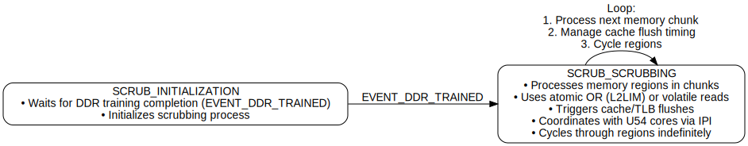

# PolarFire SoC: Hart Software Services Memory Scrubbing Service

- [Overview](#overview)

- [State Machine Structure](#state-machine-structure)
  - [States](#states)

- [Key Components](#key-components)
  - [Memory Regions](#memory-regions)
  - [Scrubbing Mechanism](#scrubbing-mechanism)
  - [Cache Management](#cache-management)
  - [Configuration Options](#configuration-options)
  - [Inter-Processor Communication (IPI)](#inter-processor-communication)
  - [Debugging & Statistics](#debugging-and-statistics)

- [Flow Summary](#flow-summary)

- [Conclusion](#conclusion)

This document provides a brief overview of the PolarFire SoC HSS memory scrubbing service.

Please refer to the [PolarFire SoC Microprocessor Subsystem (MSS) User Guide](https://ww1.microchip.com/downloads/aemDocuments/documents/FPGA/ProductDocuments/ReferenceManuals/PolarFire_SoC_FPGA_MSS_Technical_Reference_Manual_VC.pdf)
for the detailed description of PolarFire SoC.

## Overview

In embedded systems, memory integrity is critical for ensuring reliable operation, especially
in harsh environments where soft errors such as bit flips can occur. To mitigate such risks,
the HSS supports autonomous memory scrubbing independent of application workloads. It
systematically accesses and checks various memory regions for potential errors, utilizing
inter-processor coordination and cache management to preserve system integrity with minimal
overhead.

This document details the memory scrubbing system's state machine implementation, key
components, configuration options, and runtime behavior.

The HSS implements a **memory scrubbing state machine** to detect and prevent memory errors in
embedded platforms. It primarily operates on two states: **initialization** and **scrubbing**.

The mechanism manages various memory regions, including L2 cache, DDR, DTIM, and more. It also
incorporates cache flushing and inter-processor interrupts (IPI) to maintain cache coherence
and system stability.

## State Machine Structure

### States

#### 1. Initialization (`SCRUB_INITIALIZATION`)

- **Purpose**: Wait for DDR training to complete before beginning scrubbing.
- **Transition**: Proceeds to `SCRUB_SCRUBBING` upon receiving the `EVENT_DDR_TRAINED` notification.

#### 2. Scrubbing (`SCRUB_SCRUBBING`)

- **Purpose**: Iteratively scrub configured memory regions.
- **Actions**:
  - Processes each memory region in configurable chunk sizes.
  - Uses atomic operations or volatile reads to trigger error detection.
  - Periodically flushes caches and coordinates with other harts via IPIs.

## Key Components

### Memory Regions

Regions are defined by linker symbols and controlled using `CONFIG_SERVICE_SCRUB_*` options.
Example memory areas include:

- **L2LIM**: L2 Limited memory
- **L2 Scratchpad**
- **DDR**: Both cached and non-cached regions
- **DTIM**: Data Tightly Integrated Memory
- **ITIM**: Instruction Tightly Integrated Memory (per core)

### Scrubbing Mechanism

- **Atomic OR for L2LIM**:
  Uses `__atomic_or_fetch` to ensure access is not optimized away by the compiler.

- **Volatile Read for Other Regions**:
  Ensures actual memory access to provoke fault detection.

- **Chunk Processing**:
  Processes memory in chunks (defined by `CONFIG_SERVICE_SCRUB_MAX_SIZE_PER_LOOP_ITER`) to
  minimize blocking.

### Cache Management

- **Local Cache Flush**:
  The E51 core flushes its instruction cache using `fence.i`.

- **Remote Cache Flush**:
  Sends IPI messages to U54 cores to trigger `fence.i` and `sfence.vma`.

- **L2 Cache Flush**:
  - Disables eviction sequentially for L2 cache ways.
  - Reads from a zero device to flush content.
  - Restores original L2 configuration post-flush.

**IMPORTANT**: the scrubbing service works with systems that utilize coherent memory. For
system designs that make use of non-coherent memory for DMA purposes, enabling scrubbing could
cause issues with coherency and unanticipated L2 cache flushes. For these reasons, scrubbing
defaults to disabled in the HSS.

### Configuration Options

- `CONFIG_SERVICE_SCRUB_RUN_EVERY_X_SUPERLOOPS`:
  Controls how often scrubbing is performed.

- Region-specific options (e.g., `CONFIG_SERVICE_SCRUB_L2LIM`):
  Enable/disable scrubbing for specific regions.

### Inter-Processor Communication (IPI)

#### `Scrub_IPIHandler`

- Flushes instruction cache (`fence.i`) and TLB (`sfence.vma`).

- Triggered remotely from E51 to U54 cores for cache coherence.

### Debugging & Statistics

- **`scrub_dump_stats()`**:
  Displays current scrubbing progress (region index, offset, iteration count).

## Flow Summary

1. Initialization:
- Wait for DDR training completion.

2. Scrubbing Loop:
- For each configured memory region:
  - Perform chunked memory access (atomic or volatile).
  - Periodically flush local and remote caches.
  - Execute L2 cache flushing to prevent stale data.
- Repeat until all regions have been scrubbed.

## Conclusion

This memory scrubbing state machine provides a robust and efficient method to maintain memory
integrity in embedded systems. By employing atomic/volatile memory access patterns, leveraging
inter-hart coordination, and managing cache consistency, it proactively detects memory faults
without disrupting system performance. With configurable options and debug capabilities, the
system is adaptable to various runtime conditions and development requirements.
