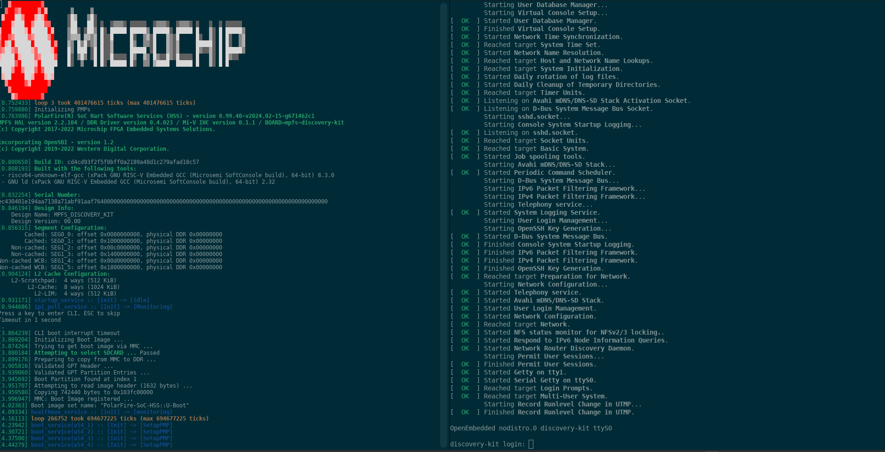

# MPFS Discovery Kit Embedded Software User Guide

## Table of Contents

- [MPFS Discovery Kit Embedded Software User Guide](#mpfs-discovery-kit-embedded-software-user-guide)
  - [Table of Contents](#table-of-contents)
  - [Introduction](#introduction)
  - [Connectors and Jumpers](#connectors-and-jumpers)
    - [Default Jumper Settings](#default-jumper-settings)
  - [Coming out of the box](#coming-out-of-the-box)
  - [Updating](#updating)
  - [Connecting to MSS UART interfaces from Linux hosts](#connecting-to-mss-uart-interfaces-from-linux-hosts)
  - [References](#references)

<a name="introduction"></a>

## Introduction

The PolarFire SoC Discovery Kit features an MPFS095T PolarFire SoC device.
Microchip's PolarFire SoC devices combine a RISC-V 5x core Microprocessor Subsystem capable of running Linux and the PolarFire FPGA fabric in a single device.
This powerful combination enables the partitioning of user designs between the Microprocessor Subsystem (MSS) and the FPGA fabric.
Microchip's Libero SoC enables the rapid development of RTL based designs for PolarFire SoC and many other device families.
Libero SoC provides a wide range of IP for a variety of applications such as video and imaging, signal processing, wired and wireless communications, and networking.
Microchip's SoftConsole IDE enables the rapid development of C/C++ source code based applications targeted for all Microchip FPGA and SoC device families.

<a name="connectors-and-jumers"></a>

## Connectors and Jumpers

The connectors and jumpers for the Discovery Kit can be seen below:


<a name="default-jumper-settings"></a>

### Default Jumper Settings

The Discovery Kit jumper settings required to boot Linux are as follows:

| Jumper | Setting | Description                                                               |
|:-------|:--------|:--------------------------------------------------------------------------|
| J45    | 1 & 2   | Bank 1 voltage. 1 & 2: 3.3V, 2 & 3: 2.5v                                  |
| J46    | 1 & 2   | Bank 1 voltage. 1 & 2: 3.3V, 2 & 3: 2.5v                                  |
| J47    | Closed  | Power supply selection, closed: USB C power, open: jack power             |
| J49    | 1 & 2   | Reference power for 7 segment display connector. 1 & 2: 3.3V, 2 & 3: 5V   |

<a name="coming-out-of-the-box"></a>

## Coming out of the box

The Discovery Kit is pre-programmed with a FIR filter example design.
To boot Linux the Discovery Kit will need to be re-programmed with the reference design from the [Discovery Kit Reference Design Repository](https://github.com/polarfire-soc/polarfire-soc-discovery-kit-reference-design).
FlashPro express files for programming without using Libero are available in the "Releases". Consult the [Updating MPFS Kit](https://mi-v-ecosystem.github.io/redirects/boards-mpfs-generic-updating-mpfs-kit) document for information on how to update the kit to a bitstream supporting Linux.

Connect the Discovery Kit's USB C connector (J4) to your host computer.
Use the terminal software of your choice (Putty ExtraPutty, minicom, screen) to open serial connections to the three UARTs available though the USB C connector.
**Serial port settings: 115220 baud, no flow control, no parity**.
Power cycle the board. This should result in boot messages appearing on two of the serials ports.



MMUART1 (1st COM port) displays the Hart Software Service (HSS) boot messages.
MMUART4 (2nd COM port) displays U-Boot messages, Linux boot messages and provides a Linux prompt.
The default user name is "root".
No password is required.
If a password is requested at any stage "microchip" is used as default password.

<a name="updating"></a>

## Updating

Consult the [Updating MPFS Kit](https://mi-v-ecosystem.github.io/redirects/boards-mpfs-generic-updating-mpfs-kit) document on the steps to update a PolarFire SoC development kit to the latest reference design and Linux images.

Pre-generated FPGA programming job files for the Discovery Kit can be found in the releases section of the [Discovery Kit Reference Design](https://mi-v-ecosystem.github.io/redirects/repo-discovery-kit-reference-design) repository.

Linux images for the Discovery Kit are available from the releases section of the [Meta PolarFire SoC Yocto BSP](https://mi-v-ecosystem.github.io/redirects/releases-meta-polarfire-soc-yocto-bsp).

<a name="linux-host-uart"></a>

## Connecting to MSS UART interfaces from Linux hosts

If the Discovery Kit is being used with a Linux host PC the following udev rules should be added to allow Linux to detect the FTDI USB to UART bridge.
Without these settings COM ports may not appear on the Linux host.

Add the following to: ```/etc/udev/rules.d/70-microchip.rules``` using a text editor such as vim or nano:

```console
# Bind ftdi_sio driver to all input
ACTION=="add", ATTRS{idVendor}=="1514", ATTRS{idProduct}=="2008", \
ATTRS{product}=="Embedded FlashPro5", ATTR{bInterfaceNumber}!="00", \
RUN+="/sbin/modprobe ftdi_sio", RUN+="/bin/sh -c 'echo 1514 2008 > /sys/bus/usb-serial/drivers/ftdi_sio/new_id'"

# Unbind ftdi_sio driver for channel A which should be the JTAG
SUBSYSTEM=="usb", DRIVER=="ftdi_sio", ATTR{bInterfaceNumber}=="00", ATTR{interface}=="Embedded FlashPro5",\
RUN+="/bin/sh -c 'echo $kernel > /sys/bus/usb/drivers/ftdi_sio/unbind'"

# Helper (optional)
KERNEL=="ttyUSB[0-9]*", SUBSYSTEM=="tty", SUBSYSTEMS=="usb", \
ATTRS{interface}=="Embedded FlashPro5", ATTRS{bInterfaceNumber}=="01", \
SYMLINK+="ttyUSB-FlashPro5B" GROUP="dialout" MODE="0666"

KERNEL=="ttyUSB[0-9]*", SUBSYSTEM=="tty", SUBSYSTEMS=="usb", \
ATTRS{interface}=="Embedded FlashPro5", ATTRS{bInterfaceNumber}=="02", \
SYMLINK+="ttyUSB-FlashPro5C" GROUP="dialout" MODE="0666"

KERNEL=="ttyUSB[0-9]*", SUBSYSTEM=="tty", SUBSYSTEMS=="usb", \
ATTRS{interface}=="Embedded FlashPro5", ATTRS{bInterfaceNumber}=="03", \
SYMLINK+="ttyUSB-FlashPro5D" GROUP="dialout" MODE="0666"
```

<a name="references"></a>

## References

[PolarFire SoC Discovery Kit Quick Start Guide](https://onlinedocs.microchip.com/v2/literature/DS50003565?version=latest&redirect=true)

[PolarFire SoC Discovery Kit Schematics](https://ww1.microchip.com/downloads/aemDocuments/documents/FPGA/ProductDocuments/ReferenceManuals/PolarFire_SoC_Discovery_Kit_Rev2_SCH_090423_01.pdf)

[PolarFire SoC Discovery Kit Product Page](https://www.microchip.com/en-us/development-tool/mpfs-disco-kit)
