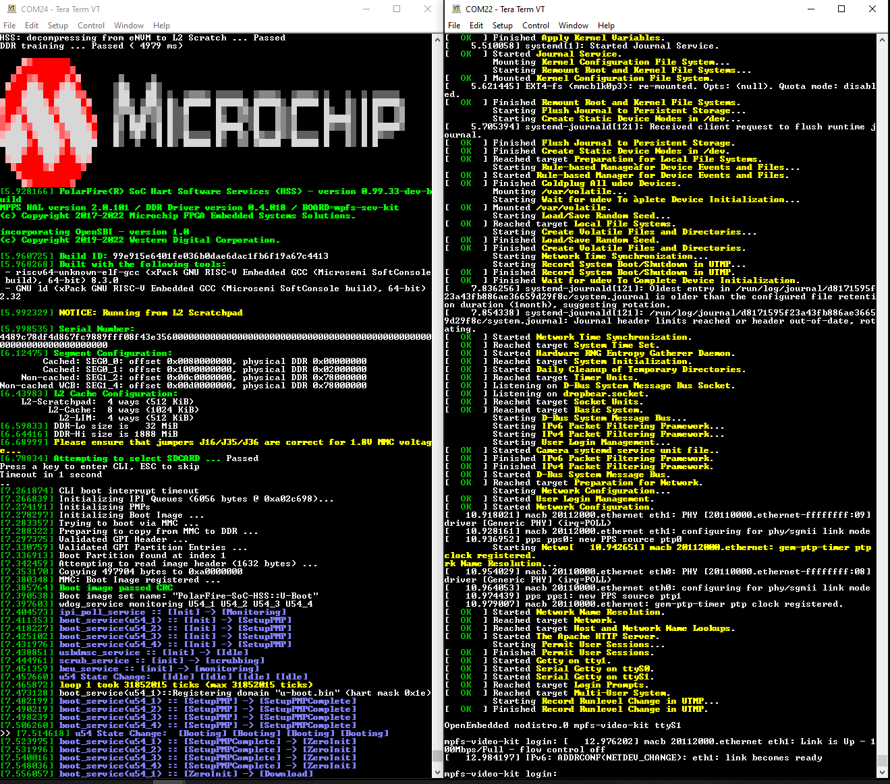

# MPFS Video Kit User Guide

## Table of Contents

- [MPFS Video Kit User Guide](#mpfs-mpfs-video-kit-user-guide)
  - [Table of Contents](#table-of-contents)
  - [Introduction](#introduction)
  - [Connectors & Jumpers](#connectors-&-Jumpers)
    - [Default Jumper Settings](#default-jumper-settings)
    - [FlashPro Jumpers](#flashpro-jumpers)
  - [Coming out of the box](#coming-out-of-the-box)
  - [Updating](#updating)
  - [References](#references)

## Introduction

The PolarFire® SoC Video Kit features an MPFS250TS PolarFire SoC device.
Microchip's PolarFire SoC devices combine a RISC-V 5x core Microprocessor Subsystem capable of running Linux and the PolarFire FPGA fabric in a single device.
This powerful combination enables the partitioning of user designs between the Microprocessor Subsystem (MSS) and the FPGA fabric.
Microchip's Libero SoC enables the rapid development of RTL based designs for PolarFire SoC and many other device families.
Libero SoC provides a wide range of IP for a variety of applications such as video and imaging, signal processing, wired and wireless communications, and networking.
Microchip's SoftConsole IDE enables the rapid development of C/C++ source code based applications targeted for all Microchip FPGA and SoC device families.

The PolarFire SoC Video kit is the industry’s first RISC-V SoC FPGA-based, full-featured embedded vision
development platform.
It targets secure, reliable, and power-efficient vision applications at the edge, industrial IoT and automation.
It supports Microchip’s VectorBlox neural network accelerator IP and SDK.

The kit features dual 4K MIPI CSI-2 cameras, HDMI 2.0 ports with FMC-based expansion towards CoaXPress 2.0,
6/12G SDI, 1/2.5/ 5/ 10G USXGMII, and USB 2.0 Gen1 and Gen2 protocols. It also includes USB 2.0, SD Card,
eMMC, PCIe® Gen2 x4 endpoint or root port, and a mikroBUS™ connector.

## Connectors & Jumpers

### Default Jumper Settings

The Video Kit jumper settings required to boot Linux are as follows:

| Jumper | Setting | Description                                                               |
|:-------|:--------|:--------------------------------------------------------------------------|
| J18    | Open    | USB device mode selection. Open: USB client. Closed: USB host             |
| J57    | Open    | USB device mode selection. Open: USB client. Closed: USB host             |
| J20    | Closed  | Required for Embedded FlashPro6 (eFP6)                                    |
| J2 & J3| Open    | DDR controller reference voltage.                                         |
|        |         | Open: no external reference.                                              |
|        |         | Closed: External reference provided.                                      |
| J9     | Open    | MSS DDR Vref.                                                             |
|        |         | Open: no external reference.                                              |
|        |         | Closed: External reference provided.                                      |
| J38    | Open    | WiFi chip I2C CLK and data.                                               |
| J36    | Open    | VDDAUX4 voltage.                                                          |
| J33    | 1 & 2   | VDDAUX9 voltage.                                                          |
| J30    | 1 & 2   | VDDAUX1 voltage.                                                          |
| J41    | 1 & 2   | 125 MHz output.                                                           |
| J46    | 9 & 10  | Bank1 voltage 3v3 for CAN testing.                                        |
| J40    | 9 & 10  | Bank9 voltage 3v3.                                                        |
| J16 & J35| Open  | VCC for eMMC / SD.                                                        |
| J44    | 1 & 2   | Core voltage (VDD) set to 1.05v.                                          |
| J23    | 1 & 2   | Backlight LED driver VANODE.                                              |

### FlashPro Jumpers

| Jumper | Description                                                             |
|:-------|:------------------------------------------------------------------------|
| J28    | Used to select between Embedded FlashPro6 and external FlashPro header. |
|        | Closed: eFP6 connected to J5 micro-USB port.                            |
|        | Open: External FlashPro connected to J31 header.                        |
| J27    | JTAG nTRST interface pull down enable. Leave open.                      |
| J20    | VBUS source. Leave closed.                                              |

## Coming out of the box

The board is pre-programmed with a reference design booting Linux from eMMC.

MMUART0 displays the Hart Software Service (HSS) boot messages. MMUART1 displays U-Boot messages, Linux boot messages and provides a Linux prompt. The default user name is "root". No password is required. If a password is requested at any stage "microchip" is used as default password.

## Updating

Consult the [Updating MPFS Kit](https://mi-v-ecosystem.github.io/redirects/boards-mpfs-generic-updating-mpfs-kit) document on the steps to update a PolarFire SoC development kit to the latest reference design and Linux images.

Pre-generated FPGA programming job files for the Video Kit can be found in the releases section of the [Video Kit Reference Design](https://mi-v-ecosystem.github.io/redirects/repo-sev-kit-reference-design) repository.

Linux images for the Video Kit are available from the releases section of the [Meta PolarFire SoC Yocto BSP](https://mi-v-ecosystem.github.io/redirects/releases-meta-polarfire-soc-yocto-bsp).

## References

[PolarFire SoC Video Kit Schematics](https://ww1.microchip.com/downloads/aemDocuments/documents/FPGA/ProductDocuments/ReferenceManuals/PolarFire_SoC_SEV_KIT_Schematics.pdf)

[PolarFire SoC Video Kit Product Page](https://www.microchip.com/en-us/development-tool/MPFS250-VIDEO-KIT)
