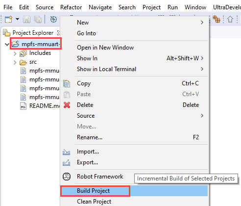
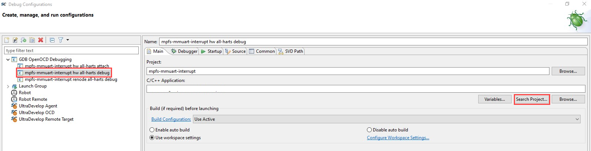
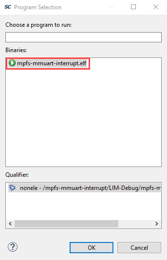
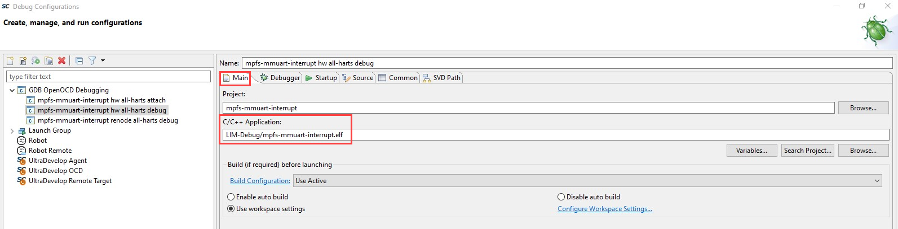
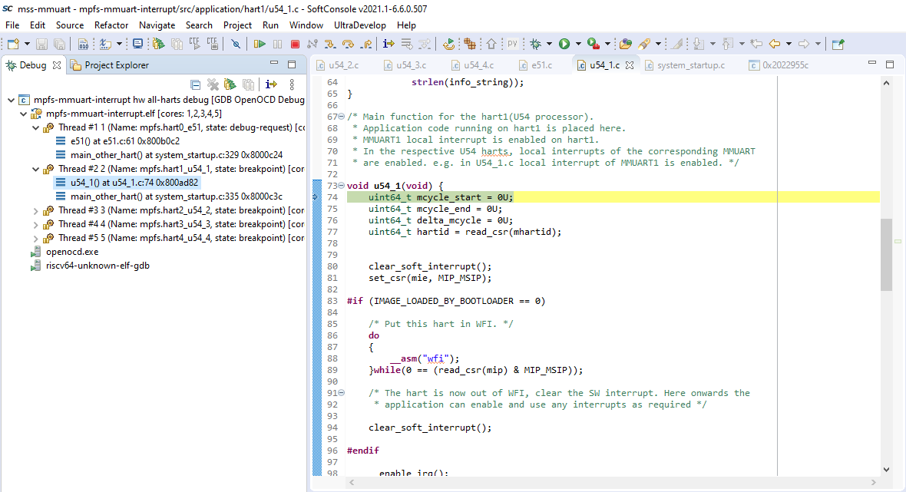
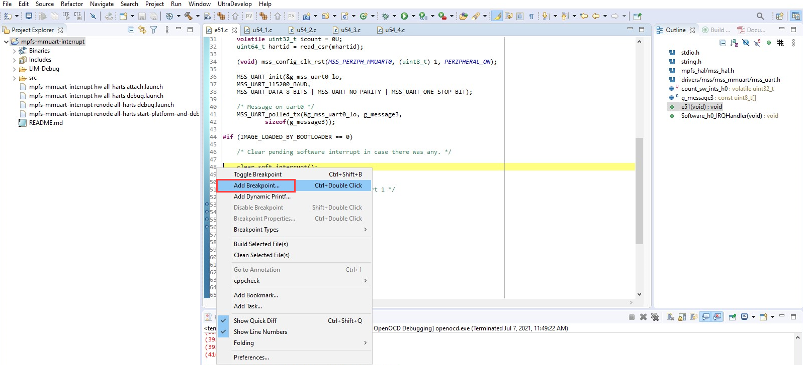
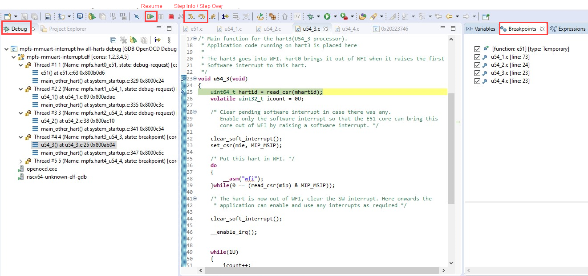
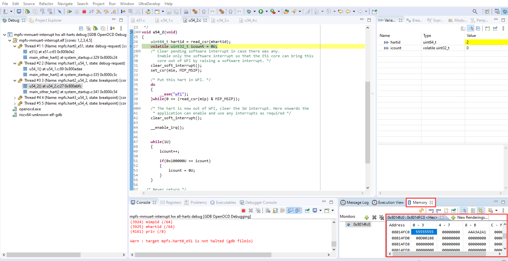

# Multiprocessor Debugging using SoftConsole

## Objective

The scope of this project is to demonstrate multiprocessor debugging using MMUART Example SoftConsole project on the PolarFire SoC ICICLE kit. This also includes creating a debug configuration, adding breakpoints, and halting the execution flow to perform step by step debug of the application.

## Description

PolarFire SoC FPGA supports 5x 64-bit RISC-V cores—one E51 monitor core and four U54 application cores. The Bare Metal MMUART Example SoftConsole project contains application code specific to each processor core. The project is set to debug the application from loosely integrated memory (LIM) by default.  The E51 processor invokes the U54_1 processor from wait for interrupt (WFI) mode. The U54_1 processor runs the application code to display the serial terminal messages. Remaining processor cores (U54_2, U54_3, and U54_4) are in WFI mode. MMUART Example SoftConsole project is preconfigured to demonstrate multiprocessor debugging. All the processor cores cannot be debugged concurrently. Halting the application execution flow halts all the processor cores. 

## Requirements
- ICICLE Kit (MPFS250T_ES-FCVG484E)
- SoftConsole v2021.1
- Libero SoC v2021.1
- Host PC - Windows 10 OS

## Pre-Requisite

Before debugging the user application, ensure to complete the following steps:

- Setting up the [jumpers](https://github.com/polarfire-soc/polarfire-soc-documentation/blob/master/boards/mpfs-icicle-kit-es/updating-icicle-kit/updating-icicle-kit-design-and-linux.md) on the ICICLE Kit.
- Use FlashPro Express to program the ICICLE Kit with the [PolarFire SoC ICICLE Kit Reference Design job file](https://github.com/polarfire-soc/polarfire-soc-documentation/blob/master/boards/mpfs-icicle-kit-es/updating-icicle-kit/updating-icicle-kit-design-and-linux.md).

## Debugging the Application

To debug the application, perform the following step: 

1. Download the [polarfire-soc-bare-metal-examples](https://github.com/polarfire-soc/polarfire-soc-bare-metal-examples) project as shown in the following figure and extract the same on the host PC.

 
2. Launch SoftConsole application. In the Workspace Launcher dialog box, paste the path where the example project is stored as the workspace location and click OK. The SoftConsole main window opens.

3. In the Project Explorer window, click Import projects... as shown in the following figure. Expand General, select Existing Projects into Workspace, and then, click Next.  

4. Click Browse..., and navigate to the location where the mpfs-mmuart > mpfs-mmuart-interrupt project folder is located, select the folder and then, click Finish. 

5. By default, the e51 releases U54_1 from wait for interrupt (WFI) mode. Other processor cores can also be released from WFI mode. 

6. On the Project Explorer, right-click the mpfs-mmuart-interrupt project and select Build Project as shown in the following figure. Ensure that no errors are displayed in the build result.

7. Select the mpfs-mmuart-interrupt project as shown in following figure. Click Run > Debug Configurations... from the SoftConsole toolbar as shown in the following figure. Debug Configurations window appears.

 
8. In the Debug Configurations window, select the mpfs-mmuart-interrupt hw all-harts debug and click Search Project in the Main tab, as shown in the following figure.

 
9. In the Program Selection window, select the .elf file as shown in the following figure, and click OK. 

10. In the Main tab, ensure that the C/C++ Application: field contains the correct executable name as shown in the following figure. 

11. In the Debugger tab, ensure that the Config options field contains the correct command line options as shown in the following figure.

 
12. In the Startup tab, enable Set breakpoint at: and Continue check box as shown in the following figure. Set the breakpoint at u54_1.   

13. Click Debug.

14. The Confirm Perspective Switch dialog box opens and click Switch. The debugger halts the execution at the u54_1 function.

  
15. Right-click wherever breakpoint is required in the application code and select Add Breakpoint... as shown in the following figure. The breakpoints can be added in each hart application code. The breakpoints are used to pause the execution flow. The debugger switches between the hart source code files to halt the execution depending on the breakpoints set. 

16. In the following figure, the Breakpoints tab lists the breakpoints added in the application project. When the debugger halts at any breakpoint, the user can perform step debug (Step Into or Step Over), or resume the debugger. In the Debug window on the left pane, call stack of all the harts is displayed. Each Thread represents one hart. For Example, Thread #1 represents E51 monitor core, Thread #4 represents U54_3 processor core. 

17. When the program execution is halted at the breakpoint, the content of the variables can be seen using Variables tab as shown in the following figure. Selecting another function in the call stack window displays all the local variables in that function in the Variables tab.

18. The user can monitor contents of the memory for any variables declared in the application using Memory window as shown in the following figure. 

19. To terminate the debugging of the application, click Terminate on the SoftConsole toolbar and close SoftConsole.

This concludes the debugging process of the demo.
