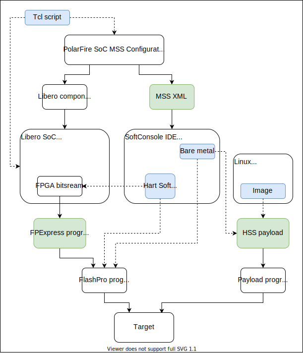
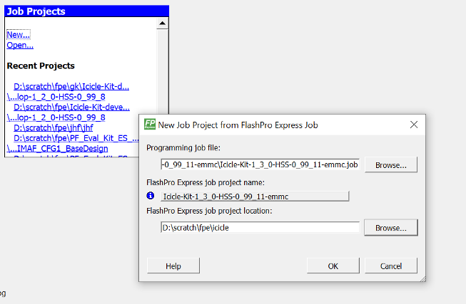
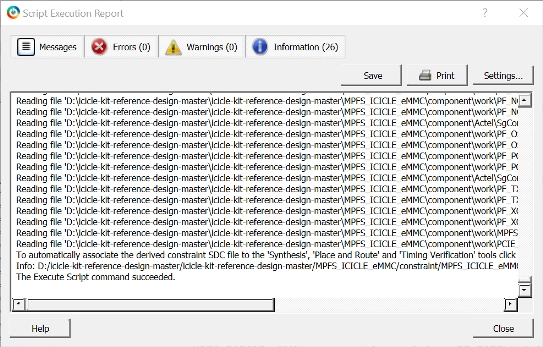
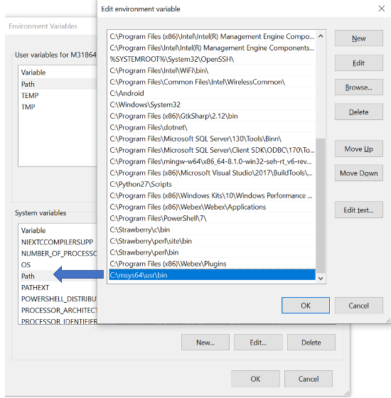
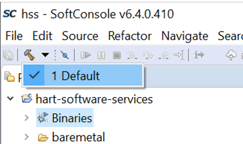

# PolarFire SoC Software Tool Flow

- [Tools required to program a PolarFire SoC FPGA](#program-a-PolarFire-SoC-FPGA)
- [Tool flow](#tool-flow)
	- [FPGA tool flow](#fpga-tool-flow)
	- [Software development tool flow](#software-tool-flow)
	- [Full tool flow](#full-tool-flow)
- [Potential starting points](#potential-starting-points)
	- [FlashPro Express and provided Linux images](#fpe-linux)
	- [FlashPro Express and bare metal or Linux flow](#fpe)
	- [TCL design flow](#tcl-flow)
	- [Full design flow](#full-flow)
- [Using FlashPro Express](#FlashPro-Express)
- [Using Libero SoC](#Libero-SoC)
- [Using the HSS](#using-the-hss)
	- [Configuring the HSS](#configuring-the-hss)
	- [Build the HSS](#build-the-hss)
		- [Configuring MSYS2 on Windows](#config-msys2)
		- [Building the HSS](#building-hss)
- [Using the MSS Configurator](#mss-configurator)
	- [MSS Configuration XML Description](#mss-xml)
- [Programming the eNVM](#programming-envm)
	- [Configuring PolarFire SoC boot mode tools](#boot-mode)
- [Programming eMMC and SD Cards](#emmc_SD)

This document describes:
- The tools required to program and generate an FPGA design for PolarFire SoC Devices (The PolarFire SoC Icicle Kit is used as an example)
- How to configure and build the Hart Software Services (HSS)
- How to generate a Linux image for a target and program the target

## Tools required to program a PolarFire SoC FPGA
- Libero SoC v12.5 or greater
	- Libero is required to run the FPGA flow. Libero is not required if you are using a FlashPro Express programming job file and do not intend to modify the FPGA design included. The MSS configurator and FlashPro Express can be installed separately to Libero when only using pre-built FPGA programming files.
	- Libero bundles FlashPro Express and the PolarFire SoC MSS Configurator, if these tools are going to be used, the standalone versions do not need to be installed if Libero is also installed.
	- A valid license is required to use Libero SoC, a free Silver license supports the MPFS250 part (this is the part on the Icicle Kit). More information and links to generate licenses can be found in the [licensing section](https://www.microsemi.com/product-directory/design-resources/1711-licensing) of the Microsemi website.
	- Libero can be downloaded [here](https://www.microsemi.com/product-directory/design-resources/1750-libero-soc#downloads).
- FlashPro Express v12.5 or greater
	- FlashPro Express is used to program Microchip FPGAs using a programming job file exported by Libero SoC.
	- Programming job files can contain the FPGA bitstream and several memory clients.
	- This tool does not require a license.
	- FlashPro Express is installed alongside Libero SoC, it can also be installed standalone with the "Program and Debug" tools.
	- FlashPro Express replaced FlashPro as the Microchip standalone programming tool, FlashPro and FlashPro Express are two separate tools.
	- The Program and Debug tools can be downloaded [here](https://www.microsemi.com/product-directory/programming/4977-flashpro#software).
- SoftConsole v6.4 or greater
	- SoftConsole is Microchip's Eclipse based embedded software development IDE with support for RISC-V targets including PolarFire SoC.
	- SoftConsole is available free of charge without a license.
	- The Renode emulation platform is bundled with SoftConsole and supports Microchip soft RISC-V cores and PolarFire SoC.
	- On Windows SoftConsole will also require MSYS2 to build the Hart Software Services.
	- SoftConsole can be downloaded [here](https://www.microsemi.com/product-directory/design-tools/4879-softconsole#downloads).
- PolarFire SoC MSS Configurator
	- The MSS Configurator is used to generate MSS configuration XML files for the software flows and a Libero component for the FPGA flow.
	- This tool does not require a license.
	- The MSS Configurator is installed alongside Libero SoC, it can also be installed as a standalone tool.
	- The standalone MSS Configurator can be downloaded [here](https://www.microsemi.com/product-directory/soc-design-tools/5587-pfsoc-mss-configurator-tool#downloads).

## Tool flow
There are several routes a designer can take depending on their end goal when developing for PolarFire SoC, this section outlines some possible methods of developing for PolarFire SoC.

### FPGA tool flow
When designing for an FPGA, a board's schematic files can be used to determine pin outs, for example [The Icicle Kit Schematics here](https://www.microsemi.com/existing-parts/parts/152514#resources).
Design creation scripts are provided to aid the quick generation of a Linux capable design, FlashPro Express programming job files are also provided for those who don't want to use Libero - these will contain a bitstream matching the design created by the latest tag of the Icicle Kit reference design repository.

### Software development tool flow
The default eMMC and SD card configurations for the PolarFire SoC MSS configurator used in the Icicle Kit reference design are provided along with the resulting XML. When designing software for bare metal, Linux, RTOS etc applications this XML can be used for development.
Bare metal applications can be built using SoftConsole v6.4 and greater. Linux for PolarFire SoC can be built using Buildroot or Yocto on a variety of Linux operating systems and the readme for each build system should be consulted.

### Full tool flow
The image below shows the full development flow for PolarFire SoC for both the FPGA and software. Blue boxes are source files and green are output files that can be generated and are provided via GitHub for the user:

Anything on the left (TCL Script, Libero Component, Libero SoC etc) can be considered part of the FPGA flow, anything in the middle or on the right can be considered part of the software flow. The MSS configurator is required for both flows.
Provided files in green can be considered end points as, part of the flow is already completed.
Provided makefile, script and source files in blue can be considered starting points as, part of a flow will have to be run.

The different components of the tool flow are described below:

- **TCL script:** a TCL script can be used to run create a design and run tool in Libero SoC.
- **PolarFire SoC MSS Configurator:** this is a tool used to configure an instance of the PolarFire SoC MSS. It produces an MSS component file which can be imported into Libero SoC and an XML file which is used as part of the software development flow.
- **Libero component:** this file is an output of the PolarFire SoC MSS Configurator, it is imported into Libero and describes the generated MSS component to the tools.
- **MSS XML:** see the [MSS Configuration XML Description](#mss-xml) section.
- **Libero SoC:** This is Microchip's FPGA design IDE. Libero allows the creation of a design and running the Synthesize, Place and Route, Generate FPGA Data Array and Generate Bitstream tools.
- **FPGA bitstream:** this is an FPGA programming file which can contain an FPGA fabric configuration and/or an sNVM client and/or an eNVM client and/or a SPI client and/or a uPROM client.
- **SoftConsole IDE:** this is Microchips bare metal development IDE, it allows the build, debug and emulation of RISC-V embedded software projects.
- **Hart Software Services:** this involves cloning, configuring and building the HSS in SoftConsole, it can also include programming the HSS to eNVM as a client.
- **Bare metal:** this is the process of configuring and building a C/C++ program or RTOS using SoftConsole. The build requires the generated MSS XML along with the PolarFire SoC HAL, example projects and the HAL are available from [The PolarFire SoC Bare Metal Library](https://github.com/polarfire-soc/polarfire-soc-bare-metal-library).
- **Linux:** this is the process of building a Linux image using either the [PolarFire SoC Buildroot SDK](https://github.com/polarfire-soc/polarfire-soc-buildroot-sdk) or the [Meta PolarFire SoC Yocto BSP](https://github.com/polarfire-soc/meta-polarfire-soc-yocto-bsp).
- **FP Express programming file:** this file is generated by Libero SoC and contains an FPGA bitstream.
- **HSS payload:** this file is generated using the hss-payload-generator, it contains an image of any binaries (e.g bare metal, Linux images etc) to be executed on the target. A payload is stored in non-volatile storage and loaded by the HSS on boot.
- **FlashPro programmer:** this is a hardware programmer, such as a FlashPro6, FlashPro5 or FlashPro4 used to program a Microchip FPGA.
- **Payload programming:** these are the methods of programming a HSS payload. For example the HSS can be used to program the eMMC using USB or YMODEM, an SD card can be programmed directly by the host PC.
- **Target:** this is the PolarFire SoC device or board being programmed.

## Potential starting points
There are several starting points a user can choose with different levels of configurability, these could include for example:
- [FlashPro Express and provided Linux images](#fpe-linux):

  Using this flow a user would program the FPGA fabric and eNVM using the provided FlashPro Express programming job file and then program the eMMC or SD card with a payload.
  There would be no opportunity to configure the contents of the FPGA fabric or Payload.

- [FlashPro Express and bare metal or Linux flow](#fpe):

  Using this flow a user would program the FPGA fabric and eNVM using the provided FlashPro Express programming job file.
  They would then build a Linux image or bare metal application using the provided XML and program it to the eMMC or SD card as a payload.
  There would be no opportunity to configure the contents of the FPGA fabric, but the Linux image or bare metal application could be customized.

- [TCL design flow](#tcl-flow):

  Using this flow a user would build a Libero design using the provided TCL scripts, customize as needed and run the design flow.
  They would then build and program the HSS (if being used) and a Linux image or bare metal application using the XML generated from their design and program the eMMC or SD card.
  There would be an opportunity to configure the contents of the FPGA fabric and, the Linux image or bare metal application.

- [Full design flow](#full-flow):

  Using this flow a user would configure an MSS component and import it into a Libero design, customize as needed and run the design flow.
  They would then build and program the HSS (if being used) and a Linux image or bare metal application using the XML generated from their design and program the eMMC or SD card.
  There would be an opportunity to configure the contents of the FPGA fabric and, the Linux image or bare metal application.

### FlashPro Express and provided Linux images
FlashPro Express files and Linux images are available for download from the [Updating PolarFire SoC Icicle-Kit FPGA Design and Linux Image](https://github.com/polarfire-soc/polarfire-soc-documentation/blob/master/boards/mpfs-icicle-kit-es/updating-icicle-kit/updating-icicle-kit-design-and-linux.md#Links) document.
FlashPro Express programming job files can be used to program the FPGA from a pre-generated design the Linux images are pre-built into payloads to be written to eMMC or SD cards by the user.

### FlashPro Express and bare metal or Linux flow
FlashPro Express programming job files are available for download from the [Updating PolarFire SoC Icicle-Kit FPGA Design and Linux Image](https://github.com/polarfire-soc/polarfire-soc-documentation/blob/master/boards/mpfs-icicle-kit-es/updating-icicle-kit/updating-icicle-kit-design-and-linux.md#Links) document.
They can be used to program the FPGA from a pre-generated design. XML for the designs is provided in the reference design [xml folder](https://github.com/polarfire-soc/icicle-kit-reference-design/tree/master/XML).
The user can then use the provided XML to run the bare metal or Linux flow they desire and program the external memory (i.e eMMC or SD). The provided FlashPro Express programming job files will program the FPGA fabric and the eNVM and then set the boot mode to 1.

### TCL design flow
TCL scripts are available from board reference design repositories such as the [Icicle Kit Reference Design](https://github.com/polarfire-soc/icicle-kit-reference-design).
These will generate a PolarFire SoC MSS Configurator component for the Libero design flow and generate XML for the bare metal and Linux design flows. The scripts will then import the MSS Configurator component into a Libero project so the user can configure the design, run the Libero design flow and program a target.
The user can then use generated or provided XML to run the bare metal or Linux flow they desire, build the HSS and program the eNVM, setting the MSS boot mode to 1 and program the eMMC or SD card.

### Full design flow
In this flow the user would configure an MSS component using the MSS configurator and import it into a Libero SoC design. The design should be configured and the Libero flow run.
The XML generated by the MSS configurator can be used to run the bare metal or Linux flow desired, build the HSS and program the eNVM, setting the MSS boot mode to 1 and program the eMMC or SD card.

## Using FlashPro Express
FlashPro Express can be downloaded and installed standalone with the [Programming and Debug tools](https://www.microsemi.com/product-directory/programming/4977-flashpro#software).
FlashPro Express is also installed as part of a Libero installation and a shortcut is usually created, or else it can be launched from the following locations:
- On Windows:

		[Libero installation]/designer/bin/FPexpress.exe
		[Program and Debug tool installation]/bin/FPExpress.exe

- On Linux:

		[Libero installation]/Libero/bin64/FPExpress
		[Program and Debug tool installation]/Program_Debug_Tool/bin64/FPExpress

FlashPro Express uses pre-generated bitstreams stored in a programming job file to program a target. Programming job files for the Icicle Kit can be found in the [Updating PolarFire SoC Icicle-Kit FPGA Design and Linux Image](https://github.com/polarfire-soc/polarfire-soc-documentation/blob/master/boards/mpfs-icicle-kit-es/updating-icicle-kit/updating-icicle-kit-design-and-linux.md) document.

1. Create a new FP Express job:

2. Select "Run Program Action" to program the target.

## Using Libero SoC
Libero SoC V12.5 and above can be downloaded [here](https://www.microsemi.com/product-directory/design-resources/1750-libero-soc#downloads). A Libero license is required to use this tool, a free Silver license can be used with the Icicle Kit, available [here](https://www.microsemi.com/product-directory/design-resources/1711-licensing#overview).

The Icicle Kit will be used as an example, design files are available in the [icicle-kit-reference-design](https://github.com/polarfire-soc/icicle-kit-reference-design) repository along with instructions on running the Tcl scripts to generate a design.

Once a design has been generated for a target:

The design can be configured further if required by editing the SmartDesigns created:

The design flow can then be run from the left hand side:

Running the flow as far as "Generate Bitstream" does not require a board to be connected to the host PC. Double clicking "Generate Bitstream" will run the full flow to that point, i.e individual items don't need to be selected.
"Run PROGRAM Action" will program the target board using a FlashPro Programmer. Libero will open the generated bitstream and program the target. Once this is complete the FPGA will perform a soft reset and boot.

## Using the HSS
The Hart Software Services (HSS) is used as a Zero Stage Boot Loader (ZSBL) in PolarFire SoC, it executes from eNVM and can be built in several configurations.
It can be found in the [HSS repository](https://github.com/polarfire-soc/hart-software-services).

To boot the HSS, ensure its programmed into the eNVM and the PolarFire SoC system is configured to boot mode 1. On boot the MSS will boot from the eNVM and the HSS will start.
The HSS will attempt to initialize an SD card, if no card is inserted, the HSS will attempt to initialize the eMMC. There will then be a count down waiting for a user input on UART0. If no key is pressed the HSS will load the payload from eMMC / SD, if a key is pressed the user can enter a service such as the USBDMSC for mounting and programming the eMMC.
If a valid payload is found, its contents will be unpacked into its destination memory (LIM, DDR, fabric memory etc) and owner U54 harts will be taken out of WFI to run the payload.

### Configuring the HSS
The HSS can be configured for settings and tools such as:
- Using YMODEM
- Using SD Card / eMMC
- Different MMC voltage levels
- Using QSPI
- Using SPI
- etc

The default configurations for eMMC can be viewed by cloning the [HSS repository](https://github.com/polarfire-soc/hart-software-services) and installing kconfiglib, as per the readme.

1. Copy the default configuration from

		[hss_directory]/boards/icicle-kit-es/def_config

to the top level hss_directory

2. Rename the default configuration file in the top level hss_directory to ".config".

3. Open a terminal and enter:

		make BOARD=icicle-kit-es config

4. This will display the default configuration for the Icicle Kit which can be modified as required:

5. Enter "Q" to quit and save the configuration

### Build the HSS
The HSS should be built in SoftConsole v6.4 or greater or using the GNU tools built as part of the Linux flow. SoftConsole is available for download [here](https://www.microsemi.com/product-directory/design-tools/4879-softconsole#downloads). The HSS repository can be downloaded and either:
- Import the contents of the repository into a SoftConsole Workspace as an existing project and build
- Build the HSS using the included make files and a local RISC-V toolchain

#### Configuring MSYS2 on Windows

If running Windows MSYS2 will also be required to build the HSS. To install MSYS2:

1. Follow the installation steps found on the MSYS2 [website](https://www.msys2.org/#installation).  

2. Then the make, python3 and python3-pip packages should be installed by running:

		pacman -S make python3 python3-pip

3. Then install kconfiglib using the following command:

		pip3 install kconfiglib

4. The msys2 user bin path should then be added to the Windows system path variable:

#### Building the HSS

To build the HSS:

1. Clone or download the HSS source code from GitHub

2. In SoftConsole select File -> Import and then select General/Existing Projects into Workspace:

3. Navigate to the HSS repository and select finish to import the project:

4. Place the HSS configuration file in the top level directory naming it solely ".config", the default configurations can be used from the boards folder for each target:

If a custom MSS configuration has been created the xml folder should be updated with the configuration generated by the MSS Configurator:

	[hss_directory]/boards/[target]/soc_fpga_design/xml

5. Build the HSS "Default" build configuration:

## Using the MSS Configurator
The Microcrocessor Subsystem (MSS) is configured using the PolarFire SoC MSS Configurator. This software tool takes user inputs and generates an XML configuration file along with a Libero component.
The MSS Configurator can be launched from shortcuts created during installation or:

- On Windows:

		[Libero installation]/designer/bin64/pfsoc_mss.exe
		[PolarFire SoC MSS Configurator installation]/MSS/bin64/pfsoc_mss.exe

- On Linux:

		[Libero installation]/Libero/bin64/pfsoc_mss
		[PolarFire SoC MSS Configurator installation]/MSS/bin64/pfsoc_mss

### MSS Configuration XML Description
The generated XML file contents are converted into header files by the [PolarFire SoC Configuration Generator](https://github.com/polarfire-soc/polarfire-soc-configuration-generator), which are used as part of the bare metal and HSS flows.
These header files configure system settings such as clocks, MUX settings for MSS I/Os and DDR training configuration.

## Programming the eNVM
If the eNVM needs to be programmed, for example with an updated HSS, bare metal application etc, SoftConsole can be used to do this.

Note: the FlashPro Express programming job files for the provided FPGA designs also program the eNVM with the HSS.

Bare metal application(s) can be stored and executed out of the eNVM if the program size is less than or equal to the size of the eNVM. If bare metal application(s), or Linux image(s), are larger than than the size of the eNVM, the HSS should be stored in the eNVM.
The bare metal application(s) or Linux image(s) should be built into a payload and stored in non volatile storage, such as eMMC or SD card. The HSS will load the payload(s) into their relevant memory locations and boot the system on power up.

1. Build a SoftConsole application and select it in the SoftConsole Workspace - the eNVM programming will target the last used build configuration.
2. Select External Tools -> PolarFire SoC program non-secure boot mode 1:

### Configuring PolarFire SoC boot mode tools
Programming the eNVM on PolarFire SoC parts requires the fpgenprog tool included with Libero Soc or FlashPro Express (installed as part of the Program and Debug tools). This tool is also included with the standalone Program and Debug tools.
Depending on the tools installed by the user (Libero or Program and Debug tools) the default SoftConsole path to the fpgenprog tool may need to be updated as it targets the Program and Debug tools default install directory.

To do this edit the softconsole.cmd on Windows or softconsole.sh file on Linux - these files are found in the SoftConsole installation directory.
Edit the line starting with:

	if not defined FPGENPROG set FPGENPROG

To match the path to the actual installation which is in:

- On Windows:

		[Libero installation]/designer/bin64/fpgenprog.exe
		[Program and Debug tool installation]/Program_Debug_Tool/bin64/fpgenprog.exe

- On Linux:

		[Libero installation]/Libero/bin64/fpgenprog
		[Program and Debug tool installation]/Program_Debug_Tool/bin64/fpgenprog

So for example a full updated tool path is:

	if not defined FPGENPROG set FPGENPROG=C:\Microsemi\Libero_SoC_v12.5\Designer\bin64\fpgenprog.exe

## Programming eMMC and SD Cards
The eMMC and SD cards can be programmed using the HSS's "USBDMSC" service and a USB cable, for example connected to J16 on the Icicle Kit, on Windows using Win32DiskImager or using dd on Linux.
SD cards can also be programmed directly on Windows using Win32DiskImager or using dd on Linux.

Instructions for programming the eMMC and SD cards with HSS payloads can be found in the [Programming the Linux Image](https://github.com/polarfire-soc/polarfire-soc-documentation/blob/master/boards/mpfs-icicle-kit-es/updating-icicle-kit/updating-icicle-kit-design-and-linux.md#Programming-Linux-Image) document.
